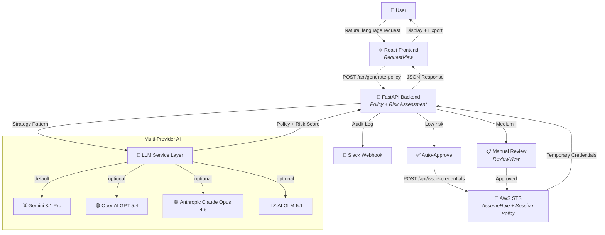

**IAM-Dynamic** is a secure, AI-driven portal that transforms natural language requests into least-privilege AWS IAM policies, then issues temporary credentials via AWS STS. Instead of manually crafting complex JSON policies, users simply describe what they need — *"I need read-only access to the production S3 bucket"* — and the system uses a large language model to generate a scoped IAM policy, assess its risk level, and either auto-approve low-risk requests or route higher-risk ones for manual review. Every credential is ephemeral by design, expiring automatically after a time window that scales inversely with risk.

The application follows a clean **frontend/backend separation** architecture: a React single-page application handles the user interface, while a FastAPI REST API orchestrates policy generation, risk assessment, credential issuance, and audit logging. Both services are containerized with Docker and orchestrated through Docker Compose, with a production topology that adds Caddy for automatic HTTPS via Cloudflare DNS challenge.

Sources: [README.md](README.md#L1-L48), [CLAUDE.md](CLAUDE.md#L3-L8)

## What Problem Does It Solve?

Managing AWS IAM access is notoriously error-prone. Teams face a tension between two extremes: granting overly broad permissions that violate least-privilege principles, or requiring engineers to author intricate IAM policy JSON by hand — a slow, error-prone process that often results in escalated privileges out of frustration. IAM-Dynamic eliminates this tradeoff by placing an AI reasoning layer between the human intent and the resulting policy. The LLM interprets natural language, translates it into well-scoped IAM actions and resource ARNs, and applies guardrails that block dangerous patterns like `*:*` wildcard permissions.

Beyond policy generation, the platform enforces **just-in-time access**: credentials are issued for a limited duration and automatically expire. Risk-based duration limits ensure that higher-risk requests receive shorter-lived credentials (critical risk: 1 hour max; low risk: up to 12 hours), reducing the blast radius of any compromised or misused access key.

Sources: [CLAUDE.md](CLAUDE.md#L3-L8), [README.md](README.md#L18-L32)

## Architecture at a Glance

The following diagram illustrates the complete request lifecycle — from natural language input through AI-powered policy generation to ephemeral AWS credential issuance:



Sources: [CLAUDE.md](CLAUDE.md#L48-L74), [backend/main.py](backend/main.py#L1-L47)

## Core Components

The project is organized into three primary layers — frontend, backend, and infrastructure — each with clear responsibilities and boundaries.

### Backend (FastAPI + Python)

The backend is a FastAPI application that exposes a REST API for policy generation, credential issuance, authentication, and audit logging. It uses a **Strategy Pattern** in the LLM service layer to abstract multiple AI providers behind a common interface, selected at runtime via the `LLM_PROVIDER` environment variable.

| Component | File | Responsibility |
|-----------|------|----------------|
| **API Entry Point** | [main.py](backend/main.py) | REST endpoints, CORS, dependency injection, lifespan management |
| **LLM Service** | [llm_service.py](backend/llm_service.py) | Multi-provider abstraction (Strategy Pattern), prompt engineering, rejection guidance |
| **Configuration** | [config.py](backend/config.py) | Pydantic-validated settings from environment variables |
| **STS Service** | [services/sts_service.py](backend/services/sts_service.py) | AWS STS `AssumeRole` with scoped session policies |
| **Auth Service** | [services/auth_service.py](backend/services/auth_service.py) | JWT creation/verification, bcrypt password hashing |
| **Slack Service** | [services/slack_service.py](backend/services/slack_service.py) | Webhook notifications for audit trail |
| **Turnstile Service** | [services/turnstile_service.py](backend/services/turnstile_service.py) | Cloudflare CAPTCHA verification |
| **Error Handler** | [services/error_handler.py](backend/services/error_handler.py) | Structured user-facing error messages |
| **Data Schemas** | [schemas.py](backend/schemas.py) | Typed dataclasses for requests, credentials, audit events |

Sources: [backend/main.py](backend/main.py#L1-L47), [backend/config.py](backend/config.py#L1-L30), [backend/schemas.py](backend/schemas.py#L1-L25)

### Frontend (React + TypeScript)

The frontend is a single-page React application built with Vite and TypeScript. It implements a **multi-view state machine** that guides users through a four-stage workflow: Request → Review → Credentials (or Rejected). Radix UI primitives ensure accessibility, while Tailwind CSS provides consistent styling with a light/dark/system theme toggle.

| Component | File | Responsibility |
|-----------|------|----------------|
| **App Shell** | [App.tsx](frontend/src/App.tsx) | State machine, auth gate, view routing, provider/model selection |
| **Auth Provider** | [components/auth-provider.tsx](frontend/src/components/auth-provider.tsx) | React context for JWT session management |
| **Sidebar** | [components/sidebar.tsx](frontend/src/components/sidebar.tsx) | Provider/model selector, templates, theme toggle |
| **Request View** | [views/request-view.tsx](frontend/src/views/request-view.tsx) | Natural language input, duration selector, quick templates |
| **Review View** | [views/review-view.tsx](frontend/src/views/review-view.tsx) | Policy display, risk badge, approval/rejection flow |
| **Credentials View** | [views/credentials-view.tsx](frontend/src/views/credentials-view.tsx) | Credential display, multi-format export, expiration countdown |
| **Rejected View** | [views/rejected-view.tsx](frontend/src/views/rejected-view.tsx) | AI-generated guidance, revision suggestions |
| **Login View** | [views/login-view.tsx](frontend/src/views/login-view.tsx) | Login form with optional Turnstile CAPTCHA |

Sources: [frontend/src/App.tsx](frontend/src/App.tsx#L1-L45), [frontend/src/views/](frontend/src/views/)

### Infrastructure (Docker + CI/CD)

The project provides two Docker Compose topologies optimized for different environments:

| Aspect | Development (`docker-compose.yml`) | Production (`docker-compose.prod.yml`) |
|--------|-----------------------------------|---------------------------------------|
| **Containers** | 2 (frontend + backend) | 3 (Caddy + frontend + backend) |
| **TLS Termination** | None (HTTP only) | Caddy with Let's Encrypt via Cloudflare DNS |
| **Port Exposure** | 8080 (frontend), 8000 (backend) | 80/443 (Caddy only; internal ports) |
| **Image Source** | Local build | Pre-built from GHCR |
| **Resource Limits** | None | Backend: 1GB, Frontend: 256MB |
| **Hot Reload** | Yes (volume mounts) | No |
| **Reverse Proxy** | nginx → backend | Caddy → nginx → backend |

A GitHub Actions CI/CD pipeline handles PR checks (lint, typecheck, build) and main-branch deployments (security scan, GHCR push, Trivy vulnerability scan, SSH deploy).

Sources: [docker-compose.yml](docker-compose.yml), [docker-compose.prod.yml](docker-compose.prod.yml), [.github/workflows/ci.yml](.github/workflows/ci.yml)

## Project Structure

```
IAM-Dynamic/
├── backend/                          # 🐍 Python FastAPI backend
│   ├── main.py                       # API endpoints and app configuration
│   ├── llm_service.py                # Multi-provider LLM abstraction
│   ├── config.py                     # Pydantic-validated configuration
│   ├── schemas.py                    # Type definitions and dataclasses
│   ├── services/
│   │   ├── sts_service.py            # AWS STS credential issuance
│   │   ├── auth_service.py           # JWT authentication
│   │   ├── slack_service.py          # Slack webhook notifications
│   │   ├── turnstile_service.py      # Cloudflare CAPTCHA verification
│   │   └── error_handler.py          # User-facing error formatting
│   └── scripts/
│       └── hash_password.py          # CLI utility for bcrypt hashes
│
├── frontend/                         # ⚛️ React TypeScript frontend
│   ├── src/
│   │   ├── App.tsx                   # Main app shell and state machine
│   │   ├── components/               # Shared UI components
│   │   │   ├── auth-provider.tsx     # Auth context (JWT sessions)
│   │   │   ├── sidebar.tsx           # Provider/model selector
│   │   │   ├── theme-provider.tsx    # Light/dark/system theme
│   │   │   └── ui/                   # Radix UI primitives
│   │   └── views/                    # State machine views
│   │       ├── request-view.tsx      # Natural language input
│   │       ├── review-view.tsx       # Policy review & approval
│   │       ├── credentials-view.tsx  # Credential export
│   │       ├── rejected-view.tsx     # AI-powered resubmission guidance
│   │       └── login-view.tsx        # Authentication portal
│   └── vite.config.ts                # Vite build configuration
│
├── docker/                           # 🐳 Infrastructure configuration
│   ├── Caddyfile                     # Caddy TLS + reverse proxy
│   ├── nginx.conf                    # Main nginx config (gzip, rate limits)
│   ├── default.conf                  # nginx server block (SPA + API proxy)
│   └── healthcheck-*.sh              # Container health checks
│
├── .github/workflows/                # 🔄 CI/CD pipelines
│   ├── ci.yml                        # PR checks (lint, test, build)
│   └── deploy.yml                    # Main branch deployment to GHCR
│
├── docker-compose.yml                # Development topology (2 containers)
├── docker-compose.prod.yml           # Production topology (3 containers)
├── .env.example                      # Environment variable template
└── start-dev.sh                      # Local development launcher
```

Sources: [Project directory structure](.)

## Supported AI Providers

The LLM service layer uses a **Strategy Pattern** to support multiple AI providers behind a unified interface. Providers are selected at runtime via the `LLM_PROVIDER` environment variable and can be switched per-request from the frontend sidebar.

| Provider | Default Model | Alternatives | Key Strength |
|----------|--------------|--------------|-------------|
| **Google Gemini** | `gemini-3.1-pro-preview` | `gemini-3-flash-preview`, `gemini-3.1-flash-lite-preview` | High-reasoning policy generation (default) |
| **OpenAI** | `gpt-5.4` | `gpt-5-mini-2025-08-07`, `gpt-4o`, `o1-preview` | Broad model selection |
| **Anthropic Claude** | `claude-opus-4-6` | `claude-sonnet-4-6`, `claude-opus-4-5` | Safety-focused reasoning |
| **Z.AI GLM** | `glm-5.1` | `glm-5`, `glm-4.7`, `glm-4.7-flash` | Global platform via api.z.ai |

All providers receive the same system-level guardrail instructions to enforce least-privilege policies and block over-permissive access patterns. The provider configuration is validated at startup by Pydantic, and unavailable providers (those without API keys) are hidden from the frontend selector.

Sources: [backend/llm_service.py](backend/llm_service.py#L1-L42), [backend/config.py](backend/config.py#L52-L91)

## Security Model

Security in IAM-Dynamic operates at multiple layers — from authentication at the edge to policy-level guardrails in the AI reasoning stage:

- **Authentication (optional):** JWT-based login with bcrypt password hashing. Disabled by default for local development; enabled by setting `AUTH_PASSWORD_HASH` and `JWT_SECRET` in the environment. When enabled, all API endpoints except `/health` and `/api/auth/*` require a valid token.
- **CAPTCHA protection:** Cloudflare Turnstile integration on the login form prevents brute-force attacks (configurable via `TURNSTILE_SECRET_KEY`).
- **TLS termination:** Caddy provides automatic HTTPS in production using Let's Encrypt certificates obtained via Cloudflare DNS challenge — no manual certificate management required.
- **Rate limiting:** nginx limits login endpoint requests to 5 per minute per IP address.
- **AI guardrails:** System-level instructions in every LLM prompt explicitly block `*:*` wildcards, penalize broad resource scopes, and enforce least-privilege principles.
- **Risk-based duration limits:** Credential lifetime is capped by risk level — low risk allows up to 12 hours, while critical risk is limited to 1 hour.
- **Ephemeral credentials:** All issued credentials are temporary STS tokens that expire automatically; no long-lived access keys are created.
- **Audit trail:** Every request and credential issuance triggers a Slack webhook notification for compliance tracking.

Sources: [backend/services/auth_service.py](backend/services/auth_service.py), [docker/nginx.conf](docker/nginx.conf), [docker/Caddyfile](docker/Caddyfile)

## Where to Go Next

The documentation is organized into two sections: **Get Started** for setup and configuration, and **Deep Dive** for architectural and implementation details. Here is the recommended reading path:

**Getting started (read in order):**

1. **[Quick Start](2-quick-start)** — Get the application running locally in under 5 minutes
2. **[Environment Configuration](3-environment-configuration)** — Configure AI providers, AWS credentials, and optional integrations
3. **[Running with Docker](4-running-with-docker)** — Containerized deployment for development and production

**Understanding the system (read in any order):**

4. **[Architecture Overview and Request Lifecycle](5-architecture-overview-and-request-lifecycle)** — End-to-end data flow from user request to credential issuance
5. Then explore the **Backend**, **Frontend**, and **Infrastructure** sections based on what you're working on