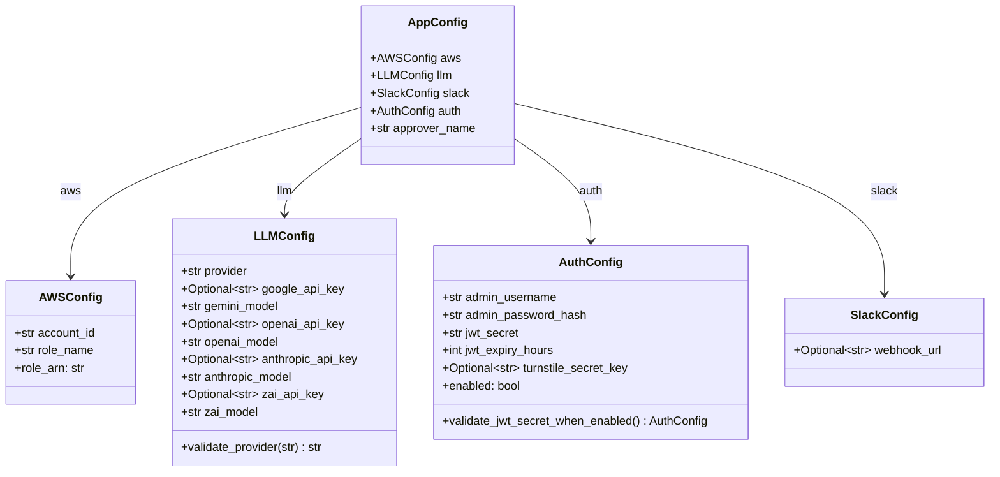
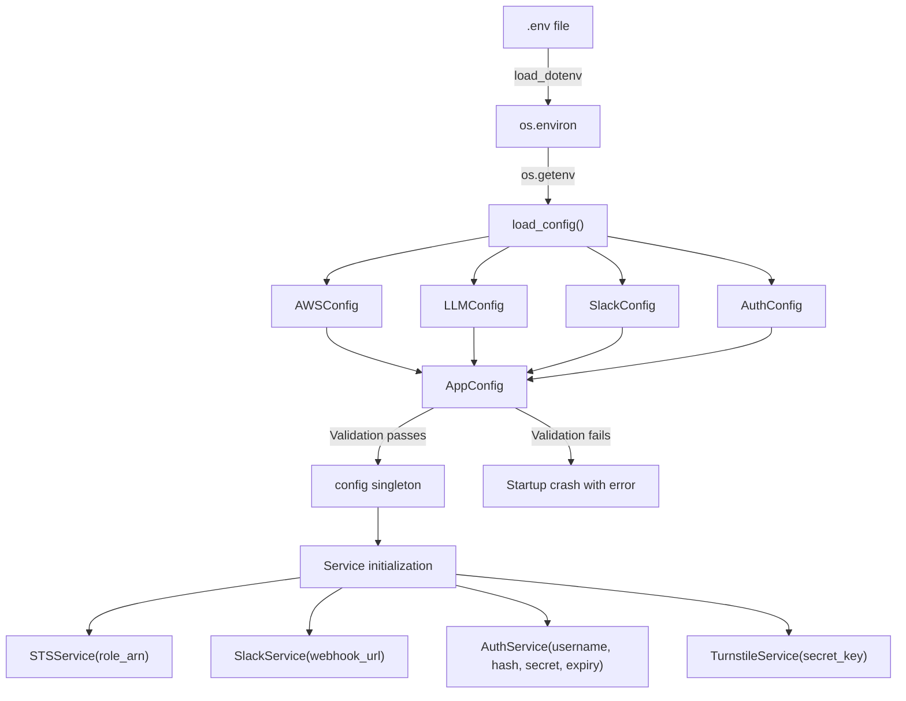

IAM-Dynamic's backend configuration lives in a single Pydantic-validated module that converts raw environment variables into a type-safe, hierarchically composed object graph. Rather than scattering `os.getenv()` calls across the codebase, the system centralizes every external parameter — AWS targets, LLM provider credentials, Slack webhooks, and authentication secrets — into four domain-specific models that compose into a single `AppConfig` root. This design guarantees that the application fails fast at startup with a clear validation error rather than silently operating with missing or malformed values.

Sources: [config.py](backend/config.py#L1-L163), [main.py](backend/main.py#L33-L55)

## Configuration Model Hierarchy

The configuration system follows a **composition pattern** where each domain concern gets its own Pydantic `BaseModel`. These sub-models are assembled under a top-level `AppConfig` container, giving each subsystem a strongly-typed namespace. The diagram below shows how the models relate to each other and to the environment variables they consume.



Each sub-model encapsulates defaults, optional fields, and validation logic relevant to its domain. The `AppConfig` root acts as a typed namespace — downstream code accesses `config.aws.role_arn` or `config.llm.provider` with full IDE autocompletion and runtime type safety.

Sources: [config.py](backend/config.py#L27-L104)

## Environment Variable Mapping

The system reads configuration exclusively from environment variables, with `.env` files providing developer-friendly defaults during local development. A dedicated `load_config()` factory function performs the explicit mapping from flat env vars to the nested Pydantic model structure. The table below lists every recognized variable, its target model, default value, and whether it is required.

| Environment Variable | Model Field | Default | Required | Description |
|---|---|---|---|---|
| `AWS_ACCOUNT_ID` | `aws.account_id` | — | **Yes** | AWS account ID for IAM role ARN construction |
| `AWS_ROLE_NAME` | `aws.role_name` | `AgentPOCSessionRole` | No | IAM role name to assume via STS |
| `LLM_PROVIDER` | `llm.provider` | `gemini` | No | Active LLM provider (gemini, openai, anthropic, zhipu) |
| `GOOGLE_API_KEY` | `llm.google_api_key` | `None` | Conditional | Google Gemini API key (required if provider=gemini) |
| `GEMINI_MODEL` | `llm.gemini_model` | `gemini-3.1-pro-preview` | No | Gemini model identifier |
| `OPENAI_API_KEY` | `llm.openai_api_key` | `None` | Conditional | OpenAI API key (required if provider=openai) |
| `OPENAI_MODEL` | `llm.openai_model` | `gpt-5.4` | No | OpenAI model identifier |
| `ANTHROPIC_API_KEY` | `llm.anthropic_api_key` | `None` | Conditional | Anthropic API key (required if provider=anthropic) |
| `ANTHROPIC_MODEL` | `llm.anthropic_model` | `claude-opus-4-6` | No | Anthropic model identifier |
| `ZAI_API_KEY` | `llm.zai_api_key` | `None` | Conditional | Z.AI GLM API key (required if provider=zhipu) |
| `ZAI_MODEL` | `llm.zai_model` | `glm-5.1` | No | Zhipu model identifier |
| `SLACK_WEBHOOK_URL` | `slack.webhook_url` | `None` | No | Slack incoming webhook for audit notifications |
| `APPROVER_NAME` | `approver_name` | `Admin` | No | Display name for the human approver |
| `AUTH_USERNAME` | `auth.admin_username` | `admin` | No | Admin username for login |
| `AUTH_PASSWORD_HASH` | `auth.admin_password_hash` | `""` | No | bcrypt hash; when empty, auth is disabled |
| `JWT_SECRET` | `auth.jwt_secret` | `""` | Conditional | Required when `AUTH_PASSWORD_HASH` is set |
| `JWT_EXPIRY_HOURS` | `auth.jwt_expiry_hours` | `8` | No | JWT token lifetime in hours |
| `TURNSTILE_SECRET_KEY` | `auth.turnstile_secret_key` | `None` | No | Cloudflare Turnstile server-side secret |

The `load_config()` function calls `os.getenv()` for each variable and passes the results to the Pydantic model constructors. This explicit mapping — as opposed to Pydantic's `BaseSettings` auto-binding — gives the codebase fine-grained control over which environment variables map to which fields and makes the transformation pipeline transparent.

Sources: [config.py](backend/config.py#L107-L158), [.env.example](.env.example#L1-L50)

## Validation Layers

The configuration system applies validation at three distinct levels, each catching a different category of misconfiguration before the application starts serving requests.

### Field-Level Validation: Provider Normalization

The `LLMConfig` model uses a `@field_validator` on the `provider` field to ensure only known providers are accepted. When an unrecognized value arrives, the validator logs a warning and falls back to `gemini` rather than crashing — a deliberate **graceful degradation** choice that keeps the application operational even with a typo in `.env`.

Sources: [config.py](backend/config.py#L58-L66)

### Cross-Field Validation: Auth Consistency

The `AuthConfig` model employs a `@model_validator` (mode=`after`) to enforce a critical security invariant: **JWT_SECRET must be set whenever authentication is enabled**. Since auth is considered "enabled" whenever a non-empty `AUTH_PASSWORD_HASH` exists, the validator checks both fields together and raises a `ValueError` at startup if the secret is missing. This prevents the application from accidentally signing JWTs with an empty string — a vulnerability that would allow token forgery.

Sources: [config.py](backend/config.py#L82-L87)

### Computed Properties: Derived Values

Two models expose read-only `@property` methods that compute derived values from their fields:

- **`AWSConfig.role_arn`** — constructs the full IAM role ARN (`arn:aws:iam::{account_id}:role/{role_name}`) from the account ID and role name. This is the value that downstream services like `STSService` receive directly.

- **`AuthConfig.enabled`** — returns `True` only when `admin_password_hash` is non-empty. This boolean drives the conditional initialization of the entire authentication subsystem, allowing the application to run in an open mode for local development while enforcing auth in production.

Sources: [config.py](backend/config.py#L32-L35), [config.py](backend/config.py#L77-L80)

## Startup Loading and Singleton Pattern

Configuration loading follows a two-phase boot sequence orchestrated by `main.py`. At module import time, `config.py` calls `load_dotenv()` to populate `os.environ` from the `.env` file. When `main.py` imports and calls `load_config()`, the function reads environment variables, constructs all four sub-models, assembles them into an `AppConfig`, and returns the validated instance. The module also exports a **module-level singleton** (`config = load_config()`) for simpler import patterns, though the primary `main.py` entry point uses its own local variable.



The singleton pattern means any module that needs configuration can `from config import config` and immediately access validated values. However, because each service constructor receives only the specific values it needs (not the entire config object), services remain **decoupled** from the configuration system — they see plain strings and integers, not Pydantic models.

Sources: [config.py](backend/config.py#L107-L162), [main.py](backend/main.py#L33-L55)

## Feature Toggle Pattern: Graceful Degradation

A defining characteristic of this configuration system is its pervasive use of `Optional` fields with `None` defaults to create **feature toggles**. Rather than requiring a complete configuration for every integration, the system allows individual subsystems to silently deactivate when their required values are absent:

| Feature | Trigger to Disable | Behavior When Disabled |
|---|---|---|
| **Slack Notifications** | `SLACK_WEBHOOK_URL` unset | `SlackService` skips all notification sends, logs a one-time info message |
| **JWT Authentication** | `AUTH_PASSWORD_HASH` empty | `AuthService` is not instantiated; all requests resolve as "admin" |
| **Cloudflare Turnstile** | `TURNSTILE_SECRET_KEY` unset | `TurnstileService.verify()` always returns `True` |
| **Specific LLM Provider** | Corresponding API key unset | Provider excluded from `/config/providers` response; cannot be selected |

This pattern enables a streamlined local development workflow where a developer needs only `AWS_ACCOUNT_ID` and a single LLM API key to run the application. Production deployments then layer on authentication, CAPTCHA verification, and Slack audit trail by setting the corresponding environment variables — no code changes required.

Sources: [config.py](backend/config.py#L69-L87), [services/slack_service.py](backend/services/slack_service.py#L18-L29), [services/turnstile_service.py](backend/services/turnstile_service.py#L17-L27), [main.py](backend/main.py#L301-L337)

## Configuration-to-Service Wiring

The `main.py` entry point acts as the **composition root** — the single location where validated configuration values are extracted and injected into service constructors. This wiring happens once at application startup, before the FastAPI app begins handling requests:

```python
# Services receive only the values they need — not the full config object
sts_service = STSService(config.aws.role_arn)
slack_service = SlackService(config.slack.webhook_url)
turnstile_service = TurnstileService(config.auth.turnstile_secret_key)

# Auth is conditionally initialized based on the enabled property
if config.auth.enabled:
    auth_service = AuthService(
        username=config.auth.admin_username,
        password_hash=config.auth.admin_password_hash,
        jwt_secret=config.auth.jwt_secret,
        jwt_expiry_hours=config.auth.jwt_expiry_hours,
    )
```

This design means services never import the config module themselves. They receive their dependencies through constructor parameters, making them independently testable with mock values. The `config` object serves as the single source of truth, but it does not become a god-object that every service depends on.

Sources: [main.py](backend/main.py#L39-L55)

## Architectural Note: BaseModel vs. BaseSettings

A noteworthy design choice in this codebase is the use of `pydantic.BaseModel` rather than `pydantic_settings.BaseSettings` for the configuration models. While `BaseSettings` (from the `pydantic-settings` package, which is listed in `pyproject.toml` as a dependency) would automatically map environment variables to model fields, the `load_config()` function performs this mapping explicitly through `os.getenv()` calls. The `env=` parameters on `Field()` declarations serve as **documentation metadata** — they record which environment variable each field corresponds to — but they are not used by Pydantic's validation engine under `BaseModel`.

This approach trades the convenience of auto-binding for full transparency and control over the mapping process. The explicit `os.getenv()` calls make it immediately clear which environment variables are read, what defaults are applied, and where the boundary between raw environment data and validated configuration lies.

Sources: [config.py](backend/config.py#L27-L104), [pyproject.toml](backend/pyproject.toml#L9-L10)

---

**Next**: Learn how the validated auth configuration flows into [JWT Authentication and Cloudflare Turnstile CAPTCHA](11-jwt-authentication-and-cloudflare-turnstile-captcha), or explore how LLM credentials power the [Multi-Provider LLM Service Layer](7-multi-provider-llm-service-layer).