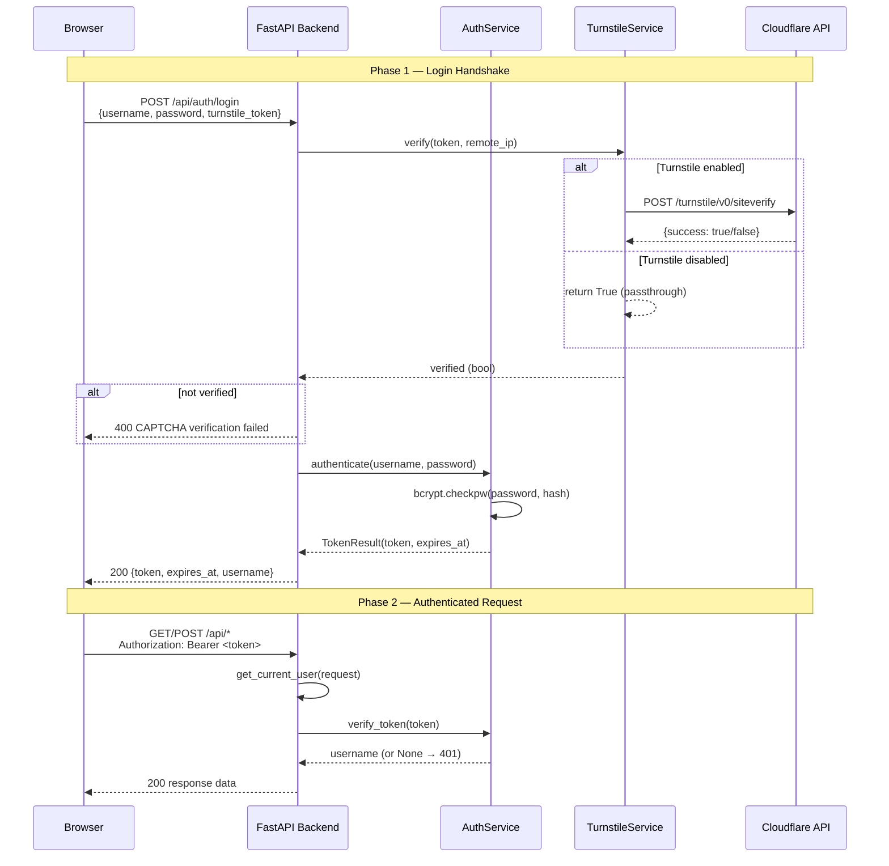

IAM-Dynamic employs a **dual-layer defense strategy** for protecting its API surface: stateless JWT tokens govern every authenticated request, while Cloudflare Turnstile CAPTCHA guards the login endpoint against automated credential-stuffing and brute-force attacks. Both layers are independently toggleable — when no `AUTH_PASSWORD_HASH` is configured, the entire auth subsystem degrades gracefully to a passthrough mode that returns `"admin"` for all requests, preserving a frictionless local development workflow. This page covers the backend services, the FastAPI dependency-injection wiring, the frontend React integration, and the operational setup tooling that binds them together.

Sources: [auth_service.py](backend/services/auth_service.py#L1-L6), [turnstile_service.py](backend/services/turnstile_service.py#L1-L5), [main.py](backend/main.py#L42-L55)

## Architecture Overview

The authentication pipeline spans three physical boundaries — browser, backend API, and Cloudflare's verification endpoint — and two temporal phases: an initial **login handshake** (username + password + CAPTCHA → JWT) followed by **per-request token validation** via FastAPI's `Depends()` mechanism. The following diagram illustrates the complete request lifecycle for both phases.

Sources: [main.py](backend/main.py#L260-L279), [main.py](backend/main.py#L126-L153), [auth_service.py](backend/services/auth_service.py#L49-L70)

## Configuration and Validation

All auth-related settings are consolidated into the `AuthConfig` Pydantic model, which enforces a critical invariant: **if a password hash is present, a JWT secret must also be configured**. This prevents the application from accidentally signing tokens with an empty string — a class of misconfiguration that would allow any attacker to forge valid JWTs.

| Environment Variable | Default | Purpose |
|---|---|---|
| `AUTH_USERNAME` | `admin` | Single admin username |
| `AUTH_PASSWORD_HASH` | `""` (empty) | bcrypt hash; empty = auth disabled |
| `JWT_SECRET` | `""` (empty) | HMAC-SHA256 signing key |
| `JWT_EXPIRY_HOURS` | `8` | Token lifetime before expiry |
| `TURNSTILE_SECRET_KEY` | `None` | Server-side Turnstile verification key |

The `AuthConfig.enabled` property reads `bool(self.admin_password_hash)` — any non-empty bcrypt hash string enables authentication. The `@model_validator` then asserts `jwt_secret` is non-empty when enabled, raising a `ValueError` at startup if the invariant is violated.

Sources: [config.py](backend/config.py#L69-L87), [config.py](backend/config.py#L137-L143)

## AuthService: JWT Lifecycle

The `AuthService` class encapsulates the complete JWT lifecycle — password verification, token creation, and token validation — behind a minimal interface built on the `PyJWT` library with `HS256` as the signing algorithm.

**Password verification** uses `bcrypt.checkpw()` to compare the plaintext input against the stored hash. The `authenticate()` method always executes `bcrypt.checkpw` regardless of whether the username matches, which is a deliberate constant-time defense against timing-based username enumeration: an attacker measuring response latency cannot distinguish "wrong username" from "wrong password."

**Token creation** builds a standard JWT payload with three claims: `sub` (the username), `iat` (issued-at timestamp), and `exp` (expiration). The `TokenResult` dataclass pairs the signed token string with its computed `expires_at` datetime, allowing the API to return both in a single response without re-parsing the token.

**Token verification** decodes the JWT against the secret and returns the `sub` claim (username). Two exception branches handle the two failure modes — `ExpiredSignatureError` for expired tokens and `InvalidTokenError` for any other corruption — both logging at `DEBUG` level and returning `None` rather than raising, which lets the FastAPI dependency translate `None` into a clean `401 Unauthorized`.

Sources: [auth_service.py](backend/services/auth_service.py#L18-L82)

## TurnstileService: CAPTCHA Verification

The `TurnstileService` wraps Cloudflare's siteverify API at `https://challenges.cloudflare.com/turnstile/v0/siteverify`. Its design follows the same graceful-degradation pattern as `AuthService`: when `secret_key` is `None` (the default), the `enabled` property returns `False` and `verify()` immediately returns `True` — effectively making CAPTCHA a no-op for development environments.

When enabled, the service sends an asynchronous `POST` request via `httpx.AsyncClient` with a 10-second timeout. The payload contains the `secret` key, the client-provided `response` token, and optionally the `remoteip` for IP-bound verification. The response's `success` boolean determines the return value. On failure, Cloudflare's `error-codes` array is logged at `WARNING` level to aid debugging (e.g., `invalid-input-response`, `timeout-or-duplicate`). Any network-level exception is caught and returns `False` — the fail-closed posture prevents login when the verification service is unreachable.

Sources: [turnstile_service.py](backend/services/turnstile_service.py#L1-L50)

## FastAPI Integration: Dependency Injection

Auth enforcement is implemented as a FastAPI `Depends()` dependency, making it declarative at the endpoint level rather than imperative middleware. Two helpers form the integration layer:

**`_extract_token(request)`** implements dual-channel token extraction. It first checks the `Authorization` header for a `Bearer ` prefix; if absent, it falls back to an `iam_session` cookie. This supports both the SPA's `Authorization` header pattern and any future cookie-based flows behind Caddy's reverse proxy.

**`get_current_user(request)`** is the `Depends`-compatible dependency. When `auth_service is None` (auth disabled), it returns the string `"admin"` immediately — every endpoint that depends on it receives a valid username without any token check. When auth is enabled, it extracts the token, calls `verify_token()`, and either returns the username or raises `HTTPException(401)`. Every protected endpoint — `/config/providers`, `/api/generate-policy`, `/api/issue-credentials`, `/api/generate-rejection-guidance` — declares `_user: str = Depends(get_current_user)` as a parameter, making the auth requirement visible in the OpenAPI schema.

Sources: [main.py](backend/main.py#L126-L153), [main.py](backend/main.py#L301-L302), [main.py](backend/main.py#L341)

## Login Endpoint: The CAPTCHA Gate

The `POST /api/auth/login` endpoint orchestrates the two-phase login handshake. It extracts the client's IP address from the `x-real-ip` header (set by nginx/Caddy in production) with a fallback to `request.client.host`, then delegates to `turnstile_service.verify()`. If Turnstile rejects the token, a `400` response is returned before any password check occurs — this is intentional: it avoids wasting bcrypt CPU cycles on bot traffic.

Only after CAPTCHA passes does `auth_service.authenticate()` run the bcrypt comparison and JWT creation. The response is a `LoginResponse` Pydantic model containing the token, the ISO-formatted expiry timestamp, and the username. The `GET /api/auth/verify` endpoint complements login by allowing the frontend to check whether a stored token is still valid, returning an `AuthStatusResponse` with `authenticated`, `username`, and `auth_required` fields.

Sources: [main.py](backend/main.py#L260-L296)

## Frontend Auth Context and Login Flow

The frontend auth system is built on React's Context API. The `AuthProvider` component wraps the entire application and manages four pieces of state: `isAuthenticated`, `username`, `isLoading`, and `authRequired`. On mount, it calls `api.verifySession()` (which hits `GET /api/auth/verify`) to restore session state from a previously stored token. It also registers a global event listener for `auth:logout` — a custom event dispatched by the API client layer whenever a `401` response is received on any endpoint (except `/api/auth/login` itself), which triggers an automatic logout.

The `api.ts` client layer stores the JWT in `localStorage` under the key `iam_token` and injects it as an `Authorization: Bearer <token>` header on every request. The `setToken()` export allows the `AuthProvider` to persist or clear the token imperatively. The `401` interception in the `request()` function is the enforcement mechanism: it clears the token, dispatches `auth:logout`, and throws `"Session expired. Please log in again."`.

Sources: [auth-provider.tsx](frontend/src/components/auth-provider.tsx#L1-L75), [api.ts](frontend/src/lib/api.ts#L1-L41)

## LoginView: Turnstile Widget Integration

The `LoginView` component renders the login form and manages the Cloudflare Turnstile widget lifecycle. The Turnstile script is loaded globally in `index.html` via `<script src="https://challenges.cloudflare.com/turnstile/v0/api.js" async defer>`, which exposes `window.turnstile`. The site key is injected at build time through the `VITE_TURNSTILE_SITE_KEY` environment variable.

The component uses a polling pattern to handle the race condition between React mounting and the Turnstile script loading: if `window.turnstile` is not yet available, a `setInterval` checks every 200ms until it appears, then renders the widget into a `div` ref. The widget's `callback` stores the verification token in React state, and the `expired-callback` clears it. The submit button is **disabled until a valid Turnstile token exists** (when the site key is configured), preventing form submission before CAPTCHA completion.

On login failure, `window.turnstile.reset()` is called to invalidate the old token and present a fresh challenge — a security best practice that prevents token replay. If `VITE_TURNSTILE_SITE_KEY` is empty (dev mode), the Turnstile section is not rendered at all, and the submit button is always enabled.

Sources: [login-view.tsx](frontend/src/views/login-view.tsx#L1-L157), [index.html](frontend/index.html#L1-L14)

## View Routing and Auth Gate

The `App` component implements a declarative auth gate: after the `AuthProvider` resolves its initial loading state, the app checks `authRequired && !isAuthenticated`. If auth is required and the user is not authenticated, the entire application is replaced by `<LoginView />` — no sidebar, no header, no access to any view. When auth is not required (local dev), `authRequired` is `false` and the gate is bypassed entirely.

After successful login, the `login()` callback from the auth context persists the token and updates `isAuthenticated` to `true`, causing React to re-render past the gate and display the full application shell with the sidebar, header (including username display and logout button), and the view-routing state machine.

Sources: [App.tsx](frontend/src/App.tsx#L54-L72), [App.tsx](frontend/src/App.tsx#L101-L111)

## Setup Automation

The `setup-auth.sh` script provides an interactive, two-mode setup experience. In `--dev` mode, it configures only auth credentials (bcrypt hash generation + random JWT secret). In `--prod` mode, it adds an optional Turnstile configuration step that collects the site key and secret key, and a Caddy HTTPS setup step.

The script uses a `set_env()` helper that handles both creating new entries and updating existing ones in the `.env` file, with macOS/Linux `sed` compatibility. The bcrypt hash is generated by invoking Python inline with the password passed via an environment variable (avoiding shell history leakage). The JWT secret is a 48-character URL-safe base64 string generated via Python's `secrets.token_urlsafe(36)`. For production deployments, the script prints a reminder to add `TURNSTILE_SITE_KEY` as a GitHub Actions secret, since the frontend Docker image bakes it in as a build arg (`VITE_TURNSTILE_SITE_KEY`) during the CI/CD pipeline.

A standalone `hash_password.py` script is also available for manual hash generation — it prompts for password confirmation and prints the `AUTH_PASSWORD_HASH=` line directly.

Sources: [setup-auth.sh](setup-auth.sh#L1-L175), [setup-auth.sh](setup-auth.sh#L401-L420), [hash_password.py](backend/scripts/hash_password.py#L1-L14), [Dockerfile.frontend](Dockerfile.frontend#L9-L10), [deploy.yml](.github/workflows/deploy.yml#L127)

## Environment Variable Flow: Build-Time vs Runtime

A critical architectural distinction exists between the Turnstile site key and the other auth variables. The table below clarifies the injection path for each secret.

| Variable | Injection Path | Consumed By | Phase |
|---|---|---|---|
| `AUTH_PASSWORD_HASH` | `.env` → Docker env | `backend/config.py` at startup | Runtime |
| `JWT_SECRET` | `.env` → Docker env | `backend/config.py` at startup | Runtime |
| `JWT_EXPIRY_HOURS` | `.env` → Docker env | `backend/config.py` at startup | Runtime |
| `TURNSTILE_SECRET_KEY` | `.env` → Docker env | `backend/config.py` at startup | Runtime |
| `VITE_TURNSTILE_SITE_KEY` | GitHub Secret → Docker build arg | `Dockerfile.frontend` → Vite at build | **Build-time** |

The Turnstile site key is a **build-time constant** because Vite replaces `import.meta.env.VITE_TURNSTILE_SITE_KEY` during the static build step. Changing it requires rebuilding the frontend image and redeploying. All other auth variables are runtime environment variables read by the backend at startup, and can be changed by updating the `.env` file and restarting the backend container.

Sources: [Dockerfile.frontend](Dockerfile.frontend#L6-L16), [login-view.tsx](frontend/src/views/login-view.tsx#L20), [docker-compose.prod.yml](docker-compose.prod.yml#L39-L44), [deploy.yml](.github/workflows/deploy.yml#L118-L129)

## Related Pages

- [Configuration System with Pydantic Validation](10-configuration-system-with-pydantic-validation) — how `AuthConfig` fits into the broader configuration hierarchy
- [FastAPI Application Entry Point and API Endpoints](6-fastapi-application-entry-point-and-api-endpoints) — the full endpoint catalog and middleware setup
- [React App State Machine and View Routing](15-react-app-state-machine-and-view-routing) — how the auth gate interacts with the view state machine
- [API Client Layer and Auth Context Provider](16-api-client-layer-and-auth-context-provider) — the frontend `api.ts` client and `AuthProvider` in detail
- [Caddy TLS Termination with Cloudflare DNS Challenge](24-caddy-tls-termination-with-cloudflare-dns-challenge) — the HTTPS layer that sits in front of the auth system
- [nginx Reverse Proxy Configuration and Rate Limiting](25-nginx-reverse-proxy-configuration-and-rate-limiting) — nginx rate limiting that complements Turnstile's bot protection