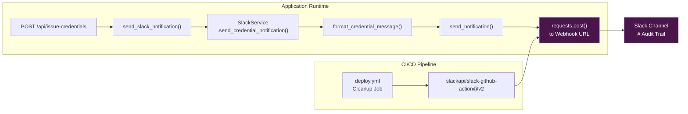

IAM-Dynamic integrates Slack as an **out-of-band observability channel** — every temporary credential issuance triggers a formatted notification to a configured Slack channel, establishing an immutable audit trail that exists entirely outside the application's request-response cycle. This design ensures that security-sensitive events are visible to operations teams even when the application's own logs are unavailable or tampered with. The integration is **fully optional**: when no webhook is configured, the system degrades gracefully by silently skipping notifications rather than failing.

Sources: [slack_service.py](backend/services/slack_service.py#L1-L29), [main.py](backend/main.py#L38-L40)

## Architecture: Two-Channel Notification Topology

Slack notifications originate from two architecturally distinct channels — one embedded in the **application runtime** (credential issuance), and one in the **CI/CD pipeline** (deployment completion). Both channels share a single `SLACK_WEBHOOK_URL` secret but use independent dispatch mechanisms. The application channel uses a custom Python service class, while the CI/CD channel uses the official `slackapi/slack-github-action`. This dual-path design ensures that both security-critical application events and infrastructure lifecycle events are observable from a single Slack channel.



Sources: [main.py](backend/main.py#L232-L243), [deploy.yml](.github/workflows/deploy.yml#L255-L264)

## The SlackService Class: Design and Failure Semantics

The `SlackService` class encapsulates all Slack webhook interaction behind a clean, stateless API. It is instantiated once at application startup and injected into the FastAPI module scope. The class follows a **fail-safe design philosophy**: webhook delivery failures are logged but never propagated as exceptions to the caller. This means a Slack outage cannot block credential issuance — a critical design decision for a security tool where credential availability may be time-sensitive.

The service exposes two notification categories, each with a format/send pair that separates message construction from delivery:

| Method Pair | Purpose | Emoji | Trigger Context |
|---|---|---|---|
| `format_credential_message` / `send_credential_notification` | Credential issuance audit | 🔓 `:unlock:` | After successful STS `AssumeRole` |
| `format_error_message` / `send_error_notification` | Error alerting | ⚠️ `:warning:` | Available for future integration |

The `send_notification` core method implements a single `requests.post` with a 10-second timeout and `raise_for_status()` error propagation. Any `requests.RequestException` — network timeouts, DNS failures, HTTP 4xx/5xx responses, SSL errors — is caught and logged at `ERROR` level, returning `False` to the caller. This boolean return is currently **consumed but not acted upon** by the dispatch layer, meaning notification failures are fire-and-forget at the endpoint level.

Sources: [slack_service.py](backend/services/slack_service.py#L31-L57), [slack_service.py](backend/services/slack_service.py#L139-L161)

## Configuration and Graceful Degradation

Slack integration is controlled by a single environment variable: `SLACK_WEBHOOK_URL`. The configuration path flows through Pydantic validation via the `SlackConfig` model, which declares the field as `Optional[str]` with a default of `None`. When this value is absent, the entire notification subsystem deactivates itself at initialization time — the `SlackService` constructor logs an informational message and the `send_notification` method returns `False` immediately without attempting any network I/O.

The environment variable is passed through to the production Docker container via `docker-compose.prod.yml`, using a fallback pattern that defaults to an empty string: `SLACK_WEBHOOK_URL=${SLACK_WEBHOOK_URL:-}`. This ensures the container starts cleanly even when the secret is not provisioned.

| Configuration Layer | File | Key | Behavior When Absent |
|---|---|---|---|
| `.env` file | `.env.example` | `SLACK_WEBHOOK_URL` | Notifications silently skipped |
| Pydantic model | `config.py` → `SlackConfig` | `webhook_url: Optional[str]` | `None` → early return in `send_notification` |
| Docker Compose (prod) | `docker-compose.prod.yml` | `SLACK_WEBHOOK_URL` | Passed as empty string → Pydantic reads `None` |
| GitHub Actions | `deploy.yml` | `secrets.SLACK_WEBHOOK_URL` | CI/CD notification step uses `continue-on-error: true` |

Sources: [config.py](backend/config.py#L90-L92), [docker-compose.prod.yml](docker-compose.prod.yml#L48), [.env.example](.env.example#L37-L39)

## Credential Issuance Notification Flow

The primary notification trigger is the `POST /api/issue-credentials` endpoint. After the STS service successfully calls `AssumeRole` and returns temporary credentials, the endpoint invokes the `send_slack_notification` helper function. This wrapper catches any exception from the Slack service and logs it at `ERROR` level, ensuring that notification failures never propagate to the HTTP response — the user receives their credentials regardless of Slack's availability.

The notification message is formatted with structured fields that provide immediate audit context. Here is the exact output format:

```
🔓 AWS Temporary Credentials issued for request:
AUTO-APPROVED
`Policy-based credential issuance`
Risk Score: MEDIUM
Duration: 4 hour(s)
```

The approval type line dynamically switches between `AUTO-APPROVED` and `MANUAL APPROVAL (by {approver})` based on the `auto_approved` boolean. The request text is wrapped in backticks for monospace rendering in Slack's markdown parser.

**A notable implementation detail**: the current `send_slack_notification` call at the credential issuance endpoint hardcodes `auto_approved=True` and `risk="medium"` rather than forwarding the actual risk assessment from the policy generation phase. This means the Slack audit trail currently always reports "medium" risk regardless of the LLM's actual risk determination. The `approver` parameter is forwarded from the request body, allowing manual approval tracking when an explicit approver name is provided.

Sources: [main.py](backend/main.py#L386-L404), [slack_service.py](backend/services/slack_service.py#L59-L116)

## Error Notification Channel (Reserved)

The `SlackService` class provides a complete `send_error_notification` method pair that formats error alerts with the ⚠️ emoji, an error type classification, the originating request text, and error details. This method is **defined but not yet invoked** from any endpoint in the current codebase. It represents a pre-built integration point for future error alerting — for example, surfacing policy generation failures, STS `AssumeRole` errors, or LLM provider outages to the operations channel.

The error message format follows the same structured pattern:

```
⚠️ IAM-Dynamic Error: Policy Generation
Request: `I need S3 read access to the data bucket`
Details: OpenAI API rate limit exceeded
```

This reserved channel aligns with the `AuditEvent` schema defined in `schemas.py`, which establishes typed data containers for event tracking with fields for `event_type`, `request_id`, `event_data`, `user_identifier`, and `timestamp`. While the `AuditEvent` dataclass exists in the type system, the current runtime does not yet wire it into the Slack notification pipeline — it serves as the schema contract for future structured audit logging.

Sources: [slack_service.py](backend/services/slack_service.py#L118-L161), [schemas.py](backend/schemas.py#L53-L69)

## CI/CD Deployment Notification

The second Slack notification channel operates within the GitHub Actions deployment pipeline. After a successful production deployment, the `cleanup` job in `deploy.yml` sends a deployment completion message using the official `slackapi/slack-github-action@v2.0.0`. This notification includes the Git commit SHA and the actor who triggered the deployment, formatted with a 🚀 emoji.

The step is configured with `continue-on-error: true`, consistent with the application-level fail-safe philosophy — a Slack notification failure must never prevent or fail a deployment pipeline. The webhook URL is sourced from the `SLACK_WEBHOOK_URL` GitHub secret, which is the same secret used by the application runtime (though the two channels operate independently).

```json
{
  "text": "IAM-Dynamic deployed successfully 🚀\nCommit: abc123def456...\nBy: username"
}
```

Sources: [deploy.yml](.github/workflows/deploy.yml#L255-L264)

## Notification Dispatch Wrapper

The `send_slack_notification` function in `main.py` serves as the application's dispatch boundary between the FastAPI endpoint layer and the `SlackService`. This wrapper was introduced to isolate the endpoint from Slack-specific exceptions — it wraps the `send_credential_notification` call in a bare `except Exception` clause and logs any failure at `ERROR` level. This is a deliberate architectural choice: the function acts as an **anti-corruption layer** that prevents infrastructure concerns (webhook delivery) from bleeding into the domain logic (credential issuance).

The wrapper accepts parameters that map directly to the `SlackService.send_credential_notification` signature: `auto_approved`, `req` (request text), `risk`, `duration`, and optional `approver`. The current invocation passes `auto_approved=True` unconditionally with a hardcoded `risk="medium"`, representing a simplified dispatch that could be enriched in future iterations to carry forward the actual risk assessment from the policy generation response.

Sources: [main.py](backend/main.py#L232-L243)

## Frontend Audit Awareness

The frontend acknowledges the audit trail in the credentials view, displaying a **Security Notice** to the user that explicitly states: *"All credential issuance is logged for audit purposes."* This UI element serves as both a transparency disclosure and a psychological deterrent — users are made aware that their credential activity is tracked. The notice appears within the credentials card, positioned below the credential export options, ensuring visibility at the exact moment credentials are displayed.

Sources: [credentials-view.tsx](frontend/src/views/credentials-view.tsx#L217-L220)

## Service Initialization and Lifecycle

The `SlackService` is instantiated at module load time during FastAPI application startup, alongside the `STSService`. The constructor receives the `webhook_url` from `config.slack.webhook_url`, which has been validated by Pydantic. At construction, the service logs one of two messages: confirmation that the webhook is configured, or an informational notice that notifications will be skipped. This startup log provides an immediate diagnostic signal — checking the application startup logs tells you whether Slack notifications are active without needing to trigger a credential issuance.

The service is a **module-level singleton** — it is created once and reused across all requests. Since the `requests.post` call is stateless (no session cookies, no connection pooling beyond what `requests` provides internally), the singleton pattern is appropriate and introduces no thread-safety concerns under FastAPI's async concurrency model.

Sources: [main.py](backend/main.py#L38-L40), [main.py](backend/main.py#L36)

---

**Related pages**: The notification system is triggered during [AWS STS Credential Issuance](9-aws-sts-credential-issuance-and-risk-based-duration-limits) and configured through the [Pydantic Configuration System](10-configuration-system-with-pydantic-validation). Deployment notifications are dispatched by the [CI/CD Pipeline](26-ci-cd-pipeline-pr-checks-build-and-ssh-deployment). Error types referenced in the reserved notification channel are detailed in [User-Facing Error Handling Strategy](13-user-facing-error-handling-strategy). The typed schemas supporting audit events are documented in [Data Schemas and Type Definitions](14-data-schemas-and-type-definitions).