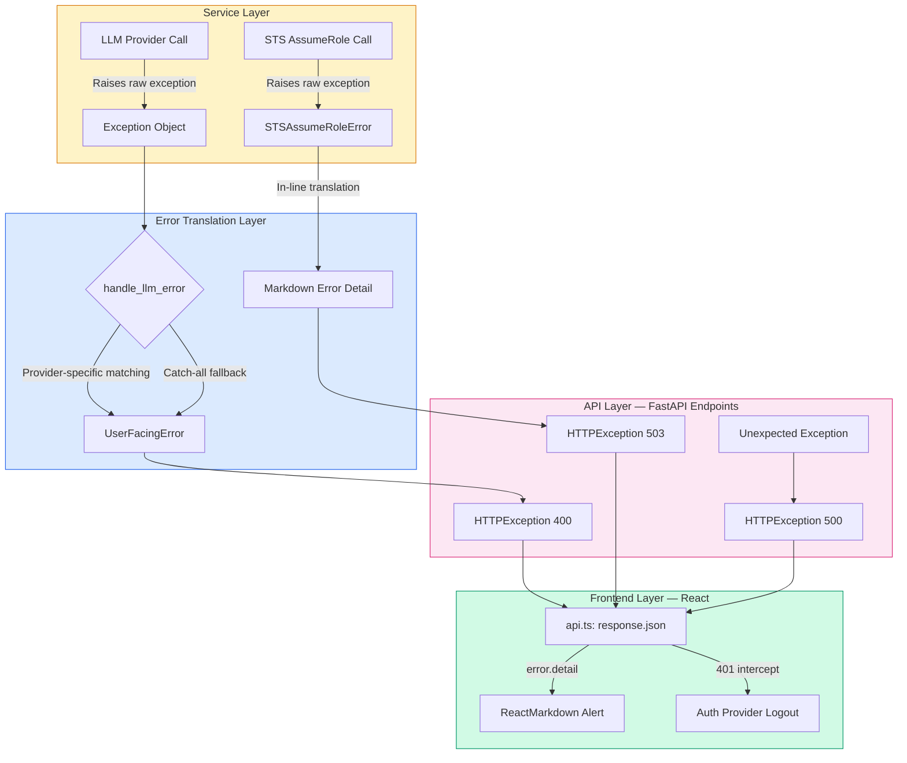
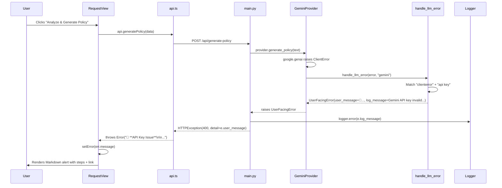

IAM-Dynamic employs a **dual-channel error handling architecture** that separates what developers see in logs from what users see in the UI. Rather than leaking raw exception traces, stack traces, or implementation details to the frontend, every error passes through a transformation pipeline that produces actionable, Markdown-rendered guidance. This page documents how that pipeline works end-to-end — from the moment an exception is raised inside an LLM provider or AWS service call to the moment a styled alert appears in the React frontend.

Sources: [error_handler.py](backend/services/error_handler.py#L1-L219), [main.py](backend/main.py#L340-L383)

## Architectural Overview

The error handling system follows a **three-layer funnel** pattern: exceptions are born in service code, translated into user-friendly messages by the error handler, and finally delivered as structured HTTP responses that the frontend renders as styled alerts. Each layer has a distinct responsibility and a clear contract with the next.



The key insight is that **no raw exception text ever reaches the user**. The `UserFacingError` class carries two messages: `user_message` (Markdown-formatted, with actionable steps and links) and `log_message` (the real technical detail for server-side diagnostics). This separation ensures that the frontend always receives something useful while server logs retain the full context needed for debugging.

Sources: [error_handler.py](backend/services/error_handler.py#L13-L19), [main.py](backend/main.py#L371-L383)

## The UserFacingError Exception Class

At the center of the translation layer sits `UserFacingError`, a purpose-built exception that acts as a **structured envelope** for error information. It extends Python's base `Exception` and adds two properties that travel in parallel through the call stack.

| Property | Purpose | Example Content |
|---|---|---|
| `user_message` | Markdown-formatted guidance shown in the UI | `"🔑 **API Key Issue**\n\nThe Google API key is invalid..."` |
| `log_message` | Technical detail written to server logs | `"Gemini API key invalid: ClientError: API_KEY_INVALID"` |

The constructor accepts both messages explicitly, defaulting `log_message` to `user_message` when only one is provided. This design means that in a quick fix, a developer can raise `UserFacingError("Something went wrong")` and the logging will still capture it, while the explicit two-argument form ensures that sensitive internal details never accidentally appear in the user-facing message.

Sources: [error_handler.py](backend/services/error_handler.py#L13-L19)

## Error Detection Strategy: String-Based Pattern Matching

The `handle_llm_error` function uses **string-based detection** on exception messages rather than importing provider-specific exception classes. This is a deliberate architectural choice documented in the module's docstring: it provides better compatibility across provider library versions, where exception class hierarchies may change between releases.

The function examines three attributes of the caught exception:

1. **`str(error).lower()`** — the normalized error message text
2. **`type(error).__name__`** — the exception class name (e.g., `ClientError`)
3. **`type(error).__module__`** — the originating module (e.g., `google.genai.errors`)

These three signals are combined in `if`/`elif` chains that map error signatures to user-friendly responses. The matching proceeds in a specific order: **provider-specific checks first, then generic cross-provider patterns, then a universal catch-all**.

Sources: [error_handler.py](backend/services/error_handler.py#L22-L39)

### Error Category Taxonomy

The table below shows every error category the system handles, along with the provider applicability and the user-facing guidance pattern:

| Category | Providers | Detection Signals | User Guidance |
|---|---|---|---|
| **API Key Invalid** | All 4 | `"api key"`, `"apikey"`, `"401"`, `"unauthorized"`, `"invalid_argument"` | Step-by-step key retrieval + `.env` configuration instructions |
| **Rate Limit / Quota** | All 4 | `"quota"`, `"limit"`, `"exceeded"`, `"429"`, `"rate"` | Wait → Check dashboard → Switch provider |
| **Model Not Found** | Gemini, OpenAI | `"model"` + `"not found"` / `"does not exist"` | Lists available models for the provider |
| **Request Timeout** | Claude, Generic | `"timeout"`, `"timed out"` | Retry → Check network → Switch provider |
| **Connection Error** | Claude, Generic | `"connection"`, `"network"` | Check internet → Retry → Status page link |
| **Unexpected Error** | Catch-all | Any unmatched exception | Retry → Verify key → Switch provider + error type hint |
| **AWS STS Failure** | N/A (STS-specific) | `STSAssumeRoleError` | Verify IAM role ARN → Check trust policy → Ensure `sts:AssumeRole` permission |
| **Authentication Failure** | N/A (Auth-specific) | HTTP 401 from FastAPI | `"Invalid username or password"` / `"Session expired"` |

Sources: [error_handler.py](backend/services/error_handler.py#L40-L218), [main.py](backend/main.py#L414-L440)

## Error Flow Through the API Layer

Every FastAPI endpoint in [main.py](backend/main.py) follows the same **try/except triad** pattern. This is not accidental — it's a consistent convention that ensures every code path produces a well-formed error response. The pattern looks like this:

```python
try:
    # Business logic
except UserFacingError as e:
    logger.error(f"... (user-facing): {e.log_message}")
    raise HTTPException(status_code=400, detail=e.user_message)
except Exception as e:
    logger.error(f"... : {e}", exc_info=True)
    raise HTTPException(status_code=500, detail="An unexpected error occurred.")
```

The triad handles three distinct scenarios:

- **`UserFacingError`** (400 Bad Request) — A translated, actionable error from the service layer. The `log_message` goes to logs; the `user_message` goes to the client.
- **`STSAssumeRoleError`** (503 Service Unavailable) — A specialized AWS error that receives inline Markdown formatting directly in the endpoint, including the actual role ARN for the user to verify.
- **Generic `Exception`** (500 Internal Server Error) — The safety net. The full traceback is logged server-side (`exc_info=True`), but the user only sees `"An unexpected error occurred."`

Sources: [main.py](backend/main.py#L340-L383), [main.py](backend/main.py#L386-L440), [main.py](backend/main.py#L457-L489)

### Endpoint-Specific Error Handling

| Endpoint | Catchable Errors | HTTP Status Codes | User-Facing Fallback |
|---|---|---|---|
| `POST /api/generate-policy` | `UserFacingError`, generic `Exception` | 400, 500 | "An unexpected error occurred. Please try again." |
| `POST /api/issue-credentials` | `STSAssumeRoleError`, generic `Exception` | 503, 500 | "Failed to issue credentials. Please try again." |
| `POST /api/generate-rejection-guidance` | `UserFacingError`, generic `Exception` | 400, 500 | "Unable to generate guidance. Please review your request." |
| `POST /api/auth/login` | Turnstile failure, invalid credentials | 400, 401 | "CAPTCHA verification failed" / "Invalid username or password" |

Sources: [main.py](backend/main.py#L260-L279), [main.py](backend/main.py#L340-L389), [main.py](backend/main.py#L457-L489)

## Service-Layer Error Origination

Errors originate from two primary sources in the service layer, each with its own propagation strategy.

### LLM Provider Errors

Each LLM provider class (Gemini, OpenAI, Claude, Zhipu) follows a consistent pattern in its `generate_policy` method. Before making any API call, the method checks whether the client was properly initialized (i.e., whether an API key was provided). If the key is missing, a `UserFacingError` is raised immediately with provider-specific setup instructions. For runtime errors from the API call itself, the pattern is:

```python
except UserFacingError:
    raise                    # Pass through pre-translated errors
except Exception as e:
    raise handle_llm_error(e, "provider_name")  # Translate unknown errors
```

This ensures that `UserFacingError` instances bubble up unchanged (they've already been translated), while all other exceptions pass through `handle_llm_error` for classification and translation.

Sources: [llm_service.py](backend/llm_service.py#L314-L317), [llm_service.py](backend/llm_service.py#L361-L370), [llm_service.py](backend/llm_service.py#L404-L407), [llm_service.py](backend/llm_service.py#L489-L492), [llm_service.py](backend/llm_service.py#L584-L587)

### AWS STS Errors

The STS service defines its own exception hierarchy: `STSAssumeRoleError` extends `STSServiceError`, which extends the base `Exception`. These are not translated through `handle_llm_error` — instead, the `issue_credentials` endpoint in `main.py` catches `STSAssumeRoleError` directly and constructs a detailed Markdown response inline, including the actual IAM role ARN from the configuration so the user can verify it. This is a deliberate exception to the centralized error handler pattern, because STS errors require configuration-specific details (account ID, role name) that only the endpoint handler has access to.

Sources: [sts_service.py](backend/services/sts_service.py#L13-L21), [sts_service.py](backend/services/sts_service.py#L100-L105), [main.py](backend/main.py#L414-L434)

## Frontend Error Consumption and Rendering

The React frontend handles errors at three distinct levels, each with a different scope and rendering strategy.

### API Client Layer: The Central Error Gateway

The `request<T>()` function in `api.ts` is the single point where all API responses are processed. It performs two critical checks before returning data:

1. **401 Interception** — If any request returns HTTP 401 (and it's not a login attempt), the client immediately clears the stored JWT token, dispatches a `auth:logout` custom event, and throws a `"Session expired. Please log in again."` error. The `AuthProvider` listens for this event and updates the application state to show the login screen.

2. **Generic Error Extraction** — For all other non-OK responses, the function attempts to parse the response body as JSON and extract the `detail` field. If JSON parsing fails, it falls back to `response.statusText`. The resulting string is thrown as a standard JavaScript `Error`.

Sources: [api.ts](frontend/src/lib/api.ts#L16-L41), [auth-provider.tsx](frontend/src/components/auth-provider.tsx#L57-L62)

### View-Level Error Rendering

Each view component manages its own error state and renders it in a contextually appropriate way:

**Request View** uses a `useMutation` hook from TanStack Query. The `onError` callback captures `err.message` into a local `error` state, which renders as a bordered alert box containing a `ReactMarkdown` component. This means backend Markdown-formatted error messages (with bold text, emoji icons, and clickable links) are rendered as styled HTML directly in the error alert.

**Review View** uses the same `useMutation` pattern for the credential issuance flow, but renders errors in a simpler format — plain text inside a destructive-colored alert, without Markdown rendering. This is appropriate because the review stage produces fewer error types (primarily STS failures or validation issues).

**Rejected View** handles errors from the AI guidance generation using a try/catch block rather than `useMutation`. Errors render inside a Radix `Alert` component with a destructive variant, including the `AlertCircle` icon and a title/description layout.

**Login View** captures authentication errors from the login API call and renders them as a simple destructive-colored text block. On failure, the Turnstile CAPTCHA widget is explicitly reset.

Sources: [request-view.tsx](frontend/src/views/request-view.tsx#L32-L43), [request-view.tsx](frontend/src/views/request-view.tsx#L109-L120), [review-view.tsx](frontend/src/views/review-view.tsx#L33-L43), [review-view.tsx](frontend/src/views/review-view.tsx#L156-L160), [rejected-view.tsx](frontend/src/views/rejected-view.tsx#L46-L66), [rejected-view.tsx](frontend/src/views/rejected-view.tsx#L156-L162), [login-view.tsx](frontend/src/views/login-view.tsx#L64-L86)

### Frontend Error Rendering Comparison

| View | Error State Mechanism | Rendering Style | Markdown Support | User Actions Offered |
|---|---|---|---|---|
| Request View | `useMutation.onError` → `useState` | Alert box with `AlertCircle` icon | ✅ Full (ReactMarkdown + remarkGfm) | Implicit via form retry |
| Review View | `useMutation.onError` → `useState` | Destructive-colored text alert | ❌ Plain text | Back button, Issue/Reject buttons |
| Rejected View | `try/catch` → `useState` | Radix `Alert` component | ❌ Plain text | Retry guidance, Revise, Start Fresh |
| Login View | `try/catch` → `useState` | Destructive-colored text block | ❌ Plain text | Form resubmission + Turnstile reset |

Sources: [request-view.tsx](frontend/src/views/request-view.tsx#L109-L120), [review-view.tsx](frontend/src/views/review-view.tsx#L156-L160), [rejected-view.tsx](frontend/src/views/rejected-view.tsx#L156-L162), [login-view.tsx](frontend/src/views/login-view.tsx#L131-L135)

## The Complete Error Lifecycle: An End-to-End Walkthrough

To understand how all these pieces fit together, consider what happens when a user submits a request while the Google API key has expired:



Notice the clean separation: the **logger** receives `"Gemini API key invalid: ClientError: API_KEY_INVALID"` while the **user** receives a formatted guide with a direct link to Google AI Studio. Neither the exception class name nor the internal error code leaks to the frontend.

Sources: [error_handler.py](backend/services/error_handler.py#L42-L53), [main.py](backend/main.py#L371-L377), [api.ts](frontend/src/lib/api.ts#L35-L38), [request-view.tsx](frontend/src/views/request-view.tsx#L40-L42)

## Design Principles and Trade-offs

The current error handling architecture reflects several deliberate design decisions worth understanding for anyone extending the system:

**String-based detection over exception type matching.** The `handle_llm_error` function inspects `str(error).lower()` and `type(error).__name__` rather than importing provider-specific exception classes. This trades compile-time type safety for runtime resilience — when Google, OpenAI, or Anthropic rename or restructure their exception hierarchies in a new SDK version, the string-matching approach continues to work as long as the error message content remains similar.

**Markdown as the error format contract.** Backend error messages use Markdown formatting with emoji prefixes (🔑, ⚠️, 🤖, ⏱️, 🔌, ❌) because the `RequestView` renders them through `ReactMarkdown`. This is a coupling point — if a new view renders errors as plain text, the Markdown syntax will appear raw. Views that don't use ReactMarkdown (Review View, Login View) deliberately receive simpler error strings.

**Two-tier fallback safety net.** The system has two catch-all layers: `handle_llm_error` returns a generic `UserFacingError` for any unrecognized LLM exception, and each endpoint's `except Exception` block returns a hardcoded generic message. This means even completely novel, unclassifiable errors produce a reasonable user experience rather than a stack trace.

**Inline STS error formatting.** AWS STS errors are formatted directly in the endpoint handler rather than through `handle_llm_error`, because they need access to `config.aws.account_id` and `config.aws.role_arn`. This is an intentional deviation from the centralized pattern — the STS error handler needs runtime configuration context that the generic error handler doesn't have access to.

Sources: [error_handler.py](backend/services/error_handler.py#L209-L218), [main.py](backend/main.py#L414-L440)

## Where to Go Next

- **[FastAPI Application Entry Point and API Endpoints](6-fastapi-application-entry-point-and-api-endpoints)** — See the full endpoint definitions where error handling is applied
- **[Multi-Provider LLM Service Layer](7-multi-provider-llm-service-layer)** — Understand how each provider raises errors that feed into this system
- **[AWS STS Credential Issuance and Risk-Based Duration Limits](9-aws-sts-credential-issuance-and-risk-based-duration-limits)** — Deep dive into the STS error hierarchy and credential failure scenarios
- **[API Client Layer and Auth Context Provider](16-api-client-layer-and-auth-context-provider)** — How the frontend fetch layer intercepts and dispatches errors
- **[Request View: Natural Language Input and Templates](17-request-view-natural-language-input-and-templates)** — See the Markdown error rendering in the policy generation view