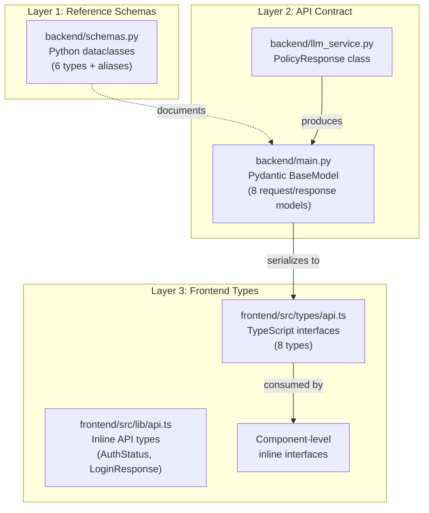
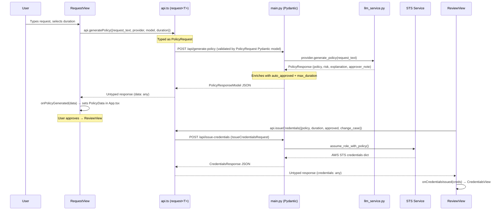

Every piece of data flowing through the IAM-Dynamic system — from a user's natural language access request to the final AWS credentials — is shaped by explicitly defined types. This page maps the complete type landscape across both backend and frontend, showing how Python dataclasses, Pydantic models, and TypeScript interfaces form a **layered contract** that connects the API boundary to the UI. Understanding these types is the key to following any data flow through the application.

## Where Types Live: A Three-Layer Architecture

The project defines types at three distinct layers, each serving a different purpose. Rather than a single shared schema file, the type definitions are distributed across files that align with their architectural role.



**Layer 1** (backend/schemas.py) contains pure Python dataclasses that document the internal data shapes used throughout the system — request data, credentials, audit events, and more. **Layer 2** (backend/main.py) holds the Pydantic models that FastAPI uses for request validation, response serialization, and automatic OpenAPI schema generation. **Layer 3** (frontend/src/types/api.ts) provides TypeScript interfaces that mirror the backend's API contract, giving the frontend compile-time safety when consuming API responses.

Sources: [schemas.py](backend/schemas.py#L1-L130), [main.py](backend/main.py#L58-L123), [api.ts](frontend/src/types/api.ts#L1-L59)

## Backend Reference Schemas (Python Dataclasses)

The file `backend/schemas.py` defines six dataclasses and four type aliases. These serve as the **authoritative reference** for the data shapes that flow through the system. Each dataclass is a plain Python class with no inheritance and no validation logic — their role is purely structural documentation.

| Dataclass | Purpose | Key Fields |
|-----------|---------|------------|
| `RequestData` | Typed container for a user's access request | `request_text`, `duration_hours`, `risk_level`, `policy`, `explanation`, `auto_approved` |
| `CredentialData` | Typed container for issued AWS credentials | `access_key_id`, `secret_access_key`, `session_token`, `expiration`, `session_name` |
| `AuditEvent` | Represents an audit trail event | `event_type`, `request_id`, `event_data`, `user_identifier`, `timestamp` |
| `HistoryItem` | Display-oriented record for session history | `time`, `req`, `risk`, `access_key`, `status` |
| `PolicyStats` | Statistical summary of a generated IAM policy | `services`, `action_count`, `unique_actions`, `has_wildcard_resource`, `has_wildcard_action` |
| `ValidationResult` | Outcome of a validation operation | `is_valid`, `errors`, `warnings` |

The file also defines four **type aliases** at the bottom, which encode semantic meaning into primitive types:

```python
RequestId = int
RiskLevel = str      # Literal["low", "medium", "high", "critical"]
DurationHours = float
PolicyJSON = Dict[str, Any]
```

These aliases capture the *intent* behind raw types. A `RiskLevel` is technically a string, but the alias communicates that only four values are valid. The comment on `RiskLevel` hints at a potential upgrade to `Literal["low", "medium", "high", "critical"]` for compile-time enforcement.

Sources: [schemas.py](backend/schemas.py#L1-L130)

## API Contract Models (Pydantic BaseModel)

While the dataclasses in `schemas.py` are reference documentation, the Pydantic models defined in `backend/main.py` are **runtime-enforced contracts**. FastAPI uses them to automatically validate incoming requests, serialize outgoing responses, and generate the `/docs` OpenAPI specification. Every HTTP endpoint has its input and output shaped by these models.

### Request Models

**`PolicyRequest`** is the primary input model — it captures what the user sends when requesting an IAM policy. Its fields carry validation constraints directly through Pydantic's `Field`:

| Field | Type | Default | Constraint | Description |
|-------|------|---------|------------|-------------|
| `request_text` | `str` | required | `min_length=10` | Natural language access description |
| `provider` | `Optional[str]` | `"gemini"` | — | LLM provider selection |
| `model` | `Optional[str]` | `None` | — | Override the provider's default model |
| `duration` | `int` | `2` | `ge=1, le=12` | Requested session duration in hours |
| `change_case` | `Optional[str]` | `None` | — | Business justification for high-risk |

**`IssueCredentialsRequest`** is sent when a user approves a policy and requests actual AWS credentials. It requires the policy JSON, a validated duration (1–12 hours), and an `approved` flag:

| Field | Type | Default | Constraint | Description |
|-------|------|---------|------------|-------------|
| `policy` | `dict` | required | — | The approved IAM policy document |
| `duration` | `int` | required | `ge=1, le=12` | Session duration in hours |
| `approved` | `bool` | `False` | — | Manual approval confirmation |
| `approver` | `Optional[str]` | `None` | — | Name of the approver |
| `change_case` | `Optional[str]` | `None` | — | Business justification |

**`RejectionGuidanceRequest`** powers the AI-assisted resubmission flow. When a request is rejected, the frontend sends back the original request, the generated policy, and the risk level so the LLM can suggest improvements.

**`LoginRequest`** handles authentication with a username, password, and an optional Cloudflare Turnstile CAPTCHA token.

Sources: [main.py](backend/main.py#L60-L109), [main.py](backend/main.py#L443-L454)

### Response Models

**`PolicyResponseModel`** is the most information-dense response in the system. It wraps the LLM's output with risk metadata:

```python
class PolicyResponseModel(BaseModel):
    policy: dict                          # Generated IAM policy JSON
    risk: str                             # "low" | "medium" | "high" | "critical"
    explanation: str                      # Human-readable risk explanation
    approver_note: str                    # Note for the approver
    auto_approved: bool                   # True only when risk == "low"
    max_duration: int                     # Capped by risk level (12/4/2/1 hours)
```

The `max_duration` field is computed server-side by the `get_max_duration()` function, which enforces a risk-based ceiling: low-risk requests can last up to 12 hours, critical-risk requests are capped at 1 hour. The `auto_approved` flag is set to `True` only when the risk level is `"low"`.

**`CredentialsResponse`** carries the sensitive AWS STS credentials back to the frontend. Note that `region` has a fixed default of `"us-east-1"` — it's not derived from the STS response:

```python
class CredentialsResponse(BaseModel):
    access_key_id: str
    secret_access_key: str      # Sensitive — displayed once
    session_token: str
    expiration: str             # ISO 8601 datetime string
    region: str = "us-east-1"
```

**`HealthResponse`**, **`LoginResponse`**, and **`AuthStatusResponse`** complete the set, providing health check data, JWT authentication tokens, and session verification status respectively.

Sources: [main.py](backend/main.py#L69-L123)

### The LLM Service PolicyResponse

Separate from the Pydantic models, the `llm_service.py` file defines its own `PolicyResponse` class — a plain Python class (not a dataclass, not a Pydantic model) that serves as the **return type** for all LLM provider implementations:

```python
class PolicyResponse:
    def __init__(self, policy: Dict[str, Any], risk: str,
                 explanation: str, approver_note: str):
        self.policy = policy
        self.risk = risk
        self.explanation = explanation
        self.approver_note = approver_note
```

This is the internal representation that every LLM provider (Gemini, OpenAI, Claude, Zhipu) returns from its `generate_policy()` method. The FastAPI endpoint then transforms this into a `PolicyResponseModel` by adding the computed `auto_approved` and `max_duration` fields. This is a deliberate separation: the LLM layer produces raw policy assessments, while the API layer enriches them with business logic.

Sources: [llm_service.py](backend/llm_service.py#L205-L219)

## Frontend Type Definitions (TypeScript)

The frontend defines types across three locations, each targeting a different consumption pattern.

### Central API Types (types/api.ts)

The `frontend/src/types/api.ts` file provides TypeScript interfaces that mirror the backend's Pydantic response models. These represent the **canonical shapes** of data flowing from the API:

| Interface | Mirrors Backend Model | Purpose |
|-----------|----------------------|---------|
| `ModelInfo` | — | Provider-specific model entry (`{ id, name }`) |
| `LLMProvider` | — | Provider config (`{ id, name, model, models[] }`) |
| `ProvidersResponse` | `/config/providers` response | Available LLM providers and current selection |
| `PolicyRequest` | `PolicyRequest` (Pydantic) | Policy generation request payload |
| `PolicyResponse` | `PolicyResponseModel` (Pydantic) | Generated policy with risk assessment |
| `IssueCredentialsRequest` | `IssueCredentialsRequest` (Pydantic) | Credential issuance request payload |
| `Credentials` | `CredentialsResponse` (Pydantic) | Issued AWS temporary credentials |
| `HealthResponse` | `HealthResponse` (Pydantic) | Health check response |

The `PolicyResponse` interface on the frontend uses a **string literal union** for the `risk` field — `type: 'low' | 'medium' | 'high' | 'critical'` — which is stricter than the backend's plain `str` type. This is a case where the frontend provides type safety that the backend's Pydantic model delegates to validation logic elsewhere.

Sources: [api.ts](frontend/src/types/api.ts#L1-L59)

### API Client Inline Types (lib/api.ts)

The API client in `frontend/src/lib/api.ts` defines two additional interfaces that handle authentication flows — `AuthStatus` and `LoginResponse` — alongside the generic `request<T>()` function that enforces typed responses:

```typescript
export interface AuthStatus {
  authenticated: boolean
  username: string | null
  auth_required: boolean
}

export interface LoginResponse {
  token: string
  expires_at: string
  username: string
}
```

The `request<T>()` function is the single point where all API calls pass through. It automatically attaches the JWT token from localStorage, handles 401 responses by clearing the session, and throws structured errors. Its generic type parameter `<T>` means every `api.*` method call is typed against its expected response shape.

Sources: [api.ts](frontend/src/lib/api.ts#L43-L88)

### Component-Level Inline Interfaces

Each view component defines its own `Props` interface inline, specifying the data it receives from the parent `App` component. This is a pattern where the types are co-located with their consumers rather than centralized:

| Component | Interface | Key Typed Props |
|-----------|-----------|----------------|
| `RequestView` | `RequestViewProps` | `requestText: string`, `duration: number`, `onPolicyGenerated: (data: any) => void` |
| `ReviewView` | `ReviewViewProps` | `policyData: any`, `onCredentialsIssued: (credentials: any) => void` |
| `RejectedView` | `RejectedViewProps` | `policyData: any`, `requestText: string`, `onReviseRequest: (text: string) => void` |
| `CredentialsView` | `CredentialsViewProps` | `credentials: { access_key_id, secret_access_key, session_token, expiration, region }` |

Notable here is the **type safety gap**: `ReviewView` and `RejectedView` accept `policyData: any` and `onCredentialsIssued: (credentials: any) => void`, bypassing the well-defined `PolicyResponse` and `Credentials` interfaces from `types/api.ts`. Only `CredentialsView` defines an explicit inline shape for its credentials prop, and only the `Sidebar` component actually imports from `types/api.ts` (for `ProvidersResponse`).

The `App.tsx` file defines the central `PolicyData` interface and the `ViewType` union (`'request' | 'review' | 'credentials' | 'rejected'`) that drives the entire view routing state machine.

Sources: [App.tsx](frontend/src/App.tsx#L15-L24), [review-view.tsx](frontend/src/views/review-view.tsx#L12-L17), [credentials-view.tsx](frontend/src/views/credentials-view.tsx#L8-L18), [rejected-view.tsx](frontend/src/views/rejected-view.tsx#L13-L21)

## Supporting Type Declarations

Two auxiliary type files complete the frontend's type system. The `vite-env.d.ts` file extends Vite's `ImportMetaEnv` to declare the `VITE_API_BASE_URL` environment variable as an optional string, enabling type-safe access to `import.meta.env.VITE_API_BASE_URL` throughout the codebase. The `global.d.ts` file provides module declarations for `*.css` and `*.svg` imports, which allows Vite's asset handling to work correctly with TypeScript's module resolution.

Sources: [vite-env.d.ts](frontend/src/vite-env.d.ts#L1-L9), [global.d.ts](frontend/src/global.d.ts#L1-L9)

## Data Flow: How Types Connect Across Layers

The following diagram shows how a single request flows through the type layers, from the user's input to the final credential display. Each arrow represents a type transformation:



This sequence reveals an important architectural pattern: **the backend enforces strict types at the API boundary** (Pydantic validates every request and serializes every response), while **the frontend currently relies on trust and loose typing** in its component layer. The `types/api.ts` interfaces exist as documentation but are not consistently imported by consuming components.

Sources: [App.tsx](frontend/src/App.tsx#L125-L141), [main.py](backend/main.py#L340-L412), [api.ts](frontend/src/lib/api.ts#L71-L81)

## Type Correspondence Table

The table below maps each data shape across all layers where it appears. Gaps (marked with "—") indicate where a layer does not define that shape, and "(unused)" marks types that are defined but not imported at runtime.

| Concept | backend/schemas.py | backend/main.py (Pydantic) | frontend/types/api.ts | Frontend Consumer |
|---------|-------------------|---------------------------|----------------------|-------------------|
| Policy generation request | `RequestData` | `PolicyRequest` | `PolicyRequest` | Inline in `api.ts` |
| Policy generation response | — | `PolicyResponseModel` | `PolicyResponse` | `App.tsx` `PolicyData` (inline) |
| Credential issuance request | — | `IssueCredentialsRequest` | `IssueCredentialsRequest` | Inline in `api.ts` |
| Credential issuance response | `CredentialData` | `CredentialsResponse` | `Credentials` | `CredentialsView` (inline) |
| Risk level | `RiskLevel` alias | `risk: str` | `'low' \| 'medium' \| 'high' \| 'critical'` | `riskConfig` objects |
| LLM provider config | — | — (dict response) | `LLMProvider`, `ProvidersResponse` | `Sidebar` (imports `ProvidersResponse`) |
| Auth status | — | `AuthStatusResponse` | `AuthStatus` (in `lib/api.ts`) | `auth-provider` component |
| Login | — | `LoginRequest` / `LoginResponse` | `LoginResponse` (in `lib/api.ts`) | `login-view` component |
| Health check | — | `HealthResponse` | `HealthResponse` | (unused) |
| Audit trail | `AuditEvent` | — | — | (unused) |
| Session history | `HistoryItem` | — | — | (unused) |
| Policy statistics | `PolicyStats` | — | — | (unused) |
| Validation result | `ValidationResult` | — | — | (unused) |

Sources: [schemas.py](backend/schemas.py#L1-L130), [main.py](backend/main.py#L58-L123), [api.ts](frontend/src/types/api.ts#L1-L59), [App.tsx](frontend/src/App.tsx#L15-L24)

## Key Takeaways

The type system in IAM-Dynamic follows a **progressive strictness** pattern: the backend's Pydantic models provide the strongest guarantees (automatic validation, OpenAPI schema generation, error messages), while the frontend's type coverage varies by component. The `backend/schemas.py` dataclasses (`AuditEvent`, `HistoryItem`, `PolicyStats`, `ValidationResult`) represent planned or internal data shapes that are not yet wired into the API layer — they serve as a **forward-looking schema** for future audit and analytics features.

For developers adding new API endpoints or frontend views, the workflow is: define the Pydantic request/response models in `backend/main.py`, create matching TypeScript interfaces in `frontend/src/types/api.ts`, and then import those interfaces in the consuming component rather than using inline `any` types.

**Next steps**: To see how the Pydantic models are used in actual endpoint logic, read [FastAPI Application Entry Point and API Endpoints](6-fastapi-application-entry-point-and-api-endpoints). For the frontend's consumption patterns, see [API Client Layer and Auth Context Provider](16-api-client-layer-and-auth-context-provider). For how the `PolicyResponse` type is produced by each LLM provider, see [Multi-Provider LLM Service Layer](7-multi-provider-llm-service-layer).