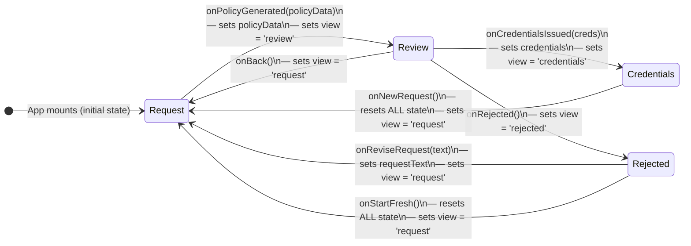
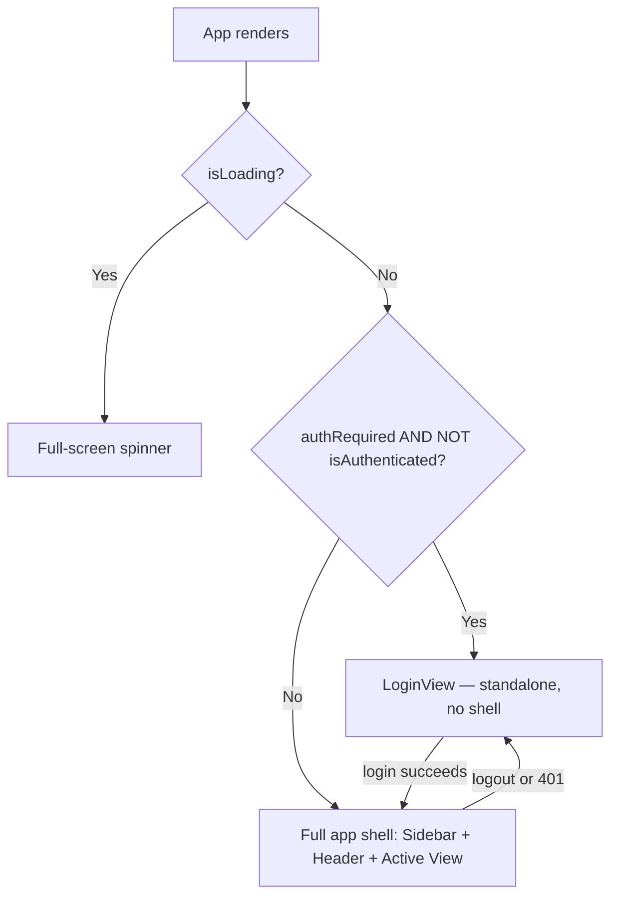

The IAM-Dynamic frontend does **not** use a URL-based router such as React Router. Instead, the entire application navigates through a **finite state machine** managed by a single `useState<ViewType>` hook in the root `App` component. This design treats the user's credential-request workflow as a linear, directed graph with four named views and well-defined transition rules, keeping navigation logic co-located with the shared application state that each view consumes. The result is a tightly coupled but highly predictable architecture where every state transition is an explicit function call rather than an implicit URL change.

Sources: [App.tsx](frontend/src/App.tsx#L15-L35)

## Component Hierarchy and Provider Stack

Before examining the state machine itself, it is important to understand the provider context that wraps the application. The entry point in `main.tsx` composes three providers in a specific order: `QueryClientProvider` (TanStack React Query for server-state management), `AuthProvider` (session verification and JWT token storage), and finally the `App` component itself. The `ThemeProvider` wraps only the rendered content inside `App`, meaning theme state is accessible to all visual components but not to the authentication logic.

```
StrictMode
 └── QueryClientProvider (staleTime: 5m, retry: 1)
      └── AuthProvider (verifySession on mount, 401 listener)
           └── App
                └── ThemeProvider (system/light/dark)
                     ├── Sidebar (provider, model, templates)
                     └── [Active View Component]
```

The `AuthProvider` performs session verification on mount via `api.verifySession()`, resolving three pieces of state — `isAuthenticated`, `username`, and `authRequired` — that determine whether the login gate activates. It also listens for a custom `auth:logout` DOM event dispatched by the API client when a 401 response is received, triggering a forced logout without requiring a page refresh.

Sources: [main.tsx](frontend/src/main.tsx#L1-L25), [auth-provider.tsx](frontend/src/components/auth-provider.tsx#L43-L62)

## The Four-State View Machine

The core routing mechanism is a single `ViewType` union — `'request' | 'review' | 'credentials' | 'rejected'` — stored in `useState` at the `App` level. Conditional rendering maps each view constant to its corresponding component, and because no two views render simultaneously, the application behaves as a strict single-state machine. Alongside `view`, the `App` component maintains five additional state variables that serve as the **shared payload** passed between views during transitions.

| State Variable | Type | Purpose | Reset on "New Request" |
|---|---|---|---|
| `view` | `'request' \| 'review' \| 'credentials' \| 'rejected'` | Active view selector | Yes → `'request'` |
| `policyData` | `PolicyData \| null` | Generated policy + risk assessment | Yes → `null` |
| `duration` | `number` | Requested session duration in hours | Yes → `2` |
| `credentials` | `any \| null` | STS temporary credentials | Yes → `null` |
| `requestText` | `string` | User's natural-language input | Yes → `''` |
| `selectedProvider` | `string` | LLM provider ID (e.g., `'gemini'`) | No |
| `selectedModel` | `string` | Specific model within provider | No |

Note that `selectedProvider` and `selectedModel` are **not** reset during a "new request" cycle, allowing users to maintain their LLM preference across multiple credential requests.

Sources: [App.tsx](frontend/src/App.tsx#L28-L34)

## State Transition Diagram

The following diagram illustrates every valid transition in the view state machine. Each arrow is labelled with the callback that triggers the transition and the side effects (state mutations) that accompany it.



**Transition rules enforced by conditional rendering:** The `review` view renders only when `view === 'review' && policyData` is truthy, meaning it is impossible to reach the review state without a completed policy generation. Similarly, `credentials` requires both `view === 'credentials' && credentials`, and `rejected` requires `view === 'rejected' && policyData`. These guards prevent orphaned states from rendering partial or missing data.

Sources: [App.tsx](frontend/src/App.tsx#L117-L176)

## Transition Callbacks in Detail

Each view component receives its transition callbacks as props, and the `App` component defines them as inline arrow functions. This pattern keeps the transition logic centralized while allowing each view to trigger state changes without knowledge of the overall state machine. Below is a breakdown of every transition, its trigger, and the state mutations it performs.

### Request → Review (Policy Generation Success)

The `RequestView` component calls `api.generatePolicy` via a TanStack `useMutation` hook. On success, it invokes `onPolicyGenerated(data)`, which the `App` component handles by storing the full `PolicyData` object (containing the generated IAM policy, risk level, explanation, approver note, auto-approval flag, and maximum duration) and switching to the `review` view. The mutation also carries the `provider`, `model`, and `duration` selections to the backend, ensuring the LLM service uses the user's chosen configuration.

Sources: [request-view.tsx](frontend/src/views/request-view.tsx#L34-L43), [App.tsx](frontend/src/App.tsx#L125-L128)

### Review → Credentials (Credential Issuance Success)

When the user approves the policy in `ReviewView`, the component calls `api.issueCredentials` via another `useMutation` hook. The request payload includes the policy document, the risk-adjusted `max_duration` (not the user's original duration), an `approved: true` flag, and an optional `change_case` business justification for non-auto-approved requests. On success, `onCredentialsIssued(creds)` stores the STS credentials (access key, secret key, session token, expiration, region) and transitions to the `credentials` view.

Sources: [review-view.tsx](frontend/src/views/review-view.tsx#L35-L57), [App.tsx](frontend/src/App.tsx#L136-L139)

### Review → Rejected (User-Initiated Rejection)

The `ReviewView` renders a "Reject" button that directly calls `onRejected()` with no payload. This is a user-driven decision — typically when the generated policy is too broad or the risk assessment is unacceptable. The transition simply switches the view to `rejected` while preserving the `policyData` and `requestText` so the `RejectedView` can display context about what was rejected.

Sources: [review-view.tsx](frontend/src/views/review-view.tsx#L183-L191), [App.tsx](frontend/src/App.tsx#L140)

### Rejected → Request (Revise or Start Fresh)

The `RejectedView` offers two paths back to the request state. **"Revise Request"** calls `onReviseRequest(requestText)`, which pre-populates the request text area with the original text so the user can edit and resubmit. **"Start Fresh"** calls `onStartFresh()`, which wipes all accumulated state (`policyData`, `requestText`, `duration`) and returns to a clean initial form. The rejected view also provides an "Get AI Guidance" button that fetches revision suggestions from the backend's `/api/generate-rejection-guidance` endpoint — this does not trigger a view transition but renders inline markdown guidance to help the user improve their request.

Sources: [rejected-view.tsx](frontend/src/views/rejected-view.tsx#L46-L66), [App.tsx](frontend/src/App.tsx#L151-L161)

### Credentials → Request (New Request Cycle)

After credentials are issued and displayed, `CredentialsView` offers an "onNewRequest" callback that performs a full state reset — nullifying `policyData`, `credentials`, and `requestText`, and resetting `duration` to its default of 2 hours. This is the only transition that clears the `credentials` state, ensuring sensitive STS data is removed from memory once the user moves on.

Sources: [credentials-view.tsx](frontend/src/views/credentials-view.tsx#L8-L18), [App.tsx](frontend/src/App.tsx#L168-L174)

## Authentication Gate

The view state machine operates beneath an authentication gate implemented directly in `App`. The rendering logic follows a strict priority sequence: (1) if `isLoading` is true, render a full-screen spinner; (2) if `authRequired && !isAuthenticated`, render the `LoginView` in isolation (no sidebar, no header); (3) otherwise, render the full application shell with sidebar, header, and the active view. This means the four-state machine is only reachable after authentication succeeds, and there is no path from an authenticated view back to the login screen other than the `logout()` function (triggered by the header button or a 401 event).



The `LoginView` component integrates with Cloudflare Turnstile CAPTCHA when the `VITE_TURNSTILE_SITE_KEY` environment variable is set. On successful login, it calls the `login(token, username)` function from `AuthContext`, which stores the JWT in `localStorage` and updates the auth state, causing a re-render that unlocks the main application shell.

Sources: [App.tsx](frontend/src/App.tsx#L55-L72), [login-view.tsx](frontend/src/views/login-view.tsx#L64-L86)

## Data Flow Between App and Views

The architecture follows a **lifted state** pattern where `App` is the single source of truth for all shared state. No view maintains its own copy of data that another view needs. Instead, each view receives its required data through props and signals transitions through callbacks. The following table maps each view to the data it consumes and the transitions it can trigger.

| View | Data Consumed (Props In) | Transitions (Callbacks Out) | API Calls |
|---|---|---|---|
| **RequestView** | `requestText`, `duration`, `selectedProvider`, `selectedModel` | `onPolicyGenerated(policyData)` | `POST /api/generate-policy` |
| **ReviewView** | `policyData` (policy, risk, explanation, auto_approved, max_duration) | `onBack()`, `onCredentialsIssued(creds)`, `onRejected()` | `POST /api/issue-credentials` |
| **RejectedView** | `policyData`, `requestText`, `duration`, `selectedProvider`, `selectedModel` | `onReviseRequest(text)`, `onStartFresh()` | `POST /api/generate-rejection-guidance` |
| **CredentialsView** | `credentials` (keys, token, expiration, region), `duration` | `onNewRequest()` | None (client-side only) |

A notable implication of this pattern is that `RejectedView` receives the original `requestText`, `duration`, and LLM configuration alongside `policyData`. This enables the "Revise Request" path to pre-populate the form with the user's original input while also allowing the AI guidance generator to reference both the original request and the rejected policy for contextual revision suggestions.

Sources: [App.tsx](frontend/src/App.tsx#L117-L176)

## Sidebar: Cross-Cutting State Independent of View

The `Sidebar` component renders alongside every view in the authenticated state and manages two categories of cross-cutting concerns: **LLM configuration** (provider and model selectors) and **request templates** (pre-written prompts that populate the request text). Notably, the sidebar's provider/model state is synchronized with the `App` component through a bidirectional prop chain — `App` passes the current selections down, and the `Sidebar` fires `onProviderChange` and `onModelChange` callbacks upward. Internally, the sidebar uses local `useState` for immediate reactivity but syncs changes to the parent via `useEffect`, creating a controlled component pattern where the parent is always the authoritative source.

The `onRequestTextChange` callback from the sidebar's template buttons is particularly interesting: it directly mutates the `requestText` state in `App`, meaning a user can click a template at any point (even while viewing the review or credentials screen) and the text will be waiting for them when they navigate back to the request view. This works because the template buttons only modify the shared `requestText` state without triggering a view transition.

Sources: [sidebar.tsx](frontend/src/components/sidebar.tsx#L36-L61), [App.tsx](frontend/src/App.tsx#L78-L85)

## Design Tradeoffs: State Machine vs. URL Routing

The decision to use a `useState`-driven state machine instead of a URL-based router reflects the application's **single-workflow nature**. Unlike a content site or dashboard with many independent pages, the IAM-Dynamic portal guides users through a sequential process (request → review → credentials/rejected) where back-navigation to arbitrary states is intentionally restricted. This approach offers several advantages and one meaningful tradeoff.

**Advantages:**
- **Guaranteed state consistency** — The conditional rendering guards (`view === 'review' && policyData`) make it structurally impossible to render a view without its prerequisite data, eliminating an entire class of "null reference" bugs that URL-based routing often introduces.
- **Simplified browser history** — Users cannot accidentally bookmark or share a deep link to the credentials view (which would expose sensitive STS keys in the URL), reducing the security surface.
- **Co-located transition logic** — Every state transition is visible within a 60-line section of `App.tsx`, making the control flow auditable at a glance.

**Tradeoff:**
- **No deep linking** — The browser's back button does not navigate between views; it navigates away from the application entirely. For this specific workflow (a credential request tool), this is an acceptable tradeoff because each request is ephemeral and sequential.

Sources: [App.tsx](frontend/src/App.tsx#L117-L176)

## Further Reading

- For the API client that powers each view's server interactions, see [API Client Layer and Auth Context Provider](16-api-client-layer-and-auth-context-provider).
- For the natural language input form and template system, see [Request View: Natural Language Input and Templates](17-request-view-natural-language-input-and-templates).
- For the risk assessment display and approval/rejection flow, see [Review View: Risk Assessment and Policy Approval Flow](18-review-view-risk-assessment-and-policy-approval-flow).
- For the credential export formats and expiration timer, see [Credentials View: Multi-Format Export and Expiration Timer](19-credentials-view-multi-format-export-and-expiration-timer).
- For the AI-powered revision guidance system, see [Rejected View: AI-Powered Resubmission Guidance](20-rejected-view-ai-powered-resubmission-guidance).