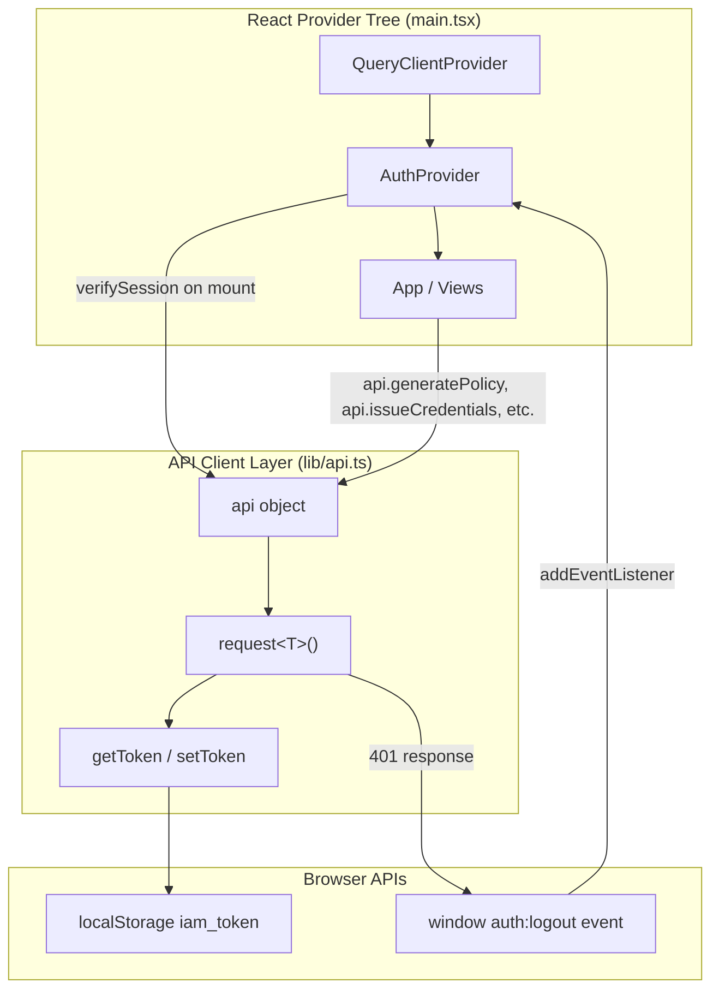
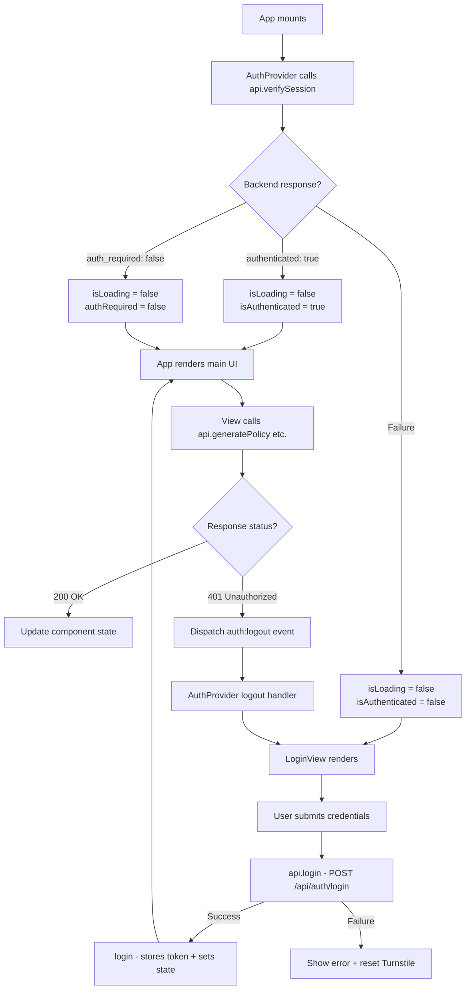

The frontend's HTTP communication and authentication state are managed by two tightly coupled modules: a lightweight **API client** (`lib/api.ts`) that encapsulates all backend interaction behind a single object, and an **Auth Context Provider** (`components/auth-provider.tsx`) that exposes session state and login/logout actions to every component via React Context. Together they form the backbone of the frontend's data layer — every fetch call, every token refresh, and every forced-logout event flows through these two files before reaching a UI component.

Sources: [api.ts](frontend/src/lib/api.ts#L1-L89), [auth-provider.tsx](frontend/src/components/auth-provider.tsx#L1-L76)

## Architecture Overview

Before examining each module in isolation, it helps to see how they sit within the broader React tree. The following diagram shows the provider nesting order and the data-flow paths from component mount through to HTTP request:



The key takeaway is the **feedback loop**: `AuthProvider` boots the session by calling `api.verifySession()`, views trigger mutations through `api.*` methods, and if the server ever returns a 401 the `request()` function dispatches a DOM event that `AuthProvider` listens for — forcing a logout without any component needing to orchestrate it.

Sources: [main.tsx](frontend/src/main.tsx#L17-L25), [api.ts](frontend/src/lib/api.ts#L16-L41), [auth-provider.tsx](frontend/src/components/auth-provider.tsx#L43-L62)

## API Client — `lib/api.ts`

### Token Management

The module manages a single JWT token stored under the key `iam_token` in the browser's `localStorage`. Two internal functions handle reads and writes:

| Function | Visibility | Behaviour |
|---|---|---|
| `getToken()` | private | Reads `iam_token` from localStorage; returns `null` when absent |
| `setToken(token)` | **exported** | Writes the token to localStorage, or removes the key when `null` is passed |

The `setToken` export is deliberately public because `AuthProvider` calls it during login (to persist the token) and during logout or session expiry (to clear it). This makes `setToken` the **single source of truth** for token persistence — no other module touches `localStorage` directly.

Sources: [api.ts](frontend/src/lib/api.ts#L1-L14)

### Generic Request Function

All HTTP traffic passes through a single generic helper, `request<T>(url, options)`. This function implements three cross-cutting concerns in a compact pipeline:

1. **Authorization header injection** — If `getToken()` returns a non-null value, an `Authorization: Bearer <token>` header is attached to every request automatically.
2. **401 interception** — When the server responds with HTTP 401 and the request is *not* targeting `/api/auth/login`, the function clears the token and dispatches a `CustomEvent('auth:logout')` on the `window` object. This triggers `AuthProvider`'s listener and forces a coordinated logout across the entire React tree.
3. **Error normalisation** — For any non-OK response, the function attempts to parse a JSON `detail` field from the body (matching FastAPI's error schema). If JSON parsing fails, it falls back to `response.statusText`.

Sources: [api.ts](frontend/src/lib/api.ts#L16-L41)

### API Surface Object

The module exports a single `api` object whose methods map one-to-one to backend endpoints. Each method is a thin wrapper that calls `request()` with the appropriate HTTP verb, URL, and JSON body:

| Method | HTTP | Endpoint | Purpose |
|---|---|---|---|
| `verifySession()` | GET | `/api/auth/verify` | Check if the stored token is still valid |
| `login(data)` | POST | `/api/auth/login` | Authenticate with username/password + optional Turnstile token |
| `getProviders()` | GET | `/config/providers` | Fetch available LLM providers and current selection |
| `generatePolicy(data)` | POST | `/api/generate-policy` | Send natural-language request, receive generated IAM policy |
| `issueCredentials(data)` | POST | `/api/issue-credentials` | Exchange an approved policy for temporary STS credentials |
| `generateRejectionGuidance(data)` | POST | `/api/generate-rejection-guidance` | Get AI-generated advice for resubmitting a rejected request |

All methods are typed with generics on `request<T>()` so that callers receive properly typed responses — for instance, `verifySession()` returns `AuthStatus` and `login()` returns `LoginResponse`.

Sources: [api.ts](frontend/src/lib/api.ts#L43-L88)

### Base URL and Development Proxy

The `BASE_URL` constant defaults to `import.meta.env.VITE_API_BASE_URL`, falling back to an empty string. In local development this empty string works because Vite's dev server proxies `/api`, `/health`, and `/config` prefixes to `http://localhost:8000` (the FastAPI backend). In production, the frontend is served behind Caddy or nginx, which routes those same prefixes to the backend container — so the empty-string default is correct for both environments.

Sources: [api.ts](frontend/src/lib/api.ts#L1), [vite.config.ts](frontend/vite.config.ts#L15-L28)

## Auth Context Provider — `components/auth-provider.tsx`

### Context Shape

The `AuthContext` exposes five values to any descendant component that calls `useAuth()`:

| Property | Type | Description |
|---|---|---|
| `isAuthenticated` | `boolean` | Whether the user currently holds a valid session |
| `username` | `string \| null` | Display name of the logged-in user |
| `isLoading` | `boolean` | `true` during the initial session verification on mount |
| `authRequired` | `boolean` | `false` when the backend has authentication disabled (single-user mode) |
| `login(token, username)` | function | Persists token + sets authenticated state |
| `logout()` | function | Clears token + resets authenticated state |

Sources: [auth-provider.tsx](frontend/src/components/auth-provider.tsx#L4-L20)

### Session Verification on Mount

When `AuthProvider` mounts, a `useEffect` fires `api.verifySession()`. The backend responds with `{ authenticated, username, auth_required }`. Three outcomes are possible:

- **Authenticated** — `isAuthenticated` is set to `true`, `username` is populated, and `isLoading` becomes `false`. The app renders normally.
- **Not authenticated but auth not required** — `authRequired` is set to `false`. The `App` component skips the login gate entirely, allowing anonymous access.
- **Verification failure** (network error, invalid token) — The token is cleared, `isAuthenticated` is set to `false`, and `isLoading` becomes `false`. The app shows the login view.

Sources: [auth-provider.tsx](frontend/src/components/auth-provider.tsx#L43-L55)

### Forced Logout via DOM Event

A second `useEffect` subscribes to the `auth:logout` custom event on `window`. When the API client's `request()` function detects a 401 response, it dispatches this event. The `AuthProvider` responds by calling `logout()`, which clears the token and resets state. This pattern ensures that **any** component making an API call — whether it uses the context or not — triggers a global session reset when the server rejects the token.

Sources: [auth-provider.tsx](frontend/src/components/auth-provider.tsx#L58-L62), [api.ts](frontend/src/lib/api.ts#L29-L33)

### The `useAuth` Hook

The provider exports a `useAuth()` convenience hook that calls `useContext(AuthContext)` and throws a descriptive error if called outside of `<AuthProvider>`. This defensive check prevents subtle bugs where a component is accidentally rendered outside the provider tree.

Sources: [auth-provider.tsx](frontend/src/components/auth-provider.tsx#L71-L75)

## Provider Composition in `main.tsx`

The application entry point composes three providers in a specific order, from outermost to innermost:

```
StrictMode → QueryClientProvider → AuthProvider → App
```

This ordering is deliberate. `QueryClientProvider` must wrap `AuthProvider` because `App` uses `useQuery` (from TanStack React Query) to fetch provider configuration, and that query depends on the `isAuthenticated` flag from `AuthProvider`. Placing `QueryClientProvider` outside ensures the query client is available when `App` renders.

Sources: [main.tsx](frontend/src/main.tsx#L17-L25)

## Authentication Lifecycle

The following flowchart traces the complete lifecycle from application boot through login, normal usage, and forced logout:



Sources: [auth-provider.tsx](frontend/src/components/auth-provider.tsx#L30-L62), [login-view.tsx](frontend/src/views/login-view.tsx#L64-L86), [api.ts](frontend/src/lib/api.ts#L29-L33)

## How Views Consume the API

Views do not call `request()` directly. Instead, they import the `api` object and pass individual methods as `mutationFn` to TanStack React Query's `useMutation` hook. This pattern gives each view automatic loading states, error handling, and retry logic without boilerplate:

| View | API Method | Hook |
|---|---|---|
| [RequestView](frontend/src/views/request-view.tsx) | `api.generatePolicy` | `useMutation` |
| [ReviewView](frontend/src/views/review-view.tsx) | `api.issueCredentials` | `useMutation` |
| [RejectedView](frontend/src/views/rejected-view.tsx) | `api.generateRejectionGuidance` | imperative `await` |
| [App](frontend/src/App.tsx) | `api.getProviders` | `useQuery` |

The `App` component additionally uses `useQuery` (not `useMutation`) for `api.getProviders` because provider configuration is a read-only fetch that should be cached and refetched according to TanStack's `staleTime` (configured globally at 5 minutes in `main.tsx`).

Sources: [request-view.tsx](frontend/src/views/request-view.tsx#L34-L43), [review-view.tsx](frontend/src/views/review-view.tsx#L35-L44), [App.tsx](frontend/src/App.tsx#L37-L41), [main.tsx](frontend/src/main.tsx#L8-L15)

## Type Definitions

The API client defines its own response interfaces (`AuthStatus`, `LoginResponse`) directly in `lib/api.ts`, while shared domain types live in `types/api.ts`. The following table summarises the type ownership:

| File | Types | Reason |
|---|---|---|
| `lib/api.ts` | `AuthStatus`, `LoginResponse` | Tight coupling to auth flow — only the API client and auth-provider use these |
| `types/api.ts` | `PolicyRequest`, `PolicyResponse`, `Credentials`, `LLMProvider`, etc. | Shared domain models consumed by multiple views and the sidebar |

Sources: [api.ts](frontend/src/lib/api.ts#L43-L53), [api.ts](frontend/src/types/api.ts#L1-L59)

## Key Design Decisions

**Single request function with cross-cutting concerns.** Rather than scattering `fetch` calls across the codebase, every call passes through `request<T>()`. This centralises auth header injection, 401 handling, and error normalisation in one place — a pattern sometimes called the "API gateway on the client."

**DOM event for forced logout.** The 401 handler dispatches a `CustomEvent` rather than importing a React state setter directly. This decouples the API client (a plain module with no React dependency) from the auth provider (a React context), keeping both testable in isolation.

**`setToken` as the single writer.** Both `login()` and `logout()` in the auth provider call the exported `setToken()`. No other code path writes to `localStorage`, which eliminates race conditions around token persistence.

**`authRequired` flag for optional auth.** The backend's `/api/auth/verify` endpoint returns `auth_required`, allowing the frontend to adapt when authentication is disabled (useful for local development or single-user deployments). The `App` component uses this flag to skip the login gate entirely.

Sources: [api.ts](frontend/src/lib/api.ts#L16-L41), [auth-provider.tsx](frontend/src/components/auth-provider.tsx#L36-L55)

## What to Read Next

- **[React App State Machine and View Routing](15-react-app-state-machine-and-view-routing)** — How `App.tsx` uses the auth state to drive view transitions between request, review, credentials, and rejected screens.
- **[Request View: Natural Language Input and Templates](17-request-view-natural-language-input-and-templates)** — Where `api.generatePolicy` is consumed via `useMutation` to submit user input to the LLM.
- **[JWT Authentication and Cloudflare Turnstile CAPTCHA](11-jwt-authentication-and-cloudflare-turnstile-captcha)** — The backend counterpart: how tokens are issued, verified, and how Turnstile tokens are validated server-side.