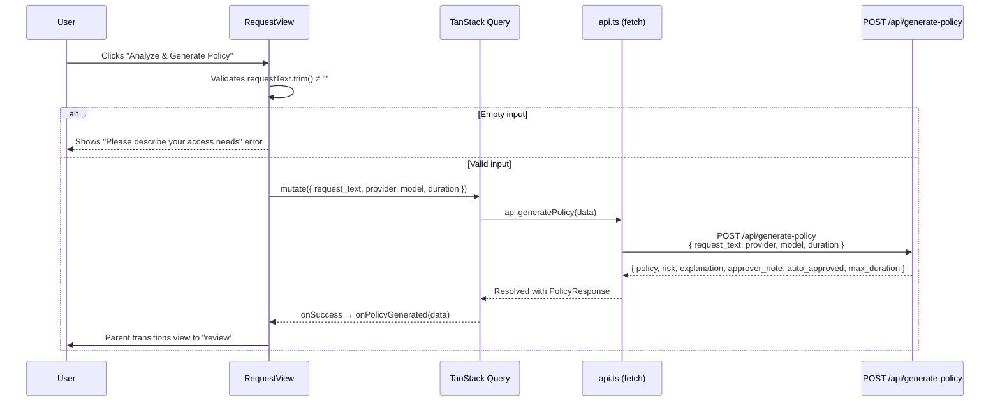
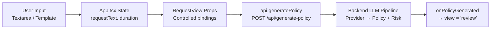

The **Request View** is the primary entry point for users of the IAM-Dynamic portal — the screen where access needs are translated from human intent into a structured payload that the backend's LLM pipeline transforms into a least-privilege IAM policy. It is a controlled, stateless component that renders a natural language textarea, a session-duration slider, submission logic, and contextual guidance. The view does not own application state; instead, it receives all data and callbacks from its parent (`App.tsx`) through props, making it predictable and easy to test in isolation. Template selection, by contrast, lives in the sidebar, which injects pre-written prompts directly into the same `requestText` state — meaning templates and free-form input share a single data path to the backend.

Sources: [request-view.tsx](frontend/src/views/request-view.tsx#L1-L174), [App.tsx](frontend/src/App.tsx#L117-L129), [sidebar.tsx](frontend/src/components/sidebar.tsx#L20-L27)

## Component Architecture and Props Contract

`RequestView` is a pure functional component with a tightly defined props interface. Every piece of user-visible state — the request text, the session duration, the selected LLM provider and model — is **lifted** to `App.tsx` and threaded down as props alongside corresponding change handlers. This unidirectional data flow means `RequestView` never mutates global state directly; it signals intent upward via callbacks (`onRequestTextChange`, `onDurationChange`, `onPolicyGenerated`), and the parent decides what happens next (in this case, transitioning the view machine to `'review'`).

| Prop | Type | Purpose |
|------|------|---------|
| `requestText` | `string` | Current value of the natural language textarea |
| `onRequestTextChange` | `(text: string) => void` | Callback fired on every keystroke or template injection |
| `duration` | `number` | Session duration in hours (1–12, default 2) |
| `onDurationChange` | `(duration: number) => void` | Callback fired when the slider value changes |
| `selectedProvider` | `string` | Active LLM provider identifier (e.g. `'gemini'`) |
| `selectedModel` | `string \| undefined` | Optional model override within the provider |
| `onPolicyGenerated` | `(data: any) => void` | Callback fired on successful policy generation; parent transitions to review view |

The `onPolicyGenerated` callback is the single exit gate from this view. When the backend returns a successful `PolicyResponse`, the parent stores the result in `policyData` state and switches the view machine from `'request'` to `'review'`, handing control to [Review View: Risk Assessment and Policy Approval Flow](18-review-view-risk-assessment-and-policy-approval-flow).

Sources: [request-view.tsx](frontend/src/views/request-view.tsx#L13-L21), [App.tsx](frontend/src/App.tsx#L125-L128)

## The Natural Language Input Field

At the center of the view sits a `<Textarea>` component rendered with a fixed 5-row height and `resize-none` to prevent users from accidentally expanding the input beyond its intended visual bounds. The placeholder text — *"e.g. I need read-only access to the 'production-logs' S3 bucket to debug an issue."* — serves a dual purpose: it demonstrates the expected specificity level and hints at the structured vocabulary (service name, resource identifier, access type) that produces the most accurate policies.

The textarea is bound to the controlled `requestText` prop via `value={requestText}` and `onChange={(e) => onRequestTextChange(e.target.value)}`. Because this is a controlled input, the component never holds stale state — every render reflects the exact current value as managed by `App.tsx`. This design also means that when a sidebar template is clicked (which calls `onRequestTextChange(template.prompt)` from the parent), the textarea updates instantly and seamlessly, as if the user had typed the text themselves.

The `<Label>` element uses `htmlFor="request"` paired with the textarea's `id="request"`, establishing a proper accessible association that screen readers can announce. The underlying `<Textarea>` component is a thin Radix-compatible wrapper around a native `<textarea>` element, providing consistent styling via Tailwind's `ring-offset-background`, `focus-visible:ring-2`, and `placeholder:text-muted-foreground` classes.

Sources: [request-view.tsx](frontend/src/views/request-view.tsx#L76-L87), [textarea.tsx](frontend/src/components/ui/textarea.tsx#L7-L20)

## Session Duration Slider

Below the textarea, a continuous `<Slider>` component (backed by `@radix-ui/react-slider`) lets users select a session duration between **1 and 12 hours**, with a step size of 1. The default value is **2 hours**, initialized in `App.tsx` as `const [duration, setDuration] = useState(2)`. The slider renders a single thumb (the `value={[duration]}` array has one element) on a rounded track with `bg-secondary` background and `bg-primary` fill for the active range.

A live readout beside the label — `{duration} hours` — provides immediate numeric feedback. Below the slider, a muted footnote warns: *"Maximum duration may be limited based on risk level assessment."* This is not merely informational; the backend enforces hard caps via the `get_max_duration()` function, which maps risk levels to maximum hours:

| Risk Level | Maximum Duration |
|------------|-----------------|
| `low` | 12 hours |
| `medium` | 4 hours |
| `high` | 2 hours |
| `critical` | 1 hour |

The backend calculates `actual_duration = min(request.duration, max_duration)`, so if a user requests 8 hours but the generated policy is assessed as `medium` risk, the issued credentials will be capped at 4 hours. This cap is communicated back in the `max_duration` field of the policy response, which the [Review View](18-review-view-risk-assessment-and-policy-approval-flow) displays to the user.

Sources: [request-view.tsx](frontend/src/views/request-view.tsx#L89-L106), [App.tsx](frontend/src/App.tsx#L30), [main.py](backend/main.py#L198-L200), [main.py](backend/main.py#L356-L357)

## Quick Templates: Sidebar-Driven Prompt Injection

Templates are defined as a static array in the `Sidebar` component, not in `RequestView` itself. This separation is intentional: the sidebar is the persistent navigation surface, while the main content area is view-specific. Each template is a plain object with three fields:

| Field | Type | Example |
|-------|------|---------|
| `id` | `string` | `'s3'` |
| `name` | `string` | `'S3 Read-Only'` |
| `prompt` | `string` | `'I need read-only access to list and get objects from all S3 buckets.'` |

The six built-in templates cover the most common AWS service access patterns:

| Template | AWS Service | Access Pattern |
|----------|-------------|----------------|
| **S3 Read-Only** | S3 | List and get objects from all buckets |
| **EC2 Observer** | EC2 | Describe instances and view status checks |
| **Lambda Invoker** | Lambda | Invoke functions in us-east-1 |
| **CloudWatch Logs** | CloudWatch | Read and filter log streams |
| **DynamoDB Reader** | DynamoDB | Query and scan items from production tables |
| **Secrets Manager** | Secrets Manager | Retrieve specific secrets |

When a user clicks a template button in the sidebar, the `onClick` handler calls `onRequestTextChange(template.prompt)`, which flows up to `App.tsx`'s `setRequestText` and then back down to `RequestView`'s `requestText` prop — overwriting whatever was previously in the textarea. This is a **replace** operation, not an append. If the user had already typed partial text, selecting a template will replace it entirely, which is the expected UX for quick-start prompts.

The template buttons are rendered as unstyled `<button>` elements with Tailwind hover states (`hover:bg-accent hover:text-accent-foreground`) and a `w-full rounded-md px-3 py-2 text-left text-sm` layout that gives them a flat list appearance within the sidebar's `ScrollArea`.

Sources: [sidebar.tsx](frontend/src/components/sidebar.tsx#L20-L27), [sidebar.tsx](frontend/src/components/sidebar.tsx#L141-L150)

## Submission Flow and API Interaction

The submit button triggers `handleSubmit()`, which performs a single client-side validation check — `requestText.trim()` must be non-empty — before invoking the `generateMutation` from `@tanstack/react-query`. If the textarea is empty, a local error state is set to *"Please describe your access needs"* and displayed in the error panel; no network request is made.

The mutation payload is constructed as `{ request_text, provider, selectedModel, duration }`, which maps directly to the backend's `PolicyRequest` Pydantic model. The backend adds its own `min_length=10` validation on `request_text`, meaning even if the frontend allows short strings past the trim check, the backend will reject requests under 10 characters with a 422 validation error. This defense-in-depth approach ensures that neither frontend bypass nor direct API calls can submit trivially short requests.

During the pending state, the button displays a spinning `Loader2` icon with the text *"Analyzing..."* and is disabled (`generateMutation.isPending`). The button is also disabled when the textarea is empty (`!requestText.trim()`), preventing accidental submissions.

Sources: [request-view.tsx](frontend/src/views/request-view.tsx#L45-L56), [request-view.tsx](frontend/src/views/request-view.tsx#L122-L137), [api.ts](frontend/src/lib/api.ts#L71-L75), [main.py](backend/main.py#L60-L66), [main.py](backend/main.py#L340-L383)

## Error Handling and User Feedback

Errors are managed through two distinct channels. **Client-side validation errors** (empty input) are set directly into the local `error` state via `useState`. **Server-side errors** from the `useMutation` `onError` handler capture whatever message the API client extracts from the response body — typically the `detail` field from a FastAPI `HTTPException`.

The error panel uses a styled container with `bg-destructive/10` background, a `border-destructive/20` border, and an `AlertCircle` icon from Lucide. Critically, the error text is rendered through `<ReactMarkdown>` with the `remarkGfm` plugin, meaning the backend can return **Markdown-formatted error messages** that will be properly rendered. This is particularly relevant for STS-related errors, where the backend constructs rich error messages with bold headings, code blocks, and configuration guidance — as seen in the credential issuance error handler that returns detailed setup instructions.

On successful generation, `setError(null)` clears any previous error before calling `onPolicyGenerated(data)`, ensuring a clean slate when the user later returns to the request view (e.g., after a rejected policy).

Sources: [request-view.tsx](frontend/src/views/request-view.tsx#L109-L119), [request-view.tsx](frontend/src/views/request-view.tsx#L36-L43), [main.py](backend/main.py#L414-L420)

## Informational Card and User Guidance

Below the main input card, a secondary `<Card>` provides a static "How it works" informational block. It explains the AI-driven least-privilege generation pipeline and the auto-approval vs. manual-approval bifurcation based on risk level. This card uses a custom SVG info icon (the standard "i in a circle") rendered inline rather than imported from Lucide — a deliberate choice to keep the component's dependency footprint minimal for a purely decorative element.

This card serves as a permanent onboarding anchor: since the request view is the landing screen after authentication, new users encounter this explanation on every visit, reinforcing the mental model that low-risk requests are fast-tracked while higher-risk ones enter a manual approval workflow managed through [Slack Notification and Audit Trail Integration](12-slack-notification-and-audit-trail-integration).

Sources: [request-view.tsx](frontend/src/views/request-view.tsx#L141-L170)

## Data Flow Summary: From Input to Policy Response

The complete data journey from the user's first keystroke to the transition into the review view involves five distinct layers:

1. **Input layer** — User types in the textarea or selects a sidebar template; `onRequestTextChange` propagates the value upward.
2. **State layer** — `App.tsx` stores `requestText`, `duration`, `selectedProvider`, and `selectedModel` in React state.
3. **Binding layer** — These state values are passed as props to `RequestView`, which renders them into controlled inputs.
4. **Network layer** — On submit, `api.generatePolicy()` sends a `POST /api/generate-policy` with the assembled payload through the authenticated fetch wrapper in [API Client Layer and Auth Context Provider](16-api-client-layer-and-auth-context-provider).
5. **Transition layer** — The `PolicyResponse` is handed to `onPolicyGenerated`, which stores it in `policyData` and switches the view to `'review'`.

Sources: [App.tsx](frontend/src/App.tsx#L28-L34), [App.tsx](frontend/src/App.tsx#L117-L129), [request-view.tsx](frontend/src/views/request-view.tsx#L45-L56), [api.ts](frontend/src/lib/api.ts#L71-L75)

## Related Pages

- **[React App State Machine and View Routing](15-react-app-state-machine-and-view-routing)** — How the `view` state machine governs transitions between request, review, credentials, and rejected views.
- **[Sidebar: Provider/Model Selector, Templates, and Theme Toggle](21-sidebar-provider-model-selector-templates-and-theme-toggle)** — The sidebar component that houses the template buttons and provider/model selectors.
- **[Multi-Provider LLM Service Layer](7-multi-provider-llm-service-layer)** — The backend service that receives the `request_text` and generates the IAM policy.
- **[Review View: Risk Assessment and Policy Approval Flow](18-review-view-risk-assessment-and-policy-approval-flow)** — The next view in the lifecycle, where the generated policy is displayed for approval.
- **[Data Schemas and Type Definitions](14-data-schemas-and-type-definitions)** — The shared TypeScript and Python type definitions that shape the API contract.