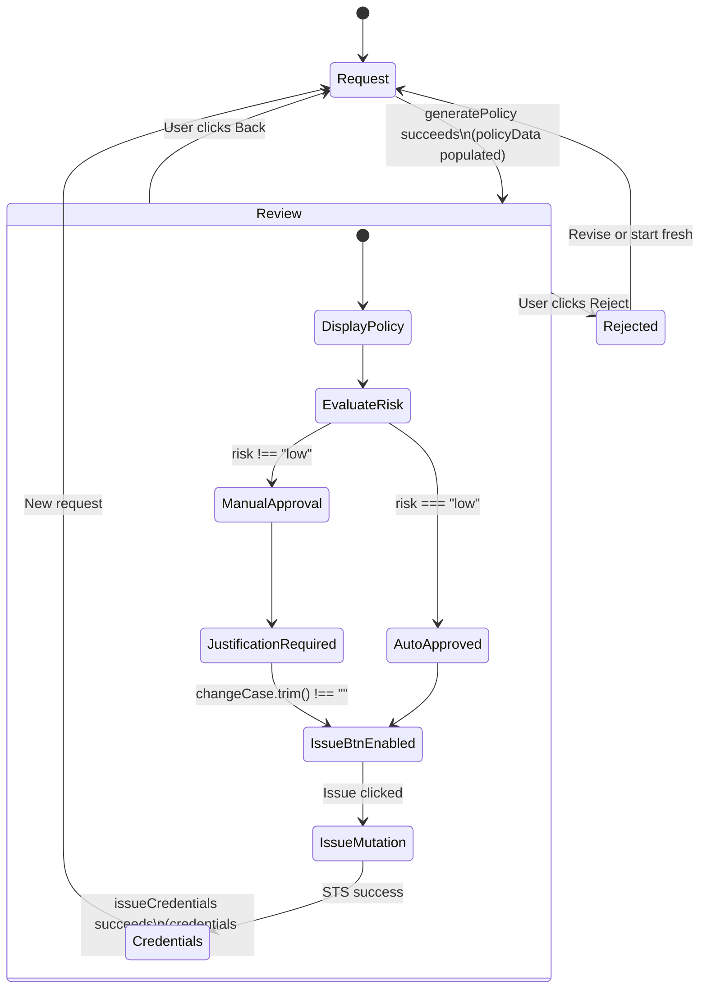

The Review View is the **critical decision gate** in the IAM-Dynamic request lifecycle — the point where an AI-generated IAM policy is surfaced to the operator for inspection, risk assessment is visually communicated, and the binary choice to issue credentials or reject the request is made. It sits between the [Request View](17-request-view-natural-language-input-and-templates) (which produces the policy) and either the [Credentials View](19-credentials-view-multi-format-export-and-expiration-timer) (on approval) or the [Rejected View](20-rejected-view-ai-powered-resubmission-guidance) (on rejection). This page dissects the component's architecture, its data contract with the backend, the risk-to-approval mapping logic, and the mutation flow that triggers AWS STS credential issuance.

Sources: [review-view.tsx](frontend/src/views/review-view.tsx#L1-L204), [App.tsx](frontend/src/App.tsx#L132-L142)

## Position in the Application State Machine

The Review View is one of four view states managed by the top-level `App` component. The application uses a simple string-discriminated union (`'request' | 'review' | 'credentials' | 'rejected'`) to control which view is rendered. The transition into the Review View occurs when `RequestView` completes a successful `generatePolicy` mutation — the returned policy data object is stored in `App` state and the view switches to `'review'`. This means the Review View receives a fully populated `PolicyData` object and never performs LLM calls itself; it is purely a **presentation and decision** layer.



The `App` component passes four props to `ReviewView`: the `policyData` object (the full backend response), an `onBack` callback (returns to request), `onCredentialsIssued` (forwards credentials to state and switches to credentials view), and `onRejected` (switches to rejected view). This prop-driven architecture keeps the Review View stateless with respect to application-level navigation — it manages only its own local UI state (the justification textarea and error messages).

Sources: [App.tsx](frontend/src/App.tsx#L15-L32), [App.tsx](frontend/src/App.tsx#L132-L142)

## Data Contract: What the Review View Receives

The `policyData` prop conforms to the `PolicyData` interface defined in `App.tsx`, which mirrors the backend's `PolicyResponseModel`. This object arrives pre-computed from the `/api/generate-policy` endpoint — the Review View never calls the LLM directly. The data contract includes six fields that drive every aspect of the view's rendering logic.

| Field | Type | Source | Purpose in Review View |
|---|---|---|---|
| `policy` | `Record<string, unknown>` | LLM-generated IAM policy JSON | Displayed in the JSON tab; forwarded to STS on approval |
| `risk` | `'low' \| 'medium' \| 'high' \| 'critical'` | LLM risk assessment (`risk_score` field) | Controls risk badge color, icon, and approval gate |
| `explanation` | `string` | LLM explanation text | Displayed in the Explanation tab |
| `approver_note` | `string` | LLM approver recommendation | Conditionally displayed in Explanation tab |
| `auto_approved` | `boolean` | Backend computation: `risk === "low"` | Controls whether justification textarea is shown |
| `max_duration` | `number` | Backend: `min(requested, riskCap)` | Displayed as badge; forwarded to STS on approval |

Sources: [App.tsx](frontend/src/App.tsx#L17-L24), [api.ts](frontend/src/types/api.ts#L29-L36), [main.py](backend/main.py#L69-L77)

The `auto_approved` flag is particularly important — it is computed on the backend by the simple rule `response.risk.lower() == "low"` and determines whether the operator must provide a business justification before issuing credentials. The `max_duration` field is already capped by the backend using the risk-based duration table, so the frontend can trust it without additional validation.

Sources: [main.py](backend/main.py#L356-L369)

## Risk Assessment Visual System

The Review View implements a four-tier risk visualization system through the `riskConfig` mapping object. Each risk level maps to a color class, a human-readable label, and a Lucide icon component. This mapping is resolved once on render by looking up `policyData.risk` in the config, with a fallback to `medium` if the risk string is unrecognized.

| Risk Level | Color | Icon | Max Duration | Auto-Approved |
|---|---|---|---|---|
| `low` | Green (`bg-green-500`) | `CheckCircle2` | 12 hours | ✅ Yes |
| `medium` | Yellow (`bg-yellow-500`) | `AlertTriangle` | 4 hours | ❌ No |
| `high` | Orange (`bg-orange-500`) | `AlertTriangle` | 2 hours | ❌ No |
| `critical` | Red (`bg-red-500`) | `AlertCircle` | 1 hour | ❌ No |

The risk badge is rendered as a `Card` with a colored left border (`border-l-4`), containing a circular icon background in the risk color, the risk label, a contextual subtitle indicating auto-approval status, and a right-aligned badge showing the maximum session duration. The border color is computed via a ternary chain that maps risk strings to Tailwind color names — this approach avoids dynamic class construction that Tailwind's JIT compiler would purge.

Sources: [review-view.tsx](frontend/src/views/review-view.tsx#L19-L24), [review-view.tsx](frontend/src/views/review-view.tsx#L59-L95), [main.py](backend/main.py#L198-L200)

## Policy Display: Dual-Tab Inspector

The generated IAM policy is presented in a tabbed interface using the Radix-based `Tabs` component. The **JSON tab** (default) renders the raw policy document as formatted JSON inside a `<pre>` block with a muted background — this is the authoritative policy that will be sent to AWS STS `AssumeRole`. The **Explanation tab** surfaces two text fields: the LLM's `explanation` of the policy and its risk assessment, and the optional `approver_note` which provides recommendations for the approver. The `approver_note` is conditionally rendered only when present, preventing empty UI sections.

This tabbed design separates the **machine-readable artifact** (the JSON policy that becomes the STS session policy) from the **human-readable context** (the LLM's reasoning about what permissions were granted and why). This distinction is architecturally significant — the JSON content is the exact object that will be passed to `api.issueCredentials`, while the explanation is purely informational.

Sources: [review-view.tsx](frontend/src/views/review-view.tsx#L97-L130)

## Approval Gate and Credential Issuance Flow

The credential issuance section implements a **conditional approval gate** that adapts its UI based on the `auto_approved` flag. When the policy is auto-approved (low risk), the section displays a confirmation message and enables the "Issue Credentials" button immediately. When manual approval is required (medium, high, or critical risk), a `Textarea` labeled "Business Justification" is rendered and the issue button remains disabled until the justification field contains non-whitespace text.

```mermaid
flowchart TD
    A[User clicks Issue Credentials] --> B{auto_approved?}
    B -- Yes --> C[Call api.issueCredentials]
    B -- No --> D{changeCase.trim() !== ''}
    D -- No --> E[Show error: provide justification]
    D -- Yes --> C
    C --> F[POST /api/issue-credentials]
    F --> G{STS AssumeRole success?}
    G -- Yes --> H[onCredentialsIssued callback]
    H --> I[App stores credentials,\nswitches to credentials view]
    G -- No --> J[Display error in destructive alert]
```

The `handleIssue` function serves as the single entry point for credential issuance. It first validates the justification requirement (skipped when auto-approved), then triggers the `issueMutation` via TanStack Query's `useMutation` hook. The mutation sends a `POST /api/issue-credentials` request with four fields: the `policy` JSON, the risk-capped `max_duration`, `approved: true`, and the optional `change_case` justification. On success, the `onCredentialsIssued` callback prop is invoked with the STS credentials, causing the App to transition to the Credentials View. On failure, the error message is displayed in a destructive-styled alert box.

Sources: [review-view.tsx](frontend/src/views/review-view.tsx#L35-L57), [review-view.tsx](frontend/src/views/review-view.tsx#L132-L199), [api.ts](frontend/src/lib/api.ts#L77-L81)

## Backend Endpoint: Credential Issuance

The `POST /api/issue-credentials` endpoint receives the `IssueCredentialsRequest` payload and delegates to the `STSService.assume_role_with_policy` method. This method calls `boto3.client("sts").assume_role()` with the IAM role ARN (from configuration), a session name, the duration in seconds (converted from hours), and — critically — the policy JSON serialized as a string via the `Policy` parameter. This `Policy` parameter becomes the **STS session policy**, which further scopes the permissions of the assumed role to only those actions defined in the AI-generated policy. The result is a set of temporary AWS credentials (access key, secret key, session token) with an expiration timestamp.

The endpoint wraps the STS call in a dual exception handler: `STSAssumeRoleError` triggers a 503 response with a detailed troubleshooting message (including the expected role ARN and trust policy guidance), while any other exception produces a generic 500 error. After successful credential issuance, a Slack notification is dispatched via `send_slack_notification` for audit trail purposes. For a deeper exploration of the STS integration, see [AWS STS Credential Issuance and Risk-Based Duration Limits](9-aws-sts-credential-issuance-and-risk-based-duration-limits).

Sources: [main.py](backend/main.py#L386-L440), [sts_service.py](backend/services/sts_service.py#L42-L106), [main.py](backend/main.py#L232-L244)

## Rejection Path

The Review View provides a destructive-styled "Reject" button that immediately triggers the `onRejected` callback, switching the application to the Rejected View. No confirmation dialog is presented — the rejection is instant. Notably, the Review View does not call the rejection guidance endpoint itself; that API call is deferred to the [Rejected View](20-rejected-view-ai-powered-resubmission-guidance), which invokes `/api/generate-rejection-guidance` with the original request text, the policy, the risk level, and the selected provider/model. This separation of concerns means the Review View remains focused solely on the approve/reject decision, while the Rejected View handles the resubmission guidance workflow.

Sources: [review-view.tsx](frontend/src/views/review-view.tsx#L184-L192), [App.tsx](frontend/src/App.tsx#L140), [main.py](backend/main.py#L443-L489)

## Error Handling and Loading States

The component manages two local state variables: `changeCase` (the justification textarea value) and `error` (a string or null). Error state is populated from two sources: the validation check in `handleIssue` (when justification is required but empty) and the `onError` callback of the `useMutation` hook (when the API call fails). Errors are displayed in a rounded alert box with destructive styling. The mutation's `isPending` state drives two UI behaviors: the issue button is disabled during the request, and the button text changes to show a spinning `Loader2` icon with "Issuing Credentials..." text. The back button remains functional during the mutation, allowing the user to abort the operation at any time.

Sources: [review-view.tsx](frontend/src/views/review-view.tsx#L32-L44), [review-view.tsx](frontend/src/views/review-view.tsx#L156-L173)

## Next Steps

- **See how the generated credentials are displayed and exported**: [Credentials View: Multi-Format Export and Expiration Timer](19-credentials-view-multi-format-export-and-expiration-timer)
- **Understand what happens after rejection**: [Rejected View: AI-Powered Resubmission Guidance](20-rejected-view-ai-powered-resubmission-guidance)
- **Explore the STS integration in depth**: [AWS STS Credential Issuance and Risk-Based Duration Limits](9-aws-sts-credential-issuance-and-risk-based-duration-limits)
- **Learn how the policy was generated**: [Request View: Natural Language Input and Templates](17-request-view-natural-language-input-and-templates)