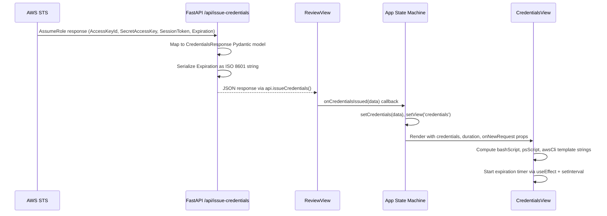
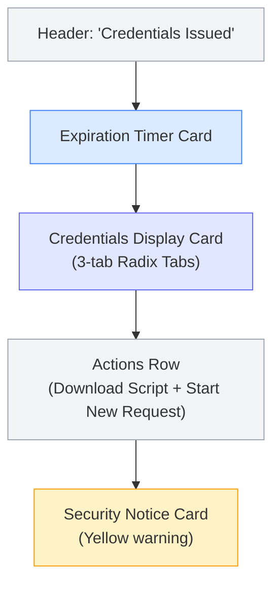

The **Credentials View** is the terminal state in the IAM-Dynamic request lifecycle — rendered only after the user approves a generated policy through the [Review View](18-review-view-risk-assessment-and-policy-approval-flow) and the backend successfully issues temporary AWS credentials via STS `AssumeRole`. Its purpose is threefold: display the issued credentials in multiple shell-compatible formats, provide a live countdown timer to credential expiration, and enforce security-conscious UX through visual warnings and single-action clipboard controls. This view does not fetch data independently; it receives all state through props from [React App State Machine and View Routing](15-react-app-state-machine-and-view-routing), which holds the credential payload returned by `POST /api/issue-credentials`.

Sources: [credentials-view.tsx](frontend/src/views/credentials-view.tsx#L1-L226), [App.tsx](frontend/src/App.tsx#L164-L176)

## Component Props and Data Contract

The component accepts a tightly-scoped props interface that mirrors the backend's `CredentialsResponse` Pydantic model. The `credentials` object carries the five fields returned by the STS service — `access_key_id`, `secret_access_key`, `session_token`, `expiration` (ISO 8601 string), and `region`. The `duration` prop represents the approved session length in hours (already capped by the backend's risk-based duration logic from [AWS STS Credential Issuance and Risk-Based Duration Limits](9-aws-sts-credential-issuance-and-risk-based-duration-limits)). The `onNewRequest` callback resets the entire application state machine back to the request phase.

| Prop | Type | Source |
|---|---|---|
| `credentials.access_key_id` | `string` | STS `AccessKeyId` |
| `credentials.secret_access_key` | `string` | STS `SecretAccessKey` |
| `credentials.session_token` | `string` | STS `SessionToken` |
| `credentials.expiration` | `string` (ISO 8601) | STS `Expiration` via `.isoformat()` |
| `credentials.region` | `string` | Backend default `"us-east-1"` |
| `duration` | `number` | `PolicyResponseModel.max_duration` |
| `onNewRequest` | `() => void` | App-level state reset |

Sources: [credentials-view.tsx](frontend/src/views/credentials-view.tsx#L8-L18), [main.py](backend/main.py#L88-L95), [main.py](backend/main.py#L406-L412)

## End-to-End Data Flow

The following diagram traces a credential from AWS STS through the backend serialization layer, across the API boundary, and into the React component tree where it is decomposed into three shell export formats.

The backend's `issue_credentials` endpoint maps the raw boto3 STS response into the `CredentialsResponse` Pydantic model, converting the `datetime` expiration to an ISO 8601 string via `.isoformat()`. The region defaults to `"us-east-1"` as a static value — it is not derived from the STS response or the role configuration. The `ReviewView` receives this JSON through a `useMutation` hook and propagates it upward to `App` via the `onCredentialsIssued` callback, which triggers a view transition.

Sources: [main.py](backend/main.py#L386-L412), [review-view.tsx](frontend/src/views/review-view.tsx#L35-L44), [App.tsx](frontend/src/App.tsx#L136-L141)

## Expiration Timer: Client-Side Countdown

The expiration timer is implemented as a `useEffect` hook that computes the time delta between the current client clock and the credential's expiration timestamp. It recalculates every **60 seconds** via `setInterval`, displaying the remaining time in `{hours}h {minutes}m` format. When the delta reaches zero or goes negative, the display switches to a static `"Expired"` string.

A deliberate design choice: the interval granularity is one minute, not one second. Since STS credentials are issued in multi-hour durations (1–12 hours), second-level precision provides no operational value and would cause unnecessary re-renders. The `useEffect` cleanup function properly clears the interval on unmount to prevent memory leaks.

The expiration timestamp is parsed using `new Date(credentials.expiration)` — this relies on the browser's built-in ISO 8601 parser, which handles the timezone suffix appended by the backend's `.isoformat()` method. The absolute expiration time is also displayed below the countdown using `.toLocaleString()` for user-friendly formatting. The `duration` badge beside the timer shows the approved session length (e.g., "2 hour session"), providing context for how long the credentials *should* last versus how long remains.

Sources: [credentials-view.tsx](frontend/src/views/credentials-view.tsx#L24-L45), [credentials-view.tsx](frontend/src/views/credentials-view.tsx#L98-L114)

## Multi-Format Export Templates

The component generates three credential export formats as template strings, each tailored to a specific shell environment. All three embed the same credential values but differ in syntax and invocation method. Each format includes a commented-out `aws sts get-caller-identity` test command so the user can immediately verify their credentials work.

| Tab Label | Variable | Shell Syntax | Use Case |
|---|---|---|---|
| **Bash / Zsh** | `bashScript` | `export AWS_ACCESS_KEY_ID="..."` | macOS/Linux terminals, CI/CD pipelines |
| **PowerShell** | `psScript` | `$Env:AWS_ACCESS_KEY_ID="..."` | Windows environments |
| **AWS CLI** | `awsCli` | `aws configure set aws_access_key_id ... --profile iam-session` | Persistent named profile via `~/.aws/credentials` |

The **AWS CLI** format is notable because it writes to a named profile (`iam-session`) rather than setting environment variables. This means the credentials persist in `~/.aws/credentials` until manually removed — a different security posture than the ephemeral environment variable approach. The other two formats are session-scoped: credentials vanish when the terminal session ends.

Sources: [credentials-view.tsx](frontend/src/views/credentials-view.tsx#L58-L75)

## Clipboard and Download Interactions

Each tab panel includes a **Copy to Clipboard** button that calls `navigator.clipboard.writeText()` with the corresponding template string. The `copied` state tracks which tab's content was last copied, enabling a 2-second visual confirmation where the button icon swaps from `Copy` to `Check` and the label changes to "Copied!". This feedback loop is managed by a `setTimeout` that resets `copied` to `null` after the delay.

The **Download Script** button generates a Blob object from the `bashScript` template string with MIME type `text/x-shellscript`, creates a temporary `<a>` element with an object URL, programmatically clicks it to trigger the browser's download dialog, then cleans up the DOM element and revokes the object URL. The filename includes a Unix timestamp (`aws-credentials-{Date.now()}.sh`) to prevent overwriting previous downloads. Note that only the Bash format is available for download — there is no equivalent for PowerShell or AWS CLI profiles.

Sources: [credentials-view.tsx](frontend/src/views/credentials-view.tsx#L47-L86), [credentials-view.tsx](frontend/src/views/credentials-view.tsx#L201-L211)

## UI Layout and Visual Structure

The component renders a vertically-stacked layout within a `max-w-4xl` centered container, composed of four distinct sections:

The **Expiration Timer** card uses a `flex` row with the countdown on the left and a `Badge` (outline variant) showing the session duration on the right. The **Credentials Display** card wraps a Radix UI `Tabs` component with a 3-column grid trigger bar. The **Actions Row** contains two equal-width buttons: "Download Script" (outline variant with `Download` icon) and "Start New Request" (primary variant with `RotateCcw` icon). The **Security Notice** card applies conditional Tailwind classes (`border-yellow-200 bg-yellow-50` with `dark:` variants) to render a persistent amber warning about credential handling and audit logging.

Sources: [credentials-view.tsx](frontend/src/views/credentials-view.tsx#L88-L223)

## State Reset: Starting a New Request

The "Start New Request" button triggers the `onNewRequest` callback, which is defined in `App.tsx` as an inline arrow function. This function performs a complete state reset: it nullifies `policyData` and `credentials`, clears `requestText`, resets `duration` to the default value of `2`, and sets the view back to `'request'`. This is the only exit point from the Credentials View — there is no back button or navigation to any other view. The component is designed as a terminal leaf in the state machine: once credentials are issued, the user can either download them or start over.

Sources: [App.tsx](frontend/src/App.tsx#L168-L174), [credentials-view.tsx](frontend/src/views/credentials-view.tsx#L207-L210)

## Design Trade-offs and Edge Cases

**Timer drift**: The 60-second interval does not account for client clock skew relative to the AWS STS server clock. If the user's system time differs significantly from UTC, the displayed countdown will be inaccurate. The backend serializes expiration in UTC (via `datetime.now(timezone.utc)`), and the browser's `Date` constructor handles the ISO timezone offset — but the *local* clock determines "now."

**Clipboard fallback**: The `copyToClipboard` function wraps `navigator.clipboard.writeText()` in a try/catch, but on failure it only logs to console. There is no user-facing fallback (e.g., a textarea-based manual copy mechanism). This means the copy button silently fails in environments where the Clipboard API is restricted (non-HTTPS contexts, some iframe embeddings).

**Download format limitation**: Only the Bash/Zsh format is downloadable. Users who need the PowerShell or AWS CLI format must use the clipboard copy. This is an intentional simplification — the download path was implemented for the most common automation workflow (sourcing a shell script in a terminal).

**Session token exposure**: All three export formats expose the `session_token` in plaintext within the template strings. While this is necessary for the credentials to function, the Security Notice card reminds users never to commit credentials to version control. All credential issuance events are logged on the backend for audit purposes (see [Slack Notification and Audit Trail Integration](12-slack-notification-and-audit-trail-integration)).

Sources: [credentials-view.tsx](frontend/src/views/credentials-view.tsx#L47-L56), [credentials-view.tsx](frontend/src/views/credentials-view.tsx#L76-L86), [credentials-view.tsx](frontend/src/views/credentials-view.tsx#L213-L222), [sts_service.py](backend/services/sts_service.py#L86-L98)

## Navigation Context

The Credentials View is the final step in the happy-path request lifecycle. From here, the user can only proceed forward to a new request cycle:

- **Previous**: [Review View: Risk Assessment and Policy Approval Flow](18-review-view-risk-assessment-and-policy-approval-flow) — the view that triggers credential issuance
- **Next**: [Rejected View: AI-Powered Resubmission Guidance](20-rejected-view-ai-powered-resubmission-guidance) — the alternative path when a policy is rejected during review
- **Upstream**: [React App State Machine and View Routing](15-react-app-state-machine-and-view-routing) — the parent component that manages view transitions and state
- **Backend**: [AWS STS Credential Issuance and Risk-Based Duration Limits](9-aws-sts-credential-issuance-and-risk-based-duration-limits) — the service that generates the credential payload