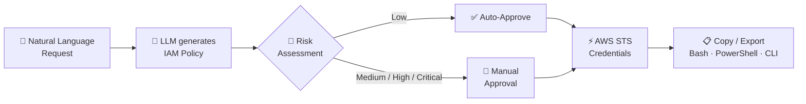
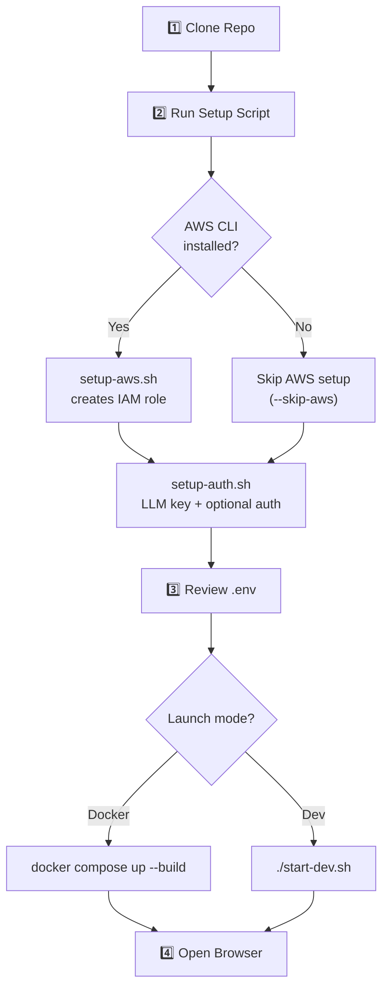

This page walks you through getting **IAM-Dynamic** running on your machine in under five minutes. You will clone the repository, configure an AI provider and your AWS account, launch the application, and issue your first set of temporary credentials through the web UI. Every step is designed to be copy-paste friendly — no prior experience with the codebase is assumed.

Sources: [setup.sh](setup.sh#L1-L48), [start-dev.sh](start-dev.sh#L1-L48)

## What You Will Build

IAM-Dynamic is an AI-driven portal that converts natural-language access requests — for example *"I need read-only access to the production S3 bucket"* — into scoped, time-limited AWS credentials. A large language model drafts the least-privilege IAM policy, scores the risk, and (for low-risk requests) auto-approves credential issuance via AWS STS `AssumeRole`. The entire request-to-credential lifecycle runs in seconds.



Sources: [backend/main.py](backend/main.py#L340-L383), [backend/services/sts_service.py](backend/services/sts_service.py#L1-L1)

## Prerequisites

Before you begin, make sure the following tools are installed on your system. The table lists the absolute minimum plus optional tools that unlock additional features.

| Tool | Minimum Version | Required For | Install (macOS) | Install (Linux) |
|------|:-:|---|---|---|
| **Python** | 3.11+ | Backend runtime | `brew install python3` | `sudo apt install python3` |
| **Node.js** | 20+ | Frontend build & dev server | `brew install node` | `sudo apt install nodejs` |
| **npm** | 10+ | Frontend dependency management | bundled with Node.js | bundled with Node.js |
| **Docker** | 24+ | Containerised deployment (optional) | [Docker Desktop](https://docs.docker.com/desktop/install/) | `sudo apt install docker-ce docker-compose-plugin` |
| **AWS CLI** | 2.x | AWS IAM role creation (optional) | `brew install awscli` | `sudo apt install awscli` |
| **Git** | 2.x | Cloning the repository | `brew install git` | `sudo apt install git` |

> **Note:** Docker and the AWS CLI are optional for a local-only test drive — you can run the full stack with just Python and Node.js. Docker is recommended for the most reproducible experience, and the AWS CLI is only needed if you want the setup script to create your IAM role automatically.

Sources: [setup.sh](setup.sh#L139-L167), [backend/requirements.txt](backend/requirements.txt#L1-L14), [frontend/package.json](frontend/package.json#L1-L58)

## Step-by-Step Setup

The following flowchart shows the full setup journey end to end. Each numbered node maps to a section below.



Sources: [setup.sh](setup.sh#L52-L100), [setup-aws.sh](setup-aws.sh#L1-L28), [setup-auth.sh](setup-auth.sh#L1-L30)

### Step 1 — Clone the Repository

```bash
git clone https://github.com/tupacalypse187/IAM-dynamic.git
cd IAM-dynamic
```

Sources: [README.md](README.md#L1-L30)

### Step 2 — Run the Setup Script

The master setup script (`setup.sh`) orchestrates the entire first-time configuration. It checks your prerequisites, optionally configures AWS, collects your AI provider API key, and writes a `.env` file.

```bash
chmod +x setup.sh
./setup.sh
```

The script supports several flags to tailor the experience:

| Flag | Effect |
|------|--------|
| *(none)* | Fully interactive — prompts for every option with sensible defaults |
| `--quick` | Accepts defaults for most questions; fewer prompts |
| `--ci` | No prompts at all; uses defaults everywhere |
| `--skip-aws` | Skips AWS IAM role creation (use if you already have credentials) |
| `--skip-auth` | Skips authentication setup — the app will run **without** a login page |

For the fastest possible local test drive where you just want to see the UI in action:

```bash
./setup.sh --quick --skip-aws
```

> **What the script does behind the scenes:** It delegates to [setup-aws.sh](setup-aws.sh#L1-L28) (creates an IAM role with a trust policy in your AWS account) and [setup-auth.sh](setup-auth.sh#L1-L30) (prompts for your LLM provider, API key, and optionally generates a bcrypt password hash + JWT secret). Everything is written into a single `.env` file at the project root.

Sources: [setup.sh](setup.sh#L52-L100), [setup-aws.sh](setup-aws.sh#L23-L28), [setup-auth.sh](setup-auth.sh#L1-L30)

### Step 3 — Review Your `.env` File

After the setup script completes, open `.env` in your editor and confirm the values look correct. At minimum you need **one** LLM provider configured with a valid API key and your **AWS account ID**. A typical minimal `.env` looks like this:

```bash
# ── AI Provider ──
LLM_PROVIDER=gemini
GOOGLE_API_KEY=AIzaSy...          # Your Gemini API key
GEMINI_MODEL=gemini-3.1-pro-preview

# ── AWS ──
AWS_ACCOUNT_ID=123456789012
AWS_ROLE_NAME=AgentPOCSessionRole

# ── Optional ──
APPROVER_NAME=Admin
DATABASE_PATH=iam_dynamic.db
```

A full template with every supported variable — including multi-provider keys, authentication, Slack webhooks, and Caddy HTTPS — is available in [.env.example](.env.example#L1-L50).

**Choosing an LLM provider.** The application supports four providers. You only need to configure the one you select with `LLM_PROVIDER`, but you can set keys for multiple providers and switch between them at runtime from the sidebar.

| `LLM_PROVIDER` value | Required Env Var | Default Model | Get an API Key |
|:--|:--|:--|:--|
| `gemini` | `GOOGLE_API_KEY` | `gemini-3.1-pro-preview` | [aistudio.google.com/apikey](https://aistudio.google.com/apikey) |
| `openai` | `OPENAI_API_KEY` | `gpt-5.4` | [platform.openai.com/api-keys](https://platform.openai.com/api-keys) |
| `anthropic` or `claude` | `ANTHROPIC_API_KEY` | `claude-opus-4-6` | [console.anthropic.com](https://console.anthropic.com/settings/keys) |
| `zhipu` or `glm` | `ZAI_API_KEY` | `glm-5.1` | [open.bigmodel.cn](https://open.bigmodel.cn/) |

> **Zero-auth local dev:** If you omit `AUTH_PASSWORD_HASH` and `JWT_SECRET`, the application starts **without** a login screen — every request is treated as coming from `admin`. This is intentional for local development. For production, always enable authentication.

Sources: [.env.example](.env.example#L1-L50), [backend/config.py](backend/config.py#L1-L163), [setup-auth.sh](setup-auth.sh#L170-L207)

### Step 4 — Start the Application

You have two launch options. Pick whichever fits your workflow.

| | Docker (Recommended) | Dev Mode (Hot-Reload) |
|---|---|---|
| **Command** | `docker compose up --build` | `./start-dev.sh` |
| **Frontend URL** | `http://localhost:8080` | `http://localhost:3000` |
| **Backend URL** | proxied through nginx | `http://localhost:8000` |
| **API Docs** | `http://localhost:8080/docs` | `http://localhost:8000/docs` |
| **Hot-Reload** | Backend only (`--reload` flag) | Both frontend and backend |
| **Best For** | Testing the full production-like stack | Active development |

**Docker** builds two containers — an `nginx:1.27-alpine` frontend that serves the React SPA and reverse-proxies API calls, and a `python:3.11-slim` backend running uvicorn with two workers. The frontend container waits for the backend's health check to pass before accepting traffic.

```bash
# Build and start (foreground)
docker compose up --build

# Or run detached
docker compose up --build -d
```

**Dev mode** kills any existing processes on ports 3000 and 8000, then starts the FastAPI backend and the Vite dev server in parallel. The Vite config proxies `/api`, `/health`, and `/config` requests to the backend automatically, so the frontend works seamlessly without CORS issues.

```bash
./start-dev.sh
```

Both terminals will print their URLs. Leave them running and open the frontend URL in your browser.

Sources: [docker-compose.yml](docker-compose.yml#L1-L37), [start-dev.sh](start-dev.sh#L1-L48), [frontend/vite.config.ts](frontend/vite.config.ts#L1-L31), [Dockerfile.backend](Dockerfile.backend#L1-L1), [Dockerfile.frontend](Dockerfile.frontend#L1-L1)

## Your First Request

Once the application is running, follow these steps to issue your first set of temporary AWS credentials.

1. **Open the application** in your browser at the URL shown in the terminal (`http://localhost:8080` for Docker, `http://localhost:3000` for dev mode). If authentication is enabled, log in with the credentials you set during setup.
2. **Type a natural-language request** in the input field — for example:
   ```
   I need read-only access to the S3 bucket named my-data-bucket
   ```
   Or click one of the **Quick Templates** on the sidebar (S3 Read, EC2 Observer, Lambda Invoker, etc.) to pre-fill a common request.
3. **Select a session duration** (1–12 hours) using the slider.
4. **Click "Generate Policy".** The backend forwards your request to the configured LLM, which returns an IAM policy JSON, a risk score, and a human-readable explanation.
5. **Review the generated policy.** The UI colour-codes the risk badge — **Low** (green, auto-approved), **Medium** (yellow), **High** (orange), or **Critical** (red). For low-risk requests, you can proceed immediately; higher-risk requests require manual approval.
6. **Approve and issue credentials.** Click the approval button. The backend calls `sts:AssumeRole` with a session policy scoped to the generated IAM policy and returns temporary `AccessKeyId`, `SecretAccessKey`, and `SessionToken`.
7. **Copy or export credentials.** Use the export buttons to copy in **Bash**, **PowerShell**, or **AWS CLI** format. Credentials expire after the approved duration.

> **If credential issuance fails** with an STS error, double-check that the IAM role referenced by `AWS_ROLE_NAME` exists in your AWS account and that your local AWS credentials (or the ones in `.env`) are listed in the role's trust policy. The [Environment Configuration](3-environment-configuration) and [AWS STS Credential Issuance](9-aws-sts-credential-issuance-and-risk-based-duration-limits) pages cover this in detail.

Sources: [backend/main.py](backend/main.py#L340-L399), [backend/services/sts_service.py](backend/services/sts_service.py#L1-L1), [frontend/src/App.tsx](frontend/src/App.tsx#L1-L1)

## Troubleshooting

| Symptom | Likely Cause | Fix |
|---|---|---|
| `bind: address already in use` on port 8080 or 8000 | Another process is using the port | `lsof -ti:8080 \| xargs kill -9` (or 8000) |
| `✗ Failed to generate policy` | Invalid or missing API key | Verify `GOOGLE_API_KEY` / `OPENAI_API_KEY` / etc. in `.env` |
| `✗ Failed to issue credentials` / STS error | IAM role doesn't exist or trust policy is missing | Run `./setup-aws.sh` or see [AWS IAM Role Setup](27-aws-iam-role-setup-and-trust-policy-for-sts-assumerole) |
| Blank page at `localhost:8080` | Frontend container not ready yet | Wait 15–30 seconds; check `docker compose logs frontend` |
| Login page shown when you didn't configure auth | Stale `.env` with `AUTH_PASSWORD_HASH` set | Remove `AUTH_PASSWORD_HASH` and `JWT_SECRET` from `.env`, then restart |
| CORS errors in browser console | Frontend URL not in allowed origins | Add your URL to `cors_origins` in [backend/main.py](backend/main.py#L176-L193) |

Sources: [backend/main.py](backend/main.py#L176-L193), [start-dev.sh](start-dev.sh#L7-L10)

## Where to Go Next

Now that you have the application running, explore these pages to deepen your understanding and customise your deployment:

- **[Environment Configuration](3-environment-configuration)** — Complete reference for every variable in `.env`, including multi-provider setup, authentication, Slack webhooks, and Caddy HTTPS.
- **[Running with Docker](4-running-with-docker)** — Docker architecture deep dive: development vs production topologies, health checks, and volume mounts.
- **[Architecture Overview and Request Lifecycle](5-architecture-overview-and-request-lifecycle)** — End-to-end trace of a request from the React UI through the LLM service to AWS STS and back.
- **[AWS IAM Role Setup and Trust Policy for STS AssumeRole](27-aws-iam-role-setup-and-trust-policy-for-sts-assumerole)** — Manual AWS configuration if you prefer to set up the IAM role outside the setup script.