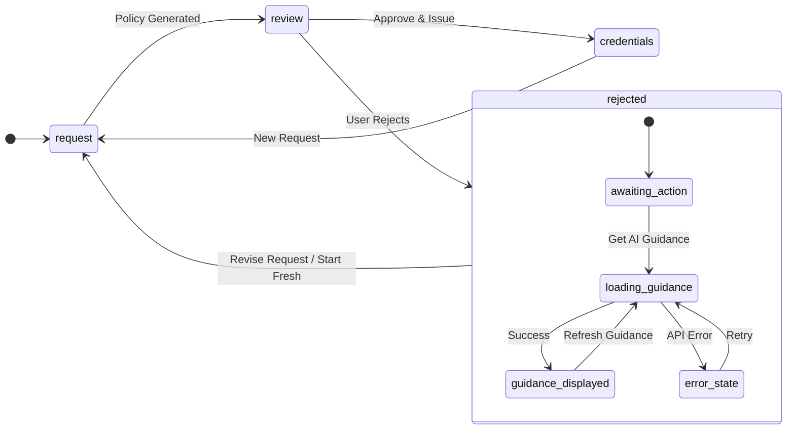
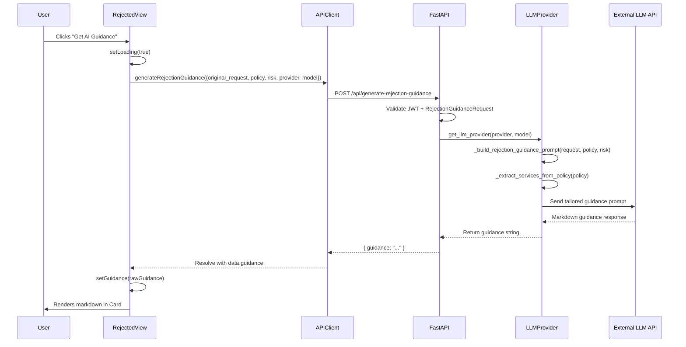

The Rejected View is the application's **recovery workspace** — the terminal screen users reach after explicitly declining a generated IAM policy from the [Review View](18-review-view-risk-assessment-and-policy-approval-flow). Rather than a dead-end rejection page, it functions as an intelligent feedback loop that leverages the same LLM infrastructure used for policy generation to produce **context-aware resubmission guidance**. The view combines three user pathways (AI guidance, request revision, fresh start) with a richly formatted markdown rendering pipeline, transforming a rejection event into an actionable remediation session.

Sources: [rejected-view.tsx](frontend/src/views/rejected-view.tsx#L1-L191), [App.tsx](frontend/src/App.tsx#L144-L162)

## State Machine Entry Point and Transition Contract

The Rejected View occupies the `rejected` node in the application's four-state view router (`request` → `review` → `credentials` | `rejected`). It is entered exclusively when the user clicks the **Reject** button on the [Review View](18-review-view-risk-assessment-and-policy-approval-flow), which fires the `onRejected` callback. The App state machine responds by setting `view` to `'rejected'` while preserving the existing `policyData`, `requestText`, `duration`, and `selectedProvider`/`selectedModel` values — the Rejected View receives all of these as props, enabling it to reconstruct full request context without any additional API calls.

Sources: [App.tsx](frontend/src/App.tsx#L144-L162)

The component's prop interface defines the complete transition contract:

| Prop | Type | Source | Purpose |
|------|------|--------|---------|
| `policyData` | `any` | Review View state | Contains `policy`, `risk`, `explanation`, `approver_note`, `auto_approved`, `max_duration` |
| `requestText` | `string` | Request View state | Original natural language request that produced the rejected policy |
| `duration` | `number` | Request View state | Requested session duration in hours |
| `selectedProvider` | `string` | Sidebar selector | LLM provider used for guidance generation |
| `selectedModel` | `string?` | Sidebar selector | Optional model override for guidance generation |
| `onReviseRequest` | `(text: string) → void` | App callback | Routes back to Request View with pre-populated text |
| `onStartFresh` | `() → void` | App callback | Resets all state and returns to clean Request View |

The `onReviseRequest` callback is particularly important: it passes the original `requestText` back to the Request View, so the user starts with their existing wording as a foundation for edits rather than staring at a blank textarea. The `onStartFresh` callback, by contrast, nullifies `policyData`, clears `requestText`, resets `duration` to 2, and navigates to a clean Request View state.

Sources: [rejected-view.tsx](frontend/src/views/rejected-view.tsx#L13-L21), [App.tsx](frontend/src/App.tsx#L151-L162)

Sources: [App.tsx](frontend/src/App.tsx#L15-L162), [rejected-view.tsx](frontend/src/views/rejected-view.tsx#L39-L66)

## Component Internal State and Risk Visualization

The component manages three internal state variables that control the guidance lifecycle: `guidance` (the rendered markdown string), `loading` (the API call in-progress flag), and `error` (any failure message). These states are mutually independent of the App-level state — the Rejected View handles its own data fetching entirely through the `api.generateRejectionGuidance` client method, which means guidance generation does not block or interfere with the parent state machine.

Sources: [rejected-view.tsx](frontend/src/views/rejected-view.tsx#L39-L41)

The risk level is visualized through a local `riskConfig` mapping that mirrors the same configuration used in the Review View. Each risk level maps to a Tailwind background color and a human-readable label:

| Risk Level | Color Class | Label | Badge Style |
|------------|-------------|-------|-------------|
| `low` | `bg-green-500` | Low Risk | White text on green |
| `medium` | `bg-yellow-500` | Medium Risk | White text on yellow |
| `high` | `bg-orange-500` | High Risk | White text on orange |
| `critical` | `bg-red-500` | Critical Risk | White text on red |

The risk configuration falls back to `riskConfig.medium` when the `policyData.risk` value doesn't match any known key, providing graceful degradation for unexpected risk strings. This same fallback pattern is used in the [Review View](18-review-view-risk-assessment-and-policy-approval-flow), maintaining visual consistency across the rejection boundary.

Sources: [rejected-view.tsx](frontend/src/views/rejected-view.tsx#L23-L44)

## The Three User Pathways

The Rejected View presents three mutually non-exclusive actions through a responsive grid layout (`grid-cols-1` on mobile, `grid-cols-3` on `md:` breakpoint and above). Each button communicates its purpose through Lucide iconography and context-aware label text.

Sources: [rejected-view.tsx](frontend/src/views/rejected-view.tsx#L111-L153)

**Get AI Guidance / Refresh Guidance** is the primary action button whose label transitions through three states. On initial render it reads "Get AI Guidance" with a `Lightbulb` icon. During the API call it switches to "Generating..." with an animated `Loader2` spinner and becomes disabled. After guidance is successfully loaded, it transforms into "Refresh Guidance" with a `RefreshCw` icon, allowing the user to regenerate the guidance (potentially getting different suggestions from the LLM's non-zero temperature). This tri-state button pattern keeps the user informed about the asynchronous operation's current phase without requiring a separate loading indicator.

**Revise Request** is a secondary `outline` variant button that fires `onReviseRequest(requestText)`, routing the user back to the Request View with their original text pre-populated. This is the "incremental improvement" path — the user has presumably read the AI guidance and now wants to refine their wording.

**Start Fresh** is also an `outline` variant button that fires `onStartFresh`, which resets all application state (policy data, request text, duration) and returns to a clean Request View. This is the "nuclear option" for when the original request was fundamentally misdirected.

Sources: [rejected-view.tsx](frontend/src/views/rejected-view.tsx#L112-L153), [App.tsx](frontend/src/App.tsx#L151-L162)

## AI Guidance Generation: The Full Request Chain

The guidance generation pipeline spans four layers: the React component's `fetchGuidance` handler, the API client, the FastAPI endpoint, and the LLM provider's prompt-and-response cycle. Understanding this chain is essential for debugging guidance failures or extending the prompt's behavior.

Sources: [rejected-view.tsx](frontend/src/views/rejected-view.tsx#L46-L66), [api.ts](frontend/src/lib/api.ts#L83-L87), [main.py](backend/main.py#L443-L489)

### Frontend: The fetchGuidance Handler

The `fetchGuidance` async function is the component's data-fetching entry point. It sets the `loading` flag, clears any previous `error`, and calls `api.generateRejectionGuidance` with a payload containing the original request text, the full generated policy, the risk level string, and the currently selected provider/model. On success, it extracts the `guidance` string from the response (falling back to a generic advisory message if the field is empty). On failure, it captures the error message. The `finally` block guarantees `loading` is reset regardless of outcome.

Sources: [rejected-view.tsx](frontend/src/views/rejected-view.tsx#L46-L66)

### API Client: The Request Contract

The `api.generateRejectionGuidance` method issues a `POST` to `/api/generate-rejection-guidance` with a JSON body containing four fields. The request is authenticated via the JWT token stored in `localStorage` (injected by the `request` wrapper function's authorization header logic). The response type is `{ guidance: string }` — a single markdown string.

Sources: [api.ts](frontend/src/lib/api.ts#L83-L87)

### Backend: The Endpoint and Pydantic Models

The FastAPI endpoint `generate_rejection_guidance` receives a `RejectionGuidanceRequest` Pydantic model with validated fields:

| Field | Type | Default | Validation |
|-------|------|---------|------------|
| `original_request` | `str` | required | Must be present |
| `policy` | `dict` | required | Must be present |
| `risk` | `str` | required | Must be present |
| `provider` | `str` | `"gemini"` | Optional override |
| `model` | `str?` | `None` | Optional model override |

The endpoint is protected by the `get_current_user` dependency (JWT verification), delegates to `get_llm_provider` for provider instantiation, and calls the provider's `generate_rejection_guidance` method. Error handling follows the application's two-tier pattern: `UserFacingError` exceptions return 400 with human-readable messages, while unexpected exceptions return 500 with a generic advisory.

Sources: [main.py](backend/main.py#L443-L489)

### LLM Provider Layer: Dynamic Prompt Construction

All four LLM providers (Gemini, OpenAI, Anthropic, Zhipu) share the same prompt via the `_build_rejection_guidance_prompt` function, which performs **policy introspection** before constructing the prompt. The function calls `_extract_services_from_policy` to parse the policy's `Statement` array, extract the service prefix from each `Action` string (e.g., `s3:GetObject` → `s3`), and map it through the `AWS_SERVICE_NAMES` dictionary to produce human-readable names (e.g., `Amazon S3`). These service names are then interpolated into the prompt template, ensuring the guidance is **service-specific rather than generic**.

Sources: [llm_service.py](backend/llm_service.py#L131-L202), [llm_service.py](backend/llm_service.py#L101-L128)

The prompt template instructs the LLM to produce four structured sections:

| Section | Purpose | Output Pattern |
|---------|---------|----------------|
| 🔴 Identify Specific Issues | Cites exact problematic wildcards, broad actions, and sensitive permissions from the generated policy | References specific `Action` and `Resource` values |
| ✨ Suggest a Rewritten Request | Provides a conversational rewrite of the user's original request that would likely achieve approval | Natural language, not technical JSON |
| 💡 Actionable Tips | Service-specific scoping advice (resource identifiers, read/write distinctions) | Bullet points tailored to the detected AWS services |
| 📝 Bad vs Good Example | A contrastive pair specific to the user's service, not a generic S3 example | Two request examples with clear labeling |

The prompt explicitly instructs the LLM to output raw markdown without escaping special characters, and to avoid wrapping the response in code blocks. This directive was added to prevent a class of rendering bugs where markdown content would appear as escaped text inside the ReactMarkdown component.

Sources: [llm_service.py](backend/llm_service.py#L154-L202)

Sources: [rejected-view.tsx](frontend/src/views/rejected-view.tsx#L46-L66), [api.ts](frontend/src/lib/api.ts#L83-L87), [main.py](backend/main.py#L457-L489), [llm_service.py](backend/llm_service.py#L319-L338)

## Markdown Rendering Pipeline

The AI guidance is rendered through a three-stage markdown pipeline: **ReactMarkdown** parses the raw markdown string, **remark-gfm** adds GitHub-Flavored Markdown support (tables, strikethrough, autolinks, task lists), and **rehype-highlight** applies syntax highlighting to fenced code blocks using highlight.js. The `github-dark` highlight.js theme is imported globally to provide consistent code block styling.

Sources: [rejected-view.tsx](frontend/src/views/rejected-view.tsx#L1-L6), [rejected-view.tsx](frontend/src/views/rejected-view.tsx#L177-L185)

The rendered output is wrapped in a `div` with three CSS classes: `prose` (Tailwind Typography baseline), `max-w-none` (removes the default prose max-width constraint), and `dark:prose-invert` (inverts colors for dark mode). The fourth class, `prose-custom`, overrides the default Tailwind Typography styles with application-specific customizations defined in the `@layer components` section of the global stylesheet. These customizations include dark-mode-aware syntax highlighting colors (using `dark:` variants for each highlight.js token type), consistent typography scales, and primary-colored list markers and blockquote borders.

Sources: [rejected-view.tsx](frontend/src/views/rejected-view.tsx#L177-L184), [index.css](frontend/src/index.css#L77-L196)

## Error Handling and Graceful Degradation

The Rejected View implements a three-layer error resilience strategy. At the **component level**, the `fetchGuidance` handler catches all exceptions and stores the error message in local state, which is displayed as a destructive `Alert` component below the action buttons. At the **API client level**, the `request` wrapper transforms non-2xx responses into `Error` objects with the backend's `detail` message. At the **LLM provider level**, each provider's `generate_rejection_guidance` method wraps the external API call in a try-catch that returns a hardcoded fallback string ("Unable to generate AI guidance...") rather than propagating the exception — this means the endpoint can return a successful response even when the LLM call fails, ensuring the user always sees something useful.

Sources: [rejected-view.tsx](frontend/src/views/rejected-view.tsx#L61-L65), [rejected-view.tsx](frontend/src/views/rejected-view.tsx#L156-L162), [api.ts](frontend/src/lib/api.ts#L35-L38), [llm_service.py](backend/llm_service.py#L336-L338)

This graceful degradation pattern is architecturally significant: the guidance feature is treated as **enhancement, not requirement**. The user can always fall back to the "Revise Request" and "Start Fresh" buttons regardless of whether the AI guidance succeeds. The guidance card only renders when the `guidance` state variable is non-null (`{guidance && <Card>...</Card>}`), so a failed or pending guidance request leaves the view clean.

Sources: [rejected-view.tsx](frontend/src/views/rejected-view.tsx#L164-L187)

## Navigation Context

The Rejected View sits at a decision point in the application flow. From here, users can:

- **Return to [Request View](17-request-view-natural-language-input-and-templates)** — via "Revise Request" (preserving original text) or "Start Fresh" (clearing all state)
- **Review the original [Review View](18-review-view-risk-assessment-and-policy-approval-flow)** context — the policy data and risk assessment that led to the rejection are displayed in the "Original Request" card
- **Understand the [Multi-Provider LLM Service Layer](7-multi-provider-llm-service-layer)** — the same LLM infrastructure that generates policies also powers the rejection guidance prompt
- **Examine the [User-Facing Error Handling Strategy](13-user-facing-error-handling-strategy)** — the error resilience patterns documented there apply directly to the guidance generation chain