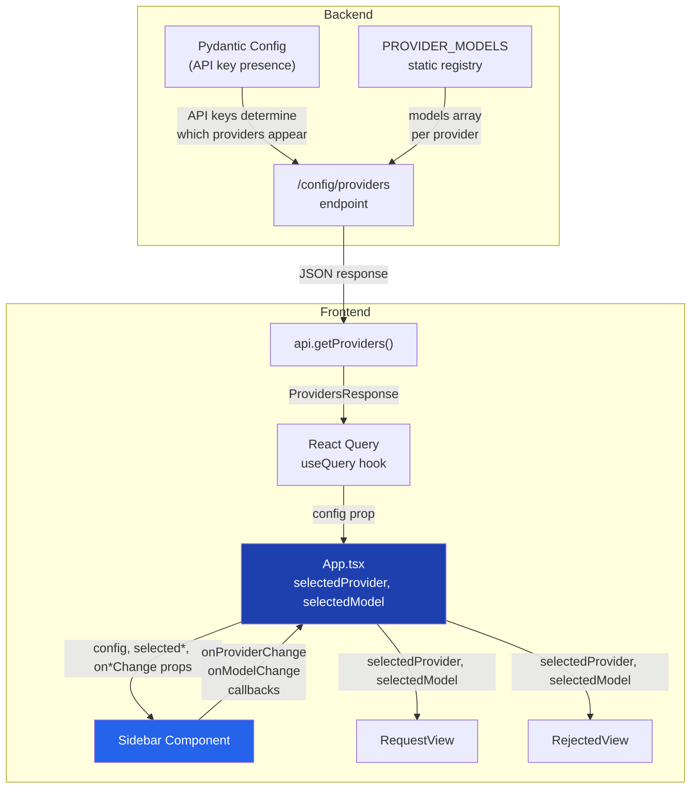
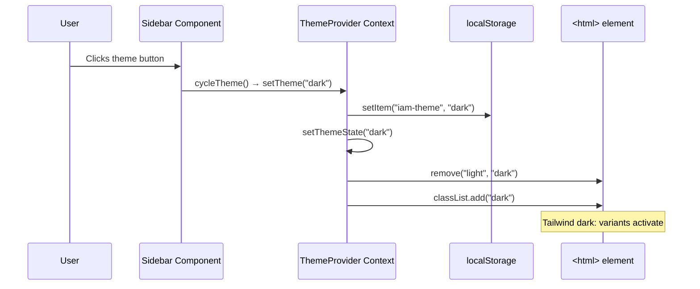

The sidebar is the application's persistent control panel — a fixed-width `<aside>` element rendered alongside the main content area that surfaces three critical interaction surfaces: **theme switching**, **LLM provider/model selection**, and **quick-access policy request templates**. Unlike the main content area which swaps between views (request → review → credentials → rejected) as described in [React App State Machine and View Routing](15-react-app-state-machine-and-view-routing), the sidebar remains permanently visible, providing continuous access to configuration that affects every stage of the IAM policy generation lifecycle. It receives its data from the backend's `/config/providers` endpoint and propagates user selections upward to `App.tsx` through controlled callback props.

Sources: [sidebar.tsx](frontend/src/components/sidebar.tsx#L1-L168), [App.tsx](frontend/src/App.tsx#L74-L85)

## Component Architecture and Data Flow

The sidebar follows React's **controlled component with local state** pattern. While `App.tsx` owns the canonical `selectedProvider` and `selectedModel` state, the sidebar manages its own local copies and synchronizes them to the parent via `useEffect` hooks. This dual-layer state design means the sidebar can render immediately with sensible defaults (falling back to `config.providers[0]?.id` or `'gemini'`) while the parent catches up. The following diagram illustrates the complete data flow from backend configuration through the sidebar to the API request:

The backend endpoint at `/config/providers` dynamically filters available providers based on which API keys are actually configured — if `GOOGLE_API_KEY` is set, Gemini appears in the response; if `OPENAI_API_KEY` is missing, OpenAI does not. This means the sidebar's dropdown options are **environment-driven** and will differ between deployments. Each provider object includes both a `model` field (the backend-configured default) and a `models` array (the full catalog the user can choose from). The `current_provider` field tells the frontend which provider the backend considers its primary, allowing `App.tsx` to initialize the selection correctly on first load.

Sources: [main.py](backend/main.py#L301-L337), [App.tsx](frontend/src/App.tsx#L36-L52), [api.ts](frontend/src/lib/api.ts#L66-L69)

## SidebarProps Interface and Component Signature

The sidebar accepts six props through its `SidebarProps` interface, cleanly separating incoming data from outgoing callbacks:

| Prop | Type | Direction | Purpose |
|------|------|-----------|---------|
| `config` | `ProvidersResponse?` | In | Backend provider catalog and account info |
| `onRequestTextChange` | `(text: string) => void` | Out | Injects template text into request textarea |
| `selectedProvider` | `string?` | In | Current provider from parent state |
| `onProviderChange` | `((provider: string) => void)?` | Out | Notifies parent of provider switch |
| `selectedModel` | `string?` | In | Current model from parent state |
| `onModelChange` | `((model: string) => void)?` | Out | Notifies parent of model switch |

The `config` prop uses the `ProvidersResponse` type which mirrors the backend JSON shape — an array of `LLMProvider` objects (each with `id`, `name`, `model`, and `models`), an `account_id` string, and a `current_provider` string. When `config` is undefined (before the query completes) or when `providers` is empty, the provider and model selectors simply don't render, gracefully degrading to a minimal sidebar with only theme and template sections.

Sources: [sidebar.tsx](frontend/src/components/sidebar.tsx#L11-L18), [api.ts](frontend/src/types/api.ts#L8-L19)

## Three Synchronization Effects

The sidebar contains three `useEffect` hooks that orchestrate bidirectional state synchronization between the sidebar's local state and the parent's controlled state. Understanding their execution order is essential for debugging stale-state issues.

**Effect 1 — Provider Sync** (lines 42–46): Fires whenever `provider` or `onProviderChange` changes. Calls `onProviderChange(provider)` to push the sidebar's local provider selection up to `App.tsx`. This ensures the parent always knows which provider the user has selected, even when the sidebar initialized with a fallback default.

**Effect 2 — Model Sync** (lines 49–53): Analogous to Effect 1, but for the model selection. Calls `onModelChange(model)` whenever `model` or `onModelChange` changes.

**Effect 3 — Model Reset on Provider Switch** (lines 56–61): This is the most architecturally significant effect. When the user switches providers, this effect locates the newly selected provider's default model from the `config.providers` array and resets `model` to that provider's `model` field. Without this effect, switching from Gemini (model: `gemini-3.1-pro-preview`) to OpenAI would leave the Gemini model string selected, causing the backend to receive an invalid provider/model combination.

The interplay between Effects 2 and 3 creates a cascading update: changing provider triggers Effect 3 (which sets `model`), which in turn triggers Effect 2 (which pushes the new model to the parent). This cascade ensures the parent's state is always consistent after a provider switch.

Sources: [sidebar.tsx](frontend/src/components/sidebar.tsx#L42-L61)

## LLM Provider and Model Selector

The provider and model selectors are **cascading dropdowns** built on the Radix UI `Select` primitive (wrapped in the project's `ui/select` component). Selecting a provider determines which models appear in the second dropdown. The provider selector is conditionally rendered only when `config` exists and `config.providers.length > 0`, and the model selector appears only when the currently selected provider has a `models` array with entries. This conditional rendering chain means a deployment with only a single provider configured (e.g., only Gemini) will show the provider dropdown but still present the model selector so users can choose between Gemini 3.1 Pro, Gemini 3 Flash, and Gemini 3.1 Flash Lite.

The provider catalog originates from the backend's `PROVIDER_MODELS` dictionary, which maps provider IDs to arrays of `{id, name}` objects. The table below shows the complete model catalog as defined in the backend:

| Provider ID | Display Name | Available Models |
|-------------|-------------|-----------------|
| `gemini` | Google Gemini | Gemini 3.1 Pro, Gemini 3 Flash, Gemini 3.1 Flash Lite |
| `openai` | OpenAI | GPT-5.4, GPT-5 Mini, GPT-4o, GPT-4o Mini, o1-preview |
| `claude` | Anthropic Claude | Claude Opus 4.6, Claude Sonnet 4.6, Claude Opus 4.5, Claude Sonnet 4.5 |
| `zhipu` | Z.AI GLM | GLM-5.1, GLM-5, GLM-4.7, GLM-4.7 Flash |

The selections made here flow directly into both the [Request View: Natural Language Input and Templates](17-request-view-natural-language-input-and-templates) (where they're sent with the `generatePolicy` API call) and the [Rejected View: AI-Powered Resubmission Guidance](20-rejected-view-ai-powered-resubmission-guidance) (where they're used for generating revision guidance). This means changing the provider or model in the sidebar affects the LLM backend that processes every subsequent request.

Sources: [sidebar.tsx](frontend/src/components/sidebar.tsx#L97-L133), [main.py](backend/main.py#L203-L229)

## Quick Templates

The sidebar includes six **pre-written prompt templates** hardcoded as a constant array at module level. Each template has an `id`, a human-readable `name`, and a `prompt` string containing the natural language text that will be injected into the request textarea when clicked. The templates cover common AWS access patterns:

| Template ID | Display Name | Prompt Text |
|-------------|-------------|-------------|
| `s3` | S3 Read-Only | "I need read-only access to list and get objects from all S3 buckets." |
| `ec2` | EC2 Observer | "I need to describe instances and view status checks for EC2." |
| `lambda` | Lambda Invoker | "I need to invoke Lambda functions in us-east-1." |
| `logs` | CloudWatch Logs | "I need to read and filter CloudWatch log streams for application debugging." |
| `dynamodb` | DynamoDB Reader | "I need to query and scan items from DynamoDB tables in production." |
| `secrets` | Secrets Manager | "I need to retrieve specific secrets from AWS Secrets Manager." |

When a user clicks a template button, the `onRequestTextChange` callback fires with the template's `prompt` string, which calls `setRequestText` in `App.tsx`. This updates the `requestText` state, which flows as a prop into `RequestView`, instantly populating the textarea. The templates are rendered inside a `ScrollArea` (from Radix UI) so that if more templates are added in the future, the list will scroll without expanding the sidebar beyond its fixed height.

Sources: [sidebar.tsx](frontend/src/components/sidebar.tsx#L20-L27), [sidebar.tsx](frontend/src/components/sidebar.tsx#L136-L164)

## Theme Toggle System

The theme toggle is built on a **React Context provider pattern** implemented in `ThemeProvider`. The provider wraps the entire application in `App.tsx` and exposes a `theme` value and `setTheme` function through the `useTheme` hook. The sidebar consumes this hook to read the current theme and provide a cycle button that rotates through three modes: `system → light → dark → system`.

### How Theme Persistence Works

The `ThemeProvider` component initializes its state by reading from `localStorage` under the key `iam-theme`. When `setTheme` is called, it writes the new value to `localStorage` and updates the React state. A `useEffect` hook then applies the theme by manipulating CSS classes on the `<html>` element — removing both `light` and `dark` classes, then adding the appropriate one. For the `system` mode, the hook queries `window.matchMedia('(prefers-color-scheme: dark)')` to detect the operating system's color scheme preference and applies the corresponding class.

The actual visual transformation happens through Tailwind CSS's dark mode strategy, which is class-based. The `index.css` file defines two complete sets of CSS custom properties — one under `:root` for light mode and one under `.dark` for dark mode. These variables control every color in the design system: `--background`, `--foreground`, `--primary`, `--muted`, `--border`, and sidebar-specific tokens like `--sidebar-background` and `--sidebar-foreground`. When the `dark` class is added to `<html>`, the `.dark` selector's variables take precedence, and every component using Tailwind's semantic color classes (like `bg-background`, `text-foreground`, `border-border`) instantly switches to the dark palette.

The cycle button itself uses Lucide icons that change based on the current theme: `Monitor` for system, `Sun` for light, and `Moon` for dark. The button includes an `sr-only` span reading "Toggle theme" for screen reader accessibility.

Sources: [theme-provider.tsx](frontend/src/components/theme-provider.tsx#L1-L72), [sidebar.tsx](frontend/src/components/sidebar.tsx#L29-L34), [sidebar.tsx](frontend/src/components/sidebar.tsx#L65-L95), [index.css](frontend/src/index.css#L1-L66)

## Account Information Section

Below the templates, separated by a visual `Separator` divider, the sidebar displays an **Account Info** section that surfaces the AWS account ID from the backend configuration. This value comes from `config?.account_id`, which is populated by the same `/config/providers` endpoint that feeds the provider selector. It reads from `config.aws.account_id` on the backend, which in turn comes from the `AWS_ACCOUNT_ID` environment variable. When the config hasn't loaded yet, the display falls back to "N/A". This section gives users immediate visual confirmation of which AWS account their credentials will be issued against.

Sources: [sidebar.tsx](frontend/src/components/sidebar.tsx#L156-L162), [main.py](backend/main.py#L333-L337)

## UI Components and Layout Structure

The sidebar's visual layout is built from a composable stack of Radix UI primitives wrapped in project-specific UI components. The outer container is a fixed-width `<aside>` with `w-72` (288px) and a right border, creating a clear visual separation from the main content. Internally, it uses a `flex flex-col h-full` layout that splits into two zones: a fixed-height **Settings** section at the top (theme toggle, provider selector, model selector) and a flexible **ScrollArea** section below (templates and account info) that expands to fill remaining vertical space. This ensures the settings controls are always visible regardless of how many templates exist or how tall the viewport is.

The `Select` components from Radix UI provide accessible dropdown interactions with full keyboard navigation, screen reader support, and portal-based rendering (the dropdown menu renders in a portal to avoid clipping by the sidebar's `overflow-hidden`). Each `SelectItem` shows a checkmark indicator for the currently selected value, providing clear visual feedback.

Sources: [sidebar.tsx](frontend/src/components/sidebar.tsx#L73-L167), [select.tsx](frontend/src/components/ui/select.tsx#L1-L157), [scroll-area.tsx](frontend/src/components/ui/scroll-area.tsx#L1-L45)

## Key Design Decisions and Patterns

**Cascading dropdown state reset**: The most important pattern in the sidebar is the provider→model cascade. When a user switches providers, the model selector must reset to that provider's default model rather than retaining the previous provider's model string. This is handled by Effect 3, which looks up `providerData.model` and calls `setModel()`. Without this, the API would receive a request like `{ provider: "openai", model: "gemini-3.1-pro-preview" }`, which the backend would reject or misinterpret.

**Environment-driven provider visibility**: The sidebar doesn't hardcode which providers appear. Instead, it renders dynamically from whatever the `/config/providers` endpoint returns. A development environment with only a Google API key configured will show only Gemini; a production environment with all four API keys will show all four providers. This makes the sidebar self-configuring based on deployment configuration.

**Template injection via controlled prop**: Templates don't manage their own navigation. They call `onRequestTextChange(template.prompt)`, which sets the parent's `requestText` state. This state then flows into whatever view is currently active. If the user is on the request view, the textarea updates immediately. This is the same callback used by the textarea's own `onChange` handler, ensuring templates and manual typing are functionally equivalent from the parent's perspective.

Sources: [sidebar.tsx](frontend/src/components/sidebar.tsx#L56-L61), [sidebar.tsx](frontend/src/components/sidebar.tsx#L98-L114), [sidebar.tsx](frontend/src/components/sidebar.tsx#L142-L149)

## Related Pages

- **[React App State Machine and View Routing](15-react-app-state-machine-and-view-routing)** — How the sidebar's provider/model selections flow into the view state machine
- **[Request View: Natural Language Input and Templates](17-request-view-natural-language-input-and-templates)** — How template-injected text is processed into IAM policy requests
- **[API Client Layer and Auth Context Provider](16-api-client-layer-and-auth-context-provider)** — The `api.getProviders()` function and React Query integration that feeds the sidebar
- **[Multi-Provider LLM Service Layer](7-multi-provider-llm-service-layer)** — How the backend routes provider/model selections to the correct LLM API
- **[UI Component Library and Styling (Tailwind + Radix UI)](22-ui-component-library-and-styling-tailwind-radix-ui)** — The Radix UI primitives and Tailwind design system underlying all sidebar components