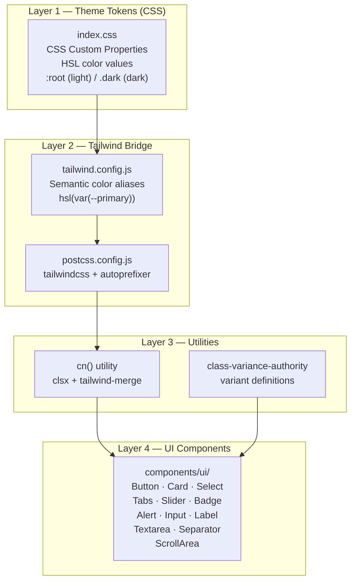

The IAM-Dynamic frontend adopts a **component-driven styling architecture** built on three pillars: **Tailwind CSS** for utility-first styling, **Radix UI** for accessible headless primitives, and a **shadcn/ui-inspired component pattern** that bridges the two into a cohesive design system. This page explains how these pieces interlock — from the CSS custom-property theme layer through Tailwind configuration, down to the individual UI components and the utilities that make them composable. If you are new to this stack, start with the theme system (CSS variables), then work upward through the Tailwind bridge and into the component catalog.

Sources: [package.json](frontend/package.json#L12-L57), [index.css](frontend/src/index.css#L1-L75), [tailwind.config.js](frontend/tailwind.config.js#L1-L63)

## Architecture Overview

The styling system is organized as a four-layer stack. At the base, **CSS custom properties** define all color and radius tokens as HSL values. **Tailwind CSS** reads those tokens through its `theme.extend` configuration, exposing semantic classes like `bg-primary` and `text-muted-foreground`. **Radix UI** provides headless, fully accessible primitives (Select, Tabs, Slider, etc.) that carry zero visual styling. Finally, the **UI component layer** wraps each Radix primitive with Tailwind classes and variant logic via `class-variance-authority` (CVA), producing ready-to-use components that live in `src/components/ui/`.



Sources: [index.css](frontend/src/index.css#L1-L66), [tailwind.config.js](frontend/tailwind.config.js#L1-L63), [utils.ts](frontend/src/lib/utils.ts#L1-L6), [button.tsx](frontend/src/components/ui/button.tsx#L1-L55)

## The Theme System: CSS Custom Properties

All visual tokens in the application are defined as **HSL color values** in CSS custom properties inside [index.css](frontend/src/index.css#L1-L66). Two rule sets exist — `:root` for light mode and `.dark` for dark mode — and they define **the exact same set of variable names** with swapped values. The dark-mode strategy uses Tailwind's `darkMode: ['class']` configuration, meaning the `.dark` class is toggled on the `<html>` element by the [ThemeProvider](frontend/src/components/theme-provider.tsx).

The token set follows a semantic naming convention where each token maps to a specific design purpose:

| Token Category | Variables | Purpose |
|---|---|---|
| **Surfaces** | `--background`, `--foreground` | Page-level background and default text |
| **Cards** | `--card`, `--card-foreground` | Card container surfaces |
| **Popovers** | `--popover`, `--popover-foreground` | Dropdown and overlay surfaces |
| **Primary** | `--primary`, `--primary-foreground` | Brand accent and CTA buttons |
| **Secondary** | `--secondary`, `--secondary-foreground` | Muted actions and secondary UI |
| **Destructive** | `--destructive`, `--destructive-foreground` | Error states and danger actions |
| **Muted** | `--muted`, `--muted-foreground` | Placeholder text and subdued areas |
| **Accent** | `--accent`, `--accent-foreground` | Hover highlights and active states |
| **Borders & Inputs** | `--border`, `--input` | Border and input field lines |
| **Focus Ring** | `--ring` | Focus indicator color |
| **Radius** | `--radius` | Base border-radius (default `0.5rem`) |
| **Sidebar** | `--sidebar-*` (8 tokens) | Dedicated sidebar surface palette |

Notice that colors are stored as **hue-saturation-lightness triplets** (e.g., `221.2 83.2% 53.3%`), without the `hsl()` wrapper. The `hsl()` function call is applied in the Tailwind config, which means you can use Tailwind's opacity modifier syntax (`bg-primary/90`) out of the box.

Sources: [index.css](frontend/src/index.css#L5-L65), [tailwind.config.js](frontend/tailwind.config.js#L10-L53)

## Tailwind Configuration and PostCSS Pipeline

The [tailwind.config.js](frontend/tailwind.config.js#L1-L63) file serves as the bridge between the raw CSS tokens and the Tailwind class system. Every semantic color in the `theme.extend.colors` block references its corresponding CSS variable via `hsl(var(--token-name))`, which means writing `bg-primary` in your JSX ultimately resolves to the HSL value defined in `index.css`.

Two **Tailwind plugins** extend the base utility set:

- **`tailwindcss-animate`** — provides `animate-in`, `animate-out`, `fade-in-0`, `zoom-in-95`, and related animation utilities used by Radix-based components for enter/exit transitions.
- **`@tailwindcss/typography`** — adds the `prose` class family for styling markdown-rendered content, complemented by the custom `.prose-custom` class defined in [index.css](frontend/src/index.css#L78-L196).

The PostCSS pipeline in [postcss.config.js](frontend/postcss.config.js#L1-L6) is minimal: `tailwindcss` processes the directives (`@tailwind base/components/utilities`), then `autoprefixer` adds vendor prefixes. The path alias `@/*` resolves to `./src/*` through configuration in both [tsconfig.json](frontend/tsconfig.json#L26-L29) and [vite.config.ts](frontend/vite.config.ts#L8-L11).

Sources: [tailwind.config.js](frontend/tailwind.config.js#L1-L63), [postcss.config.js](frontend/postcss.config.js#L1-L6), [tsconfig.json](frontend/tsconfig.json#L26-L29), [vite.config.ts](frontend/vite.config.ts#L8-L11)

## The `cn()` Utility and Variant System

Two small but critical utilities power every UI component in the library. The **`cn()` function** in [lib/utils.ts](frontend/src/lib/utils.ts#L1-L6) combines `clsx` (which conditionally joins class strings) with `tailwind-merge` (which intelligently resolves conflicting Tailwind classes). This means you can write `cn('bg-primary', 'bg-secondary')` and get only `bg-secondary` — the last conflicting class wins, just like standard CSS specificity.

The **`class-variance-authority` (CVA)** library works alongside `cn()` to define component variants as data. Instead of scattering conditional class logic through JSX ternaries, CVA extracts variant definitions into a declarative configuration. For example, the Button component defines six visual variants (`default`, `destructive`, `outline`, `secondary`, `ghost`, `link`) and four size variants (`default`, `sm`, `lg`, `icon`), all as a plain object that CVA converts into a type-safe function call:

```tsx
// Simplified pattern from button.tsx
const buttonVariants = cva('base-classes-here', {
  variants: {
    variant: { default: 'bg-primary text-primary-foreground ...', ... },
    size: { default: 'h-10 px-4 py-2', sm: 'h-9 ...', ... },
  },
  defaultVariants: { variant: 'default', size: 'default' },
})
```

Every UI component accepts an optional `className` prop that is **merged last** via `cn()`, so consumers can always override or extend styles without modifying the component source.

Sources: [utils.ts](frontend/src/lib/utils.ts#L1-L6), [button.tsx](frontend/src/components/ui/button.tsx#L6-L33)

## Component Catalog

The UI components live in `src/components/ui/` and follow a consistent pattern: each file exports one or more named components built with `React.forwardRef`, wrapped with `cn()` for class merging, and typed with explicit `Props` interfaces. Twelve components form the foundation:

| Component | Radix Dependency | Key Variants | Used In |
|---|---|---|---|
| **Alert** | None | `default`, `destructive` | Error display panels |
| **Badge** | None | `default`, `secondary`, `destructive`, `outline` | Risk level indicators |
| **Button** | `@radix-ui/react-slot` | `default`, `destructive`, `outline`, `secondary`, `ghost`, `link` | All views, sidebar |
| **Card** | None | — (sub-components: Header, Title, Description, Content, Footer) | Request, Login, Info panels |
| **Input** | None | — | Login form fields |
| **Label** | `@radix-ui/react-label` | — | Form field labels |
| **ScrollArea** | `@radix-ui/react-scroll-area` | `vertical`, `horizontal` (ScrollBar) | Sidebar template list |
| **Select** | `@radix-ui/react-select` | — (sub-components: Trigger, Content, Item, etc.) | Provider/model pickers |
| **Separator** | `@radix-ui/react-separator` | `horizontal`, `vertical` | Sidebar section dividers |
| **Slider** | `@radix-ui/react-slider` | — | Duration selector |
| **Tabs** | `@radix-ui/react-tabs` | — (sub-components: List, Trigger, Content) | Credential format switcher |
| **Textarea** | None | — | Request description input |

Components fall into two categories. **Simple wrappers** (Card, Input, Textarea) compose native HTML elements with Tailwind classes and `forwardRef` support — they have no Radix dependency. **Radix-backed components** (Select, Tabs, Slider, ScrollArea, Label, Separator) wrap a Radix primitive, adding Tailwind styling to each sub-part of the Radix component tree. The Radix primitives handle all accessibility concerns (keyboard navigation, ARIA attributes, focus management) while Tailwind handles the visual layer.

Sources: [button.tsx](frontend/src/components/ui/button.tsx#L1-L55), [card.tsx](frontend/src/components/ui/card.tsx#L1-L78), [select.tsx](frontend/src/components/ui/select.tsx#L1-L157), [tabs.tsx](frontend/src/components/ui/tabs.tsx#L1-L52), [slider.tsx](frontend/src/components/ui/slider.tsx#L1-L25), [alert.tsx](frontend/src/components/ui/alert.tsx#L1-L58), [badge.tsx](frontend/src/components/ui/badge.tsx#L1-L35), [input.tsx](frontend/src/components/ui/input.tsx#L1-L24), [label.tsx](frontend/src/components/ui/label.tsx#L1-L23), [scroll-area.tsx](frontend/src/components/ui/scroll-area.tsx#L1-L45), [separator.tsx](frontend/src/components/ui/separator.tsx#L1-L28), [textarea.tsx](frontend/src/components/ui/textarea.tsx#L1-L23)

## The Radix UI Integration Pattern

Radix UI primitives are **headless** — they render no visual elements themselves. The IAM-Dynamic frontend wraps each primitive with Tailwind-styled JSX. Consider the Select component as an illustrative example. The root `Select` is a direct re-export of `SelectPrimitive.Root`. The `SelectTrigger` wraps `SelectPrimitive.Trigger` with border, background, and focus-ring classes. The `SelectContent` renders inside a `SelectPrimitive.Portal` (ensuring it appears above all other content) with animation classes (`animate-in`, `fade-in-0`, `zoom-in-95`) powered by the `tailwindcss-animate` plugin. Each `SelectItem` positions a checkmark indicator using absolute positioning while the Radix primitive manages selection state and ARIA attributes.

The `React.forwardRef` pattern is used universally across all components. This ensures that parent code can attach refs to the underlying DOM node — essential for form libraries, focus management, and animation libraries. Every forwarded component also sets `displayName` for better React DevTools debugging.

Sources: [select.tsx](frontend/src/components/ui/select.tsx#L1-L157), [button.tsx](frontend/src/components/ui/button.tsx#L41-L53)

## Dark Mode and the ThemeProvider

Dark mode is implemented through a **class-based strategy** (`darkMode: ['class']` in Tailwind). The [ThemeProvider](frontend/src/components/theme-provider.tsx) component manages the current theme state (`'light'` | `'dark'` | `'system'`) and persists the user's choice to `localStorage` under the key `iam-theme`. When the theme changes, the provider adds or removes the `dark` class on `document.documentElement`, which triggers the `.dark` CSS variable overrides defined in [index.css](frontend/src/index.css#L37-L65).

The `system` option detects the operating system preference via `window.matchMedia('(prefers-color-scheme: dark)')` and applies the matching class. The [Sidebar](frontend/src/components/sidebar.tsx) exposes a cycle button that rotates through all three modes (system → light → dark) using Lucide icons (Monitor, Sun, Moon) as visual indicators.

Because all color tokens are CSS variables that automatically switch between light and dark values, **no component code needs to reference dark mode explicitly** — the token swap happens at the CSS layer. The only exception is the custom prose styling in [index.css](frontend/src/index.css#L131-L133), which uses explicit `dark:` Tailwind prefixes for code block backgrounds (`bg-zinc-100 dark:bg-zinc-800`) where the design intentionally differs from the token-based palette.

Sources: [theme-provider.tsx](frontend/src/components/theme-provider.tsx#L1-L72), [tailwind.config.js](frontend/tailwind.config.js#L3), [index.css](frontend/src/index.css#L37-L65), [sidebar.tsx](frontend/src/components/sidebar.tsx#L65-L71)

## Custom Prose Styles for Markdown Rendering

The application renders AI-generated content (policy explanations, error messages, resubmission guidance) as Markdown using `react-markdown` with `remark-gfm` (GitHub Flavored Markdown) and `rehype-highlight` (syntax highlighting via highlight.js). Rather than relying solely on the `@tailwindcss/typography` plugin's default `prose` classes, the project defines a **custom `.prose-custom`** layer in [index.css](frontend/src/index.css#L78-L196) that provides fine-grained control over every Markdown element.

The prose system covers headings (h1–h4), paragraphs, lists (ordered and unordered), blockquotes, horizontal rules, links, and code blocks. Syntax highlighting tokens (`.hljs-keyword`, `.hljs-string`, `.hljs-comment`, etc.) each get dedicated light/dark color pairs using Tailwind's `dark:` prefix, ensuring readable code in both themes. The overall approach uses `@layer components` to keep the custom styles within Tailwind's cascade order.

Sources: [index.css](frontend/src/index.css#L78-L196)

## Component Consumption in Practice

View components import UI primitives from `@/components/ui/` and compose them with Tailwind layout utilities. A typical pattern — visible in [LoginView](frontend/src/views/login-view.tsx) — wraps form elements inside a `Card` with `CardHeader` for the title/description and `CardContent` for the form fields. Each form field pairs a `Label` with an `Input`, using `space-y-2` for vertical rhythm. The `Button` component accepts `variant` and `size` props to control its visual style, and the `asChild` prop (backed by Radix's `Slot`) allows the button styles to be applied to a child element instead of rendering a `<button>` tag.

The [Sidebar](frontend/src/components/sidebar.tsx) demonstrates more complex composition: `Select` for provider/model pickers, `ScrollArea` for the scrollable template list, `Separator` for visual section dividers, and `Button` with `variant="outline"` for the theme toggle. All of these components share the same design tokens, so color consistency is automatic — the sidebar's `bg-background` matches the main content area's `bg-background`, and `text-muted-foreground` renders identically everywhere.

Sources: [login-view.tsx](frontend/src/views/login-view.tsx#L1-L157), [sidebar.tsx](frontend/src/components/sidebar.tsx#L1-L168), [request-view.tsx](frontend/src/views/request-view.tsx#L1-L174)

## Adding a New UI Component

The established pattern for adding a new component follows these steps: (1) install the relevant `@radix-ui/react-*` package if accessibility primitives are needed, (2) create a file in `src/components/ui/`, (3) use `React.forwardRef` with typed props, (4) apply the `cn()` utility to merge base classes with the consumer's `className` prop, (5) if the component needs visual variants, define them with CVA following the pattern in [button.tsx](frontend/src/components/ui/button.tsx#L6-L33) or [badge.tsx](frontend/src/components/ui/badge.tsx#L5-L23), and (6) export the component and any variant helper. All color references should use the semantic tokens (`primary`, `muted`, `destructive`, etc.) rather than raw Tailwind colors, ensuring automatic dark-mode support.

Sources: [button.tsx](frontend/src/components/ui/button.tsx#L1-L55), [badge.tsx](frontend/src/components/ui/badge.tsx#L1-L35), [utils.ts](frontend/src/lib/utils.ts#L1-L6)

## Key Dependencies Summary

| Package | Version | Role |
|---|---|---|
| `tailwindcss` | ^3.4.19 | Utility-first CSS framework |
| `@radix-ui/react-select` | ^2.1.2 | Accessible dropdown select |
| `@radix-ui/react-tabs` | ^1.1.1 | Accessible tab navigation |
| `@radix-ui/react-slider` | ^1.2.1 | Accessible range slider |
| `@radix-ui/react-scroll-area` | ^1.2.10 | Custom scrollbar area |
| `@radix-ui/react-separator` | ^1.1.0 | Visual separator |
| `@radix-ui/react-label` | ^2.1.0 | Accessible form label |
| `@radix-ui/react-slot` | ^1.1.0 | Polymorphic component support |
| `class-variance-authority` | ^0.7.0 | Declarative variant definitions |
| `clsx` | ^2.1.1 | Conditional class joining |
| `tailwind-merge` | ^2.6.1 | Intelligent Tailwind class conflict resolution |
| `tailwindcss-animate` | ^1.0.7 | Animation utilities for Radix transitions |
| `@tailwindcss/typography` | ^0.5.19 | Prose styling for markdown |
| `lucide-react` | ^0.577.0 | Icon library |

Sources: [package.json](frontend/package.json#L12-L57)

## Next Steps

Now that you understand how the UI layer is styled and composed, you can explore the individual views that consume these components:

- **[Request View: Natural Language Input and Templates](17-request-view-natural-language-input-and-templates)** — see how Card, Textarea, Slider, and Button compose the policy request form.
- **[Review View: Risk Assessment and Policy Approval Flow](18-review-view-risk-assessment-and-policy-approval-flow)** — observe Badge variants for risk levels and Markdown rendering with the prose-custom styles.
- **[Credentials View: Multi-Format Export and Expiration Timer](19-credentials-view-multi-format-export-and-expiration-timer)** — examine the Tabs component for format switching.
- **[Sidebar: Provider/Model Selector, Templates, and Theme Toggle](21-sidebar-provider-model-selector-templates-and-theme-toggle)** — deep dive into the Select, ScrollArea, and theme cycling components.