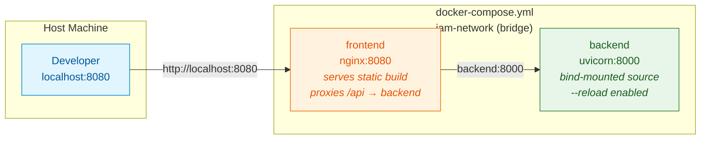
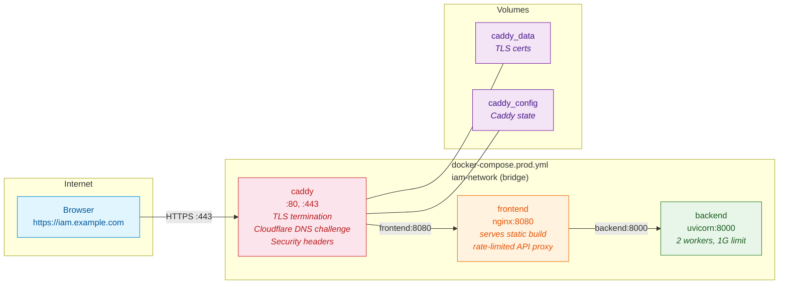
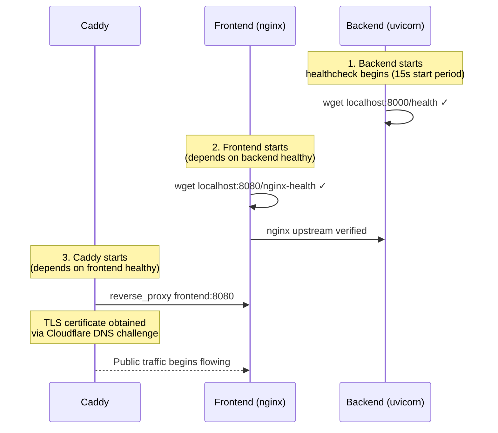

This page explains how the IAM-Dynamic application is containerized across two distinct Docker Compose topologies — one optimized for the inner-loop developer experience, the other hardened for production deployment. Understanding the architectural split between these topologies reveals how the same three Dockerfiles (backend, frontend, caddy) are composed differently depending on the target environment, and how the **nginx reverse proxy** embedded in the frontend container serves as a universal API gateway regardless of whether Caddy sits in front of it.

## The Three Container Images

Every deployment of IAM-Dynamic is built from three purpose-specific images, each with its own Dockerfile at the repository root. The **backend image** extends `python:3.11-slim`, installs dependencies from a pinned `requirements.txt`, copies the backend source, and runs `uvicorn` with `tini` as an init process. The **frontend image** uses a multi-stage build: stage one compiles the React application in `node:20-alpine`, stage two copies the compiled `dist/` output into `nginx:1.27-alpine` along with custom configuration files. The **caddy image** is also multi-stage — it compiles the `caddy-dns/cloudflare` plugin into the Caddy binary, then packages it into the minimal `caddy:2-alpine` runtime.

Sources: [Dockerfile.backend](Dockerfile.backend#L1-L28), [Dockerfile.frontend](Dockerfile.frontend#L1-L48), [Dockerfile.caddy](Dockerfile.caddy#L1-L9)

All three images share a set of hardening conventions that are worth understanding as a pattern: each runs as a **non-root user** (`appuser`, uid 1001), uses `tini` as PID 1 to properly signal the application process, and defines an inline `HEALTHCHECK` instruction that Docker uses to determine container liveness. The backend healthcheck pings `localhost:8000/health` via `wget`, while the frontend healthcheck pings `localhost:8080/nginx-health` — a lightweight endpoint that returns `"ok"` without hitting the backend.

Sources: [healthcheck-backend.sh](docker/healthcheck-backend.sh#L1-L3), [healthcheck-frontend.sh](docker/healthcheck-frontend.sh#L1-L3), [Dockerfile.backend](Dockerfile.backend#L19-L26), [Dockerfile.frontend](Dockerfile.frontend#L21-L47)

The table below summarizes the three images and their key characteristics:

| Image | Base | Entrypoint | Default Command | Listen Port |
|---|---|---|---|---|
| **backend** | `python:3.11-slim` | `tini --` | `uvicorn main:app --host 0.0.0.0 --port 8000 --workers 2` | 8000 |
| **frontend** | `nginx:1.27-alpine` | `tini --` | `nginx -g "daemon off;"` | 8080 |
| **caddy** | `caddy:2-alpine` | (default) | (default) | 80, 443 |

Sources: [Dockerfile.backend](Dockerfile.backend#L26-L27), [Dockerfile.frontend](Dockerfile.frontend#L46-L47), [Dockerfile.caddy](Dockerfile.caddy#L1-L9)

## Development Topology: Two Services, Bind-Mounted Code

The development Compose file (`docker-compose.yml`) defines a minimal two-service stack designed for rapid iteration. The **backend** container is built from the local Dockerfile but critically **bind-mounts** the entire `./backend` directory into `/app` inside the container, and overrides the default command to run `uvicorn --reload`. This means any local file change triggers an automatic server restart — the developer edits code on their host machine and sees the effect without rebuilding the image.

Sources: [docker-compose.yml](docker-compose.yml#L1-L20)

The **frontend** container in development is also built from the local Dockerfile, but unlike the backend, it does not bind-mount source code. This is because the frontend image already performs the Vite production build inside its first build stage — there is no live-reload mechanism in the containerized frontend. For true frontend hot-reload, developers should use [start-dev.sh](start-dev.sh) instead, which runs the Vite dev server natively with its proxy configuration routing `/api` calls to the backend.

Sources: [docker-compose.yml](docker-compose.yml#L22-L33), [start-dev.sh](start-dev.sh#L1-L48), [vite.config.ts](frontend/vite.config.ts#L13-L28)

Both containers attach to a user-defined bridge network called `iam-network`, which enables DNS-based service discovery. The frontend's nginx configuration references the backend as `backend:8000` in its upstream block — Docker's embedded DNS resolves this name to the backend container's IP on the shared network. The frontend container declares a `depends_on` condition of `service_healthy` against the backend, ensuring nginx only starts accepting connections after the backend's healthcheck has passed.

Sources: [docker-compose.yml](docker-compose.yml#L28-L32), [default.conf](docker/default.conf#L1-L3)

The key characteristics that distinguish the development topology are summarized below:

| Aspect | Behavior |
|---|---|
| **Image source** | Built locally from repository Dockerfiles |
| **Backend source** | Bind-mounted `./backend → /app` for live reload |
| **Backend command** | `uvicorn --reload` (single worker, auto-restart on change) |
| **Frontend source** | Built into image at `docker build` time (no hot reload) |
| **Port exposure** | Backend `8000`, Frontend `8080` — both mapped to host |
| **TLS** | None — plain HTTP |
| **Environment** | Loaded from `.env` file via `env_file` directive |
| **Restart policy** | None — containers stop when the host process stops |

Sources: [docker-compose.yml](docker-compose.yml#L1-L36)

## Production Topology: Three Services with TLS Termination

The production Compose file (`docker-compose.prod.yml`) introduces a **third service** — Caddy — and shifts every image source from local builds to pre-built images hosted on GitHub Container Registry (GHCR). This is a fundamental architectural difference: production containers are never built on the server. They are built by the CI pipeline, pushed to GHCR, and pulled onto the production host via `docker compose pull`.

Sources: [docker-compose.prod.yml](docker-compose.prod.yml#L1-L83)

### Caddy: The TLS Entry Point

Caddy serves as the public-facing entry point, listening on ports 80 and 443 (including UDP/443 for HTTP/3). It terminates TLS using certificates obtained via the **Cloudflare DNS-01 challenge**, which means the server does not need to expose port 80 to the public internet for certificate validation. The Caddy image is custom-built with the `caddy-dns/cloudflare` plugin compiled in, and its `Caddyfile` is templated with environment variable substitutions for the domain name, Cloudflare API token, and ACME email. After establishing TLS, Caddy adds a suite of **security headers** (HSTS, X-Content-Type-Options, X-Frame-Options, Referrer-Policy) and forwards all traffic to `frontend:8080`.

Sources: [docker-compose.prod.yml](docker-compose.prod.yml#L1-L20), [Dockerfile.caddy](Dockerfile.caddy#L1-L9), [Caddyfile](docker/Caddyfile#L1-L22)

### Backend: Explicit Environment, Resource Limits

The production backend does not use `env_file` to load a `.env` file. Instead, every environment variable is declared **explicitly** in the Compose file with `${VAR:-default}` interpolation syntax. This makes the production configuration self-documenting and ensures that no accidental `.env` file on the host leaks into the container. The backend is constrained to **1 GB of memory** via Docker's `deploy.resources.limits` directive, and uses `restart: unless-stopped` to ensure automatic recovery after crashes or host reboots. CORS origins are derived from the `CADDY_DOMAIN` environment variable — when set, the backend adds `https://{domain}` to its allowed origins list.

Sources: [docker-compose.prod.yml](docker-compose.prod.yml#L22-L62), [main.py](backend/main.py#L175-L193)

### Frontend: Minimal Resource Footprint

The production frontend container runs the same nginx image as in development but with a **256 MB memory limit** — appropriate for a static file server with a reverse proxy. Like the backend, it uses `restart: unless-stopped`. It depends on the backend being healthy before starting, and Caddy in turn depends on the frontend being healthy. This creates a cascading startup chain: **backend → frontend → caddy**.

Sources: [docker-compose.prod.yml](docker-compose.prod.yml#L64-L75)

### Named Volumes for TLS Persistence

Caddy requires persistent storage for its TLS certificates and internal configuration. The production Compose file declares two named Docker volumes — `caddy_data` and `caddy_config` — mounted into the Caddy container at `/data` and `/config` respectively. These volumes survive container restarts and updates, preventing Caddy from re-requesting certificates on every deployment. The development topology has no named volumes because it does not use TLS.

Sources: [docker-compose.prod.yml](docker-compose.prod.yml#L77-L79)

The complete comparison between the two topologies:

| Dimension | Development (`docker-compose.yml`) | Production (`docker-compose.prod.yml`) |
|---|---|---|
| **Services** | 2 (backend, frontend) | 3 (caddy, backend, frontend) |
| **Image source** | Local build (`build:`) | GHCR pull (`image:`) |
| **TLS** | None (HTTP only) | Caddy + Cloudflare DNS-01 |
| **Backend source mount** | Bind-mounted `./backend → /app` | None (baked into image) |
| **Backend workers** | 1 (with `--reload`) | 2 (production `--workers 2`) |
| **Memory limits** | None | Backend 1G, Frontend 256M |
| **Restart policy** | None | `unless-stopped` (all services) |
| **Environment** | `.env` file via `env_file` | Explicit `${VAR:-default}` per-variable |
| **Volumes** | None | `caddy_data`, `caddy_config` |
| **Host ports** | 8000, 8080 | 80, 443 |
| **Startup order** | backend → frontend | backend → frontend → caddy |

Sources: [docker-compose.yml](docker-compose.yml#L1-L36), [docker-compose.prod.yml](docker-compose.prod.yml#L1-L83)

## The Nginx Gateway Pattern

A critical architectural insight is that the **frontend container is not just a static file server** — it is a full reverse proxy gateway. The nginx configuration inside the frontend container defines an upstream pointing to `backend:8000` and routes all `/api/`, `/health`, `/config/`, `/docs`, and `/openapi.json` paths to the backend. Only requests that don't match these patterns fall through to the SPA's `try_files` handler, which serves `index.html` for client-side routing.

Sources: [default.conf](docker/default.conf#L1-L81)

This design means that both the development and production topologies present a **single-port architecture** from the perspective of the upstream consumer. In development, the developer accesses `localhost:8080` and everything works — API calls and static assets alike. In production, Caddy adds TLS on top but still talks to `frontend:8080`, which continues to act as the unified gateway. The backend is never directly exposed to any external consumer.

Sources: [default.conf](docker/default.conf#L1-L81), [Caddyfile](docker/Caddyfile#L17-L20)

Nginx also provides **rate limiting** in both environments. Two zones are defined: `api` allows 30 requests per second per IP with a burst of 20, while `login` restricts the authentication endpoint to 5 requests per minute per IP with a burst of 3. These zones are allocated in the main `nginx.conf` with 10 MB of shared memory each, sufficient to track roughly 160,000 unique IPs.

Sources: [nginx.conf](docker/nginx.conf#L39-L40), [default.conf](docker/default.conf#L16-L23), [default.conf](docker/default.conf#L26-L27)

The request routing table below shows how nginx classifies each incoming path:

| Path Pattern | Target | Rate Limit | Notes |
|---|---|---|---|
| `/api/auth/login` | `backend:8000` | 5 req/min (burst 3) | Strict — prevents brute-force |
| `/api/*` | `backend:8000` | 30 req/s (burst 20) | General API access |
| `/health` | `backend:8000` | None | Backend health check |
| `/config/*` | `backend:8000` | None | Runtime configuration |
| `/docs` | `backend:8000` | None | Swagger UI |
| `/openapi.json` | `backend:8000` | None | OpenAPI spec |
| `/nginx-health` | `200 "ok"` (local) | None | Container health only |
| `/assets/*` | Static file (1yr cache) | None | Immutable hashed assets |
| `/*` | `index.html` (SPA fallback) | None | Client-side routing |

Sources: [default.conf](docker/default.conf#L1-L81)

## Network Topology and Service Discovery

Both Compose files use a user-defined bridge network named `iam-network`. This is significant because Docker's default bridge network does **not** support automatic DNS-based service discovery — containers can only communicate via IP addresses. A user-defined bridge network enables containers to reference each other by service name, which is how the frontend's nginx configuration can use `backend:8000` as a stable upstream address regardless of the container's actual IP.

Sources: [docker-compose.yml](docker-compose.yml#L34-L36), [docker-compose.prod.yml](docker-compose.prod.yml#L81-L83)

The startup dependency chain differs between environments. In development, only the frontend depends on the backend being healthy. In production, a three-tier chain forms: **backend starts first** (no dependencies), **frontend starts second** (depends on `backend: service_healthy`), and **caddy starts last** (depends on `frontend: service_healthy`). This ensures that Caddy never begins accepting public connections until the entire downstream stack is verified operational.

Sources: [docker-compose.yml](docker-compose.yml#L28-L30), [docker-compose.prod.yml](docker-compose.prod.yml#L15-L17), [docker-compose.prod.yml](docker-compose.prod.yml#L66-L68)

## Image Build and Deployment Pipeline

The transition from local builds to pre-built GHCR images is managed by the CI/CD pipeline. On every pull request, the **CI workflow** runs linting, type checking, and a dry-run Docker build of all three images without pushing. On push to `main`, the **Deploy workflow** builds and pushes all three images to GHCR with tags derived from the Git SHA and `latest` for the default branch. The frontend build injects `VITE_TURNSTILE_SITE_KEY` as a build argument so the CAPTCHA site key is embedded at compile time.

Sources: [ci.yml](.github/workflows/ci.yml#L51-L86), [deploy.yml](.github/workflows/deploy.yml#L89-L178)

After images are pushed, the pipeline SSHs into the production host at `/opt/iam-dynamic` and runs `docker compose -f docker-compose.prod.yml pull && docker compose -f docker-compose.prod.yml up -d`. It then waits 10 seconds and verifies both the frontend's `nginx-health` endpoint and the backend's `/health` endpoint through the running frontend container. If either check fails, the deployment process exits with an error. Old image versions are pruned to the latest 3 per image via GitHub's `delete-package-versions` action.

Sources: [deploy.yml](.github/workflows/deploy.yml#L201-L265)

## What to Read Next

- [Caddy TLS Termination with Cloudflare DNS Challenge](24-caddy-tls-termination-with-cloudflare-dns-challenge) — deep dive into how the Caddyfile automates certificate provisioning
- [nginx Reverse Proxy Configuration and Rate Limiting](25-nginx-reverse-proxy-configuration-and-rate-limiting) — detailed analysis of the nginx routing rules and security zones
- [CI/CD Pipeline: PR Checks, Build, and SSH Deployment](26-ci-cd-pipeline-pr-checks-build-and-ssh-deployment) — the full build-to-deploy automation that produces the GHCR images