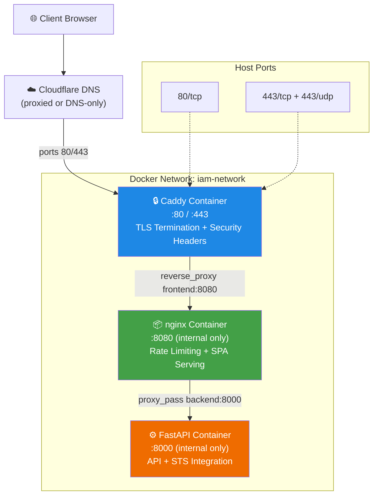
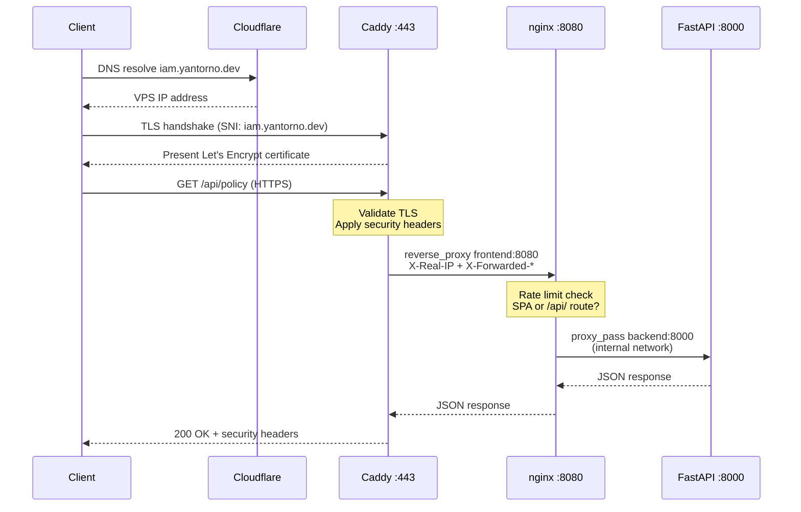

This page explains how IAM-Dynamic achieves fully automated HTTPS in production using **Caddy** as a TLS-terminating reverse proxy with the **ACME DNS-01 challenge** resolved through the Cloudflare DNS plugin. The design eliminates the need to expose port 80 for HTTP-01 challenges, enables certificate issuance behind strict firewalls, and layers security headers at the edge before traffic ever reaches the application layer.

Sources: [Caddyfile](docker/Caddyfile#L1-L22), [Dockerfile.caddy](Dockerfile.caddy#L1-L9)

## Why DNS-01 Over HTTP-01

Caddy's default ACME challenge type is HTTP-01, which requires Let's Encrypt to make an inbound HTTP connection to port 80 on your server to verify domain control. In constrained environments — VPS behind strict firewall rules, Cloudflare proxy mode enabled, or private networks without public port 80 exposure — this verification path fails. The **DNS-01 challenge** sidesteps the problem entirely: Caddy writes a `_acme-challenge` TXT record into Cloudflare's DNS via API, Let's Encrypt queries it through normal DNS resolution, and the certificate is issued without any inbound connectivity beyond what Cloudflare already handles.

Sources: [Caddyfile](docker/Caddyfile#L6-L8), [vps-setup-guide.md](docs/vps-setup-guide.md#L356-L378)

## Architecture: The Three-Tier Proxy Chain

In production, traffic flows through three distinct network boundaries before reaching the FastAPI application:



The critical architectural constraint is that **only Caddy exposes host ports** (80 and 443). Both nginx and the FastAPI backend communicate exclusively over the internal `iam-network` Docker bridge, making them unreachable from the public internet. This defense-in-depth approach means TLS termination, HSTS enforcement, and header hardening all happen at the outermost perimeter.

Sources: [docker-compose.prod.yml](docker-compose.prod.yml#L1-L20), [Caddyfile](docker/Caddyfile#L17-L20), [default.conf](docker/default.conf#L1-L14)

## Custom Caddy Image with Cloudflare DNS Plugin

Stock Caddy images do not include the Cloudflare DNS provider module. The project builds a custom image using **xcaddy**, Caddy's official build tool, which compiles the `caddy-dns/cloudflare` plugin into the binary at container build time:

```dockerfile
FROM caddy:2-builder AS builder
RUN xcaddy build --with github.com/caddy-dns/cloudflare

FROM caddy:2-alpine
COPY --from=builder /usr/bin/caddy /usr/bin/caddy
COPY docker/Caddyfile /etc/caddy/Caddyfile
```

The multi-stage build keeps the final image lean — the builder stage compiles the enhanced binary, then only the compiled artifact and the Caddyfile are copied into the minimal Alpine-based runtime. This image is built in the CI pipeline, tagged with SHA and `latest`, and pushed to GitHub Container Registry for the production VPS to pull.

Sources: [Dockerfile.caddy](Dockerfile.caddy#L1-L9), [deploy.yml](.github/workflows/deploy.yml#L155-L177)

## Caddyfile: Environment-Driven Configuration

The Caddyfile uses Caddy's **`{$VAR}` substitution syntax** to inject configuration from Docker Compose environment variables, keeping the configuration file environment-agnostic:

```text
{
    email {$ACME_EMAIL:admin@yantorno.dev}
}

{$CADDY_DOMAIN:iam.yantorno.dev} {
    tls {
        dns cloudflare {$CLOUDFLARE_API_TOKEN}
    }

    header {
        Strict-Transport-Security "max-age=31536000; includeSubDomains; preload"
        X-Content-Type-Options "nosniff"
        X-Frame-Options "DENY"
        Referrer-Policy "strict-origin-when-cross-origin"
    }

    reverse_proxy frontend:8080 {
        header_up X-Real-IP {remote_host}
    }
}
```

| Directive | Purpose |
|-----------|---------|
| `email` (global block) | ACME account email for Let's Encrypt notifications and certificate expiry warnings |
| `tls { dns cloudflare ... }` | Triggers DNS-01 challenge using the Cloudflare API token; Caddy automatically provisions and renews certificates |
| `header` block | Sets **HSTS** with 1-year max-age, subdomain inclusion, and browser preload submission; disables MIME sniffing; blocks iframe embedding; restricts referrer leakage |
| `reverse_proxy frontend:8080` | Routes all traffic to the nginx container on the internal Docker network; `X-Real-IP` preserves the true client IP through the proxy chain |

The `{$VAR:default}` syntax provides fallback defaults for local testing while allowing production overrides through `.env` or Docker Compose environment directives. Caddy automatically sets `X-Forwarded-For` and `X-Forwarded-Proto` headers, which nginx downstream uses for real IP extraction.

Sources: [Caddyfile](docker/Caddyfile#L1-L22), [default.conf](docker/default.conf#L11-L13)

## Production Service Orchestration

Caddy is defined as a first-class service in `docker-compose.prod.yml` with deliberate dependency ordering, volume persistence, and container restart guarantees:

```yaml
caddy:
    image: ghcr.io/tupacalypse187/iam-dynamic-caddy:latest
    ports:
      - "80:80"
      - "443:443"
      - "443:443/udp"      # HTTP/3 (QUIC) support
    environment:
      - CADDY_DOMAIN=${CADDY_DOMAIN:-iam.yantorno.dev}
      - CLOUDFLARE_API_TOKEN=${CLOUDFLARE_API_TOKEN:?CLOUDFLARE_API_TOKEN is required for Caddy TLS}
      - ACME_EMAIL=${ACME_EMAIL:-admin@yantorno.dev}
    volumes:
      - caddy_data:/data
      - caddy_config:/config
    depends_on:
      frontend:
        condition: service_healthy
    restart: unless-stopped
    networks:
      - iam-network
```

Several design decisions deserve attention. The **`CLOUDFLARE_API_TOKEN` variable uses the `${VAR:?error}` syntax**, which causes `docker compose up` to fail immediately with a clear error message if the token is missing — this prevents Caddy from starting in a broken state where certificate provisioning would silently fail. The **`caddy_data` volume** persists ACME certificates and account keys across container restarts, avoiding unnecessary re-issuance and rate-limit hits against Let's Encrypt. The **`caddy_config` volume** stores Caddy's internal auto-generated configuration. Port **443/udp** is explicitly mapped to support **HTTP/3 (QUIC)**, which Caddy enables by default. Finally, the **`depends_on` with `service_healthy`** ensures Caddy only starts after nginx passes its health check, preventing connection-refused errors during the reverse proxy handshake.

Sources: [docker-compose.prod.yml](docker-compose.prod.yml#L1-L20), [docker-compose.prod.yml](docker-compose.prod.yml#L77-L79)

## CORS Origin Derivation from Caddy Domain

A subtle but critical integration point exists between Caddy's domain configuration and the backend's CORS policy. The FastAPI application reads the `CADDY_DOMAIN` environment variable to dynamically construct the production CORS origin:

```python
cors_origins = [
    "http://localhost:3000",
    "http://localhost:5173",
    "http://127.0.0.1:3000",
    "http://127.0.0.1:5173",
    "http://localhost:8080",
]
caddy_domain = os.getenv("CADDY_DOMAIN")
if caddy_domain:
    cors_origins.append(f"https://{caddy_domain}")
```

This ensures the backend only accepts cross-origin requests from the canonical HTTPS origin that Caddy serves. The local development origins remain available for the non-Caddy development topology. Because both `CADDY_DOMAIN` and the actual domain in the Caddyfile are driven from the same `.env` variable, they are guaranteed to stay in sync — there is no configuration drift between the TLS certificate's domain and the CORS allowlist.

Sources: [main.py](backend/main.py#L176-L193), [docker-compose.prod.yml](docker-compose.prod.yml#L9)

## Certificate Lifecycle and Renewal

Caddy manages the entire certificate lifecycle autonomously. On first startup, it initiates the ACME DNS-01 challenge sequence: Caddy calls the Cloudflare API to create a `_acme-challenge.<domain>` TXT record, Let's Encrypt verifies it, and the certificate is issued. Caddy then **automatically renews certificates at approximately 30 days before expiry** (Let's Encrypt certificates are valid for 90 days). Renewal uses the same DNS-01 mechanism — no manual intervention is required.

The persistent Docker volumes are essential to this process. The `caddy_data` volume stores the issued certificates and private keys; without it, every container restart would trigger re-provisioning and eventually hit Let's Encrypt rate limits (5 duplicate certificates per week). The `caddy_config` volume stores Caddy's internal state, including the ACME account key.

Sources: [docker-compose.prod.yml](docker-compose.prod.yml#L13-L14), [vps-setup-guide.md](docs/vps-setup-guide.md#L377-L378)

## Required Cloudflare API Token Permissions

The Cloudflare API token used by Caddy must have the following minimum permissions:

| Permission | Scope | Reason |
|------------|-------|--------|
| **Zone → DNS → Edit** | Specific zone (`iam.yantorno.dev`) or All zones | Caddy creates and deletes `_acme-challenge` TXT records during certificate issuance and renewal |
| **Zone → Zone → Read** | Specific zone or All zones | Caddy queries the zone ID to locate the correct DNS zone for record management |

To create the token in the Cloudflare dashboard: navigate to **My Profile → API Tokens → Create Token**, select the **"Edit zone DNS"** template or create a custom token with the permissions above scoped to the specific zone.

Sources: [vps-setup-guide.md](docs/vps-setup-guide.md#L362-L364)

## Environment Variable Reference

All Caddy-related environment variables are configured in the production `.env` file and propagated through Docker Compose:

| Variable | Required | Default | Description |
|----------|----------|---------|-------------|
| `CLOUDFLARE_API_TOKEN` | **Yes** (enforced) | — | Cloudflare API token with DNS edit permission; `${VAR:?error}` syntax prevents startup without it |
| `CADDY_DOMAIN` | No | `iam.yantorno.dev` | FQDN for TLS certificate and site address; also used by backend for CORS origin |
| `ACME_EMAIL` | No | `admin@yantorno.dev` | Let's Encrypt account email for expiry notifications |

Sources: [docker-compose.prod.yml](docker-compose.prod.yml#L8-L11), [vps-setup-guide.md](docs/vps-setup-guide.md#L369-L375)

## CI/CD Integration

The Caddy image follows the same build-and-push pipeline as the frontend and backend images. On every push to `main`, the deploy workflow builds the custom Caddy image, pushes it to GHCR, runs a Trivy vulnerability scan, and deploys it to the production VPS via SSH:

1. **Build**: `Dockerfile.caddy` is built using Docker Buildx with GitHub Actions cache
2. **Push**: Tagged with commit SHA and `latest`, pushed to `ghcr.io/<owner>/iam-dynamic-caddy`
3. **Scan**: Trivy scans the image for `CRITICAL` and `HIGH` severity vulnerabilities (non-blocking)
4. **Deploy**: SSH into VPS → `docker compose pull` → `docker compose up -d`
5. **Cleanup**: Old image versions pruned, keeping the 3 most recent

The PR workflow also performs a dry-run build of the Caddy image to catch Dockerfile regressions before merge.

Sources: [deploy.yml](.github/workflows/deploy.yml#L155-L199), [ci.yml](.github/workflows/ci.yml#L78-L85)

## Request Flow Through the Proxy Chain

When a client sends a request to `https://iam.yantorno.dev`, the following sequence occurs:



At each hop, the original client IP is preserved through the `X-Real-IP` header chain: Caddy injects it via `{remote_host}`, and nginx extracts it via the `real_ip_header X-Real-IP` directive (trusted for the Docker internal `172.16.0.0/12` subnet). This ensures rate limiting at the nginx layer operates on true client addresses rather than Caddy's internal IP.

Sources: [Caddyfile](docker/Caddyfile#L10-L20), [default.conf](docker/default.conf#L11-L13), [default.conf](docker/default.conf#L15-L23)

## Comparison: Development vs Production Proxy Topology

The proxy architecture differs significantly between local development and production deployment:

| Aspect | Development (`docker-compose.yml`) | Production (`docker-compose.prod.yml`) |
|--------|-------------------------------------|----------------------------------------|
| **TLS termination** | None — plain HTTP | Caddy with Let's Encrypt via DNS-01 |
| **Edge proxy** | None — ports exposed directly | Caddy on 80/443 (only host ports) |
| **Frontend access** | `localhost:8080` directly | Internal only via `frontend:8080` |
| **Backend access** | `localhost:8000` directly | Internal only via `backend:8000` |
| **Security headers** | Not applied | HSTS, X-Content-Type-Options, X-Frame-Options, Referrer-Policy |
| **Certificate management** | N/A | Automatic via Caddy + Cloudflare |
| **HTTP/3 (QUIC)** | N/A | Enabled (443/udp mapped) |
| **CORS origins** | `localhost` variants only | `https://{CADDY_DOMAIN}` added |

In development, there is no Caddy service at all — the docker-compose.yml defines only backend and frontend services with direct host port mappings. This keeps the local development loop fast while ensuring production traffic always traverses the hardened Caddy perimeter.

Sources: [docker-compose.yml](docker-compose.yml#L1-L36), [docker-compose.prod.yml](docker-compose.prod.yml#L1-L83)

## Related Pages

- [Docker Architecture: Development vs Production Topology](23-docker-architecture-development-vs-production-topology) — full comparison of dev and prod Docker Compose configurations
- [nginx Reverse Proxy Configuration and Rate Limiting](25-nginx-reverse-proxy-configuration-and-rate-limiting) — how nginx sits behind Caddy and applies request throttling
- [CI/CD Pipeline: PR Checks, Build, and SSH Deployment](26-ci-cd-pipeline-pr-checks-build-and-ssh-deployment) — the pipeline that builds and deploys the Caddy image
- [FastAPI Application Entry Point and API Endpoints](6-fastapi-application-entry-point-and-api-endpoints) — CORS configuration derived from `CADDY_DOMAIN`