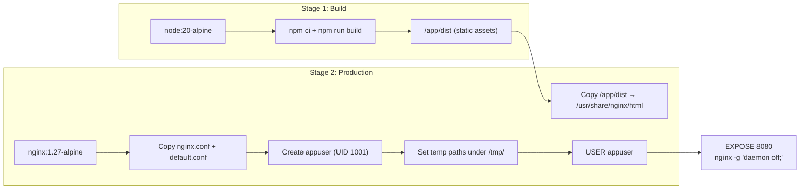
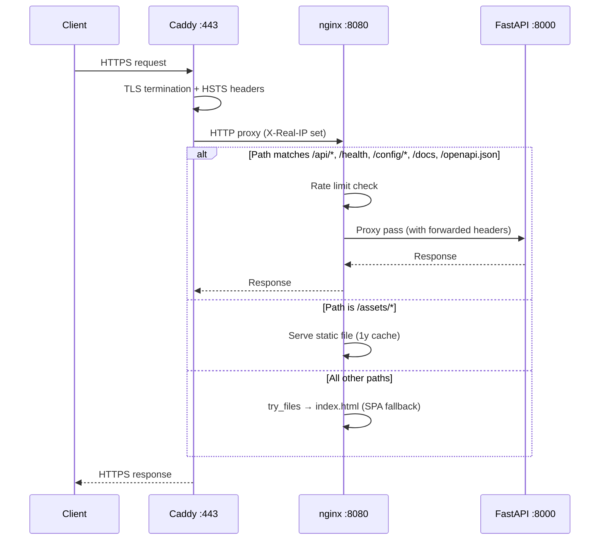

The **frontend container** is not a simple static file server — it is a purpose-built nginx instance that serves the compiled React SPA *and* reverse-proxies every API request to the FastAPI backend. This dual-role design eliminates the need for a dedicated API gateway while enforcing per-IP rate limits at the edge of the application, before requests ever reach Python code. In production the chain is **Caddy → nginx → FastAPI**, where Caddy terminates TLS (documented in [Caddy TLS Termination with Cloudflare DNS Challenge](24-caddy-tls-termination-with-cloudflare-dns-challenge)) and nginx handles request routing, compression, and abuse prevention.

Sources: [Dockerfile.frontend](Dockerfile.frontend#L19-L47), [nginx.conf](docker/nginx.conf#L1-L50), [default.conf](docker/default.conf#L1-L81)

---

## Container Build: From Node Build to Hardened nginx

The `Dockerfile.frontend` uses a two-stage build. Stage one compiles the React application with Vite, producing static assets under `/app/dist`. Stage two copies those assets into an `nginx:1.27-alpine` image alongside the two configuration files (`nginx.conf` and `default.conf`). Critically, the container **does not run as root** — a dedicated `appuser` (UID 1001) is created, and all nginx temp directories are pre-created under `/tmp/` and chowned before the user switch occurs. This follows the principle of least privilege: even if the nginx process were compromised, it has no write access outside its designated temp paths.

The health check script (`healthcheck-frontend.sh`) targets the `/nginx-health` endpoint — a lightweight location block that returns `200 ok` with access logging disabled, ensuring container orchestration probes do not pollute the access log. The process supervisor is **tini**, which handles signal forwarding and zombie reaping inside the container.

Sources: [Dockerfile.frontend](Dockerfile.frontend#L1-L47), [healthcheck-frontend.sh](docker/healthcheck-frontend.sh#L1-L3)

---

## Request Flow: Caddy → nginx → Backend

In production, external traffic never reaches nginx directly. Caddy binds ports 80/443 and forwards all requests to `frontend:8080` over the Docker bridge network. nginx receives the request and makes a routing decision based on the URI path. API paths (`/api/`, `/health`, `/config/`, `/docs`, `/openapi.json`) are proxied to the `backend` upstream (FastAPI on port 8000), while everything else is served from the static asset root with SPA fallback.

Because nginx sits behind Caddy, it must extract the real client IP from Caddy's `X-Real-IP` header rather than from the TCP socket. The `set_real_ip_from 172.16.0.0/12` directive tells nginx to trust the Docker internal network range, and `real_ip_header X-Real-IP` selects the header Caddy sets during forwarding. This ensures rate limiting operates on the *actual* client IP, not the Caddy container's internal address.

Sources: [Caddyfile](docker/Caddyfile#L1-L21), [default.conf](docker/default.conf#L11-L13)

---

## Dual-Zone Rate Limiting Architecture

nginx defines two independent rate limiting zones in the `http` block, each with its own memory allocation and enforcement policy. The separation is intentional: login brute-force protection requires drastically different thresholds than general API throughput management.

| Zone | Shared Memory | Rate | Applied To | Burst | Behavior |
|------|--------------|------|------------|-------|----------|
| `api` | 10 MB | **30 requests/second** | `/api/*` | 20 | `nodelay` — processes burst immediately |
| `login` | 10 MB | **5 requests/minute** | `/api/auth/login` | 3 | `nodelay` — processes burst immediately |

The `limit_req_zone` directive uses `$binary_remote_addr` (the binary representation of the client IP) as the key, which consumes less shared memory than the text representation. Each 10 MB zone can track approximately **160,000 unique IP addresses** (at ~64 bytes per entry). When the zone's capacity is exhausted, nginx removes the least recently used entries — a reasonable trade-off for a single-application deployment.

The `burst` parameter defines how many excess requests nginx queues before rejecting with **HTTP 429 Too Many Requests**. The `nodelay` flag means burst requests are processed immediately rather than being spaced out to match the configured rate. For the API zone, this allows short spikes of up to 20 requests beyond the 30/s baseline without penalty — essential for the policy generation workflow where a single user interaction may trigger multiple sequential API calls. For login, the combination of 5/minute with burst=3 means a legitimate user can retry a mistyped password a few times, but automated credential stuffing at even modest speeds is blocked within seconds.

Sources: [nginx.conf](docker/nginx.conf#L38-L41), [default.conf](docker/default.conf#L16-L23), [default.conf](docker/default.conf#L26-L34)

---

## Location Block Routing Map

nginx uses location block matching precedence (exact match `=` > prefix match with `^~` > regex `~` > standard prefix) to route requests. The following table documents every location block in the order nginx evaluates them:

| Location | Match Type | Purpose | Rate Limit | Special Headers |
|----------|-----------|---------|------------|-----------------|
| `= /api/auth/login` | Exact | JWT authentication | `login` (5r/m, burst=3) | Full proxy headers |
| `/api/` | Prefix | All API endpoints | `api` (30r/s, burst=20) | `proxy_read_timeout 120s` |
| `= /health` | Exact | Backend health check | None | Minimal headers |
| `/config/` | Prefix | Provider configuration | None | Minimal headers |
| `/docs` | Prefix | Swagger UI | None | Minimal headers |
| `/openapi.json` | Prefix | OpenAPI schema | None | Minimal headers |
| `= /nginx-health` | Exact | Container health check | None | `access_log off`, returns 200 directly |
| `/assets/` | Prefix | Vite-hashed static files | None | `expires 1y`, `Cache-Control: public, immutable` |
| `/` | Prefix | SPA fallback | None | `try_files $uri $uri/ /index.html` |

The exact-match `= /api/auth/login` block takes priority over the prefix-match `/api/` block, ensuring the stricter login rate limit is applied to authentication attempts rather than the more permissive API limit. The `proxy_read_timeout 120s` on the general API location accommodates long-running LLM inference calls, which can take over a minute for complex policy generation requests.

Sources: [default.conf](docker/default.conf#L1-L81)

---

## Proxy Header Forwarding

Every proxied location sets a consistent set of headers to preserve the original request context. The backend FastAPI application relies on these headers for two critical functions: **IP-based rate limiting verification** (Turnstile CAPTCHA validation reads `X-Real-IP`) and **CORS origin detection**. The four standard headers forwarded are:

- **`Host`** — the original host header from the client request
- **`X-Real-IP`** — the client's real IP address (extracted from Caddy's forwarding)
- **`X-Forwarded-For`** — appended with the proxy chain using `$proxy_add_x_forwarded_for`
- **`X-Forwarded-Proto`** — the original scheme (`https` in production)

The backend reads `X-Real-IP` explicitly in the login handler to pass the client IP to Cloudflare Turnstile's siteverify API, which uses it as an additional signal for bot detection. If nginx did not forward this header, Turnstile would see the Docker gateway IP for every request, reducing its fraud-detection effectiveness.

Sources: [default.conf](docker/default.conf#L17-L22), [main.py](backend/main.py#L267-L268)

---

## Static Asset Serving and SPA Fallback

The frontend build produces Vite-hashed assets under `/assets/` (filenames like `index-AbCd1234.js`). nginx serves these with a **1-year `Expires` header and `Cache-Control: public, immutable`**, leveraging the content hash in the filename as the cache-busting mechanism. This means returning visitors load the application from browser cache with zero network round-trips — only `index.html` (served without caching headers by the `/` fallback) is re-fetched on each visit.

The SPA fallback `try_files $uri $uri/ /index.html` ensures that all client-side routes (e.g., `/request`, `/review`, `/credentials`) resolve to `index.html`, allowing React Router to handle navigation. This is a standard pattern, but worth noting that it applies to **any path not matched by a more specific location block**, including paths that don't exist on disk — which is why the API proxy locations must be defined *before* the catch-all `/` location.

Sources: [default.conf](docker/default.conf#L70-L80)

---

## Gzip Compression

nginx performs response compression at the `http` context level, meaning it applies to all responses including proxied API responses. The configuration targets six MIME types commonly used in this application:

| MIME Type | Content Served |
|-----------|---------------|
| `text/plain` | API error messages, health responses |
| `text/css` | Compiled CSS bundles |
| `text/javascript` | Vite-compiled JS bundles |
| `application/javascript` | Vendor libraries |
| `application/json` | All API responses |
| `application/xml` | SAML/XML policy documents |
| `image/svg+xml` | SVG icons |

The compression level is set to 6 (out of 9), balancing CPU cost against size reduction. `gzip_min_length 256` prevents compressing tiny responses where the gzip overhead exceeds the savings. `gzip_vary on` adds a `Vary: Accept-Encoding` header to ensure CDN and browser caches store separate compressed/uncompressed variants. `gzip_proxied any` ensures compression is applied even to proxied responses (the default is to skip compression for proxied content).

Sources: [nginx.conf](docker/nginx.conf#L23-L36)

---

## Non-Root Execution and Temp Path Isolation

Running nginx as a non-root user requires relocating all temp directories from their default locations under `/var/lib/nginx/` (which requires root ownership) to writable paths under `/tmp/`. The Dockerfile pre-creates five temp paths during the root build stage:

| Temp Path | Purpose |
|-----------|---------|
| `/tmp/client_body` | Stores uploaded request bodies exceeding client_body_buffer_size |
| `/tmp/proxy` | Temporary files for proxied responses |
| `/tmp/fastcgi` | FastCGI temp files (unused but required by nginx) |
| `/tmp/uwsgi` | uWSGI temp files (unused but required by nginx) |
| `/tmp/scgi` | SCGI temp files (unused but required by nginx) |

The PID file is also relocated to `/tmp/nginx.pid`. All directories and the PID file are chowned to `appuser:appuser` before the `USER appuser` directive switches the process context. The `nginx.conf` references these paths explicitly with the `*_temp_path` directives, overriding nginx's compiled-in defaults.

Sources: [Dockerfile.frontend](Dockerfile.frontend#L20-L26), [nginx.conf](docker/nginx.conf#L42-L47)

---

## Development vs Production Proxy Differences

In local development (`docker-compose.yml`), the architecture is simplified: the Vite dev server at `:3000` includes its own proxy configuration that forwards `/api`, `/health`, and `/config` directly to the backend at `localhost:8000`. nginx is not involved. In production, the chain is Caddy → nginx → backend, with nginx performing the dual static-serving and proxying roles described above.

| Aspect | Development | Production |
|--------|------------|------------|
| Frontend server | Vite dev server (`:3000`) | nginx (`:8080`) |
| API proxy | Vite `server.proxy` config | nginx `proxy_pass` to upstream |
| Rate limiting | None | Two-zone `limit_req` |
| TLS termination | None (HTTP only) | Caddy with Cloudflare DNS challenge |
| Gzip compression | None (Vite serves uncompressed) | nginx gzip at level 6 |
| Static asset caching | No cache (HMR) | 1-year immutable cache |
| Process user | Developer's UID | `appuser` (UID 1001) |

Sources: [docker-compose.yml](docker-compose.yml#L1-L37), [docker-compose.prod.yml](docker-compose.prod.yml#L1-L84), [vite.config.ts](frontend/vite.config.ts#L15-L29)

---

## Suggested Reading

The nginx configuration is one layer in a multi-tier infrastructure stack. To understand the full deployment topology, see [Docker Architecture: Development vs Production Topology](23-docker-architecture-development-vs-production-topology). For the TLS layer that sits in front of nginx, see [Caddy TLS Termination with Cloudflare DNS Challenge](24-caddy-tls-termination-with-cloudflare-dns-challenge). For how the backend handles requests that pass through nginx's proxy, start with [FastAPI Application Entry Point and API Endpoints](6-fastapi-application-entry-point-and-api-endpoints).