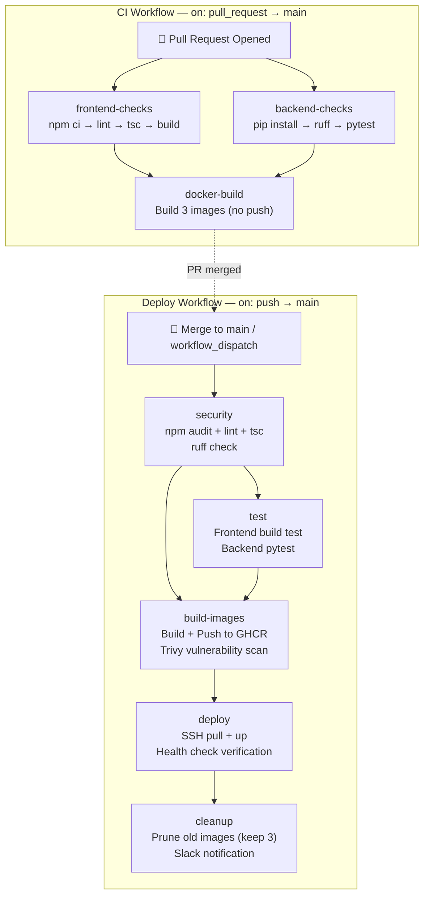
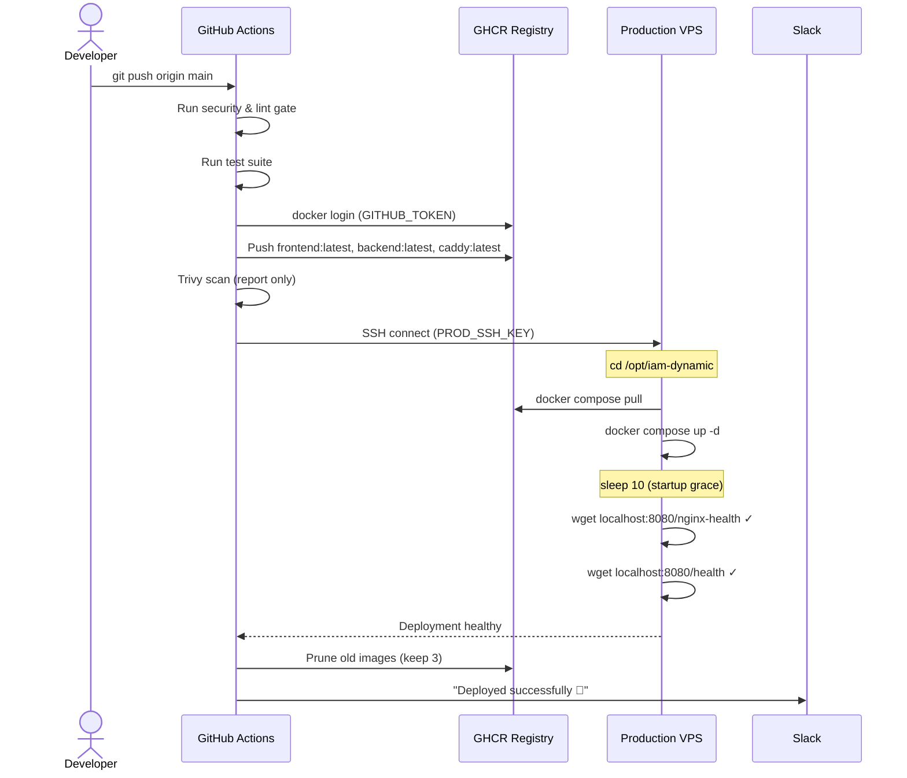

The project operates two distinct GitHub Actions workflows that together form a complete continuous integration and delivery pipeline. The **CI workflow** acts as a gate on every pull request targeting `main`, running linting, type-checking, unit tests, and a dry-run Docker build to catch regressions before merge. The **Deploy workflow** activates on every push to `main` (or manual trigger), performing a full security audit, building and pushing multi-architecture container images to GitHub Container Registry (GHCR), deploying them to a production VPS over SSH, running post-deployment health checks, and cleaning up old image versions. Together they enforce a "never deploy what hasn't been validated" discipline while keeping the feedback loop fast for developers.

Sources: [ci.yml](.github/workflows/ci.yml#L1-L86), [deploy.yml](.github/workflows/deploy.yml#L1-L265)

## Pipeline Architecture Overview

The diagram below shows the two workflows and how their jobs relate to each other. The CI workflow runs in parallel for quality checks, then serially for Docker validation. The Deploy workflow chains five jobs — security gate → test → build & push → SSH deploy → cleanup — each depending on the previous step succeeding.



Sources: [ci.yml](.github/workflows/ci.yml#L1-L86), [deploy.yml](.github/workflows/deploy.yml#L1-L265)

## Concurrency and Throttling Strategy

Both workflows use GitHub's `concurrency` feature, but with opposite semantics tuned to their purpose.

| Workflow | Concurrency Group | `cancel-in-progress` | Rationale |
|----------|-------------------|----------------------|-----------|
| CI | `ci-${{ github.ref }}` | `true` | New commits to the same PR invalidate the previous CI run — cancel it to free runner minutes. |
| Deploy | `deploy-${{ github.ref }}` | `false` | A deployment in progress must **never** be interrupted mid-way — queue subsequent deploys instead. |

The CI group key is scoped to the Git ref (branch name), so two different PRs can run checks simultaneously without interference. The deploy group similarly scopes to the ref, ensuring only one deployment to the same target happens at a time.

Sources: [ci.yml](.github/workflows/ci.yml#L8-L9), [deploy.yml](.github/workflows/deploy.yml#L8-L10)

## CI Workflow: Pull Request Quality Gate

The CI workflow triggers exclusively on `pull_request` events targeting the `main` branch. It runs three jobs — two in parallel for code quality, and a third that validates Docker image builds only after the quality checks pass.

### Job 1: Frontend Checks

Running in the `frontend` working directory, this job installs Node 20 dependencies from the lockfile, then executes four sequential steps: `npm ci` for deterministic installs, `npm run lint` (ESLint), `npx tsc -b --noEmit` for TypeScript type checking without emitting files, and finally `npm run build` to verify the Vite production bundle compiles without errors. The `setup-node` action caches the npm dependency directory using `frontend/package-lock.json` as the cache key.

Sources: [ci.yml](.github/workflows/ci.yml#L12-L30), [package.json](frontend/package.json#L7-L11)

### Job 2: Backend Checks

Running in the `backend` working directory with Python 3.11, this job installs the project dependencies plus the `ruff` linter and `pytest` test runner. It then executes `ruff check .` using the rules defined in `ruff.toml` — selecting error (`E`) and pyflakes (`F`) rules while ignoring `E402` (module-level imports after `load_dotenv()`) and `E501` (line length). Finally, `pytest --tb=short -q` runs the test suite with short tracebacks and quiet output. The `|| true` on the pytest command indicates the test suite is non-blocking in CI — the build won't fail on test failures at this stage, a pragmatic choice during early-stage development.

Sources: [ci.yml](.github/workflows/ci.yml#L32-L49), [ruff.toml](backend/ruff.toml#L1-L7)

### Job 3: Docker Build Validation

The `docker-build` job has `needs: [frontend-checks, backend-checks]`, meaning it only executes after both quality gates pass. It uses Docker Buildx to build all three production images — **frontend** (multi-stage: Node build → nginx production), **backend** (Python slim → uvicorn), and **caddy** (Caddy builder with Cloudflare DNS plugin) — but with `push: false`. This validates that the Dockerfiles parse correctly and the images build end-to-end without actually pushing to a registry. Both `cache-from` and `cache-to` use `type=gha` (GitHub Actions cache), meaning subsequent builds reuse Docker layer blobs stored in the Actions cache, significantly reducing build times.

Sources: [ci.yml](.github/workflows/ci.yml#L51-L86)

## Deploy Workflow: Build, Ship, and Run

The deploy workflow is the production pipeline, triggered by pushes to `main` or manual `workflow_dispatch` invocations. It carries `permissions: contents: read, packages: write` — the minimum needed to read the repository and push images to GHCR. Five environment variables define the container image registry paths under `ghcr.io`.

Sources: [deploy.yml](.github/workflows/deploy.yml#L1-L21)

### Job 1: Security & Lint Gate

This job combines frontend and backend quality checks into a single runner to save billable minutes. On the frontend side it runs `npm audit --audit-level=high` (which will report but not fail on high-severity vulnerabilities due to `|| true`), ESLint, TypeScript type checking, and a production build. On the backend side it installs dependencies and runs `ruff check .`. This job is the "must pass" gate before anything else runs.

Sources: [deploy.yml](.github/workflows/deploy.yml#L23-L57)

### Job 2: Test Suite

Dependent on the security gate, this job re-runs the frontend build test and backend `pytest --tb=short -q` suite on a fresh runner. Splitting tests from the security/lint job provides clearer failure signals — if this job fails, the issue is specifically a test regression, not a lint or audit problem.

Sources: [deploy.yml](.github/workflows/deploy.yml#L58-L87)

### Job 3: Build & Push Container Images

This job requires both `security` and `test` to succeed. It performs the full container image lifecycle:

**Authentication.** Logs into GHCR using the automatic `GITHUB_TOKEN` provided by GitHub Actions.

**Image Tagging Strategy.** Each of the three images (frontend, backend, caddy) goes through a `docker/metadata-action` step that generates tags using the following rules:

| Tag Template | Example | Purpose |
|-------------|---------|---------|
| `type=ref,event=branch` | `main` | Branch-based reference |
| `type=ref,event=pr` | `pr-42` | PR-based reference |
| `type=semver,pattern={{version}}` | `1.2.3` | Semantic version from git tag |
| `type=sha,prefix=` | `a1b2c3d` | Short commit SHA |
| `type=raw,value=latest,enable={{is_default_branch}}` | `latest` | Rolling tag on main only |

**Frontend build-arg injection.** The frontend image build passes `VITE_TURNSTILE_SITE_KEY` as a build argument through `docker/build-push-action`, injecting the Cloudflare Turnstile CAPTCHA site key at build time rather than runtime — this is required because Vite embeds environment variables at build time, not at container start.

**Caddy image.** The Caddy image uses a two-stage build that compiles the `caddy-dns/cloudflare` plugin into the Caddy binary via `xcaddy`, enabling DNS-01 ACME challenges for TLS certificate provisioning. The production `Caddyfile` is copied into the image.

**Vulnerability scanning with Trivy.** After all three images are pushed, the workflow installs Trivy from the official apt repository and scans each image for `CRITICAL` and `HIGH` severity vulnerabilities. The `--exit-code 0` combined with `continue-on-error: true` means scans are purely informational — they report findings but never block a deployment. This is a reasonable posture for a private tool where the blast radius is contained.

Sources: [deploy.yml](.github/workflows/deploy.yml#L89-L199), [Dockerfile.frontend](Dockerfile.frontend#L1-L48), [Dockerfile.backend](Dockerfile.backend#L1-L28), [Dockerfile.caddy](Dockerfile.caddy#L1-L9), [Caddyfile](docker/Caddyfile#L1-L22)

### Job 4: SSH Deployment to Production

The deployment job is gated by `if: github.ref == 'refs/heads/main'`, ensuring it only runs on the main branch (not on `workflow_dispatch` from a feature branch). It uses the `appleboy/ssh-action` to connect to the production server using three repository secrets:

| Secret | Purpose |
|--------|---------|
| `PROD_HOST` | SSH hostname of the production VPS |
| `PROD_USER` | SSH username for the connection |
| `PROD_SSH_KEY` | Private SSH key for authentication |

The deployment script performs the following sequence on the remote server:

```bash
cd /opt/iam-dynamic
docker compose -f docker-compose.prod.yml pull    # Pull latest images from GHCR
docker compose -f docker-compose.prod.yml up -d    # Recreate changed containers
echo "Waiting for health checks..."
sleep 10
docker compose -f docker-compose.prod.yml exec -T frontend wget -qO- http://localhost:8080/nginx-health || exit 1
docker compose -f docker-compose.prod.yml exec -T frontend wget -qO- http://localhost:8080/health || exit 1
echo "Deployment healthy"
```

The post-deployment verification hits two nginx endpoints inside the frontend container: `/nginx-health` checks the nginx reverse proxy layer, while `/health` proxies through to the backend's `/health` endpoint, confirming end-to-end connectivity. If either check fails, the step exits with code 1, marking the deployment as failed.

Sources: [deploy.yml](.github/workflows/deploy.yml#L201-L223), [docker-compose.prod.yml](docker-compose.prod.yml#L1-L84)

### Job 5: Cleanup and Notification

The cleanup job runs with `if: always() && needs.deploy.result == 'success'`, meaning it executes only when the deployment succeeds (but doesn't skip if other unrelated jobs failed). It uses `actions/delete-package-versions@v5` to prune old container image versions for each of the three packages in GHCR, keeping the **3 most recent versions** per package. Each cleanup step has `continue-on-error: true`, so a failure to prune doesn't break the workflow.

After cleanup, a Slack notification is sent via `slackapi/slack-github-action` using an incoming webhook stored in `SLACK_WEBHOOK_URL`. The payload includes the commit SHA and the actor who triggered the deployment, providing an audit trail in the team's Slack channel.

Sources: [deploy.yml](.github/workflows/deploy.yml#L225-L265)

## Container Image Architecture

Each Dockerfile is designed with production hardening in mind. The table below summarizes the key characteristics of each image:

| Property | Frontend | Backend | Caddy |
|----------|----------|---------|-------|
| **Base image** | `node:20-alpine` → `nginx:1.27-alpine` | `python:3.11-slim` | `caddy:2-builder` → `caddy:2-alpine` |
| **Stages** | 2 (build + serve) | 1 | 2 (plugin build + serve) |
| **Runtime user** | `appuser` (UID 1001) | `appuser` (UID 1001) | Default (root) |
| **Init system** | `tini` | `tini` | — |
| **Port** | 8080 | 8000 | 80, 443 |
| **Health check** | `wget localhost:8080/nginx-health` | `wget localhost:8000/health` | — |
| **Memory limit** | 256 MB | 1 GB | — |

The frontend uses a multi-stage build: the first stage compiles the React app with Vite, and the second stage copies the static output into an nginx container. The backend runs `uvicorn` with 2 workers. The Caddy image compiles the Cloudflare DNS plugin at build time so it's available for ACME DNS-01 challenges without runtime plugin management. All three images are referenced in `docker-compose.prod.yml` using their GHCR URLs and deployed on the `iam-network` bridge network.

Sources: [Dockerfile.frontend](Dockerfile.frontend#L1-L48), [Dockerfile.backend](Dockerfile.backend#L1-L28), [Dockerfile.caddy](Dockerfile.caddy#L1-L9), [docker-compose.prod.yml](docker-compose.prod.yml#L1-L84)

## Deployment Sequence Diagram

The following diagram traces a single deployment end-to-end, from merge through SSH deployment and health verification:



Sources: [deploy.yml](.github/workflows/deploy.yml#L201-L265)

## Secrets and Environment Variables

The pipeline relies on the following repository secrets, which must be configured in **Settings → Secrets and variables → Actions** before the workflows will function:

| Secret | Used By | Purpose |
|--------|---------|---------|
| `GITHUB_TOKEN` | Deploy (auto-provided) | Authenticate with GHCR for image push |
| `TURNSTILE_SITE_KEY` | Deploy | Injected as Vite build-arg in frontend image |
| `PROD_HOST` | Deploy | SSH hostname of production server |
| `PROD_USER` | Deploy | SSH username for deployment |
| `PROD_SSH_KEY` | Deploy | Private SSH key for server authentication |
| `SLACK_WEBHOOK_URL` | Deploy (cleanup) | Incoming webhook for deployment notifications |

The production server itself reads its runtime configuration from a `.env` file at `/opt/iam-dynamic/.env`, as defined by the variable substitutions in `docker-compose.prod.yml`. These include LLM provider keys, AWS credentials, authentication secrets, and the Cloudflare API token for Caddy TLS provisioning — none of which pass through the CI/CD pipeline.

Sources: [deploy.yml](.github/workflows/deploy.yml#L98-L103), [deploy.yml](.github/workflows/deploy.yml#L209-L214), [docker-compose.prod.yml](docker-compose.prod.yml#L8-L49)

## Practical Considerations

**Docker layer caching.** Both workflows use `cache-from: type=gha` and `cache-to: type=gha,mode=max`, storing all intermediate Docker layers in the GitHub Actions cache. This means that when only the backend code changes, the frontend and caddy image builds reuse their cached layers entirely, typically completing in under a minute.

**Non-blocking test posture.** Both `ci.yml` and `deploy.yml` append `|| true` to the pytest command, making test failures non-blocking. This is intentional during early development but should be removed once the test suite reaches a stable state — otherwise, regressions can silently reach production.

**Trivy scan posture.** Vulnerability scans are configured with `--exit-code 0` and `continue-on-error: true`, making them advisory rather than mandatory. As the project matures, consider switching to `--exit-code 1` to block deployments with known critical vulnerabilities.

**Image pruning.** The cleanup job retains only the 3 most recent image versions per package. This keeps GHCR storage costs low while maintaining enough rollback targets. If you need to roll back beyond 3 versions, you'll need to rebuild from the target commit.

Sources: [ci.yml](.github/workflows/ci.yml#L49), [deploy.yml](.github/workflows/deploy.yml#L89-L199), [deploy.yml](.github/workflows/deploy.yml#L225-L253)

## Related Pages

- [Docker Architecture: Development vs Production Topology](23-docker-architecture-development-vs-production-topology) — details the `docker-compose.yml` vs `docker-compose.prod.yml` configurations
- [Caddy TLS Termination with Cloudflare DNS Challenge](24-caddy-tls-termination-with-cloudflare-dns-challenge) — explains the TLS provisioning that the Caddy image enables
- [nginx Reverse Proxy Configuration and Rate Limiting](25-nginx-reverse-proxy-configuration-and-rate-limiting) — covers the nginx configuration baked into the frontend image