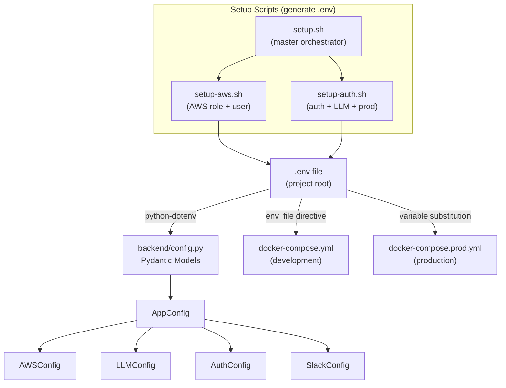
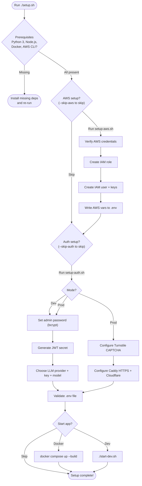

IAM-Dynamic uses a single **`.env` file** at the project root to control every aspect of the application — from which LLM provider generates your IAM policies, to how authentication works, to whether production HTTPS is enabled. This page walks you through what each variable does, how the validation system catches misconfiguration at startup, and the three setup scripts that automate first-time configuration.

Sources: [.env.example](.env.example#L1-L50), [backend/config.py](backend/config.py#L1-L163)

## Configuration Architecture Overview

Before diving into individual variables, it helps to understand how configuration flows through the system. Environment variables defined in `.env` are loaded by the Python backend via `python-dotenv`, then validated and structured into **Pydantic models** at import time. The Docker Compose files (both dev and prod) inject these same variables into their containers. The setup scripts are a convenience layer — they generate `.env` interactively so you don't have to edit it by hand.



The `.env` file is **never committed to version control** — it is listed in [`.gitignore`](.gitignore#L143). A template file [`.env.example`](.env.example#L1-L50) ships with the repository to document all available variables and their defaults.

Sources: [backend/config.py](backend/config.py#L1-L163), [backend/main.py](backend/main.py#L17-L20), [docker-compose.yml](docker-compose.yml#L8-L9), [docker-compose.prod.yml](docker-compose.prod.yml#L24-L49), [.gitignore](.gitignore#L143-L144)

## Complete Variable Reference

The table below lists every environment variable recognized by IAM-Dynamic, grouped by functional category. **Required** variables will cause the application to fail at startup if missing. **Optional** variables have sensible defaults.

### LLM Provider Configuration

The application supports four LLM providers. You choose one via `LLM_PROVIDER`, then supply that provider's API key. The other providers' keys can remain unset.

| Variable | Required | Default | Description |
|---|---|---|---|
| `LLM_PROVIDER` | Yes | `gemini` | Which LLM to use. One of: `gemini`, `openai`, `anthropic`/`claude`, `zhipu`/`glm` |
| `GOOGLE_API_KEY` | If provider=gemini | — | Google AI Studio API key |
| `GEMINI_MODEL` | No | `gemini-3.1-pro-preview` | Gemini model identifier |
| `OPENAI_API_KEY` | If provider=openai | — | OpenAI platform API key |
| `OPENAI_MODEL` | No | `gpt-5.4` | OpenAI model identifier |
| `ANTHROPIC_API_KEY` | If provider=anthropic | — | Anthropic console API key |
| `ANTHROPIC_MODEL` | No | `claude-opus-4-6` | Claude model identifier |
| `ZAI_API_KEY` | If provider=zhipu | — | Z.AI (Zhipu) platform API key |
| `ZAI_MODEL` | No | `glm-5.1` | GLM model identifier |

The backend's Pydantic `LLMConfig` model normalizes provider aliases (e.g., `claude` → `anthropic`, `glm` → `zhipu`) and logs a warning if an unrecognized provider is supplied, defaulting to `gemini`.

Sources: [.env.example](.env.example#L1-L29), [backend/config.py](backend/config.py#L38-L67)

### AWS Configuration

These variables tell the backend which AWS account and IAM role to target when issuing temporary STS credentials.

| Variable | Required | Default | Description |
|---|---|---|---|
| `AWS_ACCOUNT_ID` | Yes | — | 12-digit AWS account ID (e.g., `123456789012`) |
| `AWS_ROLE_NAME` | No | `AgentPOCSessionRole` | IAM role the application assumes via STS |
| `AWS_DEFAULT_REGION` | No | `us-east-1` | Default AWS region for API calls |

The backend constructs the full role ARN automatically from `AWS_ACCOUNT_ID` + `AWS_ROLE_NAME` using the `role_arn` property on `AWSConfig`.

Sources: [.env.example](.env.example#L31-L35), [backend/config.py](backend/config.py#L27-L35), [setup-aws.sh](setup-aws.sh#L26-L29)

### Authentication Configuration

Authentication is **disabled by default** (perfect for local development). It activates only when `AUTH_PASSWORD_HASH` is set to a non-empty bcrypt hash. When enabled, `JWT_SECRET` becomes mandatory.

| Variable | Required | Default | Description |
|---|---|---|---|
| `AUTH_USERNAME` | No | `admin` | Admin username for login |
| `AUTH_PASSWORD_HASH` | No | `""` (disabled) | bcrypt hash of the admin password |
| `JWT_SECRET` | If auth enabled | `""` | Random string for signing JWT tokens |
| `JWT_EXPIRY_HOURS` | No | `8` | Hours until JWT tokens expire |
| `TURNSTILE_SECRET_KEY` | No | — | Cloudflare Turnstile server-side secret (production) |

The `AuthConfig` model includes a **cross-field validator** that raises a `ValueError` if a password hash is present but `JWT_SECRET` is empty — preventing the application from silently signing tokens with an empty string.

Sources: [backend/config.py](backend/config.py#L69-L87), [setup-auth.sh](setup-auth.sh#L127-L175)

### Application Configuration

| Variable | Required | Default | Description |
|---|---|---|---|
| `APPROVER_NAME` | No | `Admin` | Display name shown on approval prompts |
| `SLACK_WEBHOOK_URL` | No | — | Slack incoming webhook for audit notifications |
| `DATABASE_PATH` | No | `iam_dynamic.db` | SQLite database file path |

Sources: [.env.example](.env.example#L37-L50), [backend/config.py](backend/config.py#L90-L105)

### Production-Only Variables

These are only needed when deploying with [docker-compose.prod.yml](docker-compose.prod.yml) and Caddy TLS termination.

| Variable | Required (prod) | Default | Description |
|---|---|---|---|
| `CADDY_DOMAIN` | Yes (prod) | `iam.yantorno.dev` | Domain for HTTPS certificate |
| `ACME_EMAIL` | Yes (prod) | `admin@yantorno.dev` | Let's Encrypt registration email |
| `CLOUDFLARE_API_TOKEN` | Yes (prod) | — | Cloudflare API token with Zone:DNS:Edit permission |
| `TURNSTILE_SITE_KEY` | No (prod) | — | Cloudflare Turnstile client-side site key (built into frontend image) |

Sources: [docker-compose.prod.yml](docker-compose.prod.yml#L1-L21), [setup-auth.sh](setup-auth.sh#L422-L449)

## Pydantic Validation System

Configuration isn't just a bag of strings — it's structured into **four nested Pydantic models** under a top-level `AppConfig`. When the backend starts, `load_config()` reads every variable from `os.getenv()`, passes each group into its model, and the entire structure is validated in a single operation. If any required field is missing or a cross-field rule fails, the application **crashes immediately** with a descriptive error rather than failing silently later.

The four models and their responsibilities:

| Model | Fields | Key Validation |
|---|---|---|
| `AWSConfig` | `account_id`, `role_name` | `account_id` is required; `role_arn` property auto-constructs the ARN |
| `LLMConfig` | `provider`, 8 provider keys | Provider must be one of 6 recognized names; unknown defaults to `gemini` |
| `AuthConfig` | 5 auth fields | Cross-field validator: `JWT_SECRET` required when `AUTH_PASSWORD_HASH` is set |
| `SlackConfig` | `webhook_url` | Optional; Slack features silently disabled when absent |

The singleton `config` object at the bottom of [config.py](backend/config.py#L162) is imported by every service module, ensuring validation runs exactly once at import time.

Sources: [backend/config.py](backend/config.py#L95-L162)

## Setup Scripts

IAM-Dynamic ships with three shell scripts that automate the process of creating and populating `.env`. They handle everything from prerequisite checks to AWS IAM role creation to bcrypt password hashing.

### The Master Script: `setup.sh`

The orchestrator that runs the other two scripts in sequence. It supports multiple modes to suit different workflows:

| Flag | Behavior |
|---|---|
| *(no flags)* | Fully interactive — prompts for every decision |
| `--quick` | Accepts sensible defaults, fewer prompts |
| `--ci` | Non-interactive — auto-confirms everything, no prompts |
| `--skip-aws` | Skips the AWS setup entirely |
| `--skip-auth` | Skips authentication and LLM configuration |

The master script runs five phases in order: **prerequisites check** → **AWS setup** → **Auth + LLM setup** → **env file validation** → **optional app startup**.

Sources: [setup.sh](setup.sh#L1-L506)

### AWS Setup: `setup-aws.sh`

This script interacts directly with your AWS account via the AWS CLI. It performs the following steps:

1. **Verifies AWS CLI** is installed and credentials are configured (`aws sts get-caller-identity`)
2. **Detects your account ID** and caller type (IAM user, role, or assumed-role)
3. **Creates an IAM role** named `AgentPOCSessionRole` (customizable) with a trust policy that allows your caller identity to assume it
4. **Optionally creates an IAM user** with programmatic access keys and adds that user to the role's trust policy
5. **Updates `.env`** with `AWS_ACCOUNT_ID`, `AWS_ROLE_NAME`, and optionally `AWS_ACCESS_KEY_ID`/`AWS_SECRET_ACCESS_KEY`
6. **Attaches a base permissions policy** to the role covering common AWS services (S3, EC2, Lambda, DynamoDB, RDS, CloudWatch, Logs, Secrets Manager)

Pass `--skip-user` to skip IAM user creation if you already have AWS credentials configured in your environment.

Sources: [setup-aws.sh](setup-aws.sh#L1-L640)

### Auth & LLM Setup: `setup-auth.sh`

This script handles authentication credentials and LLM provider selection. It has two modes:

**Dev mode** (`--dev`) collects:
1. Admin username and password (hashed with bcrypt on the spot)
2. A randomly generated JWT secret
3. JWT session duration
4. LLM provider choice + API key + model selection (with live model listing from the API where supported)

**Prod mode** (`--prod`) adds three additional steps:
5. Cloudflare Turnstile CAPTCHA keys (optional — protects login from brute force)
6. Caddy HTTPS configuration (domain, ACME email, Cloudflare API token)
7. A reminder to set GitHub Actions secrets for CI/CD builds

Sources: [setup-auth.sh](setup-auth.sh#L1-L490)

## Step-by-Step: Creating Your `.env` File

The flowchart below shows the decision path through the setup scripts. You can either run the master script for a guided experience, or run each sub-script independently.



Sources: [setup.sh](setup.sh#L446-L502), [setup-auth.sh](setup-auth.sh#L464-L490)

## Manual `.env` Creation

If you prefer not to use the setup scripts, you can create `.env` manually:

```bash
# 1. Copy the template
cp .env.example .env

# 2. Edit with your values
# At minimum, set:
#   - LLM_PROVIDER and the corresponding API key
#   - AWS_ACCOUNT_ID
```

For authentication, you'll need a bcrypt hash of your chosen password. Use the included helper script:

```bash
python backend/scripts/hash_password.py
```

And generate a JWT secret:

```bash
python -c "import secrets; print(secrets.token_urlsafe(36))"
```

Sources: [.env.example](.env.example#L1-L50), [backend/scripts/hash_password.py](backend/scripts/hash_password.py#L1)

## Environment Differences: Development vs Production

The key difference between environments is **how variables reach the containers**. In development, Docker Compose reads `.env` directly via the `env_file` directive. In production, each variable is explicitly mapped with a fallback default, and some (like `CLOUDFLARE_API_TOKEN`) are **required** — the compose file will refuse to start without them.

| Aspect | Development | Production |
|---|---|---|
| Compose file | `docker-compose.yml` | `docker-compose.prod.yml` |
| Config delivery | `env_file: .env` (bulk) | Explicit `environment:` per variable |
| TLS termination | None (HTTP on port 8080) | Caddy with Let's Encrypt (HTTPS on 443) |
| Authentication | Optional (disabled by default) | Strongly recommended |
| CAPTCHA | Not applicable | Cloudflare Turnstile (optional) |
| CORS origins | `localhost` variants auto-allowed | `CADDY_DOMAIN` added to allowlist |
| Resource limits | None | Backend: 1GB, Frontend: 256MB |
| Container images | Built locally from Dockerfiles | Pulled from GHCR registry |

Sources: [docker-compose.yml](docker-compose.yml#L1-L37), [docker-compose.prod.yml](docker-compose.prod.yml#L1-L84), [backend/main.py](backend/main.py#L175-L193)

## Validation at Startup

When the backend starts, `config.py` is imported and `load_config()` runs immediately. This function reads every environment variable, constructs the four Pydantic models, and validates them as a unit. The application will **refuse to start** if:

- `AWS_ACCOUNT_ID` is missing (required by `AWSConfig`)
- `AUTH_PASSWORD_HASH` is set but `JWT_SECRET` is empty (cross-field validator on `AuthConfig`)
- Any Pydantic field type conversion fails (e.g., non-numeric `JWT_EXPIRY_HOURS`)

Additionally, the master `setup.sh` script performs its own **post-setup validation** by grepping the `.env` file for required variables and emitting warnings for missing provider-specific API keys.

Sources: [backend/config.py](backend/config.py#L107-L163), [setup.sh](setup.sh#L246-L312)

## Troubleshooting Common Issues

| Symptom | Likely Cause | Fix |
|---|---|---|
| App starts but LLM calls fail | API key missing or invalid for selected provider | Set the correct `*_API_KEY` in `.env` for your `LLM_PROVIDER` |
| `JWT_SECRET must be set` error | `AUTH_PASSWORD_HASH` is set but `JWT_SECRET` is empty | Run `setup-auth.sh` or add `JWT_SECRET` manually |
| STS `AccessDenied` during credential issuance | IAM role doesn't trust your AWS identity | Run `setup-aws.sh` or update the role trust policy manually |
| `CLOUDFLARE_API_TOKEN is required` on prod deploy | Missing variable in `.env` for production compose | Set `CLOUDFLARE_API_TOKEN` in `.env` before running `docker-compose.prod.yml` |
| Frontend can't reach backend API | CORS or proxy misconfiguration | Verify `CADDY_DOMAIN` matches your actual domain, or use `localhost:3000` for dev |
| `.env` not loaded in backend | `python-dotenv` can't find the file | Ensure `.env` is in the **project root** (one directory above `backend/`) |

Sources: [backend/config.py](backend/config.py#L82-L87), [backend/main.py](backend/main.py#L17-L20), [docker-compose.prod.yml](docker-compose.prod.yml#L9-L10)

## Where to Go Next

Now that your environment is configured, you're ready to run the application:

- **[Running with Docker](4-running-with-docker)** — Start the application using Docker Compose (dev or prod topology)
- **[Architecture Overview and Request Lifecycle](5-architecture-overview-and-request-lifecycle)** — Understand how configuration flows through the full request pipeline
- **[Configuration System with Pydantic Validation](10-configuration-system-with-pydantic-validation)** — Deep dive into the validation models and their cross-field rules
- **[AWS IAM Role Setup and Trust Policy for STS AssumeRole](27-aws-iam-role-setup-and-trust-policy-for-sts-assumerole)** — Detailed guide on the AWS resources `setup-aws.sh` creates