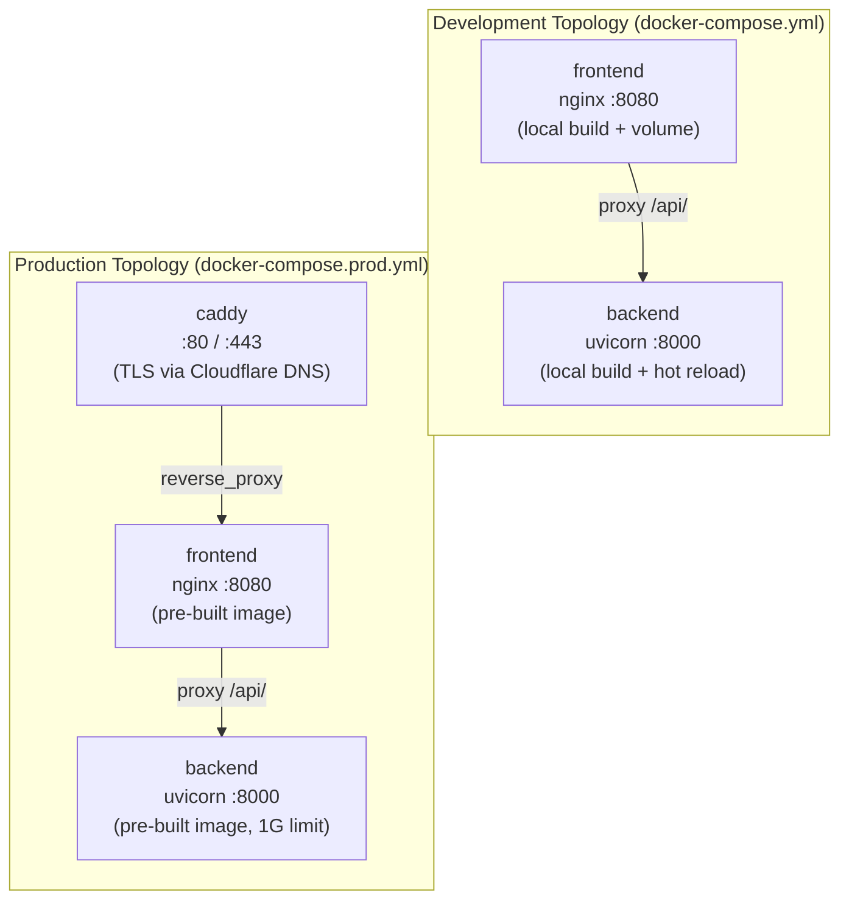
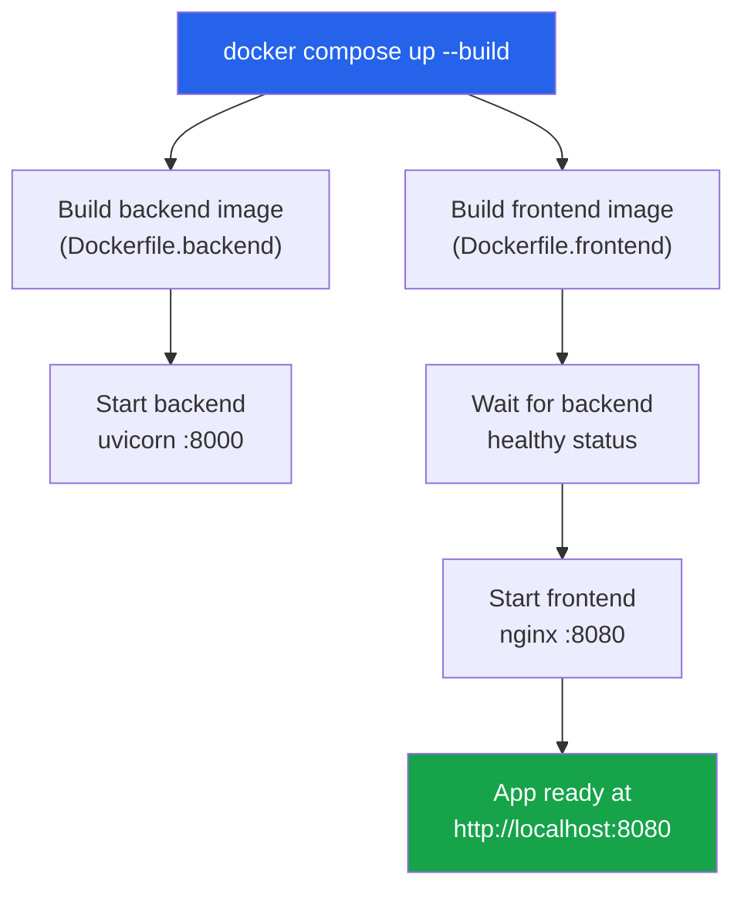

This page walks you through running **IAM-Dynamic** inside Docker — from your first local build to understanding how each container fits together. Docker provides the fastest path to a fully working environment: two commands get you a running application with a Python backend, a React frontend served by nginx, and automatic health monitoring. No manual dependency installation, no version conflicts, no "works on my machine."

## What You'll Need

Before proceeding, ensure Docker is installed and running on your system. Docker Desktop for macOS and Windows includes Docker Compose out of the box; on Linux, Docker Compose is bundled with modern Docker Engine installations. Verify your setup with `docker --version` and `docker compose version`. You also need a `.env` file in the project root — if you haven't created one yet, follow [Environment Configuration](3-environment-configuration) first.

Sources: [docker-compose.yml](docker-compose.yml#L1-L36), [docker-compose.prod.yml](docker-compose.prod.yml#L1-L83)

## Container Architecture

IAM-Dynamic ships two Docker Compose topologies designed for different stages of the development lifecycle. The **development** compose file (`docker-compose.yml`) builds images locally, mounts your source code for hot reloading, and exposes debug ports. The **production** compose file (`docker-compose.prod.yml`) pulls pre-built images from GitHub Container Registry, adds a Caddy TLS termination layer, enforces memory limits, and configures restart policies. Both share the same `iam-network` bridge network so containers can communicate using service names as hostnames.



In both topologies, the frontend container runs **nginx** which serves the compiled React application and proxies all `/api/`, `/health`, `/config/`, and `/docs` requests to the backend. This means you always access the application through a single entry point — port `8080` in development, or port `443` through Caddy in production.

Sources: [docker-compose.yml](docker-compose.yml#L1-L36), [docker-compose.prod.yml](docker-compose.prod.yml#L1-L83), [docker/default.conf](docker/default.conf#L1-L81)

## The Three Dockerfiles

Each container has its own Dockerfile optimized for a specific purpose. Understanding what each one does will help you debug build issues and customize the stack.

### Backend — `Dockerfile.backend`

The backend image starts from `python:3.11-slim`, installs `tini` as an init process (which properly handles signal forwarding and zombie process reaping), and creates a non-root `appuser` with UID 1001. Dependencies are installed from `backend/requirements.txt` with pip's `--no-cache-dir` flag to minimize image size. The health check script (`docker/healthcheck-backend.sh`) is a simple `wget` probe against `http://localhost:8000/health`. In production, uvicorn starts with `--workers 2`; in development, the compose file overrides this to a single worker with `--reload` so code changes are reflected immediately.

Sources: [Dockerfile.backend](Dockerfile.backend#L1-L28), [docker/healthcheck-backend.sh](docker/healthcheck-backend.sh#L1-L3)

### Frontend — `Dockerfile.frontend`

The frontend uses a **multi-stage build**. The first stage (`node:20-alpine`) installs npm dependencies with `npm ci` and runs `npm run build` to produce optimized static assets. Build arguments `VITE_API_BASE_URL` and `VITE_TURNSTILE_SITE_KEY` are forwarded as environment variables during the build so Vite can bake them into the JavaScript bundle. The second stage (`nginx:1.27-alpine`) copies the built assets into nginx's html directory, applies custom nginx configuration files, sets up writable temp paths for the non-root user, and runs its own health check against `/nginx-health`. This two-stage pattern keeps the final image small — no Node.js runtime, no source code, just nginx and compiled assets.

Sources: [Dockerfile.frontend](Dockerfile.frontend#L1-L48), [docker/healthcheck-frontend.sh](docker/healthcheck-frontend.sh#L1-L3)

### Caddy — `Dockerfile.caddy`

The Caddy image is only used in production. It extends the official `caddy:2-builder` image to compile the `caddy-dns/cloudflare` plugin via `xcaddy`, then copies the resulting binary into `caddy:2-alpine`. This plugin enables Cloudflare DNS-01 ACME challenges for automatic TLS certificate provisioning — a deep dive into this is available at [Caddy TLS Termination with Cloudflare DNS Challenge](24-caddy-tls-termination-with-cloudflare-dns-challenge).

Sources: [Dockerfile.caddy](Dockerfile.caddy#L1-L9)

| Dockerfile | Base Image | Non-root User | Health Check | Output |
|---|---|---|---|---|
| `Dockerfile.backend` | `python:3.11-slim` | `appuser` (UID 1001) | `wget localhost:8000/health` | FastAPI on uvicorn |
| `Dockerfile.frontend` | `node:20-alpine` → `nginx:1.27-alpine` | `appuser` (UID 1001) | `wget localhost:8080/nginx-health` | Static assets via nginx |
| `Dockerfile.caddy` | `caddy:2-builder` → `caddy:2-alpine` | (inherits rootless) | (none) | TLS reverse proxy |

Sources: [Dockerfile.backend](Dockerfile.backend#L1-L28), [Dockerfile.frontend](Dockerfile.frontend#L1-L48), [Dockerfile.caddy](Dockerfile.caddy#L1-L9)

## Step-by-Step: Running Locally

### Step 1 — Prepare your environment file

Ensure a `.env` file exists in the project root with at minimum an LLM provider API key and your AWS account ID. The minimal configuration looks like this:

```env
LLM_PROVIDER=gemini
GOOGLE_API_KEY=AIzaSy...
AWS_ACCOUNT_ID=123456789012
AWS_ROLE_NAME=AgentPOCSessionRole
```

If you've already run the setup script, this file already exists. If not, copy `.env.example` and fill in your values. Full configuration details are documented in [Environment Configuration](3-environment-configuration).

Sources: [.env.example](.env.example#L1-L50)

### Step 2 — Build and start the stack

```bash
docker compose up --build
```

This single command builds both the backend and frontend images, creates the `iam-network` bridge network, starts both containers, and streams their logs to your terminal. The first build takes 2–3 minutes as it downloads base images and installs dependencies. Subsequent builds leverage Docker layer caching and typically complete in 10–30 seconds.



The frontend container has a `depends_on` condition that waits for the backend to report `healthy` before starting. This ensures nginx doesn't begin proxying to a backend that isn't ready to accept requests. The health check runs every 30 seconds with a 15-second grace period on startup.

Sources: [docker-compose.yml](docker-compose.yml#L1-L36)

### Step 3 — Verify the application

Open your browser and navigate to **http://localhost:8080**. You should see the IAM-Dynamic interface. You can also verify each layer independently:

```bash
# Frontend nginx health (confirms nginx is running)
curl http://localhost:8080/nginx-health

# Backend health proxied through nginx (confirms full proxy chain works)
curl http://localhost:8080/health

# Backend health directly (bypasses nginx)
curl http://localhost:8000/health
```

Check that both containers report `Up (healthy)` in the status column:

```bash
docker compose ps
```

Sources: [docker/healthcheck-frontend.sh](docker/healthcheck-frontend.sh#L1-L3), [docker/healthcheck-backend.sh](docker/healthcheck-backend.sh#L1-L3), [docker-compose.yml](docker-compose.yml#L15-L20)

### Step 4 — Optional: enable authentication locally

By default, local Docker runs **without** authentication — you go directly to the application without a login screen. If you want to test the login flow, run the auth setup script with the `--dev` flag:

```bash
bash setup-auth.sh --dev
```

This prompts you for a username and password, generates a bcrypt hash, creates a JWT secret, and writes them to your `.env` file. After restarting the containers (`docker compose restart`), the login page will appear at `http://localhost:8080`.

Sources: [setup-auth.sh](setup-auth.sh#L1-L57)

## Development Workflow

### Hot reloading

The development compose file mounts `./backend` as a volume inside the backend container and overrides the default command to include `--reload`. This means any change you make to Python files under `backend/` is detected by uvicorn and the server restarts automatically — no rebuild required.

Sources: [docker-compose.yml](docker-compose.yml#L10-L12)

### Frontend changes

The frontend does **not** support hot reloading inside Docker because the container serves pre-compiled static assets from the multi-stage build. When you modify React components, you must rebuild:

```bash
docker compose up --build frontend
```

For active frontend development, the **hybrid mode** is more productive — run the backend in Docker (which gives you hot reload) and the frontend via Vite's dev server (which gives you instant HMR):

```bash
# Terminal 1: backend via Docker
docker compose up backend

# Terminal 2: frontend via Vite
cd frontend && npm install && npm run dev
```

The Vite dev server at `http://localhost:3000` proxies `/api`, `/health`, and `/config` requests to `http://localhost:8000` automatically, so the full application works from either port.

Sources: [docker-compose.yml](docker-compose.yml#L22-L32), [frontend/vite.config.ts](frontend/vite.config.ts#L13-L28)

## Common Operations

| Command | What It Does |
|---|---|
| `docker compose up --build -d` | Build and start in background |
| `docker compose logs -f` | Stream logs from all services |
| `docker compose logs -f backend` | Stream backend logs only |
| `docker compose logs -f frontend` | Stream frontend logs only |
| `docker compose restart backend` | Restart the backend container |
| `docker compose build backend` | Rebuild just the backend image |
| `docker compose build frontend` | Rebuild just the frontend image |
| `docker compose exec backend bash` | Open a shell inside the backend |
| `docker compose exec frontend sh` | Open a shell inside the frontend |
| `docker compose down` | Stop and remove containers |
| `docker compose down --rmi local --volumes` | Remove containers, images, and volumes |
| `docker stats` | Monitor container CPU/memory usage |

Sources: [docker-compose.yml](docker-compose.yml#L1-L36)

## Production Topology

The production compose file (`docker-compose.prod.yml`) introduces a third service — **Caddy** — and pulls pre-built images from GitHub Container Registry rather than building locally. This is the topology that the CI/CD pipeline deploys to your server. Key differences from development:

| Aspect | Development | Production |
|---|---|---|
| **Image source** | Built from local Dockerfiles | Pulled from `ghcr.io` |
| **TLS termination** | None (plain HTTP) | Caddy with automatic HTTPS |
| **Memory limits** | None | Backend 1G, Frontend 256M |
| **Restart policy** | None | `unless-stopped` on all services |
| **Backend command** | `--reload` (1 worker) | `--workers 2` (no reload) |
| **Source mount** | `./backend:/app` volume | No volume (image contains code) |
| **Ports exposed** | `8000`, `8080` on host | `80`, `443` via Caddy only |

To run the production stack locally for testing (you'll need a Cloudflare API token and domain):

```bash
docker compose -f docker-compose.prod.yml up -d
```

The Caddy container requires three environment variables: `CADDY_DOMAIN`, `CLOUDFLARE_API_TOKEN`, and `ACME_EMAIL`. Without a valid Cloudflare token, Caddy cannot complete the DNS-01 challenge and will fail to provision TLS certificates. For more details on this mechanism, see [Caddy TLS Termination with Cloudflare DNS Challenge](24-caddy-tls-termination-with-cloudflare-dns-challenge).

Sources: [docker-compose.prod.yml](docker-compose.prod.yml#L1-L83), [docker/Caddyfile](docker/Caddyfile#L1-L22)

## Troubleshooting

### Port already in use

If `docker compose up` fails with `bind: address already in use`, another process is occupying port `8080` or `8000`. Identify and stop it:

```bash
# macOS / Linux
lsof -i :8080
lsof -i :8000
```

Alternatively, change the port mapping in `docker-compose.yml`:

```yaml
services:
  frontend:
    ports:
      - "9090:8080"   # Access at localhost:9090 instead
```

### Backend won't start

Check the logs for missing environment variables:

```bash
docker compose logs backend
```

The most common causes are a missing `.env` file, invalid API keys, or an empty `AWS_ACCOUNT_ID`. The backend logs its configuration state on startup — look for the line `Configuration loaded successfully` to confirm it initialized properly.

Sources: [backend/config.py](backend/config.py#L107-L162)

### Frontend shows a blank page

This usually means the backend hasn't passed its health check yet, so the frontend's `depends_on` condition hasn't been satisfied. Verify backend health:

```bash
docker compose ps
# Look for backend status: "Up (healthy)"
```

If the backend is stuck in a restart loop, check its logs for Python import errors or configuration validation failures.

### Apple Silicon platform warning

If you see a platform mismatch warning on M-series Macs, the Dockerfiles use multi-arch base images that should work natively. If the warning persists, explicitly set the platform:

```yaml
services:
  backend:
    platform: linux/arm64
  frontend:
    platform: linux/arm64
```

### Nuclear option: rebuild from scratch

When nothing else works, a clean rebuild clears all cached layers and volumes:

```bash
docker compose down --rmi local --volumes
docker builder prune -f
docker compose up --build
```

Sources: [docker-compose.yml](docker-compose.yml#L1-L36)

## What's Behind the Build Context

The `.dockerignore` file plays an important role in keeping builds fast and images lean. It excludes `.git`, `node_modules`, `frontend/dist`, virtual environments, IDE files, and the `.env` file itself (which is injected at runtime via `env_file` or `environment` directives, never baked into the image). Notably, it also excludes all `*.md` files, Dockerfiles, and CI/CD configuration — these are irrelevant to the build and only add bloat.

Sources: [.dockerignore](.dockerignore#L1-L52)

## Next Steps

Now that you have Docker running locally, explore the internals:

- **[Architecture Overview and Request Lifecycle](5-architecture-overview-and-request-lifecycle)** — understand how a request flows from the browser through Caddy/nginx to the backend and back
- **[Docker Architecture: Development vs Production Topology](23-docker-architecture-development-vs-production-topology)** — deep dive into the networking, volume, and security differences between the two compose files
- **[Caddy TLS Termination with Cloudflare DNS Challenge](24-caddy-tls-termination-with-cloudflare-dns-challenge)** — how production HTTPS works with automatic certificate provisioning
- **[nginx Reverse Proxy Configuration and Rate Limiting](25-nginx-reverse-proxy-configuration-and-rate-limiting)** — the request routing rules, gzip compression, and rate limiting that protect the backend