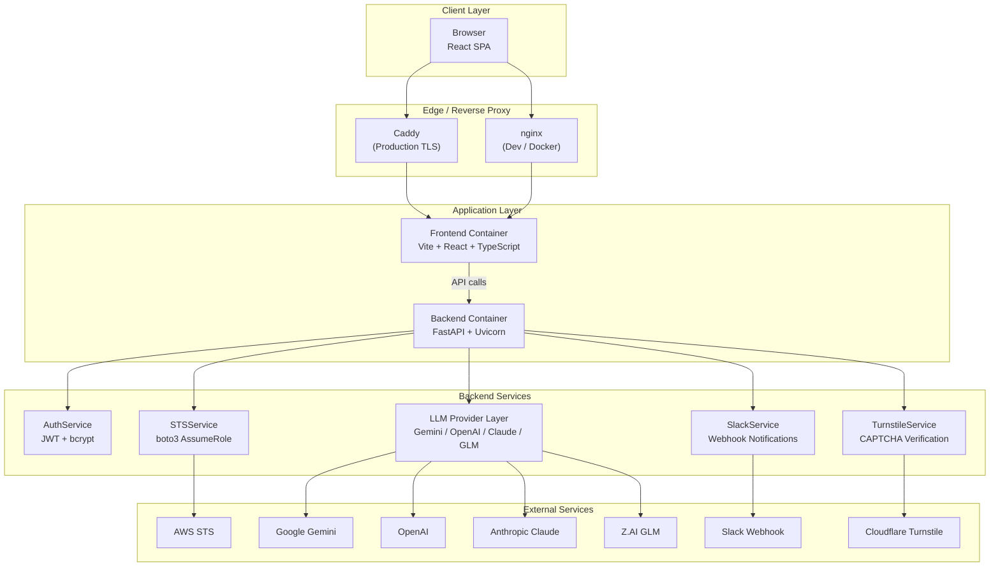
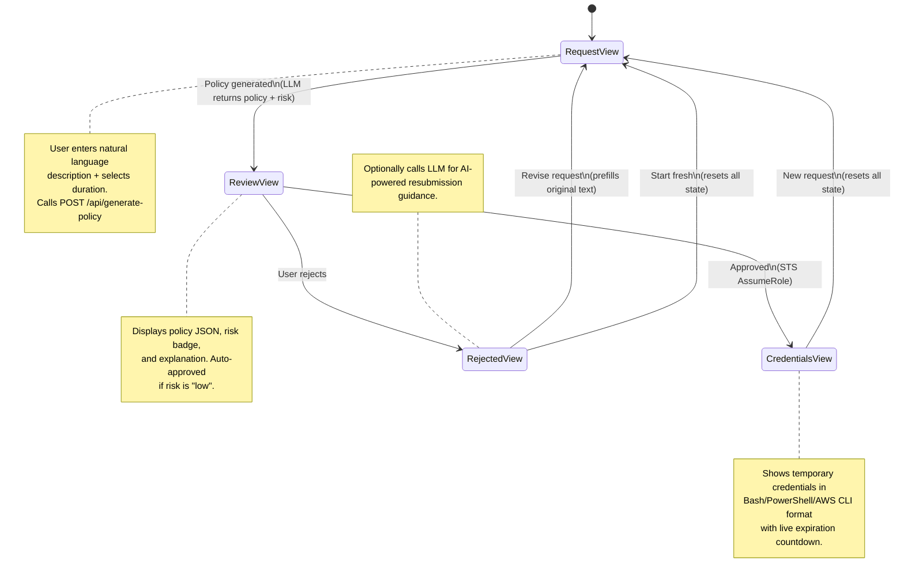
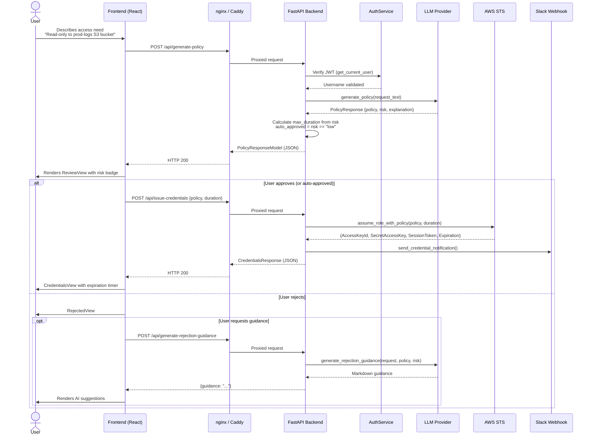
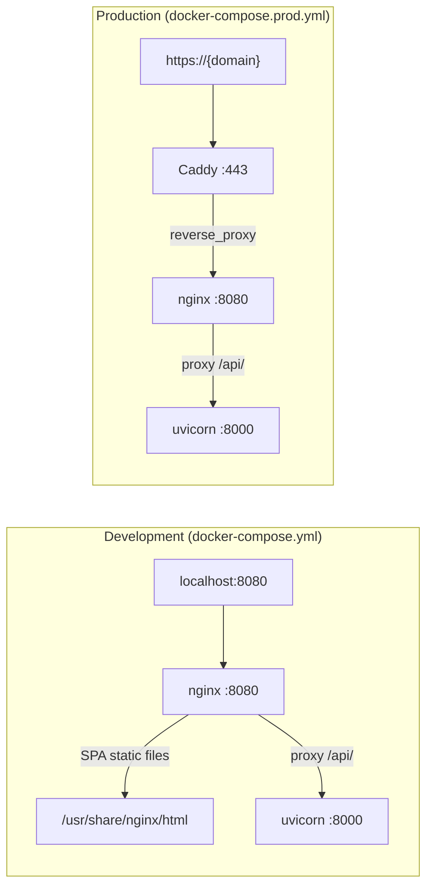

IAM-Dynamic is an **AI-driven Just-In-Time AWS IAM access request portal** — a full-stack web application that translates natural language access requests into least-privilege IAM policies via LLM, then materializes those policies as temporary AWS credentials through STS `AssumeRole`. This page maps the system's layered architecture, its service topology, and the end-to-end journey a request takes from the browser to AWS and back.

Sources: [main.py](backend/main.py#L1-L6), [App.tsx](frontend/src/App.tsx#L1-L35)

## System Architecture at a Glance

The application follows a **three-tier architecture** separated by network boundaries: a React SPA frontend, a Python FastAPI backend, and external service integrations (LLM providers, AWS STS, Slack). In production, a Caddy reverse proxy provides TLS termination; in development, nginx serves the frontend build and proxies API calls to the backend.



Sources: [docker-compose.prod.yml](docker-compose.prod.yml#L1-L84), [docker-compose.yml](docker-compose.yml#L1-L37), [Caddyfile](docker/Caddyfile#L1-L22), [default.conf](docker/default.conf#L1-L82)

## Project Structure

The repository is organized as a monorepo with clearly delineated backend and frontend directories, shared Docker configuration, and infrastructure scripts:

```
IAM-dynamic/
├── backend/                    # FastAPI application
│   ├── main.py                 # App entry point, endpoints, Pydantic models
│   ├── config.py               # Pydantic-validated configuration
│   ├── llm_service.py          # Multi-provider LLM abstraction
│   ├── schemas.py              # Shared type definitions
│   └── services/
│       ├── auth_service.py     # JWT creation/verification
│       ├── turnstile_service.py# Cloudflare CAPTCHA validation
│       ├── sts_service.py      # AWS STS AssumeRole
│       ├── slack_service.py    # Slack webhook notifications
│       └── error_handler.py    # User-facing error transformation
├── frontend/                   # React + TypeScript SPA
│   └── src/
│       ├── App.tsx             # Root component + view state machine
│       ├── lib/api.ts          # Typed HTTP client + auth token mgmt
│       ├── components/         # Shared UI + auth/theme providers
│       ├── views/              # Page-level components (request, review, etc.)
│       └── types/              # TypeScript type definitions
├── docker/                     # Reverse proxy configuration
│   ├── Caddyfile               # Production TLS via Cloudflare DNS challenge
│   ├── nginx.conf              # nginx main config with rate limiting
│   └── default.conf            # Proxy rules + SPA fallback
└── docker-compose*.yml         # Dev and prod container topologies
```

Sources: Project directory analysis

## Configuration Layer

All runtime behavior is controlled through **environment variables** validated at startup by a Pydantic `AppConfig` model. The configuration is partitioned into four concern-specific submodels — **AWS**, **LLM**, **Auth**, and **Slack** — each with its own default values and validation rules. A missing `AUTH_PASSWORD_HASH` disables authentication entirely (returning `"admin"` for all requests), making the local development workflow frictionless without requiring credential setup.

| Config Section | Key Variables | Default | Purpose |
|---|---|---|---|
| **AWSConfig** | `AWS_ACCOUNT_ID`, `AWS_ROLE_NAME` | `AgentPOCSessionRole` | Constructs the role ARN for STS |
| **LLMConfig** | `LLM_PROVIDER`, `*_API_KEY`, `*_MODEL` | `gemini` | Selects and configures the LLM backend |
| **AuthConfig** | `AUTH_PASSWORD_HASH`, `JWT_SECRET` | *(empty → disabled)* | Gates access behind JWT auth |
| **SlackConfig** | `SLACK_WEBHOOK_URL` | `None` | Enables audit notifications |

Sources: [config.py](backend/config.py#L27-L163)

## Frontend View State Machine

The React application implements a **finite state machine** with four discrete views. The `App` component manages global state — the current view, generated policy data, credentials, request text, and selected LLM provider/model — and transitions between views based on user actions and API responses. This state machine ensures a user can never land in an inconsistent state: credentials are only available after approval, and rejection guidance requires prior policy generation.



The `AuthProvider` component wraps the entire application and enforces an **authentication gate**: when `auth_required` is true and no valid JWT is found, the `LoginView` is rendered in place of the main application. Session verification happens on mount via `GET /api/auth/verify`, and a custom DOM event (`auth:logout`) triggers automatic token clearing on any 401 response from the API layer.

Sources: [App.tsx](frontend/src/App.tsx#L26-L181), [auth-provider.tsx](frontend/src/components/auth-provider.tsx#L24-L69), [api.ts](frontend/src/lib/api.ts#L16-L41)

## API Client Layer

The frontend communicates with the backend through a centralized `api` object in `lib/api.ts`. Every request automatically attaches the JWT from `localStorage` as a `Bearer` token. On a 401 response (excluding the login endpoint), the client purges the stored token and dispatches the `auth:logout` event, which cascades through the `AuthProvider` to reset the application's authentication state. Error responses are unwrapped from FastAPI's `{"detail": "..."}` envelope and surfaced as plain `Error` objects to React Query mutations.

| API Method | Endpoint | Trigger |
|---|---|---|
| `api.verifySession()` | `GET /api/auth/verify` | App mount |
| `api.login()` | `POST /api/auth/login` | Login form submit |
| `api.getProviders()` | `GET /config/providers` | Authenticated app load |
| `api.generatePolicy()` | `POST /api/generate-policy` | "Analyze & Generate Policy" button |
| `api.issueCredentials()` | `POST /api/issue-credentials` | "Issue Credentials" button |
| `api.generateRejectionGuidance()` | `POST /api/generate-rejection-guidance` | "Get AI Guidance" button |

Sources: [api.ts](frontend/src/lib/api.ts#L55-L88)

## End-to-End Request Lifecycle

The core value proposition of IAM-Dynamic is the journey from a natural language request to usable AWS credentials. Below is the complete lifecycle, tracing the data flow through every service boundary.



### Step-by-Step Breakdown

**1. Authentication Gate** — Every protected endpoint passes through `Depends(get_current_user)`. When auth is disabled (no `AUTH_PASSWORD_HASH`), this dependency short-circuits and returns `"admin"`. When enabled, it extracts the JWT from the `Authorization: Bearer` header or the `iam_session` cookie, verifies it via `AuthService.verify_token()`, and returns the embedded username. A missing or expired token results in an immediate 401.

**2. Policy Generation** — The `POST /api/generate-policy` endpoint receives the natural language request text, the selected provider/model, and the desired session duration. It instantiates the appropriate `LLMProvider` subclass (determined by `get_llm_provider()`), calls `generate_policy()` which sends the system instruction and user request to the external LLM, and parses the structured JSON response into a `PolicyResponse`. The backend then computes the **risk-based maximum duration** — low risk allows up to 12 hours, critical risk is capped at 1 hour — and determines `auto_approved` status (only `low` risk qualifies).

**3. Credential Issuance** — The `POST /api/issue-credentials` endpoint receives the approved policy document, duration, and optional business justification. It delegates to `STSService.assume_role_with_policy()`, which calls `boto3.client("sts").assume_role()` with the session policy injected via the `Policy` parameter. This scoping mechanism ensures the temporary credentials can only perform the actions defined by the LLM-generated policy. After successful issuance, a Slack notification is dispatched asynchronously for audit trail purposes.

**4. Rejection Guidance** — When a user rejects a policy, the frontend offers an AI-powered resubmission assistant. The `POST /api/generate-rejection-guidance` endpoint sends the original request, rejected policy, and risk level back to the LLM with a dynamically constructed prompt that extracts the specific AWS services from the policy and provides tailored advice.

Sources: [main.py](backend/main.py#L340-L410), [main.py](backend/main.py#L125-L153), [main.py](backend/main.py#L457-L489), [sts_service.py](backend/services/sts_service.py#L42-L98), [llm_service.py](backend/llm_service.py#L222-L233), [llm_service.py](backend/llm_service.py#L237-L254)

## Risk-Based Duration Limits

A central security control in IAM-Dynamic is the **inverse relationship between risk level and maximum credential lifetime**. The LLM assigns a risk score during policy generation, and the backend enforces duration caps that cannot be overridden by the user's slider selection. This ensures that high-privilege or broad-scope policies expire quickly, limiting the blast radius of any misuse.

| Risk Level | Max Duration | Auto-Approved | Typical Scenarios |
|---|---|---|---|
| **Low** | 12 hours | ✅ Yes | Read-only access to specific named resources |
| **Medium** | 4 hours | ❌ No | Write access to non-production resources |
| **High** | 2 hours | ❌ No | Broad permissions, wildcard resources |
| **Critical** | 1 hour | ❌ No | Administrative actions, security-sensitive operations |

Sources: [main.py](backend/main.py#L198-L200), [sts_service.py](backend/services/sts_service.py#L107-L133)

## Infrastructure Topology

The application is containerized with two distinct Docker Compose configurations. Development uses a two-container setup (backend + frontend with nginx), while production adds a Caddy container for automatic TLS via Cloudflare DNS-01 challenge. All containers communicate over a shared `iam-network` bridge network.



The nginx layer performs two critical roles: **serving the SPA's static assets** with cache headers for `/assets/` and SPA fallback for client-side routing, and **proxying API requests** to the backend with rate limiting applied per route. The login endpoint is limited to 5 requests per minute per IP, while general API endpoints allow 30 requests per second with a burst of 20.

Sources: [docker-compose.yml](docker-compose.yml#L1-L37), [docker-compose.prod.yml](docker-compose.prod.yml#L1-L84), [nginx.conf](docker/nginx.conf#L38-L40), [default.conf](docker/default.conf#L16-L48)

## Error Handling Strategy

The backend implements a **two-tier error handling model**. Internal exceptions from LLM providers are caught and transformed into `UserFacingError` instances by the `handle_llm_error()` function, which pattern-matches against error type, module, and message content to produce actionable guidance with markdown formatting (API key instructions, rate limit suggestions, model availability lists). These are then raised as HTTP 400 responses. Unrecognized exceptions fall through to a generic 500 response with no internal detail leakage. The frontend renders these markdown-formatted error messages using `ReactMarkdown`.

Sources: [error_handler.py](backend/services/error_handler.py#L1-L219), [main.py](backend/main.py#L370-L383), [request-view.tsx](frontend/src/views/request-view.tsx#L109-L119)

## Suggested Reading Path

This overview establishes the architectural foundation. To explore each layer in depth, follow this progression:

1. **[FastAPI Application Entry Point and API Endpoints](6-fastapi-application-entry-point-and-api-endpoints)** — Every endpoint's request/response contract and middleware chain
2. **[Multi-Provider LLM Service Layer](7-multi-provider-llm-service-layer)** — How the abstract provider pattern abstracts four AI backends
3. **[AWS STS Credential Issuance and Risk-Based Duration Limits](9-aws-sts-credential-issuance-and-risk-based-duration-limits)** — The STS interaction model and security duration calculus
4. **[JWT Authentication and Cloudflare Turnstile CAPTCHA](11-jwt-authentication-and-cloudflare-turnstile-captcha)** — Auth flow from login to token verification
5. **[React App State Machine and View Routing](15-react-app-state-machine-and-view-routing)** — Frontend state transitions in detail
6. **[Docker Architecture: Development vs Production Topology](23-docker-architecture-development-vs-production-topology)** — Container networking and deployment patterns