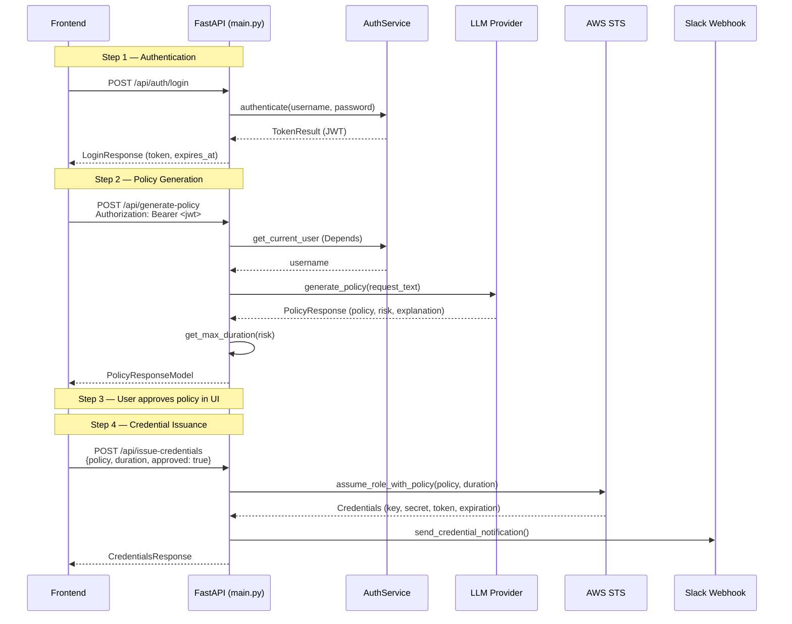

The `backend/main.py` file is the **single entry point** for the entire IAM-Dynamic backend — a FastAPI application that wires together five domain services (STS, Slack, Auth, Turnstile, and the multi-provider LLM layer) behind a RESTful API surface of seven endpoints. This page dissects how the application bootstraps at startup, how authentication guards flow through a `Depends` chain, and how each endpoint orchestrates service calls to fulfill the Just-In-Time access request lifecycle.

Sources: [main.py](backend/main.py#L1-L6)

## Application Bootstrap and Service Initialization

The module executes its setup in three sequential phases at import time, before any request is ever handled. Understanding this ordering matters because each phase depends on the output of the previous one:

**Phase 1 — Environment & Configuration.** `dotenv` loads `.env` from the repository root (one directory above `backend/`). Then `load_config()` parses environment variables into a validated `AppConfig` Pydantic model that groups settings into four sub-sections: `AWSConfig`, `LLMConfig`, `AuthConfig`, and `SlackConfig`. If any required field is missing or malformed, the application exits immediately with a validation error — there is no "partially configured" state.

Sources: [main.py](backend/main.py#L19-L36), [config.py](backend/config.py#L107-L158)

**Phase 2 — Core Services.** Two services are instantiated unconditionally: `STSService` (wrapping `boto3.client("sts")`) and `SlackService` (wrapping an optional webhook URL). Both are created with constructor arguments derived directly from `config`.

**Phase 3 — Optional Auth Services.** The `AuthService` and `TurnstileService` follow a **conditional initialization** pattern — they are only created when `config.auth.enabled` evaluates to `True` (i.e., when `AUTH_PASSWORD_HASH` is set in the environment). When auth is disabled, `auth_service` remains `None`, and the `get_current_user` dependency short-circuits by returning `"admin"` for all requests. This preserves the zero-config local development experience while enforcing real authentication in production.

```
┌─────────────────────────────────────────────────────────────────┐
│                    Startup Initialization Flow                   │
├─────────────────────────────────────────────────────────────────┤
│                                                                 │
│  .env ──► load_dotenv() ──► load_config() ──► AppConfig         │
│                                                  │              │
│         ┌────────────────────────────────────────┘              │
│         │                                                       │
│         ▼                                                       │
│  ┌─── Unconditional ───┐   ┌── Conditional (auth.enabled) ──┐  │
│  │  STSService(role_arn)│   │  AuthService(username, hash,   │  │
│  │  SlackService(url)   │   │    jwt_secret, expiry)         │  │
│  └──────────────────────┘   │  TurnstileService(secret_key)  │  │
│                              └────────────────────────────────┘  │
└─────────────────────────────────────────────────────────────────┘
```

Sources: [main.py](backend/main.py#L38-L55)

### Lifespan Context Manager

The application uses FastAPI's `lifespan` async context manager pattern (the modern replacement for deprecated `on_startup`/`on_shutdown` events). Currently it logs startup and shutdown messages, but the pattern exists to accommodate future resource lifecycle management — for example, initializing async database connection pools or gracefully draining in-flight requests.

Sources: [main.py](backend/main.py#L158-L163)

### CORS Configuration

CORS origins are built from two sources: a **static allowlist** of common local development origins (`localhost:3000`, `localhost:5173`, etc.), and a **dynamic production origin** derived from the `CADDY_DOMAIN` environment variable. When set, `https://{CADDY_DOMAIN}` is appended to the list. Credentials, all methods, and all headers are permitted — appropriate for an internal tool behind a corporate VPN or Cloudflare Access, but worth noting if the application were ever exposed to the public internet.

Sources: [main.py](backend/main.py#L175-L193)

## Authentication Dependency Injection

FastAPI's `Depends()` mechanism is used to enforce authentication on protected endpoints without scattering token-extraction logic across every route handler. The dependency chain works as follows:

1. **`_extract_token(request)`** — A plain function (not a dependency itself) that checks the `Authorization: Bearer <token>` header first, then falls back to an `iam_session` cookie. This dual-source design supports both API-only clients and browser-based sessions.

2. **`get_current_user(request)`** — The actual `Depends` target. When `auth_service is None`, it returns `"admin"` immediately (dev mode). Otherwise, it extracts the token, calls `auth_service.verify_token()`, and either returns the username or raises `HTTP 401`.

Every protected endpoint declares `_user: str = Depends(get_current_user)` in its signature. The underscore prefix on `_user` signals that the parameter is consumed by the dependency system rather than the handler body, though the username is available if needed for audit logging.

Sources: [main.py](backend/main.py#L127-L153)

## API Endpoint Reference

The table below summarizes all seven endpoints, their HTTP methods, authentication requirements, and roles in the request lifecycle:

| Method | Path | Auth Required | Purpose |
|--------|------|:---:|---------|
| `GET` | `/` | No | API metadata and link to Swagger docs |
| `GET` | `/health` | No | Liveness probe for Docker/load balancer |
| `POST` | `/api/auth/login` | No | Exchange credentials for JWT |
| `GET` | `/api/auth/verify` | No | Check if current token/session is valid |
| `GET` | `/config/providers` | Yes | List available LLM providers and models |
| `POST` | `/api/generate-policy` | Yes | Generate IAM policy from natural language |
| `POST` | `/api/issue-credentials` | Yes | Issue temporary AWS credentials via STS |
| `POST` | `/api/generate-rejection-guidance` | Yes | AI guidance for rejected requests |

Sources: [main.py](backend/main.py#L248-L501)

## Unauthenticated Endpoints

### Root — `GET /`

Returns a static JSON object with the application name, version, and links to the interactive API documentation (`/docs`) and health check. This endpoint exists primarily for browser-based discovery and as a sanity check during deployment.

```json
{
  "message": "IAM-Dynamic API",
  "version": "1.0.0",
  "docs": "/docs",
  "health": "/health"
}
```

Sources: [main.py](backend/main.py#L492-L500)

### Health Check — `GET /health`

A lightweight liveness probe that returns the current UTC timestamp alongside a `"healthy"` status string. This endpoint is designed to be called by Docker's `HEALTHCHECK` directive or by load balancer health checks — it does not verify downstream service connectivity (STS, LLM providers, Slack).

```json
{
  "status": "healthy",
  "version": "1.0.0",
  "timestamp": "2025-07-11T14:30:00.000000+00:00"
}
```

Sources: [main.py](backend/main.py#L248-L255)

### Login — `POST /api/auth/login`

Authenticates a user and returns a JWT. The endpoint is gated by a **conditional availability** pattern: if `auth_service is None` (authentication not configured), it returns `HTTP 404` with the message `"Authentication is not enabled"`. This prevents the frontend from even attempting login when auth is disabled.

The login flow has two verification stages:

1. **Turnstile CAPTCHA verification** — The request's `turnstile_token` is validated against Cloudflare's siteverify API using the client's IP address (extracted from `x-real-ip` header, falling back to the direct connection host). If Turnstile is not configured (`TURNSTILE_SECRET_KEY` absent), verification is skipped and always passes.

2. **Credential verification** — `auth_service.authenticate()` performs a constant-time bcrypt comparison (preventing timing-based username enumeration) and returns a `TokenResult` containing the signed JWT and its expiration timestamp.

**Request body** (`LoginRequest`):

| Field | Type | Required | Description |
|-------|------|:---:|-------------|
| `username` | `str` | Yes | Admin username |
| `password` | `str` | Yes | Plaintext password |
| `turnstile_token` | `str` | No | Cloudflare Turnstile CAPTCHA token |

**Response body** (`LoginResponse`):

| Field | Type | Description |
|-------|------|-------------|
| `token` | `str` | Signed JWT (HS256) |
| `expires_at` | `str` | ISO 8601 expiration timestamp |
| `username` | `str` | Confirmed username |

Sources: [main.py](backend/main.py#L104-L116), [main.py](backend/main.py#L260-L279)

### Verify Auth — `GET /api/auth/verify`

A read-only endpoint that the frontend polls to determine the current session state. It returns an `AuthStatusResponse` with three fields that together tell the client everything it needs to know:

| Field | Type | Behavior |
|-------|------|----------|
| `authenticated` | `bool` | `True` if a valid token was found (or auth is disabled) |
| `username` | `str \| null` | The decoded username, or `null` if unauthenticated |
| `auth_required` | `bool` | `False` when `AUTH_PASSWORD_HASH` is not set — signals the frontend to skip the login screen entirely |

When auth is disabled, the endpoint returns `{authenticated: true, username: "admin", auth_required: false}` without checking any tokens, allowing the frontend to proceed directly to the main application.

Sources: [main.py](backend/main.py#L118-L123), [main.py](backend/main.py#L282-L296)

## Protected Endpoints

All endpoints in this section require a valid JWT passed via the `get_current_user` dependency. When authentication is disabled (no `AUTH_PASSWORD_HASH`), the dependency returns `"admin"` automatically, so these endpoints remain fully functional for local development.

### Provider Configuration — `GET /config/providers`

Returns the subset of LLM providers that have API keys configured in the environment. The endpoint iterates over four potential providers (Gemini, OpenAI, Claude, Zhipu) and only includes those whose API key fields in `config.llm` are non-null. Each provider entry contains its ID, display name, default model, and a list of available models with human-readable names.

The `PROVIDER_MODELS` dictionary at module level maps provider IDs to their available model catalogs — this is a static registry updated separately from the dynamic configuration. The response also includes the AWS account ID and the currently configured default provider.

**Response shape:**

```json
{
  "providers": [
    {
      "id": "gemini",
      "name": "Google Gemini",
      "model": "gemini-3.1-pro-preview",
      "models": [
        {"id": "gemini-3.1-pro-preview", "name": "Gemini 3.1 Pro"},
        {"id": "gemini-3-flash-preview", "name": "Gemini 3 Flash"}
      ]
    }
  ],
  "account_id": "123456789012",
  "current_provider": "gemini"
}
```

Sources: [main.py](backend/main.py#L203-L229), [main.py](backend/main.py#L301-L337)

### Policy Generation — `POST /api/generate-policy`

This is the **primary endpoint** of the application — it accepts a natural language description of AWS access needs and returns a complete IAM policy with risk assessment. The orchestration logic follows this sequence:

1. **Resolve LLM provider** — `get_llm_provider(request.provider, request.model)` returns the appropriate provider implementation, optionally overriding the default model.
2. **Generate policy** — The provider's `generate_policy()` method sends the user's `request_text` to the configured LLM and parses the structured response.
3. **Calculate duration cap** — `get_max_duration()` maps the risk level to a maximum session duration using the table below.
4. **Determine auto-approval** — Low-risk policies are automatically approved; all others require manual review.

**Risk-to-duration mapping:**

| Risk Level | Max Duration | Auto-Approved |
|:----------:|:------------:|:-------------:|
| `low` | 12 hours | ✓ |
| `medium` | 4 hours | ✗ |
| `high` | 2 hours | ✗ |
| `critical` | 1 hour | ✗ |

**Request body** (`PolicyRequest`):

| Field | Type | Required | Constraints | Default | Description |
|-------|------|:---:|-------------|---------|-------------|
| `request_text` | `str` | Yes | `min_length=10` | — | Natural language access description |
| `provider` | `str` | No | — | `"gemini"` | LLM provider to use |
| `model` | `str` | No | — | Provider default | Specific model override |
| `duration` | `int` | No | `1–12` | `2` | Requested session hours |
| `change_case` | `str` | No | — | `null` | Business justification for high-risk |

**Response body** (`PolicyResponseModel`):

| Field | Type | Description |
|-------|------|-------------|
| `policy` | `dict` | Generated IAM policy document |
| `risk` | `str` | Risk level: `low`, `medium`, `high`, or `critical` |
| `explanation` | `str` | Human-readable risk rationale |
| `approver_note` | `str` | Note for manual approvers |
| `auto_approved` | `bool` | Whether the request bypasses manual review |
| `max_duration` | `int` | Capped duration in hours based on risk |

**Error handling** follows a two-tier strategy: `UserFacingError` exceptions (produced by the LLM service layer's error handler) are caught and returned as `HTTP 400` with actionable markdown-formatted messages; all other exceptions result in `HTTP 500` with a generic message, while the full traceback is logged server-side.

Sources: [main.py](backend/main.py#L60-L76), [main.py](backend/main.py#L198-L200), [main.py](backend/main.py#L340-L383)

### Credential Issuance — `POST /api/issue-credentials`

Converts an approved policy into temporary AWS credentials via STS `AssumeRole`. This endpoint is called only after the user (or an approver) has explicitly accepted the policy in the frontend's Review step.

The endpoint performs two side effects:

1. **STS AssumeRole** — `sts_service.assume_role_with_policy()` calls the AWS STS API with the session policy JSON embedded directly in the `Policy` parameter of `AssumeRole`. The resulting credentials inherit the intersection of the role's identity-based policies and the scoped session policy.
2. **Slack notification** — `send_slack_notification()` dispatches an audit message to the configured Slack webhook. This call is fire-and-forget: failures are logged but do not affect the response.

**Request body** (`IssueCredentialsRequest`):

| Field | Type | Required | Constraints | Default | Description |
|-------|------|:---:|-------------|---------|-------------|
| `policy` | `dict` | Yes | — | — | IAM policy document to scope the session |
| `duration` | `int` | Yes | `1–12` | — | Session duration in hours |
| `approved` | `bool` | No | — | `false` | Whether explicitly approved |
| `approver` | `str` | No | — | `null` | Approver identifier |
| `change_case` | `str` | No | — | `null` | Business justification |

**Response body** (`CredentialsResponse`):

| Field | Type | Description |
|-------|------|-------------|
| `access_key_id` | `str` | Temporary AWS access key |
| `secret_access_key` | `str` | Temporary AWS secret key |
| `session_token` | `str` | STS session token |
| `expiration` | `str` | ISO 8601 expiration timestamp |
| `region` | `str` | Always `"us-east-1"` |

When the STS call fails (e.g., invalid role ARN, trust policy misconfiguration), the endpoint returns `HTTP 503` with a detailed markdown-formatted error message that includes the expected role ARN and step-by-step remediation instructions — a deliberate design choice to surface infrastructure issues directly to operators rather than hiding them behind generic error messages.

Sources: [main.py](backend/main.py#L79-L94), [main.py](backend/main.py#L386-L440)

### Rejection Guidance — `POST /api/generate-rejection-guidance`

When a generated policy is rejected by the user (due to high risk or insufficient scoping), this endpoint uses the same LLM to produce **personalized resubmission guidance**. It sends the original request text, the rejected policy JSON, and the risk level to the LLM provider, which responds with structured markdown containing specific issues, a rewritten request suggestion, actionable tips, and a "bad vs. good" comparison tailored to the AWS services in the policy.

**Request body** (`RejectionGuidanceRequest`):

| Field | Type | Required | Description |
|-------|------|:---:|-------------|
| `original_request` | `str` | Yes | The user's initial natural language request |
| `policy` | `dict` | Yes | The rejected IAM policy document |
| `risk` | `str` | Yes | Risk level that caused rejection |
| `provider` | `str` | No | LLM provider (default: `"gemini"`) |
| `model` | `str` | No | Model override |

**Response body** (`RejectionGuidanceResponse`):

| Field | Type | Description |
|-------|------|-------------|
| `guidance` | `str` | Markdown-formatted AI guidance |

Sources: [main.py](backend/main.py#L443-L489)

## Request Lifecycle Diagram

The following diagram traces a complete happy-path request through the system, from the user's natural language input to the final credential delivery:



Sources: [main.py](backend/main.py#L246-L441)

## Pydantic Models Defined Inline

All request and response models are defined directly in `main.py` using Pydantic's `BaseModel` rather than imported from [schemas.py](backend/schemas.py). This is a deliberate architectural choice: `schemas.py` contains **internal dataclasses** used for inter-service communication (`RequestData`, `CredentialData`, `AuditEvent`, `PolicyStats`), while the inline models in `main.py` serve as the **API contract layer** — they define exactly what crosses the HTTP boundary. Keeping them co-located with their endpoints makes it straightforward to see the input/output contract at a glance without jumping between files.

The key distinction is validation scope: Pydantic models in `main.py` enforce HTTP-level constraints (`min_length`, `ge`, `le`), while `schemas.py` dataclasses carry validated data through the service layer without re-validation overhead.

Sources: [main.py](backend/main.py#L58-L123), [schemas.py](backend/schemas.py#L1-L130)

## Error Handling Pattern at the Endpoint Layer

Every protected endpoint follows the same two-tier `try/except` pattern:

```python
try:
    # Business logic
except UserFacingError as e:
    logger.error(f"... (user-facing): {e.log_message}")
    raise HTTPException(status_code=400, detail=e.user_message)
except Exception as e:
    logger.error(f"... : {e}", exc_info=True)
    raise HTTPException(status_code=500, detail="Generic fallback message")
```

The `UserFacingError` exception carries two messages: `log_message` (technical, for server logs) and `user_message` (actionable, often markdown-formatted, for the client). The generic catch-all ensures that unexpected errors never leak stack traces or internal details to the client. The `issue-credentials` endpoint extends this pattern with a third tier for `STSAssumeRoleError`, which maps to `HTTP 503` with remediation instructions.

Sources: [main.py](backend/main.py#L371-L383), [main.py](backend/main.py#L414-L440), [error_handler.py](backend/services/error_handler.py#L13-L19)

## What Comes Next

With the endpoint surface now mapped, the following pages dive into the service implementations that power each endpoint:

- **[Multi-Provider LLM Service Layer](7-multi-provider-llm-service-layer)** — How `get_llm_provider()` dispatches to provider-specific implementations and how `PolicyResponse` is parsed from LLM output.
- **[AWS STS Credential Issuance and Risk-Based Duration Limits](9-aws-sts-credential-issuance-and-risk-based-duration-limits)** — The STS AssumeRole call, session policy injection, and duration validation logic.
- **[JWT Authentication and Cloudflare Turnstile CAPTCHA](11-jwt-authentication-and-cloudflare-turnstile-captcha)** — The full auth flow including bcrypt hashing, JWT signing, and CAPTCHA verification.
- **[Data Schemas and Type Definitions](14-data-schemas-and-type-definitions)** — The `schemas.py` dataclasses that carry data between services.