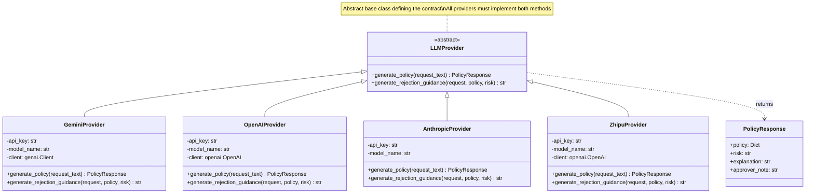
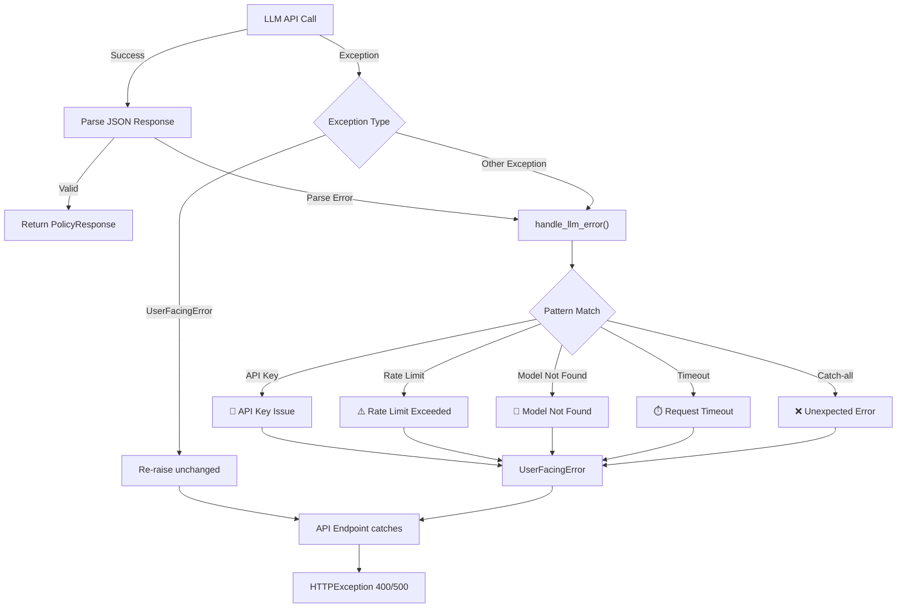

The Multi-Provider LLM Service Layer is the intelligence core of IAM-Dynamic — the subsystem responsible for translating natural language access requests into structured, least-privilege AWS IAM policies and for generating contextual guidance when requests are rejected. It implements a **Strategy pattern** through an abstract `LLMProvider` base class with four concrete provider implementations (Google Gemini, OpenAI, Anthropic Claude, and Zhipu GLM), enabling runtime provider selection and model hot-swapping without code changes. The factory function `get_llm_provider()` wires provider resolution to both the `LLM_PROVIDER` environment variable and per-request overrides from the frontend, so an administrator can change the default provider globally while end-users can select any provider at query time.
Sources: [llm_service.py](backend/llm_service.py#L1-L15), [main.py](backend/main.py#L340-L353)

## Architecture Overview

The service layer occupies a specific position in the request lifecycle: it sits between the API endpoint handlers (which handle authentication and HTTP semantics) and the downstream STS credential issuance (which acts on the generated policy). Every policy generation request flows through the same three-step pipeline regardless of which provider is selected — the factory instantiates the correct provider, the provider calls its specific LLM API, and the raw JSON response is normalized into a `PolicyResponse` object. This architecture means adding a new provider requires only implementing the `LLMProvider` interface and registering the provider alias in the factory — no changes to the API layer or frontend are needed.



The `PolicyResponse` class acts as the normalization layer — every provider, regardless of its underlying API's response format, must decompose the LLM output into the same four fields. The API endpoint then wraps this into a `PolicyResponseModel` (a Pydantic model defined in `main.py`) that adds `auto_approved` and `max_duration` computed fields before serialization to the frontend.
Sources: [llm_service.py](backend/llm_service.py#L205-L234), [main.py](backend/main.py#L340-L369)

## Provider Selection and Factory Resolution

The `get_llm_provider()` function is the single entry point for obtaining a provider instance. It accepts two optional parameters — `provider_type` and `model` — enabling two levels of override. When no `provider_type` is supplied, it falls back to the `LLM_PROVIDER` environment variable (defaulting to `"gemini"`). The `model` parameter, when provided, directly overwrites the provider's `model_name` attribute after instantiation, giving the frontend the ability to select specific models within a provider family without restarting the backend.

| Provider Type Alias | Environment Key | Default Model | SDK |
|---|---|---|---|
| `gemini` | `GOOGLE_API_KEY` | `gemini-3.1-pro-preview` | `google-genai` (or deprecated `google.generativeai`) |
| `openai` | `OPENAI_API_KEY` | `gpt-5.4` | `openai` |
| `anthropic`, `claude` | `ANTHROPIC_API_KEY` | `claude-opus-4-6` | `anthropic` |
| `zhipu`, `glm` | `ZAI_API_KEY` | `glm-5.1` | `openai` (compatible API via `api.z.ai`) |

Note that Anthropic and Zhipu each accept two aliases (`anthropic`/`claude` and `zhipu`/`glm`), providing flexibility in both environment variable configuration and frontend provider identifiers. If an unrecognized provider name is passed, the factory logs a warning and falls back to `GeminiProvider`.
Sources: [llm_service.py](backend/llm_service.py#L608-L647), [config.py](backend/config.py#L38-L66)

## Provider Implementations

Each provider implementation follows the same contract but differs in SDK usage, response parsing, and error handling due to the idiosyncrasies of their respective APIs. Understanding these differences is essential when debugging provider-specific issues or extending the service layer.

### Google Gemini Provider

The `GeminiProvider` is the most complex provider because it maintains **backward compatibility** with two generations of the Google AI SDK. At import time, the module attempts to import `google.genai` (the current package) and falls back to `google.generativeai` (deprecated), setting a `GOOGLE_GENAI_NEW` flag that governs API call structure throughout the provider. When using the new SDK, the provider initializes a `genai.Client` and calls `client.models.generate_content()` with a structured `GenerateContentConfig` that enforces `response_mime_type="application/json"` — this instructs the model to output raw JSON without markdown wrapping. The legacy path uses `genai.configure()` followed by a `GenerativeModel` with `generation_config` dict, using a chat-based message flow. Both paths converge on `json.loads(response.text)` for parsing.
Sources: [llm_service.py](backend/llm_service.py#L22-L37), [llm_service.py](backend/llm_service.py#L257-L338)

### OpenAI Provider

The `OpenAIProvider` uses the standard `openai` Python SDK. It constructs an `openai.OpenAI` client at initialization and leverages OpenAI's native JSON mode via `response_format={"type": "json_object"}` in the `chat.completions.create()` call. This provider embeds the system instruction directly within the user prompt (as a combined preamble) rather than as a separate `system` message, and sets a low `temperature=0.2` to minimize randomness in policy generation. If the API key is not configured, the provider raises a `UserFacingError` immediately with a formatted message including a direct link to the OpenAI API key page.
Sources: [llm_service.py](backend/llm_service.py#L341-L425)

### Anthropic Claude Provider

The `AnthropicProvider` uses the `anthropic` SDK and takes a unique approach to response parsing. Claude models frequently wrap JSON output in markdown code blocks (`` ```json ... ``` ``), so this provider includes explicit **markdown stripping logic** that detects and removes code block delimiters before attempting `json.loads()`. Unlike the OpenAI provider, Claude receives `SYSTEM_INSTRUCTION` as a proper `system` parameter (which Anthropic's API handles natively) and the user request as a separate `messages` parameter, maintaining a cleaner prompt structure. The client is instantiated per-request (`anthropic.Anthropic(api_key=...)`) rather than being cached as an instance variable.
Sources: [llm_service.py](backend/llm_service.py#L428-L509)

### Zhipu GLM Provider

The `ZhipuProvider` uses the **OpenAI-compatible API** exposed by Zhipu's global platform at `api.z.ai`. It instantiates an `openai.OpenAI` client with a custom `base_url` pointing to Zhipu's endpoint, which means it can reuse the OpenAI SDK's chat completion interface without any Zhipu-specific library. This provider sends both a `system` message (the `SYSTEM_INSTRUCTION`) and a `user` message, and enables `response_format={"type": "json_object"}` to enforce structured output — mirroring the OpenAI provider's approach but routed through a different endpoint.
Sources: [llm_service.py](backend/llm_service.py#L512-L605)

## Core Operations

The service layer exposes exactly two operations through the `LLMProvider` interface, each serving a distinct phase of the IAM request lifecycle.

### Policy Generation

The `generate_policy()` method is the primary operation. It accepts a natural language request string, sends it to the configured LLM along with the `SYSTEM_INSTRUCTION` prompt, and returns a `PolicyResponse` containing the IAM policy JSON, a risk score (`low`, `medium`, `high`, or `critical`), a human-readable explanation, and an approver note. The system instruction enforces least-privilege generation rules — prohibiting wildcards on sensitive actions, requiring resource ARN specificity, and defaulting to read-only for vague requests. All providers are expected to return raw JSON (enforced either via API-level JSON mode or explicit prompting), which is parsed into the `PolicyResponse` data class. On the API side, the `/api/generate-policy` endpoint receives the provider and model from the frontend, resolves the provider via the factory, and augments the response with computed `auto_approved` (true when risk is `"low"`) and `max_duration` (capped based on risk level) fields.
Sources: [llm_service.py](backend/llm_service.py#L236-L254), [llm_service.py](backend/llm_service.py#L281-L317), [main.py](backend/main.py#L340-L383)

### Rejection Guidance Generation

The `generate_rejection_guidance()` method is invoked when an approver rejects a policy. It takes the original request text, the generated policy JSON, and the risk level, then constructs a **dynamically tailored prompt** via the `_build_rejection_guidance_prompt()` helper function. This function first calls `_extract_services_from_policy()` to identify the specific AWS services referenced in the policy's `Action` statements, using the `AWS_SERVICE_NAMES` mapping dictionary to convert service prefixes (e.g., `"s3"` → `"Amazon S3"`, `"dynamodb"` → `"Amazon DynamoDB"`) into human-readable names. The resulting prompt instructs the LLM to provide service-specific issue identification, a rewritten request suggestion, actionable scoping tips, and a bad-vs-good example — all contextualized to the actual services in the rejected policy rather than generic advice. The guidance is consumed by the `/api/generate-rejection-guidance` endpoint and rendered in the frontend's rejected view.
Sources: [llm_service.py](backend/llm_service.py#L59-L128), [llm_service.py](backend/llm_service.py#L131-L202), [main.py](backend/main.py#L457-L489)

## Error Handling Strategy

The service layer implements a **two-tier error handling** strategy designed to prevent raw API errors from leaking to end users. Each provider wraps its core logic in a `try/except` block that catches `UserFacingError` (re-raising it unchanged) and all other exceptions (routing them through `handle_llm_error()` from the error handler service). This function performs string-based pattern matching on the exception message and type to categorize errors into four common categories — API key issues, rate limiting/quota exhaustion, model-not-found errors, and connectivity timeouts — returning a `UserFacingError` with markdown-formatted guidance that includes actionable steps and relevant links. If no pattern matches, a catch-all handler returns a generic error message with the exception type name for debugging. The API endpoint layer catches `UserFacingError` and converts it to an `HTTPException` with a `400` status code, while truly unexpected errors receive a `500` status with a sanitized message.
Sources: [llm_service.py](backend/llm_service.py#L314-L317), [services/error_handler.py](backend/services/error_handler.py#L22-L218), [main.py](backend/main.py#L371-L383)



## Provider Discovery and Frontend Integration

The `/config/providers` endpoint enables the frontend to dynamically discover which providers are available based on which API keys are configured in the environment. It iterates over the four possible providers and includes each one in the response only if its corresponding API key is present in the `LLMConfig`. Each provider entry includes the provider's ID, display name, configured default model, and a full list of available models from the `PROVIDER_MODELS` dictionary. This means the sidebar's provider/model selector populates entirely from server-side configuration — no frontend hardcoding of provider lists is required.
Sources: [main.py](backend/main.py#L204-L337), [config.py](backend/config.py#L38-L66)

## Configuration Reference

All provider configuration flows through the `LLMConfig` Pydantic model in the configuration system. The `provider` field accepts a string validated against the set `{"gemini", "openai", "anthropic", "claude", "zhipu", "glm"}`, with unknown values defaulting to `"gemini"` and logging a warning. Each provider has a dedicated API key field (optional, validated as `Optional[str]`) and a model name field with a sensible default. The following table documents every environment variable that controls the LLM service layer:

| Variable | Default | Description |
|---|---|---|
| `LLM_PROVIDER` | `gemini` | Active provider alias; determines which provider the factory returns |
| `GOOGLE_API_KEY` | *(none)* | Google AI Studio API key for Gemini models |
| `GEMINI_MODEL` | `gemini-3.1-pro-preview` | Model identifier for Gemini provider |
| `OPENAI_API_KEY` | *(none)* | OpenAI Platform API key |
| `OPENAI_MODEL` | `gpt-5.4` | Model identifier for OpenAI provider |
| `ANTHROPIC_API_KEY` | *(none)* | Anthropic Console API key |
| `ANTHROPIC_MODEL` | `claude-opus-4-6` | Model identifier for Anthropic provider |
| `ZAI_API_KEY` | *(none)* | Z.AI global platform API key |
| `ZAI_MODEL` | `glm-5.1` | Model identifier for Zhipu/GLM provider |
Sources: [config.py](backend/config.py#L38-L66), [.env.example](.env.example#L1-L28)

## Available Models per Provider

The `PROVIDER_MODELS` dictionary in `main.py` defines the model catalogue exposed to the frontend. These are the models users can select from the sidebar's model dropdown after choosing a provider:

| Provider | Model ID | Display Name |
|---|---|---|
| Google Gemini | `gemini-3.1-pro-preview` | Gemini 3.1 Pro |
| | `gemini-3-flash-preview` | Gemini 3 Flash |
| | `gemini-3.1-flash-lite-preview` | Gemini 3.1 Flash Lite |
| OpenAI | `gpt-5.4` | GPT-5.4 |
| | `gpt-5-mini-2025-08-07` | GPT-5 Mini |
| | `gpt-4o` | GPT-4o |
| | `gpt-4o-mini` | GPT-4o Mini |
| | `o1-preview` | o1-preview |
| Anthropic Claude | `claude-opus-4-6` | Claude Opus 4.6 |
| | `claude-sonnet-4-6` | Claude Sonnet 4.6 |
| | `claude-opus-4-5` | Claude Opus 4.5 |
| | `claude-sonnet-4-5` | Claude Sonnet 4.5 |
| Zhipu GLM | `glm-5.1` | GLM-5.1 |
| | `glm-5` | GLM-5 |
| | `glm-4.7` | GLM-4.7 |
| | `glm-4.7-flash` | GLM-4.7 Flash |
Sources: [main.py](backend/main.py#L204-L229)

---

**Next Reading**: The LLM service layer produces policies governed by the system prompt and its least-privilege rules. To understand how those prompts are structured and what guardrails constrain model output, see [IAM Policy Generation Prompt Engineering and Guardrails](8-iam-policy-generation-prompt-engineering-and-guardrails). For the downstream consumer of generated policies, see [AWS STS Credential Issuance and Risk-Based Duration Limits](9-aws-sts-credential-issuance-and-risk-based-duration-limits). For the configuration model that supplies provider keys and defaults, see [Configuration System with Pydantic Validation](10-configuration-system-with-pydantic-validation).