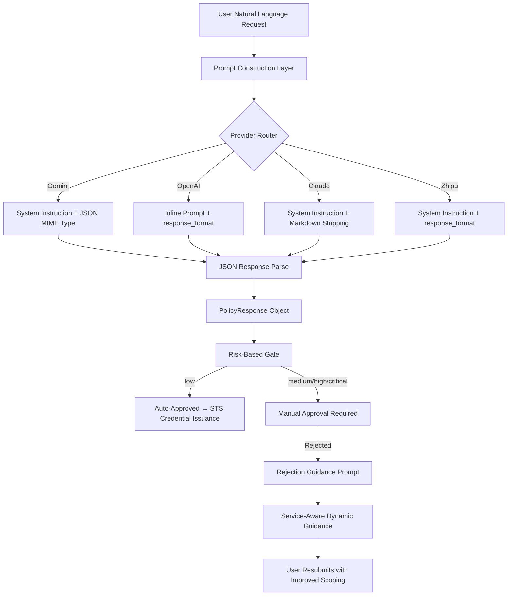

The IAM-Dynamic platform transforms natural language access requests into **least-privilege IAM policies** through a carefully engineered multi-layer prompt architecture. This page dissects the prompt engineering strategies, structured output enforcement mechanisms, and risk-scoring guardrails that ensure every generated policy is both functional and secure — regardless of which LLM provider processes the request. The system supports four providers (Google Gemini, OpenAI, Anthropic Claude, and Zhipu GLM), each with provider-specific prompt adaptations that converge on an identical output contract.

## Architectural Overview: The Prompt-to-Policy Pipeline

The prompt engineering system operates as a three-stage pipeline: **prompt construction** → **structured generation** → **response validation and risk gating**. Each stage applies progressively stricter constraints, transforming free-form natural language into a deterministic, risk-assessed IAM policy document.



The **Prompt Construction Layer** is where the architectural differentiation between providers becomes most visible. Gemini and Claude receive the `SYSTEM_INSTRUCTION` as a dedicated system message, while OpenAI and Zhipu embed security constraints directly into the user prompt. All providers, however, must produce the same JSON schema containing four fields: `policy`, `risk_score`, `explanation`, and `approver_note`.

Sources: [llm_service.py](backend/llm_service.py#L236-L254), [main.py](backend/main.py#L340-L369)

## The Core System Instruction

The central prompt that governs policy generation behavior is defined as `SYSTEM_INSTRUCTION` — a compact, rule-based directive that establishes the LLM's persona as a **highly secure AWS IAM Policy Agent**. The instruction has three distinct sections that together enforce least-privilege behavior:

**Output Format Enforcement** dictates an exact JSON schema with four required fields. The `policy` field must contain a valid IAM policy JSON document. The `risk_score` field must be one of four enumerated values: `low`, `medium`, `high`, or `critical`. The `explanation` provides a human-readable justification, and the `approver_note` offers context-specific guidance to the manual approver.

**Security Rules** encode three guardrail constraints directly into the prompt. Rule 1 prohibits wildcards (`*`) on sensitive actions or resources unless absolutely necessary, and mandates that any such occurrence be scored as `HIGH` or `CRITICAL`. Rule 2 requires the `Resource` field to be constrained to the specific ARN mentioned in the request — if a user names a particular S3 bucket, the policy must not expand to all buckets. Rule 3 establishes a conservative default for ambiguous requests: when the user's intent is unclear, the system generates the **safest interpretation** (read-only), rather than asking for clarification.

**Format Strictness** via Rule 4 demands valid JSON syntax without markdown code block wrapping, which is critical for reliable downstream parsing.

```python
SYSTEM_INSTRUCTION = """You are a highly secure AWS IAM Policy Agent.
Your goal is to translate natural language requests into LEAST PRIVILEGE IAM Policies.

OUTPUT FORMAT:
You must respond with a VALID JSON object adhering to this schema:
{
  "policy": { ...valid IAM policy JSON... },
  "risk_score": "low" | "medium" | "high" | "critical",
  "explanation": "Brief explanation of permissions and risks.",
  "approver_note": "Recommendation for the approver."
}

RULES:
1. NO WILDCARDS ('*') on sensitive actions or resources unless absolutely necessary (score as HIGH/CRITICAL if present).
2. If the user requests access to a specific bucket/resource, limit the Resource field to that specific ARN.
3. If the request is vague, assume read-only or ask for clarification (but for this task, generate the safest interpretation).
4. Strictly follow valid JSON syntax. Do not wrap in markdown code blocks.
"""
```

Sources: [llm_service.py](backend/llm_service.py#L237-L254)

## Provider-Specific Prompt Adaptations

Each LLM provider receives the core security constraints through a different mechanism, reflecting the capabilities and API design of each platform. The table below maps each provider to its prompt strategy and JSON enforcement technique:

| Provider | System Instruction Delivery | JSON Enforcement | Temperature | Code Block Handling |
|---|---|---|---|---|
| **Gemini** | `system_instruction` in `GenerateContentConfig` | `response_mime_type="application/json"` | Default (provider-controlled) | Not needed (JSON MIME type) |
| **OpenAI** | Embedded inline in user prompt | `response_format={"type": "json_object"}` | `0.2` | Not needed (JSON mode) |
| **Claude** | `system` parameter in `messages.create` | Manual markdown stripping fallback | `0.2` | `split("```json")` extraction |
| **Zhipu** | `system` role in messages array | `response_format={"type": "json_object"}` | `0.2` | Not needed (JSON mode) |

The temperature setting of **0.2** (used by OpenAI, Claude, and Zhipu) is a deliberate guardrail choice. At this low temperature, the model's output becomes highly deterministic — critical for security-sensitive policy generation where creative or unexpected policy constructions could introduce vulnerabilities. Gemini relies on its provider-controlled defaults, which are effectively deterministic when using the JSON MIME type constraint.

**Claude's markdown stripping** is particularly notable. Unlike other providers that support structured output modes natively, Claude may wrap its JSON response in markdown code blocks despite the instruction not to. The `AnthropicProvider` implements a defensive parser that detects and strips both `` ```json `` and plain `` ``` `` wrappers before attempting JSON deserialization. This is a provider-specific guardrail that compensates for Claude's tendency toward verbose formatting.

Sources: [llm_service.py](backend/llm_service.py#L257-L339), [llm_service.py](backend/llm_service.py#L341-L426), [llm_service.py](backend/llm_service.py#L428-L509), [llm_service.py](backend/llm_service.py#L512-L605)

### OpenAI and Zhipu: Inline Prompt Construction

The OpenAI and Zhipu providers embed security rules directly into the user prompt rather than relying on a separate system instruction. This is because their `generate_policy` methods construct a self-contained prompt that combines the persona definition, output format specification, and the user's request into a single message. The OpenAI prompt includes an additional `suggested_refinement` field in its format specification, though this field is not consumed by the response parser.

```python
prompt = f"""
You are a security agent that writes AWS IAM policies from user requests.
- ALWAYS create a policy that grants what is requested, scoped to least privilege.
- Respond with a JSON object.

Format:
{{
  "policy": {{ ... }},
  "risk_score": "low|medium|high|critical",
  "explanation": "...",
  "approver_note": "...",
  "suggested_refinement": "..."
}}

Request: "{request_text}"
"""
```

The Zhipu provider takes a hybrid approach — it passes the full `SYSTEM_INSTRUCTION` as a system message alongside a user prompt that also includes the inline format specification. This redundancy ensures consistent behavior even when Zhipu's model may not fully weight the system message.

Sources: [llm_service.py](backend/llm_service.py#L372-L387), [llm_service.py](backend/llm_service.py#L548-L573)

## The PolicyResponse Contract

All four providers converge on a single response type — the `PolicyResponse` dataclass. This decouples the provider-specific parsing logic from the downstream risk assessment and credential issuance logic. The contract requires four fields, with sensible defaults applied when the LLM omits optional fields:

| Field | Type | Default if Missing | Purpose |
|---|---|---|---|
| `policy` | `Dict[str, Any]` | `{}` (empty dict) | The IAM policy document |
| `risk` | `str` | `"medium"` | Risk assessment level |
| `explanation` | `str` | `"No explanation provided."` | Human-readable justification |
| `approver_note` | `str` | `""` (empty string) | Guidance for manual approver |

The default risk level of `"medium"` is a **fail-safe design**: if the LLM fails to produce a valid risk score, the system defaults to requiring manual approval rather than auto-approving. This conservative default ensures that parsing failures never result in unchecked credential issuance.

```python
class PolicyResponse:
    def __init__(self, policy: Dict[str, Any], risk: str, explanation: str, approver_note: str):
        self.policy = policy
        self.risk = risk
        self.explanation = explanation
        self.approver_note = approver_note
```

Sources: [llm_service.py](backend/llm_service.py#L205-L219)

## Risk-Based Auto-Approval Gate

The `generate_policy` endpoint in `main.py` applies a deterministic risk-based gate immediately after receiving the `PolicyResponse`. This is a **code-level guardrail** that operates independently of the LLM's risk scoring — even if the LLM were compromised or produced an anomalous response, the backend enforces its own approval rules:

| Risk Level | Auto-Approved? | Max Duration (hours) | Intent |
|---|---|---|---|
| `low` | ✅ Yes | 12 | Read-only, specific resources — safe to issue immediately |
| `medium` | ❌ No | 4 | Broader access — requires human review |
| `high` | ❌ No | 2 | Wildcards or sensitive actions — strict review |
| `critical` | ❌ No | 1 | Maximum concern — minimal duration if approved |

The auto-approval check is a simple equality comparison: `response.risk.lower() == "low"`. Duration capping uses `min(request.duration, max_duration)`, ensuring that even if a user requests 12 hours for a high-risk policy, the system silently caps it to 2 hours. The risk assessment thus serves a dual purpose: it gates approval and constrains temporal exposure.

Sources: [main.py](backend/main.py#L198-L200), [main.py](backend/main.py#L355-L369), [sts_service.py](backend/services/sts_service.py#L107-L133)

## Service-Aware Rejection Guidance Prompt Engineering

When a request is rejected, the system doesn't simply return a generic error message. Instead, it constructs a **context-rich, service-specific guidance prompt** that analyzes the rejected policy to provide actionable resubmission advice. This is implemented through two cooperating functions: `_extract_services_from_policy` and `_build_rejection_guidance_prompt`.

### Policy Service Extraction

The `_extract_services_from_policy` function performs a post-hoc analysis of the generated IAM policy to identify which AWS services are referenced. It iterates through all `Statement` entries, splits each `Action` on the colon separator (e.g., `s3:GetObject` → `s3`), and maps the prefix to a human-readable service name using the `AWS_SERVICE_NAMES` lookup table (covering 30+ AWS services). This extraction enables the rejection guidance to be **tailored to the specific AWS services** the user was trying to access, rather than offering generic advice.

### The Rejection Guidance Prompt Structure

The guidance prompt is a structured template with four sections, each with explicit instructions to the LLM:

1. **🔴 Identify the Specific Issues** — The LLM must cite concrete problems from the generated policy, referencing specific `Action` and `Resource` values rather than offering abstract advice.
2. **✨ Suggest a Rewritten Request** — The LLM writes a natural language request that would likely be approved, matching the user's conversational style.
3. **💡 Provide Actionable Tips** — Service-specific guidance about resource identifiers, read/write distinctions, and scoping best practices.
4. **📝 Show a Relevant Example** — A bad-vs-good comparison tailored to the specific AWS service, with an explicit instruction to NOT use a generic S3 example.

The prompt concludes with formatting guardrails that instruct the LLM to output raw markdown without escaping special characters — a defensive measure against over-escaping behavior observed in some models.

Sources: [llm_service.py](backend/llm_service.py#L59-L128), [llm_service.py](backend/llm_service.py#L131-L202)

### The AWS Service Name Mapping

The `AWS_SERVICE_NAMES` dictionary maps 30+ AWS service prefixes to their official human-readable names. This mapping serves a dual purpose: it provides friendly names for the rejection guidance prompt and handles edge cases where multiple prefixes map to the same service (e.g., `events` and `eventbridge` both map to "Amazon EventBridge", and `ssm`, `ec2messages`, and `ssmmessages` all map to "AWS Systems Manager").

```python
AWS_SERVICE_NAMES = {
    "s3": "Amazon S3",
    "ec2": "Amazon EC2",
    "lambda": "AWS Lambda",
    "rds": "Amazon RDS",
    "dynamodb": "Amazon DynamoDB",
    # ... 30+ service mappings
    "execute-api": "Amazon API Gateway",  # API Gateway uses different prefixes
    "eks-auth": "Amazon EKS",             # EKS Auth uses a separate prefix
}
```

Any unmapped service prefix receives automatic title-casing formatting as a fallback, ensuring that even obscure or newly-released AWS services receive reasonable display names.

Sources: [llm_service.py](backend/llm_service.py#L59-L98)

## Frontend Template System: Seeding Effective Prompts

The frontend provides six **quick-start templates** that serve as prompt engineering examples for users. These templates are carefully crafted to demonstrate the specificity level that produces well-scoped policies. Each template names a specific AWS service and constrains the request to a particular access pattern:

| Template | Prompt Text | Implied Risk Level |
|---|---|---|
| S3 Read-Only | "I need read-only access to list and get objects from all S3 buckets." | Medium (all buckets) |
| EC2 Observer | "I need to describe instances and view status checks for EC2." | Low (read-only) |
| Lambda Invoker | "I need to invoke Lambda functions in us-east-1." | Medium (write action, scoped region) |
| CloudWatch Logs | "I need to read and filter CloudWatch log streams for application debugging." | Low (read-only) |
| DynamoDB Reader | "I need to query and scan items from DynamoDB tables in production." | Medium (production scope) |
| Secrets Manager | "I need to retrieve specific secrets from AWS Secrets Manager." | High (sensitive data) |

These templates serve an implicit educational function: by demonstrating requests that include service names, access patterns, and resource scopes, they teach users the level of specificity the LLM needs to produce well-scoped policies. The placeholder text in the request textarea reinforces this pattern: `"e.g. I need read-only access to the 'production-logs' S3 bucket to debug an issue."`

Sources: [sidebar.tsx](frontend/src/components/sidebar.tsx#L20-L26), [request-view.tsx](frontend/src/views/request-view.tsx#L79-L81)

## Error Handling as a Prompt Guardrail

The `handle_llm_error` function in `error_handler.py` acts as the **final safety net** in the prompt-to-policy pipeline. When an LLM call fails — whether due to API key issues, rate limits, model unavailability, or unexpected errors — the function translates the technical exception into a structured `UserFacingError` with actionable user guidance. Each error message follows a consistent format: an emoji-prefixed title, a description of the problem, and numbered steps to resolve it.

The error handler performs string-based detection across error messages rather than relying on exception type hierarchies. This design choice provides **better compatibility across provider library versions**, since different versions of the same SDK may throw different exception types for the same underlying error. The detection cascades from provider-specific patterns (Gemini `ClientError`, OpenAI `401`, Anthropic timeouts) to generic pattern matches (any error containing "api key", "quota", "timeout").

Sources: [error_handler.py](backend/services/error_handler.py#L22-L218)

## Provider Instantiation and Model Override

The `get_llm_provider` factory function implements a **late-binding provider resolution** strategy. It resolves the provider type from either an explicit parameter or the `LLM_PROVIDER` environment variable, instantiates the appropriate provider class, and optionally overrides the model name. This design allows the frontend's provider/model selector to dynamically route requests to any configured LLM without backend restarts.

The provider resolution supports both canonical names (`anthropic`) and user-friendly aliases (`claude`), and gracefully falls back to Gemini when an unrecognized provider is specified. Model overrides are applied post-instantiation by directly setting `provider.model_name`, which means the override takes effect for the current request without modifying the singleton configuration.

Sources: [llm_service.py](backend/llm_service.py#L608-L647)

## Guardrail Summary: Defense in Depth

The prompt engineering system implements defense in depth through guardrails at every layer of the pipeline:

| Layer | Guardrail | Mechanism | Failure Mode Addressed |
|---|---|---|---|
| **Prompt** | Least-privilege rules | `SYSTEM_INSTRUCTION` Rules 1-3 | Overly permissive policies |
| **Prompt** | JSON format constraint | Rule 4 + provider JSON modes | Unparseable responses |
| **Provider** | Low temperature | `0.2` setting | Creative/dangerous policy variations |
| **Provider** | Markdown stripping | Claude-specific `split()` logic | Malformed JSON wrapping |
| **Response** | Default risk level | `"medium"` fallback | Missing risk scoring |
| **Response** | Empty policy default | `{}` fallback | Null policy propagation |
| **Backend** | Auto-approval gate | `risk == "low"` check | Unauthorized auto-issuance |
| **Backend** | Duration capping | `min(requested, max_for_risk)` | Excessive credential lifetime |
| **Backend** | Input validation | `min_length=10` on request | Trivial/gaming requests |
| **Error** | Provider-aware errors | `handle_llm_error()` | Cryptic failure messages |
| **Guidance** | Service-specific advice | `_extract_services_from_policy()` | Generic rejection messages |

Sources: [llm_service.py](backend/llm_service.py#L237-L254), [main.py](backend/main.py#L60-L66), [main.py](backend/main.py#L355-L369)

---

**Next**: Learn how approved policies are converted into temporary AWS credentials with risk-based duration limits in [AWS STS Credential Issuance and Risk-Based Duration Limits](9-aws-sts-credential-issuance-and-risk-based-duration-limits). For the rejection guidance flow from the user's perspective, see [Rejected View: AI-Powered Resubmission Guidance](20-rejected-view-ai-powered-resubmission-guidance). For the LLM provider routing infrastructure, see [Multi-Provider LLM Service Layer](7-multi-provider-llm-service-layer).