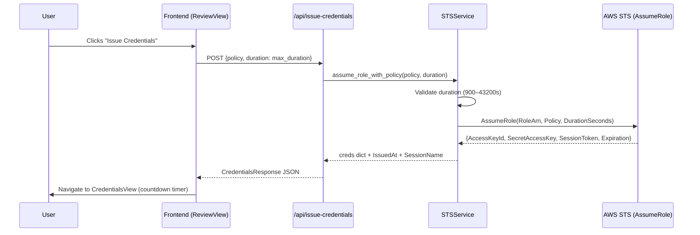
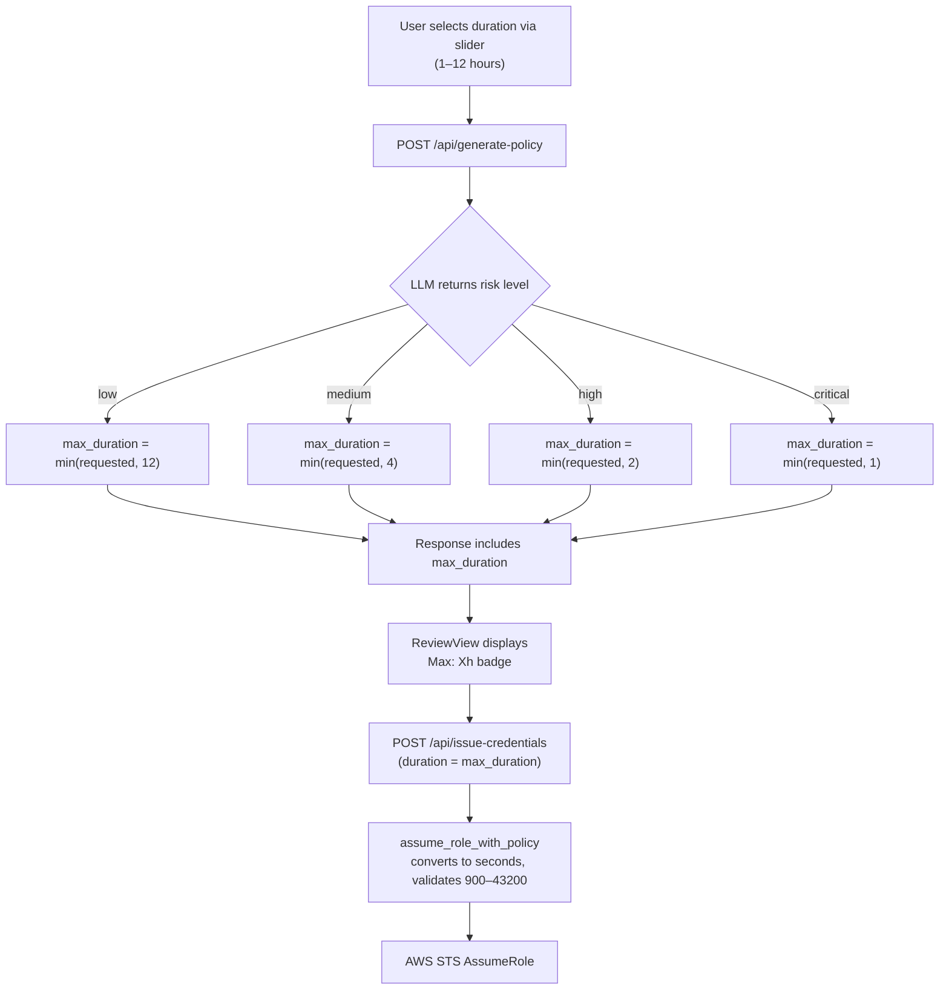
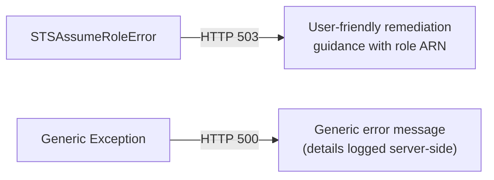

The **STS Service** is the security-critical component of IAM-Dynamic responsible for transforming an approved least-privilege IAM policy into short-lived AWS credentials. It bridges the gap between the LLM-generated policy document (a JSON authorization blueprint) and an actual set of temporary AWS credentials that a user can employ in their terminal or CI pipeline. The service enforces a **risk-based duration cap** — the higher the assessed risk of a policy, the shorter the maximum session lifetime. This ensures that powerful or broadly-scoped permissions expire quickly, minimizing the blast radius of any credential leak.

The flow involves three distinct layers: the **STS service module** (boto3 wrapper with validation), the **API endpoint** (orchestration with error handling), and the **frontend** (duration selection, credential display, expiration timer). This page examines all three layers in detail, focusing on the risk-to-duration mapping, the AWS STS `AssumeRole` call mechanics, and the defensive validation that prevents misconfiguration from issuing over-privileged or non-expiring credentials.

Sources: [sts_service.py](backend/services/sts_service.py#L1-L155), [main.py](backend/main.py#L1-L506)

## Architecture: From Policy to Credentials

The credential issuance pipeline is a two-phase operation. In the first phase, the user submits a natural-language access request and the LLM generates a least-privilege policy with a risk score. In the second phase — the one this page covers — the approved policy is passed to AWS STS `AssumeRole`, which returns temporary credentials scoped *exactly* to that policy via an inline session policy.



The key architectural insight is that **the session policy is never stored as an independent AWS entity**. Instead, it is passed inline to the `AssumeRole` API call as a JSON string. This means the generated credentials are inherently scoped — they cannot exceed the permissions defined in that inline policy, regardless of what the underlying IAM role might otherwise permit. The role acts purely as a trust anchor; the session policy acts as the permission boundary.

Sources: [sts_service.py](backend/services/sts_service.py#L42-L105), [main.py](backend/main.py#L386-L440), [review-view.tsx](frontend/src/views/review-view.tsx#L46-L57)

## The STSService Class

The [`STSService`](backend/services/sts_service.py#L23) class encapsulates all AWS STS interactions behind a clean interface. It is initialized once at application startup with the IAM role ARN derived from environment configuration, and reused across all credential issuance requests.

### Initialization and Role ARN Construction

```python
# Application startup (main.py)
sts_service = STSService(config.aws.role_arn)
```

The role ARN is constructed by [`AWSConfig`](backend/config.py#L27) from two environment variables: `AWS_ACCOUNT_ID` (required) and `AWS_ROLE_NAME` (defaults to `AgentPOCSessionRole`). The resulting ARN follows the format `arn:aws:iam::<account_id>:role/<role_name>`. This role must exist in the target AWS account and its trust policy must permit the calling identity to assume it — see [AWS IAM Role Setup and Trust Policy for STS AssumeRole](27-aws-iam-role-setup-and-trust-policy-for-sts-assumerole) for the infrastructure setup details.

### Exception Hierarchy

The service defines a two-level exception hierarchy for precise error handling at the API layer:

| Exception | Purpose | Raised By |
|---|---|---|
| `STSServiceError` | Base exception for all STS-related failures | — |
| `STSAssumeRoleError` | Any failure during the `AssumeRole` operation | Duration validation errors, AWS API errors |

This hierarchy allows the API endpoint to catch `STSAssumeRoleError` specifically and return a targeted HTTP 503 response with remediation guidance (invalid credentials, missing role, trust policy issues), while all other unexpected errors fall through to a generic 500 handler.

Sources: [sts_service.py](backend/services/sts_service.py#L13-L21), [sts_service.py](backend/services/sts_service.py#L31-L40), [config.py](backend/config.py#L27-L35), [main.py](backend/main.py#L414-L440)

## The `assume_role_with_policy` Method

This is the core method that performs the actual credential issuance. It accepts three parameters — the IAM policy document, the session duration in hours, and a session name — and returns a dictionary containing the AWS credentials plus application-level metadata.

### Duration Validation (Hard Bounds)

Before calling AWS, the method enforces two hard constraints on the duration:

| Constraint | Value | Rationale |
|---|---|---|
| **Minimum** | 900 seconds (15 minutes) | AWS STS API limit — sessions shorter than this are not permitted |
| **Maximum** | 43,200 seconds (12 hours) | AWS STS API limit for `AssumeRole` sessions |

These are **AWS-imposed limits**, not application policy. The method converts hours to seconds (`int(duration_hours * 3600)`) and raises `STSAssumeRoleError` if either bound is violated. This defensive check prevents an invalid `DurationSeconds` parameter from reaching AWS, which would result in a less descriptive API error.

### The AssumeRole API Call

```python
response = self.client.assume_role(
    RoleArn=self.role_arn,
    RoleSessionName=session_name,
    DurationSeconds=duration_seconds,
    Policy=json.dumps(policy)       # Inline session policy
)
```

The four parameters passed to `assume_role` each serve a distinct security purpose:

| Parameter | Value | Security Role |
|---|---|---|
| `RoleArn` | Configured at init from `AWS_ACCOUNT_ID` + `AWS_ROLE_NAME` | Defines *which* IAM role to assume — the trust anchor |
| `RoleSessionName` | `"gemini-jit-session"` (default) or custom | Audit trail identifier visible in CloudTrail |
| `DurationSeconds` | Risk-capped value (900–43200) | Controls credential lifetime |
| `Policy` | JSON-serialized LLM-generated policy | **Inline session policy** — scopes permissions to least-privilege |

The `Policy` parameter is the critical security element. By passing the generated policy inline, the resulting session credentials can only perform the actions explicitly allowed by that policy, even if the assumed role has broader permissions attached.

### Response Enrichment

After receiving the AWS response, the method enriches the credential dictionary with two additional metadata fields before returning it to the caller:

- **`IssuedAt`**: A UTC timestamp (`datetime.now(timezone.utc)`) recording when the credentials were created, enabling accurate countdown calculations on the frontend.
- **`SessionName`**: Echoes the session name back for display and audit purposes.

The method also ensures the `Expiration` datetime is timezone-aware. AWS STS typically returns UTC-aware datetimes, but the code defensively checks and attaches `timezone.utc` if the `tzinfo` is missing — preventing subtle bugs in downstream time arithmetic.

Sources: [sts_service.py](backend/services/sts_service.py#L42-L105)

## Risk-Based Duration Limits

The risk-based duration system is the application's primary mechanism for enforcing the principle of *short-lived access proportional to risk*. It operates at two levels: the API layer (where risk capping occurs) and the STS service layer (where the final duration is validated against AWS limits).

### The Risk-to-Duration Mapping

The mapping is defined identically in two locations — the [`get_max_duration`](backend/main.py#L198) helper function in the API layer and the [`validate_duration`](backend/services/sts_service.py#L107) method in the STS service:

| Risk Level | Max Duration | Color Coding | Auto-Approved? |
|---|---|---|---|
| **Low** | 12 hours | 🟢 Green | ✅ Yes |
| **Medium** | 4 hours | 🟡 Yellow | ❌ No |
| **High** | 2 hours | 🟠 Orange | ❌ No |
| **Critical** | 1 hour | 🔴 Red | ❌ No |
| *Unknown* | 2 hours (default) | — | ❌ No |

The design philosophy is straightforward: low-risk policies (read-only, narrowly scoped) earn the maximum 12-hour window, while critical-risk policies (wildcard actions, sensitive resources) are capped at just one hour. The default fallback of 2 hours for unrecognized risk levels ensures that unexpected risk assessments err on the side of shorter sessions.

### Duration Capping Flow



The capping occurs in the `/api/generate-policy` endpoint, where the LLM's risk assessment is combined with the user's requested duration:

```python
max_duration = get_max_duration(response.risk)     # Risk limit
actual_duration = min(request.duration, max_duration)  # Cap at risk limit
```

The `max_duration` is then included in the `PolicyResponseModel` returned to the frontend. When the user clicks "Issue Credentials" in the ReviewView, the frontend sends `policyData.max_duration` as the `duration` field — meaning the already-capped value flows through to the STS call. The `validate_duration` method in `STSService` provides a **secondary defense layer**, logging a warning and capping if somehow a value exceeds the risk limit, but in normal operation the API layer has already enforced the cap.

Sources: [main.py](backend/main.py#L198-L200), [main.py](backend/main.py#L355-L357), [sts_service.py](backend/services/sts_service.py#L107-L133), [review-view.tsx](frontend/src/views/review-view.tsx#L50-L57)

## The API Endpoint: Orchestration and Error Handling

The [`/api/issue-credentials`](backend/main.py#L386) endpoint is the HTTP entry point for credential issuance. It accepts an `IssueCredentialsRequest` containing the approved policy, duration, and optional approver/change-case metadata, and returns a `CredentialsResponse` with the temporary credentials.

### Request/Response Models

The endpoint's request model enforces FastAPI-level validation on the duration field:

```python
class IssueCredentialsRequest(BaseModel):
    policy: dict
    duration: int = Field(..., ge=1, le=12)  # 1–12 hours
    approved: bool = Field(default=False)
    approver: Optional[str] = Field(default=None)
    change_case: Optional[str] = Field(default=None)
```

The `ge=1, le=12` constraint at the Pydantic layer provides a first-pass validation that rejects out-of-range values before they reach the STS service. The STS service's own 900–43200 second check then serves as a secondary guard.

The response model strips STS-specific metadata (like `IssuedAt` and `SessionName`) and returns only what the frontend needs:

```python
class CredentialsResponse(BaseModel):
    access_key_id: str
    secret_access_key: str
    session_token: str
    expiration: str          # ISO format datetime string
    region: str = "us-east-1"
```

### Error Handling Strategy

The endpoint implements a two-tier error catch for STS failures:



When `STSAssumeRoleError` is caught, the endpoint constructs a detailed markdown-formatted error message that includes the actual role ARN and actionable troubleshooting steps (verify role exists, check trust relationship, ensure `sts:AssumeRole` permission). This error is returned as HTTP 503 (Service Unavailable), signaling that the issue is with the AWS infrastructure rather than the user's request. Generic exceptions return HTTP 500 with a non-revealing message while logging the full traceback server-side.

Sources: [main.py](backend/main.py#L79-L95), [main.py](backend/main.py#L386-L440)

## Frontend Integration: Duration Selection and Credential Display

The frontend plays two roles in the duration lifecycle: it collects the user's initial duration preference and it displays the resulting credentials with a live countdown timer.

### Duration Selection (RequestView)

In the [`RequestView`](frontend/src/views/request-view.tsx), users select a session duration via a slider component ranging from 1 to 12 hours (integer steps). The default is 2 hours. A helper text below the slider warns: *"Maximum duration may be limited based on risk level assessment."* This sets the expectation that the requested duration is a preference, not a guarantee — the actual duration will be capped by the risk assessment that happens server-side.

The selected duration is sent to the `/api/generate-policy` endpoint as part of the `PolicyRequest`. The server returns a `max_duration` field that reflects the risk-capped value, and this value — not the original slider value — is what gets forwarded to `/api/issue-credentials`.

### Risk Badge and Max Duration Display (ReviewView)

The [`ReviewView`](frontend/src/views/review-view.tsx) renders the risk assessment with color-coded severity indicators and a prominent badge displaying `Max: {max_duration}h`. This transparency ensures the approver knows exactly how long the credentials will last before they click "Issue Credentials." The risk configuration maps each level to a distinct color and icon:

| Risk | Tailwind Color | Icon |
|---|---|---|
| Low | `bg-green-500` | `CheckCircle2` |
| Medium | `bg-yellow-500` | `AlertTriangle` |
| High | `bg-orange-500` | `AlertTriangle` |
| Critical | `bg-red-500` | `AlertCircle` |

The "Issue Credentials" button passes `policyData.max_duration` (the risk-capped value) to the API call — not the original user-selected duration. This means the risk cap is enforced even if the frontend state were somehow manipulated.

### Credential Display and Expiration Timer (CredentialsView)

After successful credential issuance, the [`CredentialsView`](frontend/src/views/credentials-view.tsx) component receives the `CredentialsResponse` and renders three key elements:

**Countdown Timer**: A `useEffect` hook runs a 60-second interval that calculates the time remaining between `now` and the `credentials.expiration` timestamp. The display updates with `Xh Xm` format, switching to "Expired" when the difference reaches zero.

**Multi-Format Export**: Credentials are rendered in three formats, each as a copyable code block:
- **Bash/Zsh**: `export AWS_ACCESS_KEY_ID=...` format
- **PowerShell**: `$Env:AWS_ACCESS_KEY_ID=...` format
- **AWS CLI**: `aws configure set ... --profile iam-session` format

A "Download Script" button generates a `.sh` file containing the Bash export commands, enabling users to `source` the file in their terminal.

**Security Notice**: A yellow card reminds users that credentials expire automatically, should never be shared or committed, and that all issuance is logged for audit purposes.

Sources: [request-view.tsx](frontend/src/views/request-view.tsx#L89-L106), [review-view.tsx](frontend/src/views/review-view.tsx#L59-L95), [review-view.tsx](frontend/src/views/review-view.tsx#L46-L57), [credentials-view.tsx](frontend/src/views/credentials-view.tsx#L24-L45), [credentials-view.tsx](frontend/src/views/credentials-view.tsx#L58-L86), [credentials-view.tsx](frontend/src/views/credentials-view.tsx#L214-L222)

## The Session Duration Helper

The [`get_session_duration_remaining`](backend/services/sts_service.py#L135) method provides a server-side utility for computing the remaining lifetime of an issued credential. It accepts the expiration datetime, computes the delta from the current UTC time, and returns a `(hours, minutes)` tuple. If the credential has already expired, it returns `(0, 0)`. While this method is currently defined in the service, the frontend implements its own independent countdown logic using the ISO-formatted expiration string from the API response — the service-side helper exists as a reusable utility for potential server-side session tracking or scheduled cleanup features.

Sources: [sts_service.py](backend/services/sts_service.py#L135-L154)

## Data Types and Type Safety

The STS credential flow is supported by typed data containers defined in [`schemas.py`](backend/schemas.py). The [`CredentialData`](backend/schemas.py#L33) dataclass provides a structured representation of issued credentials, and the [`DurationHours`](backend/schemas.py#L128) type alias (`float`) and [`RiskLevel`](backend/schemas.py#L127) type alias (`str`) document the expected value domains throughout the codebase. These types are used alongside (not instead of) the Pydantic models in `main.py` — the Pydantic models handle API validation while the dataclasses provide internal type documentation.

Sources: [schemas.py](backend/schemas.py#L33-L50), [schemas.py](backend/schemas.py#L125-L129)

## Summary: Defense-in-Depth for Duration Enforcement

The risk-based duration system implements a **four-layer validation stack**, each layer providing an independent guard:

| Layer | Location | Validation | Failure Mode |
|---|---|---|---|
| **1. Pydantic** | `IssueCredentialsRequest` | `duration` must be 1–12 (integer) | HTTP 422 Unprocessable Entity |
| **2. Risk Cap** | `get_max_duration()` in API layer | `min(requested, risk_limit)` | Silently caps to risk-appropriate maximum |
| **3. STS Service** | `assume_role_with_policy()` | Duration seconds must be 900–43,200 | `STSAssumeRoleError` → HTTP 503 |
| **4. AWS STS API** | Amazon's API | Enforces role's `MaxSessionDuration` and account limits | AWS-side error propagated as HTTP 503 |

This layered approach ensures that no single point of failure — a buggy frontend, a misconfigured environment variable, or an edge case in the LLM risk assessment — can result in credentials that exceed the risk-appropriate lifetime. Each layer operates independently and assumes the previous layer may have failed.

**Next**: Learn about the configuration system that provides the AWS role ARN and other settings at [Configuration System with Pydantic Validation](10-configuration-system-with-pydantic-validation), or explore the AWS infrastructure prerequisites at [AWS IAM Role Setup and Trust Policy for STS AssumeRole](27-aws-iam-role-setup-and-trust-policy-for-sts-assumerole). For the frontend credential display experience, see [Credentials View: Multi-Format Export and Expiration Timer](19-credentials-view-multi-format-export-and-expiration-timer).