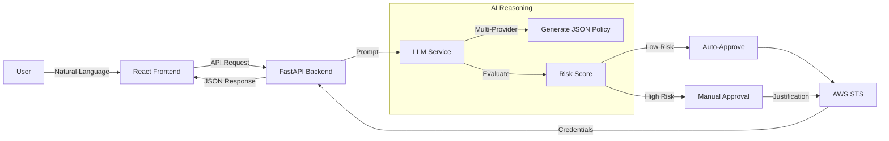

# 🔐 IAM-Dynamic

**AI-Driven Just-In-Time AWS IAM Access Request Portal**

[](https://react.dev/)
[](https://fastapi.tiangolo.com/)
[](https://deepmind.google/technologies/gemini/)
[](https://www.python.org/)
[](https://www.typescriptlang.org/)

## 🚀 Overview

**IAM-Dynamic** is a secure, user-friendly portal that leverages multiple AI providers (Google Gemini, OpenAI, Anthropic Claude, Zhipu GLM) to generate least-privilege AWS IAM policies from natural language. It features a modern React frontend with FastAPI backend that assesses risk, validates requests, and issues temporary credentials via AWS STS.

**Key Capabilities:**
-   **♊ Gemini First:** Powered by Gemini 3.0 Pro/Flash for high-reasoning policy generation.
-   **🛡️ Guardrails:** System-level instructions prevent over-privileged access (e.g., blocking `*:*`).
-   **🚦 Risk Scoring:** Automatic assessment (Low, Medium, High, Critical).
-   **⚡ Auto-Approval:** Low-risk requests are approved instantly; others require manual sign-off.
-   **🔐 Just-In-Time:** Credentials are temporary and expire automatically.

---

## 🧠 How It Works



1.  **Request:** User types a request or clicks a template in the React UI.
2.  **Analysis:** AI provider (Gemini/OpenAI/Claude/GLM) analyzes intent and drafts IAM policy.
3.  **Risk Check:** The system flags wildcards or sensitive services.
4.  **Issuance:** If approved, `boto3` calls `sts:AssumeRole` to mint credentials.

---

## ✨ Features

### Core Functionality
-   **Natural Language Input:** "I need read-only access to the production S3 bucket."
-   **Quick Templates:** One-click prompts for common tasks (S3 Read, EC2 Observer, Lambda Invoker, CloudWatch Logs, DynamoDB Reader, Secrets Manager).
-   **Modern React UI:** Multi-view state machine (request → review → credentials/rejected) with responsive design.
-   **Multi-Provider LLM Support:** Runtime switching between Gemini (default), OpenAI, Anthropic Claude, or Zhipu GLM.
-   **Slack Integration:** Audit logs and approval notifications sent directly to Slack.

### New in v3.0
-   **🎨 React Frontend:** TypeScript with Vite for fast development, Radix UI components for accessibility
-   **🌗 Theme System:** System theme detection (light/dark/system) with toggle
-   **📝 Enhanced Rejection Flow:** AI-generated guidance with markdown formatting for resubmission
-   **💾 Multiple Export Formats:** Export credentials in Bash, PowerShell, and AWS CLI formats
-   **🚦 Real-time Risk Assessment:** Color-coded badges (Low/Medium/High/Critical) with duration limits
-   **🔐 Session Policies:** AWS STS AssumeRole with scoped-down session policies
-   **📊 FastAPI Backend:** REST API with OpenAPI documentation at `/docs`
-   **🗄️ SQLite Persistence:** Request history and audit logs persisted across application restarts
-   **🛡️ Comprehensive Error Handling:** Structured logging and CORS configuration
-   **🔄 Retry Mechanism:** Automatic retry with exponential backoff for transient failures

---

## 📦 Project Structure

### Backend (`backend/`)
| File                          | Description                                      |
| ----------------------------- | ------------------------------------------------ |
| `main.py`                     | **FastAPI Application**. REST API with endpoints. |
| `llm_service.py`              | **AI Service Layer**. Multi-provider LLM abstraction (Gemini/OpenAI/Anthropic/Zhipu). |
| `config.py`                   | **Configuration**. Centralized config with pydantic. |
| `services/sts_service.py`     | **AWS STS Service**. Credential issuance operations. |
| `services/slack_service.py`   | **Slack Service**. Notification handling.        |
| `services/database.py`        | **Database Service**. SQLite persistence layer.   |
| `services/policy_validator.py`| **Policy Validator**. IAM policy risk assessment. |
| `utils/validators.py`         | **Input Validators**. Request validation.        |
| `utils/logging_config.py`     | **Logging Config**. Structured logging setup.     |
| `requirements.txt`            | Python dependencies (pinned versions).           |

### Frontend (`frontend/`)
| File/Directory                | Description                                      |
| ----------------------------- | ------------------------------------------------ |
| `src/App.tsx`                 | **Main React Application**. View routing and state management. |
| `src/views/request-view.tsx`  | Request input form with templates and provider selector. |
| `src/views/review-view.tsx`   | Policy review with risk assessment and approval. |
| `src/views/credentials-view.tsx` | Display credentials with multiple export formats. |
| `src/views/rejected-view.tsx` | Rejection display with AI-generated guidance. |
| `package.json`                | Frontend dependencies (React, Vite, Tailwind, Radix UI). |

### Root
| File                          | Description                                      |
| ----------------------------- | ------------------------------------------------ |
| `start-dev.sh`                | Development script to start both frontend and backend. |
| `.env`                        | Environment configuration (AI provider, AWS, Slack). |
| `CLAUDE.md`                   | Documentation for Claude Code (AI assistant).    |
| `GEMINI.md`                   | Roadmap and architecture for Gemini integration. |
| `CHANGELOG.md`                | Version history and release notes.               |

---

## ⚙️ Configuration

Create a `.env` file in the root directory (see `.env.example` for template):

```bash
# --- AI Provider Configuration ---
# Choose: gemini, openai, anthropic/claude, or zhipu/glm
LLM_PROVIDER=gemini

# Gemini 3 Pro Preview (November 2025) - Latest
GOOGLE_API_KEY=AIzaSy...
GEMINI_MODEL=gemini-3-pro-preview
# Alternatives: gemini-3-flash-preview, gemini-2.5-flash, gemini-2.5-pro

# OpenAI GPT-5.1 (latest) - GPT-5 is previous model
# OPENAI_API_KEY=sk-...
# OPENAI_MODEL=gpt-5.1
# Alternatives: gpt-5, o3-pro (reasoning), gpt-4o

# Anthropic Claude Opus 4.5 (November 24, 2025) - Latest flagship
# ANTHROPIC_API_KEY=sk-ant-...
# ANTHROPIC_MODEL=claude-opus-4-5-20251101
# Alternatives: claude-sonnet-4-5-20251022, claude-haiku-4-5-20250214

# Zhipu GLM-4.7 (December 2025) - Latest flagship
# ZHIPUAI_API_KEY=...
# ZHIPUAI_MODEL=glm-4.7
# Alternative: glm-4.7-flash

# --- AWS Configuration ---
AWS_ACCOUNT_ID=123456789012
AWS_ROLE_NAME=AgentPOCSessionRole  # Role to be assumed by the app

# --- Slack Integration (Optional) ---
SLACK_WEBHOOK_URL=https://hooks.slack.com/...

# --- Approval Configuration ---
APPROVER_NAME=Admin

# --- Database Configuration ---
DATABASE_PATH=iam_dynamic.db
```

---

## 🧪 Getting Started

### 1. Installation
```bash
git clone https://github.com/tupacalypse187/IAM-Dynamic.git
cd IAM-Dynamic
python3 -m venv venv
source venv/bin/activate
pip install -r backend/requirements.txt
cd frontend && npm install
```

### 2. Run the App

**Option A: Development Script**
```bash
./start-dev.sh
```

**Option B: Separate Terminals**
```bash
# Terminal 1: Backend
cd backend
python main.py

# Terminal 2: Frontend
cd frontend
npm run dev
```

Open [http://localhost:3000](http://localhost:3000) for the React frontend, or [http://localhost:8000/docs](http://localhost:8000/docs) for FastAPI documentation.

---

## 🛡️ Security Notes

-   **Principal of Least Privilege:** The AI is instructed to always scope down resources.
-   **Audit Trail:** All requests (and their risk scores) are logged to Slack.
-   **Ephemeral Access:** Credentials issued are valid *only* for the requested duration.

---

## 📄 License

MIT © 2025
