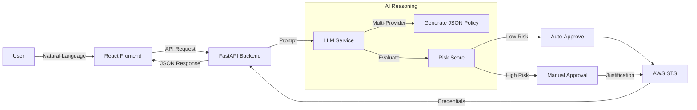

# 🔐 IAM-Dynamic

**AI-Driven Just-In-Time AWS IAM Access Request Portal**

[](https://react.dev/)
[](https://fastapi.tiangolo.com/)
[](https://ai.google.dev/api/models)
[](https://www.python.org/)
[](https://www.typescriptlang.org/)

## 🚀 Overview

**IAM-Dynamic** is a secure, user-friendly portal that leverages multiple AI providers (Google Gemini, OpenAI, Anthropic Claude, Z.AI GLM) to generate least-privilege AWS IAM policies from natural language. It features a modern React frontend with FastAPI backend that assesses risk, validates requests, and issues temporary credentials via AWS STS.

**Key Capabilities:**
-   **♊ Gemini First:** Powered by Gemini 3 Pro for high-reasoning policy generation.
-   **🛡️ Guardrails:** System-level instructions prevent over-privileged access (e.g., blocking `*:*`).
-   **🚦 Risk Scoring:** Automatic assessment (Low, Medium, High, Critical).
-   **⚡ Auto-Approval:** Low-risk requests are approved instantly; others require manual sign-off.
-   **🔐 Just-In-Time:** Credentials are temporary and expire automatically.

---

## 🧠 How It Works



1.  **Request:** User types a request or clicks a template in the React UI.
2.  **Analysis:** AI provider (Gemini/OpenAI/Claude/GLM) analyzes intent and drafts IAM policy.
3.  **Risk Check:** The system flags wildcards or sensitive services.
4.  **Issuance:** If approved, `boto3` calls `sts:AssumeRole` to mint credentials.

---

## ✨ Features

### Core Functionality
-   **Natural Language Input:** "I need read-only access to the production S3 bucket."
-   **Quick Templates:** One-click prompts for common tasks (S3 Read, EC2 Observer, Lambda Invoker, CloudWatch Logs, DynamoDB Reader, Secrets Manager).
-   **Modern React UI:** Multi-view state machine (request → review → credentials/rejected) with responsive design.
-   **Multi-Provider LLM Support:** Runtime switching between Gemini (default), OpenAI, Anthropic Claude, or Z.AI GLM.
-   **Slack Integration:** Audit logs and approval notifications sent directly to Slack.

### New in v3.0
-   **🎨 React Frontend:** TypeScript with Vite for fast development, Radix UI components for accessibility
-   **🌗 Theme System:** System theme detection (light/dark/system) with toggle
-   **📝 Enhanced Rejection Flow:** AI-generated guidance with markdown formatting for resubmission
-   **💾 Multiple Export Formats:** Export credentials in Bash, PowerShell, and AWS CLI formats
-   **🚦 Real-time Risk Assessment:** Color-coded badges (Low/Medium/High/Critical) with duration limits
-   **🔐 Session Policies:** AWS STS AssumeRole with scoped-down session policies
-   **📊 FastAPI Backend:** REST API with OpenAPI documentation at `/docs`
-   **🗄️ SQLite Persistence:** Request history and audit logs persisted across application restarts
-   **🛡️ Comprehensive Error Handling:** Structured logging and CORS configuration
-   **🔄 Retry Mechanism:** Automatic retry with exponential backoff for transient failures

### New in v3.1
-   **🔒 Authentication Portal:** Login page with JWT-based session management (bcrypt password hashing)
-   **🤖 Cloudflare Turnstile:** Optional CAPTCHA on login form to prevent brute-force attacks
-   **🔐 HTTPS via Caddy:** Automatic TLS certificates via Let's Encrypt with Cloudflare DNS challenge
-   **🛡️ Rate Limiting:** nginx rate limits on login endpoint (5 requests/minute)
-   **⚡ Zero-config Local Dev:** Auth is optional — omit `AUTH_PASSWORD_HASH` and the app works without login

---

## 📦 Project Structure

### Backend (`backend/`)
| File                          | Description                                      |
| ----------------------------- | ------------------------------------------------ |
| `main.py`                     | **FastAPI Application**. REST API with endpoints. |
| `llm_service.py`              | **AI Service Layer**. Multi-provider LLM abstraction (Gemini/OpenAI/Anthropic/Z.AI). |
| `config.py`                   | **Configuration**. Centralized config with pydantic. |
| `services/sts_service.py`     | **AWS STS Service**. Credential issuance operations. |
| `services/slack_service.py`   | **Slack Service**. Notification handling.        |
| `services/auth_service.py`    | **Auth Service**. JWT tokens and bcrypt password verification. |
| `services/turnstile_service.py`| **Turnstile Service**. Cloudflare CAPTCHA verification. |
| `scripts/hash_password.py`    | **CLI Utility**. Generate bcrypt hashes for `.env`. |
| `services/database.py`        | **Database Service**. SQLite persistence layer.   |
| `services/policy_validator.py`| **Policy Validator**. IAM policy risk assessment. |
| `utils/validators.py`         | **Input Validators**. Request validation.        |
| `utils/logging_config.py`     | **Logging Config**. Structured logging setup.     |
| `requirements.txt`            | Python dependencies (pinned versions).           |

### Frontend (`frontend/`)
| File/Directory                | Description                                      |
| ----------------------------- | ------------------------------------------------ |
| `src/App.tsx`                 | **Main React Application**. Auth gate, view routing and state management. |
| `src/components/auth-provider.tsx` | Auth context provider (JWT session management). |
| `src/views/login-view.tsx`    | Login form with optional Turnstile CAPTCHA. |
| `src/views/request-view.tsx`  | Request input form with templates and provider selector. |
| `src/views/review-view.tsx`   | Policy review with risk assessment and approval. |
| `src/views/credentials-view.tsx` | Display credentials with multiple export formats. |
| `src/views/rejected-view.tsx` | Rejection display with AI-generated guidance. |
| `package.json`                | Frontend dependencies (React, Vite, Tailwind, Radix UI). |

### Docker & CI/CD
| File                          | Description                                      |
| ----------------------------- | ------------------------------------------------ |
| `Dockerfile.frontend`         | Multi-stage build: Node 20 → nginx 1.27 (Alpine). |
| `Dockerfile.backend`          | Python 3.11-slim with uvicorn (2 workers).       |
| `Dockerfile.caddy`            | Custom Caddy with Cloudflare DNS module (xcaddy). |
| `docker-compose.yml`          | Local development (hot-reload backend, nginx frontend). |
| `docker-compose.prod.yml`     | Production (Caddy + GHCR images, internal ports, resource limits). |
| `docker/Caddyfile`            | Caddy config: TLS via Cloudflare DNS, security headers. |
| `docker/nginx.conf`           | Main nginx config (gzip, rate limiting for API and login). |
| `docker/default.conf`         | Server block: SPA + reverse proxy to backend.    |
| `.github/workflows/ci.yml`    | PR checks: lint, typecheck, build, Docker build test. |
| `.github/workflows/deploy.yml`| Main branch: security scan, build/push to GHCR, deploy. |
| `.dockerignore`               | Docker context exclusions.                       |

### Root
| File                          | Description                                      |
| ----------------------------- | ------------------------------------------------ |
| `start-dev.sh`                | Development script to start both frontend and backend. |
| `.env`                        | Environment configuration (AI provider, AWS, Slack). |
| `CLAUDE.md`                   | Documentation for Claude Code (AI assistant).    |
| `GEMINI.md`                   | Roadmap and architecture for Gemini integration. |
| `CHANGELOG.md`                | Version history and release notes.               |

---

## ⚙️ Configuration

Create a `.env` file in the root directory (see `.env.example` for template):

```bash
# --- AI Provider Configuration ---
# Choose: gemini, openai, anthropic/claude, or zhipu/z.ai
LLM_PROVIDER=gemini

# Gemini 3.1 Pro Preview
GOOGLE_API_KEY=AIzaSy...
GEMINI_MODEL=gemini-3.1-pro-preview
# Alternatives: gemini-3-flash-preview, gemini-3.1-flash-lite-preview

# OpenAI GPT-5.4
# OPENAI_API_KEY=sk-...
# OPENAI_MODEL=gpt-5.4
# Alternatives: gpt-5-mini-2025-08-07, gpt-4o, gpt-4o-mini, o1-preview

# Anthropic Claude Opus 4.6
# ANTHROPIC_API_KEY=sk-ant-...
# ANTHROPIC_MODEL=claude-opus-4-6
# Alternatives: claude-opus-4-5, claude-sonnet-4-5

# Z.AI GLM-5.1 (Global platform via api.z.ai)
# ZAI_API_KEY=...
# ZAI_MODEL=glm-5.1
# Alternatives: glm-5, glm-4.7, glm-4.7-flash

# --- AWS Configuration ---
AWS_ACCOUNT_ID=123456789012
AWS_ROLE_NAME=AgentPOCSessionRole  # Role to be assumed by the app

# --- Authentication (optional — omit for no-auth local dev) ---
# AUTH_USERNAME=admin
# AUTH_PASSWORD_HASH=$2b$12$...   # python backend/scripts/hash_password.py
# JWT_SECRET=random-secret-32-chars
# TURNSTILE_SECRET_KEY=0x...      # Cloudflare Turnstile server key

# --- Caddy / HTTPS (production only) ---
# CLOUDFLARE_API_TOKEN=...
# CADDY_DOMAIN=iam.yantorno.dev

# --- Slack Integration (Optional) ---
SLACK_WEBHOOK_URL=https://hooks.slack.com/...

# --- Approval Configuration ---
APPROVER_NAME=Admin

# --- Database Configuration ---
DATABASE_PATH=iam_dynamic.db
```

---

## 🧪 Getting Started

### 1. Installation
```bash
git clone https://github.com/tupacalypse187/IAM-Dynamic.git
cd IAM-Dynamic
python3 -m venv venv
source venv/bin/activate
pip install -r backend/requirements.txt
cd frontend && npm install
```

### 2. Run the App

**Option A: Development Script**
```bash
./start-dev.sh
```

**Option B: Separate Terminals**
```bash
# Terminal 1: Backend
cd backend
python main.py

# Terminal 2: Frontend
cd frontend
npm run dev
```

Open [http://localhost:3000](http://localhost:3000) for the React frontend, or [http://localhost:8000/docs](http://localhost:8000/docs) for FastAPI documentation.

### 3. Run with Docker

```bash
# Build and start both containers
docker compose up --build

# Or run in detached mode
docker compose up --build -d
```

Open [http://localhost:8080](http://localhost:8080) for the app (nginx serves the frontend and proxies API requests to the backend).

**Production (GHCR images):**
```bash
docker compose -f docker-compose.prod.yml up -d
```

---

## 🔄 CI/CD

GitHub Actions workflows are included for automated checks and deployment:

| Workflow | Trigger | What it does |
| -------- | ------- | ------------ |
| **CI** (`.github/workflows/ci.yml`) | Pull requests to `main` | Lint, typecheck, and build both frontend and backend. Docker build test (no push). |
| **Deploy** (`.github/workflows/deploy.yml`) | Push to `main` | Security scan, test, build & push images to GHCR, Trivy vulnerability scan, deploy via SSH, cleanup old images. |

**Required GitHub Secrets for deployment:**

| Secret | Purpose |
| ------ | ------- |
| `PROD_HOST` | Production server hostname |
| `PROD_USER` | SSH username |
| `PROD_SSH_KEY` | SSH private key |
| `TURNSTILE_SITE_KEY` | Cloudflare Turnstile public key (optional) |
| `SLACK_WEBHOOK_URL` | Deployment notifications (optional) |

`GITHUB_TOKEN` is automatic — no separate Docker registry credentials needed for GHCR.

---

## 🛡️ Security Notes

-   **Principal of Least Privilege:** The AI is instructed to always scope down resources.
-   **Authentication Portal:** JWT-based login with bcrypt password hashing and optional Cloudflare Turnstile CAPTCHA.
-   **HTTPS by Default:** Caddy with automatic Let's Encrypt certificates via Cloudflare DNS challenge in production.
-   **Rate Limiting:** Login endpoint limited to 5 requests/minute per IP via nginx.
-   **Audit Trail:** All requests (and their risk scores) are logged to Slack.
-   **Ephemeral Access:** Credentials issued are valid *only* for the requested duration.

---

## 📄 License

MIT © 2025
