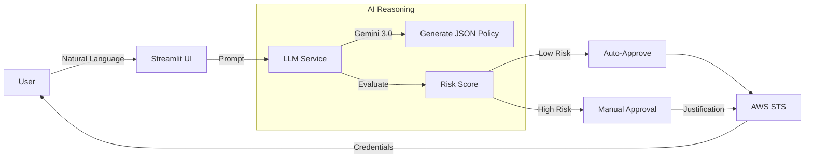

# 🔐 IAM-Dynamic

**AI-Driven Just-In-Time AWS IAM Access Request Portal**

[](https://streamlit.io)
[](https://deepmind.google/technologies/gemini/)
[](https://www.python.org/)
[](https://www.docker.com/)

## 🚀 Overview

**IAM-Dynamic** is a secure, user-friendly portal that leverages **Google Gemini 3.0** (with OpenAI fallback) to generate least-privilege AWS IAM policies from natural language. It features an "Agentic" workflow that assesses risk, validates requests, and issues temporary credentials via AWS STS.

**Key Capabilities:**
-   **♊ Gemini First:** Powered by Gemini 3.0 Pro/Flash for high-reasoning policy generation.
-   **🛡️ Guardrails:** System-level instructions prevent over-privileged access (e.g., blocking `*:*`).
-   **🚦 Risk Scoring:** Automatic assessment (Low, Medium, High, Critical).
-   **⚡ Auto-Approval:** Low-risk requests are approved instantly; others require manual sign-off.
-   **🔐 Just-In-Time:** Credentials are temporary and expire automatically.

---

## ✨ Features

### Core Functionality
-   **Natural Language Input:** "I need read-only access to the production S3 bucket."
-   **Quick Templates:** One-click prompts for common tasks (S3 Read, EC2 Observer, Lambda Invoker, CloudWatch Logs, DynamoDB Reader, Secrets Manager).
-   **Modern UI:** Gradient-themed dashboard with session history and real-time agent status.
-   **Quad AI Support:** Switch between Gemini (default), OpenAI, Anthropic Claude, or Zhipu GLM via configuration.
-   **Slack Integration:** Audit logs and approval notifications sent directly to Slack.

### New in v2.0
-   **🎨 Enhanced UI:** Modern gradient theme with visualizations and animations
-   **📊 Policy Visualization:** Interactive pie charts showing permission distribution by AWS service
-   **🎯 Risk Gauge:** Visual gauge chart for risk assessment (Low/Medium/High/Critical)
-   **⏰ Expiration Timer:** Countdown timer showing credential expiration with color-coded warnings
-   **💾 SQLite Persistence:** Session history persisted across application restarts
-   **📜 Enhanced History:** Searchable and filterable session history
-   **⬇️ Export Features:** Export history to CSV for audit and compliance
-   **🔒 Policy Validation:** Built-in validation for IAM policies against best practices
-   **🔄 Retry Mechanism:** Automatic retry with exponential backoff for transient failures
-   **✅ Input Validation:** Comprehensive validation for all user inputs
-   **📝 Download Credentials:** One-click download of credential scripts

---

## 📦 Project Structure

| File                          | Description                                      |
| ----------------------------- | ------------------------------------------------ |
| `dynamicIAM_web.py`           | **Main Application**. Streamlit UI & Logic.      |
| `llm_service.py`              | **AI Service Layer**. Handles Gemini/OpenAI/Anthropic/Zhipu API. |
| `config.py`                   | **Configuration**. Centralized config with pydantic. |
| `services/sts_service.py`     | **AWS STS Service**. Credential issuance operations. |
| `services/slack_service.py`   | **Slack Service**. Notification handling.        |
| `services/database.py`        | **Database Service**. SQLite persistence layer.   |
| `services/policy_validator.py`| **Policy Validator**. IAM policy validation.     |
| `services/retry_handler.py`   | **Retry Handler**. Exponential backoff retry.    |
| `utils/theme.py`              | **Theme Utilities**. Custom gradient styling.     |
| `utils/validators.py`         | **Input Validators**. Request validation.        |
| `utils/logging_config.py`     | **Logging Config**. Structured logging setup.     |
| `components/ui_components.py` | **UI Components**. Reusable visualization components. |
| `components/sidebar.py`       | **Sidebar Component**. Enhanced history display.  |
| `components/notifications.py` | **Notifications**. Toast notification manager.    |
| `types.py`                    | **Type Definitions**. Type hints and dataclasses. |
| `GEMINI.md`                   | Roadmap and architecture for Gemini integration. |
| `requirements.txt`            | Python dependencies (pinned versions).           |

---

## ⚙️ Configuration

Create a `.env` file in the root directory (see `.env.example` for template):

```bash
# --- AI Provider Configuration ---
# Choose: gemini, openai, anthropic/claude, or zhipu/glm
LLM_PROVIDER=gemini

# Gemini 3 Pro Preview (November 2025) - Latest
GOOGLE_API_KEY=AIzaSy...
GEMINI_MODEL=gemini-3-pro-preview
# Alternatives: gemini-3-flash-preview, gemini-2.5-flash, gemini-2.5-pro

# OpenAI GPT-5.1 (latest) - GPT-5 is previous model
# OPENAI_API_KEY=sk-...
# OPENAI_MODEL=gpt-5.1
# Alternatives: gpt-5, o3-pro (reasoning), gpt-4o

# Anthropic Claude Opus 4.5 (November 24, 2025) - Latest flagship
# ANTHROPIC_API_KEY=sk-ant-...
# ANTHROPIC_MODEL=claude-opus-4-5-20251101
# Alternatives: claude-sonnet-4-5-20251022, claude-haiku-4-5-20250214

# Zhipu GLM-4.7 (December 2025) - Latest flagship
# ZHIPUAI_API_KEY=...
# ZHIPUAI_MODEL=glm-4.7
# Alternative: glm-4.7-flash

# --- AWS Configuration ---
AWS_ACCOUNT_ID=123456789012
AWS_ROLE_NAME=AgentPOCSessionRole  # Role to be assumed by the app

# --- Slack Integration (Optional) ---
SLACK_WEBHOOK_URL=https://hooks.slack.com/...

# --- Approval Configuration ---
APPROVER_NAME=Admin

# --- Database Configuration ---
DATABASE_PATH=iam_dynamic.db
```

---

## 🧪 Getting Started

### 1. Installation
```bash
git clone https://github.com/tupacalypse187/IAM-Dynamic.git
cd IAM-Dynamic
python3 -m venv venv
source venv/bin/activate
pip install -r requirements.txt
```

### 2. Run the App
```bash
streamlit run dynamicIAM_web.py
```
Open [http://localhost:8501](http://localhost:8501) in your browser.

---

## 🧠 How It Works



1.  **Request:** User types a request or clicks a template.
2.  **Analysis:** Gemini analyzes the intent and drafts a specific IAM policy.
3.  **Risk Check:** The system flags wildcards or sensitive services.
4.  **Issuance:** If approved, `boto3` calls `sts:AssumeRole` to mint credentials.

---

## 🛡️ Security Notes

-   **Principal of Least Privilege:** The AI is instructed to always scope down resources.
-   **Audit Trail:** All requests (and their risk scores) are logged to Slack.
-   **Ephemeral Access:** Credentials issued are valid *only* for the requested duration.

---

## 📄 License

MIT © 2025