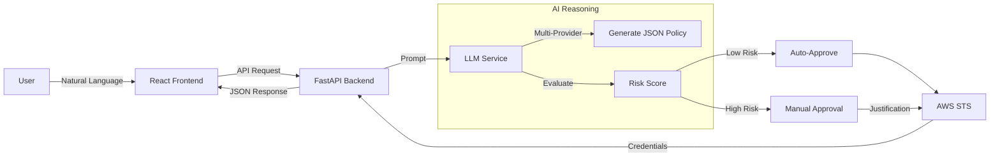

# 🔐 IAM-Dynamic

**AI-Driven Just-In-Time AWS IAM Access Request Portal**

[](https://react.dev/)
[](https://fastapi.tiangolo.com/)
[](https://ai.google.dev/api/models)
[](https://www.python.org/)
[](https://www.typescriptlang.org/)

## 🚀 Overview

**IAM-Dynamic** is a secure, user-friendly portal that leverages multiple AI providers (Google Gemini, OpenAI, Anthropic Claude, Z.AI GLM, Meta Muse, and OpenRouter) to generate least-privilege AWS IAM policies from natural language. It features a modern React frontend with FastAPI backend that assesses risk, validates requests, and issues temporary credentials via AWS STS.

**Key Capabilities:**
-   **♊ Gemini First:** Powered by Gemini 3 Pro for high-reasoning policy generation.
-   **🛡️ Guardrails:** System-level instructions prevent over-privileged access (e.g., blocking `*:*`).
-   **🚦 Risk Scoring:** Automatic assessment (Low, Medium, High, Critical).
-   **⚡ Auto-Approval:** Low-risk requests are approved instantly; others require manual sign-off.
-   **🔐 Just-In-Time:** Credentials are temporary and expire automatically.

---

## 🧠 How It Works


```mermaid
graph LR
    User[User] -->|Natural Language| UI[React Frontend]
    UI -->|API Request| API[FastAPI Backend]
    API -->|Prompt| Agent[LLM Service]
    
    subgraph "AI Reasoning"
    Agent -->|Multi-Provider| Policy[Generate JSON Policy]
    Agent -->|Evaluate| Risk[Risk Score]
    end
    
    Risk -->|Low Risk| Auto[Auto-Approve]
    Risk -->|High Risk| Manual[Manual Approval]
    
    Auto --> STS[AWS STS]
    Manual -->|Justification| STS
    
    STS -->|Credentials| API
    API -->|JSON Response| UI
```

1.  **Request:** User types a request or clicks a template in the React UI.
2.  **Analysis:** AI provider (Gemini/OpenAI/Claude/GLM) analyzes intent and drafts IAM policy.
3.  **Risk Check:** The system flags wildcards or sensitive services.
4.  **Issuance:** If approved, `boto3` calls `sts:AssumeRole` to mint credentials.

---

## ✨ Features

### Core Functionality
-   **Natural Language Input:** "I need read-only access to the production S3 bucket."
-   **Quick Templates:** One-click prompts for common tasks (S3 Read, EC2 Observer, Lambda Invoker, CloudWatch Logs, DynamoDB Reader, Secrets Manager).
-   **Modern React UI:** Multi-view state machine (request → review → credentials/rejected) with responsive design.
-   **Multi-Provider LLM Support:** Runtime switching between Gemini (default), OpenAI, Anthropic Claude, Z.AI GLM, Meta Muse, or OpenRouter (one key, many vendors).
-   **Notifications:** Audit logs and approval notifications delivered to Slack, Telegram, or both.

### New in v3.0
-   **🎨 React Frontend:** TypeScript with Vite for fast development, Radix UI components for accessibility
-   **🌗 Theme System:** System theme detection (light/dark/system) with toggle
-   **📝 Enhanced Rejection Flow:** AI-generated guidance with markdown formatting for resubmission
-   **💾 Multiple Export Formats:** Export credentials in Bash, PowerShell, and AWS CLI formats
-   **🚦 Real-time Risk Assessment:** Color-coded badges (Low/Medium/High/Critical) with duration limits
-   **🔐 Session Policies:** AWS STS AssumeRole with scoped-down session policies
-   **📊 FastAPI Backend:** REST API with OpenAPI documentation at `/docs`
-   **🛡️ Comprehensive Error Handling:** Structured logging and CORS configuration

### New in v3.1
-   **🔒 Authentication Portal:** Login page with JWT-based session management (bcrypt password hashing)
-   **🤖 Cloudflare Turnstile:** Optional CAPTCHA on login form to prevent brute-force attacks
-   **🔐 HTTPS via Caddy:** Automatic TLS certificates via Let's Encrypt with Cloudflare DNS challenge
-   **🛡️ Rate Limiting:** nginx rate limits on login endpoint (5 requests/minute)
-   **⚡ Zero-config Local Dev:** Auth is optional — omit `AUTH_PASSWORD_HASH` and the app works without login

### New in v3.2
-   **🆕 New Providers:** Meta Muse (Meta Model API) and OpenRouter gateway (one key, many vendors) alongside Gemini, OpenAI, Claude, and Z.AI GLM
-   **🧠 September 2026 Models:** GLM-5.3/GLM-5.3-Flash, GPT-5.6 family, Claude Opus/Sonnet 5, Gemini 3.8 Flash
-   **🎨 UI Refresh:** Inter typography, refined light/dark palettes, toast notifications, error boundary, mobile-first responsive layout with navigation drawer
-   **📋 Modern Copy UX:** Clipboard fallback chain (Async Clipboard API → execCommand), one-click copy buttons on credential scripts, policy JSON, and every markdown code block
-   **🗣️ Accessible:** ARIA labels, live error regions, focus-visible rings, WCAG-compliant risk colors
-   **✅ Real Test Suite:** pytest coverage for config, provider factory, catalog integrity, and API endpoints — now enforced in CI

---

## 📦 Project Structure

### Backend (`backend/`)
| File                          | Description                                      |
| ----------------------------- | ------------------------------------------------ |
| `main.py`                     | **FastAPI Application**. REST API with endpoints. |
| `llm_service.py`              | **AI Service Layer**. Multi-provider LLM abstraction (Gemini/OpenAI/Anthropic/Z.AI/Muse/OpenRouter). |
| `config.py`                   | **Configuration**. Centralized config with pydantic. |
| `services/sts_service.py`     | **AWS STS Service**. Credential issuance operations. |
| `services/slack_service.py`   | **Slack Service**. Notification handling.        |
| `services/telegram_service.py`| **Telegram Service**. Bot API notifications.     |
| `services/auth_service.py`    | **Auth Service**. JWT tokens and bcrypt password verification. |
| `services/turnstile_service.py`| **Turnstile Service**. Cloudflare CAPTCHA verification. |
| `services/error_handler.py`   | **Error Handler**. Maps provider API errors to actionable user messages. |
| `tests/`                      | **Test Suite**. Config, provider factory, catalog, and API endpoint tests (pytest). |
| `scripts/hash_password.py`    | **CLI Utility**. Generate bcrypt hashes for `.env`. |
| `requirements.txt`            | Python dependencies (minimum versions, kept in sync with `pyproject.toml`). |

### Frontend (`frontend/`)
| File/Directory                | Description                                      |
| ----------------------------- | ------------------------------------------------ |
| `src/App.tsx`                 | **Main React Application**. Auth gate, view routing and state management. |
| `src/components/auth-provider.tsx` | Auth context provider (JWT session management). |
| `src/views/login-view.tsx`    | Login form with optional Turnstile CAPTCHA. |
| `src/views/request-view.tsx`  | Request input form with templates and provider selector. |
| `src/views/review-view.tsx`   | Policy review with risk assessment and approval. |
| `src/views/credentials-view.tsx` | Display credentials with multiple export formats. |
| `src/views/rejected-view.tsx` | Rejection display with AI-generated guidance. |
| `package.json`                | Frontend dependencies (React, Vite, Tailwind, Radix UI). |

### Docker & CI/CD
| File                          | Description                                      |
| ----------------------------- | ------------------------------------------------ |
| `Dockerfile.frontend`         | Multi-stage build: Node 20 → nginx 1.27 (Alpine). |
| `Dockerfile.backend`          | Python 3.11-slim with uvicorn (2 workers).       |
| `Dockerfile.caddy`            | Custom Caddy with Cloudflare DNS module (xcaddy). |
| `docker-compose.yml`          | Local development (hot-reload backend, nginx frontend). |
| `docker-compose.prod.yml`     | Production (Caddy + GHCR images, internal ports, resource limits). |
| `docker/Caddyfile`            | Caddy config: TLS via Cloudflare DNS, security headers. |
| `docker/nginx.conf`           | Main nginx config (gzip, rate limiting for API and login). |
| `docker/default.conf`         | Server block: SPA + reverse proxy to backend.    |
| `.github/workflows/ci.yml`    | PR checks: lint, typecheck, build, Docker build test. |
| `.github/workflows/deploy.yml`| Main branch: security scan, build/push to GHCR, deploy. |
| `.dockerignore`               | Docker context exclusions.                       |

### Root
| File                          | Description                                      |
| ----------------------------- | ------------------------------------------------ |
| `start-dev.sh`                | Development script to start both frontend and backend. |
| `.env`                        | Environment configuration (AI provider, AWS, Slack). |
| `CLAUDE.md`                   | Documentation for Claude Code (AI assistant).    |
| `GEMINI.md`                   | Roadmap and architecture for Gemini integration. |
| `CHANGELOG.md`                | Version history and release notes.               |
| `.zread/`                     | Generated wiki from [zread](https://zread.ai/cli) — topical markdown breakdown of the codebase. Run `zread generate` to refresh after code changes. |

---

## ⚙️ Configuration

Create a `.env` file in the root directory (see `.env.example` for template):

```bash
# --- AI Provider Configuration ---
# Choose: gemini, openai, anthropic/claude, zhipu/glm, muse/meta, or openrouter
LLM_PROVIDER=gemini

# Gemini 3.1 Pro Preview
GOOGLE_API_KEY=AIzaSy...
GEMINI_MODEL=gemini-3.1-pro-preview
# Alternatives: gemini-3.8-flash, gemini-3.7-flash, gemini-3.5-flash-lite

# OpenAI GPT-5.6
# OPENAI_API_KEY=sk-...
# OPENAI_MODEL=gpt-5.6
# Alternatives: gpt-5.6-sol, gpt-5.6-terra, gpt-5.6-luna, gpt-5.4, gpt-5-mini-2025-08-07

# Anthropic Claude Opus 5
# ANTHROPIC_API_KEY=sk-ant-...
# ANTHROPIC_MODEL=claude-opus-5
# Alternatives: claude-sonnet-5, claude-opus-4-6, claude-haiku-4-5

# Z.AI GLM-5.3 (Global platform via api.z.ai)
# ZAI_API_KEY=...
# ZAI_MODEL=glm-5.3
# Alternatives: glm-5.3-flash, glm-5.1, glm-5, glm-4.7

# Meta Muse (Meta Model API via api.meta.ai)
# MUSE_API_KEY=...
# MUSE_MODEL=muse-spark-1.3-contributor
# Alternatives: muse-spark-1.3, muse-spark-1.2, muse-spark-1.1

# OpenRouter (gateway — one key for many vendors' models)
# OPENROUTER_API_KEY=sk-or-...
# OPENROUTER_MODEL=z-ai/glm-5.3
# Alternatives: openai/gpt-5.6, anthropic/claude-opus-5, google/gemini-3.1-pro, meta/muse-spark-1.3

# --- AWS Configuration ---
AWS_ACCOUNT_ID=123456789012
AWS_ROLE_NAME=AgentPOCSessionRole  # Role to be assumed by the app

# --- Authentication (optional — omit for no-auth local dev) ---
# AUTH_USERNAME=admin
# AUTH_PASSWORD_HASH=$2b$12$...   # python backend/scripts/hash_password.py
# JWT_SECRET=random-secret-32-chars
# TURNSTILE_SECRET_KEY=0x...      # Cloudflare Turnstile server key

# --- Caddy / HTTPS (production only) ---
# CLOUDFLARE_API_TOKEN=...
# CADDY_DOMAIN=iam.yantorno.dev

# --- Notifications (Optional) ---
SLACK_WEBHOOK_URL=https://hooks.slack.com/...
# Telegram: bot token from @BotFather + the chat id that receives messages
# TELEGRAM_BOT_TOKEN=123456789:ABCdef...
# TELEGRAM_CHAT_ID=123456789

# --- Approval Configuration ---
APPROVER_NAME=Admin
```

### Setting up Telegram notifications

1. **Create the bot** — message [@BotFather](https://t.me/BotFather) on Telegram, send `/newbot`, follow the prompts (name + a username ending in `bot`), and copy the **HTTP API token** it shows.
2. **Get your chat ID** — open a chat with your new bot and press **Start** (or send any message). Then visit `https://api.telegram.org/bot<TOKEN>/getUpdates` in a browser and copy the numeric `chat.id` from the response. (Alternative: message [@userinfobot](https://t.me/userinfobot) — it replies with your ID.) ⚠️ Use **your** chat ID — not the bot's own ID (the number before the `:` in the token); the API returns `403 Forbidden` if you mix them up.
3. **Group notifications** — add the bot to a Telegram group and send a message in it; group chat IDs appear as negative numbers in `getUpdates` (e.g. `-1001234567890`). The bot only needs to *send*, so privacy mode can stay on.
4. **Configure** — set `TELEGRAM_BOT_TOKEN` and `TELEGRAM_CHAT_ID` in `.env` (or run `./setup-env.sh`), then restart the backend. Every credential issuance is now mirrored to Telegram alongside any configured Slack webhook.

---

## 🧪 Getting Started

### 1. Installation
```bash
git clone https://github.com/tupacalypse187/IAM-Dynamic.git
cd IAM-Dynamic
python3 -m venv venv
source venv/bin/activate
pip install -r backend/requirements.txt
cd frontend && npm install
```

### 2. Configure the Environment

Build or edit your `.env` interactively — the script shows existing values
masked so you can verify them, then keep or replace each one. It walks you
through AI providers (with model defaults), AWS account details, and
Slack/Telegram notifications:

```bash
./setup-env.sh           # interactive; creates .env from the template if missing
./setup-env.sh --fresh   # start over from .env.example (backs up the old file)
```

For non-interactive or auth-focused setup, the older scripts remain:
`./setup.sh` (full orchestrator), `./setup-auth.sh` (auth + LLM provider),
`./setup-aws.sh` (IAM role), or edit `.env` manually (see `.env.example`).

### 3. Run the App

**Option A: Development Script**
```bash
./start-dev.sh
```

**Option B: Separate Terminals**
```bash
# Terminal 1: Backend
cd backend
python main.py

# Terminal 2: Frontend
cd frontend
npm run dev
```

Open [http://localhost:3000](http://localhost:3000) for the React frontend, or [http://localhost:8000/docs](http://localhost:8000/docs) for FastAPI documentation.

### 4. Run with Docker

```bash
# Build and start both containers
docker compose up --build

# Or run in detached mode
docker compose up --build -d
```

Open [http://localhost:8080](http://localhost:8080) for the app (nginx serves the frontend and proxies API requests to the backend).

**Production (GHCR images):**
```bash
docker compose -f docker-compose.prod.yml up -d
```

---

## 🔄 CI/CD

GitHub Actions workflows are included for automated checks and deployment:

| Workflow | Trigger | What it does |
| -------- | ------- | ------------ |
| **CI** (`.github/workflows/ci.yml`) | Pull requests to `main` | Lint, typecheck, and build both frontend and backend. Docker build test (no push). |
| **Deploy** (`.github/workflows/deploy.yml`) | Push to `main` | Security scan, test, build & push images to GHCR, Trivy vulnerability scan, deploy via SSH, cleanup old images. Optionally mirrors all three images to Docker Hub. |

**Required GitHub Secrets for deployment:**

| Secret | Purpose |
| ------ | ------- |
| `PROD_HOST` | Production server hostname |
| `PROD_USER` | SSH username |
| `PROD_SSH_KEY` | SSH private key |
| `TURNSTILE_SITE_KEY` | Cloudflare Turnstile public key (optional) |
| `SLACK_WEBHOOK_URL` | Deployment notifications (optional) |
| `DOCKERHUB_USERNAME` / `DOCKERHUB_TOKEN` | Docker Hub publishing (optional — the job is skipped until both are set) |

`GITHUB_TOKEN` is automatic — no separate Docker registry credentials needed for GHCR.

### Publishing images

- **GHCR (default):** every push to `main` builds and pushes `ghcr.io/tupacalypse187/iam-dynamic-{frontend,backend,caddy}` (tags: `latest` + commit SHA).
- **Docker Hub (optional):** create an access token at [hub.docker.com → Account Settings → Security](https://app.docker.com/settings/personal-access-tokens), add `DOCKERHUB_USERNAME` and `DOCKERHUB_TOKEN` as repository secrets, and the deploy workflow additionally publishes `docker.io/<username>/iam-dynamic-{frontend,backend,caddy}` with the same tags. Production still pulls from GHCR unless you retag the images in `docker-compose.prod.yml`.
- **npm:** IAM-Dynamic is a deployed application (FastAPI backend + React SPA served by nginx), not an installable library, so there is nothing meaningful to publish to npm — Docker images are the distribution channel.

---

## 🛡️ Security Notes

-   **Principal of Least Privilege:** The AI is instructed to always scope down resources.
-   **Authentication Portal:** JWT-based login with bcrypt password hashing and optional Cloudflare Turnstile CAPTCHA.
-   **HTTPS by Default:** Caddy with automatic Let's Encrypt certificates via Cloudflare DNS challenge in production.
-   **Rate Limiting:** Login endpoint limited to 5 requests/minute per IP via nginx.
-   **Audit Trail:** All requests (and their risk scores) are logged to Slack and/or Telegram.
-   **Ephemeral Access:** Credentials issued are valid *only* for the requested duration.

---

## 📄 License

MIT © 2025
